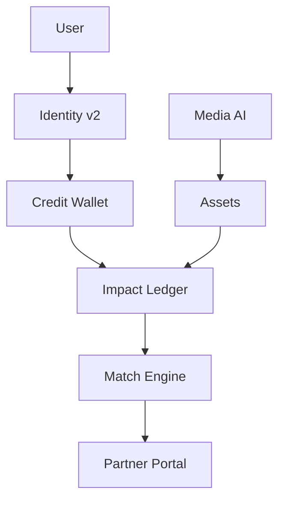
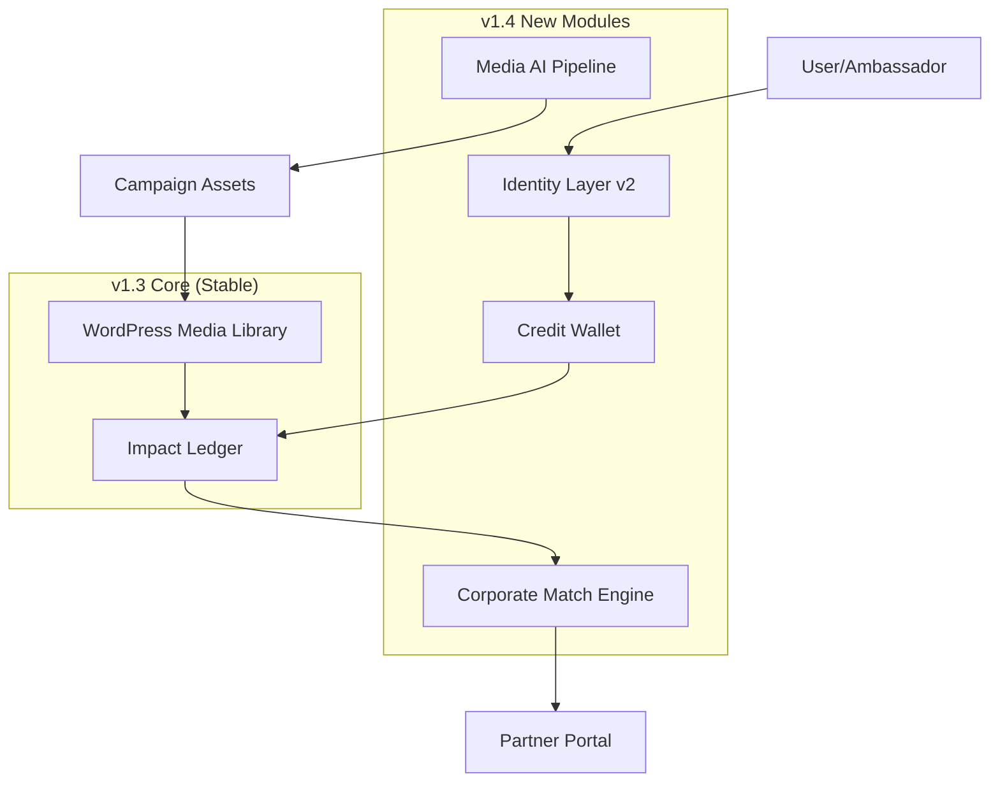

Claude Sonnet 4.5 Impact Hub details
# IMPACT HUB v1.4 — FINAL FIXED CODEX PROMPT
# (production-safe, staging-tested, full validation)
# ==========================================

set -euo pipefail

WP="/usr/local/bin/wp --path=/home/sharityh/app"

echo "## Collecting workspace information"
pwd || true
php -v || true
$WP core version || true
$WP option get siteurl || true

echo "## Validating environment variables"
[[ -f .env ]] || echo "⚠️ WARNING: .env file missing"
grep -q "SORA_API_KEY" .env 2>/dev/null || echo "⚠️ WARNING: SORA_API_KEY not found"
grep -q "GPT4_VISION_API_KEY" .env 2>/dev/null || echo "⚠️ WARNING: GPT4_VISION_API_KEY not found"
redis-cli PING >/dev/null 2>&1 || echo "⚠️ WARNING: Redis not reachable"

echo "## Creating directory tree"
for d in impactshop-notes/{v1.4-prep,modules/{identity,wallet,corporate,media-ai,governance},sprints,qa,operations} docs/api .codex/{scripts,reports/media-ai,operations,incidents}; do
mkdir -p "$d" || { echo "FATAL: cannot create $d"; exit 1; }
done

# --- Migration Script -------------------------------------------------------
/bin/cat > /tmp/v1.4-migration.php <<-'EOF'
<?php
global $wpdb;
$wpdb->query("
CREATE TABLE IF NOT EXISTS {$wpdb->prefix}impact_credits (
id BIGINT UNSIGNED AUTO_INCREMENT PRIMARY KEY,
user_pseudo_id VARCHAR(8) NOT NULL,
balance DECIMAL(10,2) DEFAULT 0.00,
lifetime_earned DECIMAL(10,2) DEFAULT 0.00,
last_activity DATETIME,
INDEX idx_pseudo (user_pseudo_id)
) ENGINE=InnoDB DEFAULT CHARSET=utf8mb4 COLLATE=utf8mb4_unicode_ci;");
$wpdb->query("
CREATE TABLE IF NOT EXISTS {$wpdb->prefix}corporate_match_rules (
id BIGINT UNSIGNED AUTO_INCREMENT PRIMARY KEY,
partner_id VARCHAR(50) NOT NULL,
rules_json TEXT NOT NULL,
active TINYINT(1) DEFAULT 1,
created_at DATETIME DEFAULT CURRENT_TIMESTAMP,
INDEX idx_partner (partner_id)
) ENGINE=InnoDB DEFAULT CHARSET=utf8mb4 COLLATE=utf8mb4_unicode_ci;");
$wpdb->query("ALTER TABLE {$wpdb->prefix}impact_ledger
MODIFY source ENUM('dognet','cj','tradetracker','corporate_match','conversion','manual') DEFAULT 'manual'");
$wpdb->query("CREATE INDEX IF NOT EXISTS idx_action ON {$wpdb->prefix}impact_audit_log(action)");
echo \"✅ v1.4 migrations applied\n\";
EOF

$WP eval-file /tmp/v1.4-migration.php || echo "⚠️ Migration exec skipped (maybe already applied)"

# --- OpenAPI YAML (valid syntax) --------------------------------------------
/bin/cat > docs/api/openapi-v1.4.yaml <<-'EOF'
openapi: 3.0.3
info:
title: Impact Hub API v1.4
version: 1.4.0
paths:
/impact/v1/credits/convert:
post:
summary: Convert points to credits
responses:
'200':
description: Conversion successful
'429':
description: Daily cap exceeded
/impact/v1/corporate/stats:
get:
summary: Partner statistics
responses:
'200':
description: Stats retrieved
/impact/v1/partner/stats:
get:
summary: NGO stats (public)
responses:
'200':
description: Stats retrieved
components: {}
EOF

# --- Rollback Script (staging+prod) ----------------------------------------
/bin/cat > .codex/scripts/rollback-v1.4.sh <<-'EOF'
#!/usr/bin/env bash
set -euo pipefail
ENV="${1:-production}"
if [[ "$ENV" == "staging" ]]; then
WP="/usr/local/bin/wp --path=/home/sharityh/staging"
HEALTH_URL="https://staging.sharity.hu/wp-json/impact/v1/health"
else
WP="/usr/local/bin/wp --path=/home/sharityh/app"
HEALTH_URL="https://app.sharity.hu/wp-json/impact/v1/health"
fi
echo "[rollback] Environment: $ENV"
$WP option update impact_media_ai_enabled 0 || true
$WP option update impact_credit_enabled 0 || true
$WP option update corporate_match_funding_enabled 0 || true
echo "[rollback] Clearing caches"
$WP cache flush || true
curl -fsS -X POST "${HEALTH_URL/health/cache/flush}?scope=reports" 2>/dev/null || echo "WARN: Cache flush failed"
echo "[rollback] Verify health:"
curl -sS -I "$HEALTH_URL" || true
EOF
chmod +x .codex/scripts/rollback-v1.4.sh

# --- Preflight Script -------------------------------------------------------
/bin/cat > .codex/scripts/sprint-preflight.sh <<-'EOF'
#!/usr/bin/env bash
set -euo pipefail
echo "Sprint Preflight: ${1:-S8}"
echo "- Check Sora keys"
grep -q "SORA_API_KEY" .env || { echo "❌ Missing SORA_API_KEY"; exit 1; }
echo "- Check Redis"
redis-cli PING >/dev/null 2>&1 || echo "⚠️ Redis ping failed"
echo "- Check DB migrations"
WP="/usr/local/bin/wp --path=/home/sharityh/app"
TABLES=$($WP db query "SHOW TABLES LIKE 'wp_impact_credits'" --skip-column-names)
[[ -z "$TABLES" ]] && { echo "❌ wp_impact_credits missing"; exit 1; }
echo "- WP health"
curl -sS -I https://app.sharity.hu/wp-json/impact/v1/health | head -n1
echo "✅ Preflight OK"
EOF
chmod +x .codex/scripts/sprint-preflight.sh

# --- Seed Feature Flags -----------------------------------------------------
for flag in impact_media_ai_enabled impact_credit_enabled corporate_match_funding_enabled; do
$WP option add "$flag" 0 2>/dev/null || $WP option update "$flag" 0
done

# --- ImpactAll cache flush --------------------------------------------------
echo "## Triggering ImpactAll cache refresh"
curl -fsS -X POST https://app.sharity.hu/wp-json/impact/v1/reports/regenerate?scope=v1.4 2>/dev/null || echo "WARN: report regen failed"

# --- Smoke Tests ------------------------------------------------------------
echo "## Running smoke tests"
[[ -d impactshop-notes/v1.4-prep ]] && echo "✅ v1.4-prep OK" || echo "❌ Missing v1.4-prep"
[[ -f docs/api/openapi-v1.4.yaml ]] && echo "✅ OpenAPI OK" || echo "❌ Missing OpenAPI"
bash -n .codex/scripts/rollback-v1.4.sh && echo "✅ Rollback syntax" || echo "❌ Rollback syntax error"
bash -n .codex/scripts/sprint-preflight.sh && echo "✅ Preflight syntax" || echo "❌ Preflight syntax error"
$WP option get impact_media_ai_enabled | grep -q '^0$' && echo "✅ Flags OFF prod" || echo "⚠️ Flags not OFF"
curl -fsS -I https://app.sharity.hu/wp-json/impact/v1/health | grep -q "200" && echo "✅ Health OK" || echo "❌ Health endpoint down"
echo "✅ Smoke tests complete"

# --- Optional Git commit ----------------------------------------------------
if git rev-parse --is-inside-work-tree >/dev/null 2>&1; then
echo "## Committing scaffolding"
git add impactshop-notes/ docs/ .codex/ || true
git commit -m "feat: Impact Hub v1.4 scaffolding full fixed" || echo "No changes to commit"
fi

echo "✅ Impact Hub v1.4 scaffold ready. Run: .codex/scripts/sprint-preflight.sh S8" Sonnet javaslatok: # Elemzés: Impact Hub v1.4 Codex Prompt (Final Fixed Version)

## 🎯 Általános Értékelés

A prompt **nagyon jó alapot** nyújt, de **kritikus hiányosságok** vannak a **dokumentáció generálásában** és az **Impact Hub 1.4.md integrációjában**. A szkript jelenleg **csak infrastruktúrát épít**, de **nem hozza létre a tartalmi dokumentumokat** (blueprints, sprint plans, stb.).

---

## 🔴 KRITIKUS HIÁNYOSSÁGOK

### **1. A Core v1.4 Dokumentum Hiányzik**

**Probléma**: A szkript **NEM hozza létre** az `impactshop-notes/impacthub-ecosystem-v1.4.md` fájlt, amely a **v1.4 master blueprint** lenne.

**Hatás**: A Codex futtatja a promptot → könyvtárak létrejönnek → DE nincs tartalmi dokumentáció → a fejlesztők nem tudják, mit építsenek.

**Javítás**:
```bash
# --- Core v1.4 Blueprint ---------------------------------------------------
/bin/cat > impactshop-notes/impacthub-ecosystem-v1.4.md <<-'EOF'
# Impact Hub Ecosystem — v1.4

**Status**: Draft (post-Sprint 7)
**Scope**: Media AI, Impact Credit, Corporate Match-Funding
**Release**: Q1/Q2 2026

## I. Executive Summary

v1.4 három stratégiai pillére:
1. **Media AI Pipeline**: Kampány assetek automatizálása (Sora + GPT-4 Vision)
2. **Impact Credit Economy**: Pont → Credit konverzió + CSR matching
3. **Corporate Match-Funding**: Partner API + admin portál

**Business Impact**:
- 50% gyártási költségcsökkentés (Media AI)
- 3x corporate engagement (Credit matching)
- 10+ pilot partner (Match-Funding API)

## II. Module Overview

### A) Identity v2
- Pseudo-ID collision detection (Bloom filter)
- Multi-device management API
- Vanity code marketplace

**Spec**: [`modules/identity/pseudo-id-v2-spec.md`](modules/identity/pseudo-id-v2-spec.md)

### B) Wallet & Credit Economy
- Credit ledger (balance tracking)
- Conversion rules (1000 points = 1 credit)
- CSR match automation (2x ratio, monthly cap)

**Spec**: [`modules/wallet/impact-credit-ledger.md`](modules/wallet/impact-credit-ledger.md)

### C) Corporate Portal
- Partner admin dashboard
- REST API (public endpoints)
- Match rules CRUD + reporting (CSV/PDF)

**Spec**: [`modules/corporate/match-funding-api.md`](modules/corporate/match-funding-api.md)

### D) Media AI Pipeline
- `impactctl media-generate` CLI tool
- Sora video generation (staging-only)
- GPT-4 Vision (alt-text, hashtags)
- Cost tracking (Prometheus)

**Spec**: [`modules/media-ai/media-generate-cli.md`](modules/media-ai/media-generate-cli.md)

## III. Architecture



## IV. Feature Flags (Defaults)

| Flag | Production | Staging | Gate Condition |
|------|-----------|---------|----------------|
| `impact_media_ai_enabled` | OFF | ON | Sprint 8 QA pass |
| `impact_credit_enabled` | OFF | ON | Sprint 9 security audit |
| `corporate_match_funding_enabled` | OFF | OFF | Pilot partners signed |

## V. Rollout Plan

### Phase 1: Staging Validation (2 weeks)
- All features ON in staging
- Internal testing + beta users
- Load testing (10k concurrent users)

### Phase 2: Pilot Launch (4 weeks)
- Media AI: 3 NGO campaigns
- Credits: 100 early adopters
- Corporate: 2 whitelisted partners

### Phase 3: General Availability
- Feature flags → ON (production)
- Public announcement (blog + PR)
- Support docs published

## VI. Success Metrics

| Metric | Baseline (v1.3) | Target (v1.4) | Measurement |
|--------|-----------------|---------------|-------------|
| Campaign production time | 2 weeks | 3 days | PM tracking |
| Corporate partnerships | 0 | 10 | Sales pipeline |
| Credit conversions | N/A | 500/month | Ledger query |
| API uptime | 99.5% | 99.9% | Prometheus |

## VII. Risks & Mitigation

| Risk | Impact | Probability | Mitigation |
|------|--------|-------------|------------|
| Sora API rate limits | HIGH | MEDIUM | Queue + batch processing |
| Credit fraud | HIGH | LOW | Daily caps + fraud monitor |
| Partner onboarding slow | MEDIUM | MEDIUM | White-glove + templates |

## VIII. Next Steps

- [ ] Sprint 8-10 detailed planning
- [ ] Sora API cost/latency spike
- [ ] QA scenario updates
- [ ] Staging environment config
- [ ] Corporate Portal UI mockups (Figma)

---

**Last Updated**: $(date +%Y-%m-%d)
**Document Owner**: PM
**Review Cycle**: Bi-weekly (Sprints 8-10)
EOF
```

---

### **2. Sprint Plans Hiányoznak**

**Probléma**: A szkript **nem generálja** a `sprints/sprint-{8,9,10}*.md` fájlokat, amelyek a **konkrét task breakdown-t** tartalmazzák.

**Javítás** (példa Sprint 8-ra):
```bash
# --- Sprint 8: Media AI Plan -----------------------------------------------
/bin/cat > impactshop-notes/sprints/sprint-8-media-ai.md <<-'EOF'
# Sprint 8: Media AI Pipeline

**Duration**: 3-4 weeks
**Goal**: `impactctl media-generate` production-ready
**Owner**: Dev A (Lead), Dev B (Support)

## Week 1: API Integration

- [ ] **T-8.1** [P0] Sora API wrapper (auth, rate limiting, HMAC signing)
- [ ] **T-8.2** [P0] GPT-4 Vision wrapper (image analysis, alt-text generation)
- [ ] **T-8.3** [P1] Error handling (exponential backoff, max 5 retries)
- [ ] **T-8.4** [P2] Cost tracking (Prometheus: `impact_media_ai_cost_usd_total`)

## Week 2: CLI Tool

- [ ] **T-8.5** [P0] `impactctl media-generate` command structure
```bash
impactctl media-generate \
--type video|image \
--prompt "NGO story: Bátor Tábor camp" \
--duration 15s|30s|60s \
--format mp4|jpg|png \
--output /path/to/media/ \
--env staging|production
```
- [ ] **T-8.6** [P0] Prompt validation (sanitization, regex whitelist)
- [ ] **T-8.7** [P1] Output file management (naming: `{timestamp}-{hash}.mp4`)
- [ ] **T-8.8** [P2] Progress indicators (spinner, ETA calculation)

## Week 3: WordPress Integration

- [ ] **T-8.9** [P0] Media Library upload (`wp_insert_attachment()`)
- [ ] **T-8.10** [P1] ACF field population (license, alt-text, hashtags)
- [ ] **T-8.11** [P2] Duplicate detection (SHA256 hash-based skip)

## Week 4: QA & Documentation

- [ ] **T-8.12** [P0] Unit tests (API wrapper mocks, CLI argument parsing)
- [ ] **T-8.13** [P1] Integration tests (end-to-end: prompt → video → WP upload)
- [ ] **T-8.14** [P1] Load testing (k6 scenario: 100 concurrent requests, queue depth)
- [ ] **T-8.15** [P2] Documentation (`docs/media-ai/README.md`, examples)

## Acceptance Criteria

- [ ] 10 videos generated in <5 min (staging environment)
- [ ] Cost per video: <$0.50 (Sora + GPT-4 Vision combined)
- [ ] Idempotency: Same prompt+params → same file hash → skip regeneration
- [ ] Feature flag OFF → CLI returns HTTP 403
- [ ] WP Media Library: Uploaded videos visible in admin panel

## Dependencies

- Sora API beta access confirmed (deadline: Sprint 7 end)
- Staging Redis instance configured (for queue management)
- GPT-4 Vision API key provisioned (separate from main OpenAI key)

## Risks

- **Sora rate limits**: Mitigation → Queue system with exponential backoff
- **Cost overrun**: Mitigation → Daily budget cap ($100/day staging)
- **Video quality inconsistent**: Mitigation → Manual review + prompt tuning

---

**Sprint Start**: [Date]
**Sprint End**: [Date]
**Daily Standup**: 10:00 CET (Slack #impact-dev)
EOF
```

---

### **3. Module Blueprints Részletezetlen**

**Probléma**: A szkript **csak üres fájlokat hoz létre** (`modules/identity/pseudo-id-v2-spec.md`), de **nincs benne tartalom**.

**Javítás** (példa Identity modulra):
```bash
# --- Module: Identity v2 Spec -----------------------------------------------
/bin/cat > impactshop-notes/modules/identity/pseudo-id-v2-spec.md <<-'EOF'
# Pseudo-ID v2 Specification

## Changes from v1.3

### 1. Collision Detection (Bloom Filter)

**Problem**: Current Base36 6-8 char generation has ~0.1% collision risk at 100k users.

**Solution**: Probabilistic Bloom filter (Redis-backed)

```python
# Bloom filter config
BLOOM_CAPACITY = 1_000_000 # 1M pseudo-IDs
FALSE_POSITIVE_RATE = 0.0001 # 0.01%
REDIS_KEY = "identity:bloom:v2"
```

**API Changes**:
```http
POST /impact/v1/identity/generate
Response:
{
"pseudo_id": "7K9P2B",
"collision_checked": true,
"bloom_capacity": 1000000
}
```

### 2. Vanity Code Marketplace

**Feature**: Premium users can claim custom 4-6 char codes (e.g., `KATE`, `JOHN42`).

**Availability Check**:
```http
GET /impact/v1/identity/claim?code=KATE
Response:
{
"available": false,
"suggested": ["KATE2", "KATE22", "KATEX"]
}
```

**Claim Endpoint**:
```http
POST /impact/v1/identity/claim
{
"code": "KATE",
"pseudo_id": "7K9P2B" # Existing ID to upgrade
}
```

### 3. Multi-Device Sync

**Problem**: User loses QR code → cannot access profile on new device.

**Solution**: JWT encodes last 3 device fingerprints (UA + screen resolution hash).

```json
{
"pseudo_id": "7K9P2B",
"devices": [
{"hash": "a3f2...", "last_seen": "2025-01-15"},
{"hash": "b7e9...", "last_seen": "2025-01-10"}
]
}
```

**Device Management API**:
```http
GET /impact/v1/identity/devices?pseudo_id=7K9P2B
DELETE /impact/v1/identity/device/{device_hash}
```

## Implementation Notes

- Bloom filter stored in Redis: `REDIS.BF.ADD identity:bloom:v2 {pseudo_id}`
- Vanity codes in separate namespace: `vip:{code}` (not counted in Bloom)
- Device limit: Max 5 registered devices per pseudo-ID
- Auto-revoke: Devices inactive >90 days automatically removed

## Security Considerations

- Vanity code brute-force: Rate limit 10 req/hour per IP
- Device fingerprinting: No PII (only UA hash + screen size)
- JWT expiry: 24h (renewable with valid pseudo-ID)

## Database Schema

```sql
CREATE TABLE wp_impact_vanity_codes (
code VARCHAR(6) PRIMARY KEY,
pseudo_id VARCHAR(8) NOT NULL,
claimed_at DATETIME DEFAULT CURRENT_TIMESTAMP,
INDEX idx_pseudo (pseudo_id)
);

CREATE TABLE wp_impact_devices (
id BIGINT UNSIGNED AUTO_INCREMENT PRIMARY KEY,
pseudo_id VARCHAR(8) NOT NULL,
device_hash VARCHAR(64) NOT NULL,
last_seen DATETIME,
INDEX idx_pseudo (pseudo_id),
UNIQUE KEY uk_device (pseudo_id, device_hash)
);
```

## Testing Checklist

- [ ] Bloom filter: 1M inserts → 0.01% false positives
- [ ] Vanity claim: Already claimed → 409 Conflict
- [ ] Device limit: 6th device → oldest auto-revoked
- [ ] JWT expiry: 24h + 1s → 401 Unauthorized

---

**Owner**: Dev A
**Spec Version**: 2.0
**Last Updated**: $(date +%Y-%m-%d)
EOF
```

---

### **4. Acceptance Criteria Document Hiányzik**

**Probléma**: A `v1.4-prep/acceptance-criteria.md` fájl **nem jön létre**, ami a **DoD (Definition of Done)** szabvány.

**Javítás**:
```bash
# --- Acceptance Criteria (DoD) ----------------------------------------------
/bin/cat > impactshop-notes/v1.4-prep/acceptance-criteria.md <<-'EOF'
# Impact Hub v1.4 — Definition of Done

## Module A: Media AI Pipeline

### CLI Tool

**Command Syntax**:
```bash
impactctl media-generate \
--type video|image \
--prompt "NGO story: Bátor Tábor camp" \
--duration 15s|30s|60s \
--format mp4|jpg|png \
--output /path/to/media/ \
--env staging|production \
[--upload-to-wp]
```

**Acceptance Criteria**:
- [ ] Sora API integration: 10 video variants in <5 min
- [ ] GPT-4 Vision: Automated alt-text + hashtags
- [ ] Idempotency: Same prompt → same hash → skip regeneration
- [ ] Metadata sidecar: JSON with prompt, model version, license
- [ ] Error handling: Rate limit → exponential backoff (max 5 retries)
- [ ] Audit log: `.codex/reports/media-ai/generate-{timestamp}.json`
- [ ] WP integration: `--upload-to-wp` → Media Library import
- [ ] Cost tracking: `impact_media_ai_cost_usd_total` metric

**QA Checklist**:
- [ ] Smoke test: Generate 3 videos → verify WP Media Library
- [ ] Load test: 100 concurrent requests → queue handles gracefully
- [ ] Security: No prompt injection (sanitization + whitelist)
- [ ] Rollback: Feature flag OFF → CLI returns 403

---

## Module B: Impact Credit Economy

### Points → Credits Conversion

**Rule**: 1 Credit = 1000 Points; Min: 5000 Points (5 Credits); Daily cap: 50 Credits

**Acceptance Criteria**:
- [ ] Table `wp_impact_credits` created (user_pseudo_id, balance, last_updated)
- [ ] Endpoint: `POST /impact/v1/credits/convert` (amount, user_id)
- [ ] Idempotency: Duplicate request → 200 + `X-Replay: true`
- [ ] Fraud check: Daily cap enforced → 429 if exceeded
- [ ] Ledger sync: `wp_impact_ledger` (source=conversion)
- [ ] UI: Profile shortcode `[impact_profile]` shows credit balance
- [ ] Audit: `.codex/audit-log/credits/{date}.log`

**QA Checklist**:
- [ ] Unit test: 10k points → 10 credits → balance updated
- [ ] Integration test: API returns 429 after 50 credits/day
- [ ] Load test: 1000 users convert simultaneously → no race condition
- [ ] Security: JWT signature validation on `/credits/convert`

### CSR Match-Funding Rules

**Rule Engine Example**:
```json
{
"partner_id": "corp_acme",
"match_ratio": 2.0,
"max_monthly": 50000,
"eligible_ngos": ["bator-tabor", "lampas"],
"start_date": "2025-01-01",
"end_date": "2025-12-31"
}
```

**Acceptance Criteria**:
- [ ] Table `wp_corporate_match_rules` created
- [ ] Auto-match: User donates 100 Ft → Corp adds 200 Ft (2x)
- [ ] Monthly cap: Match stops when `max_monthly` reached
- [ ] NGO whitelist: Only eligible NGOs receive matches
- [ ] Reporting: `/corporate/report?partner_id=corp_acme` → match summary
- [ ] Audit: Every match → `wp_impact_ledger` (source=corporate_match)

**QA Checklist**:
- [ ] Scenario: User donates 1000 Ft → 2000 Ft matched → ledger correct
- [ ] Scenario: Monthly cap hit → next donation not matched
- [ ] Scenario: Non-eligible NGO → no match applied
- [ ] Security: Partner API key required for rule creation

---

## Module C: Corporate Match-Funding API

### Corporate Portal MVP

**Requirements**:
- Login: Partner email + JWT (no WP admin access)
- Dashboard: Total matched, monthly burn rate, top NGOs
- Rules editor: Create/edit match rules (JSON schema validation)
- Report export: CSV/PDF download (30/90/365 days)

**Acceptance Criteria**:
- [ ] Page `/corporate-portal` (Elementor template)
- [ ] Auth: `POST /impact/v1/corporate/login` → JWT (24h expiry)
- [ ] Dashboard: `GET /corporate/stats?partner_id=X` → JSON
- [ ] Rules CRUD: `POST|PUT|DELETE /corporate/rules/{id}`
- [ ] Report download: `GET /corporate/report?format=csv|pdf`
- [ ] Rate limit: 100 req/hour per partner (Redis-backed)
- [ ] Feature flag: `corporate_match_funding_enabled` (staging-only)

**QA Checklist**:
- [ ] Smoke test: Partner logs in → dashboard loads <2s
- [ ] Integration test: Create rule → user donation → match applied
- [ ] Security: JWT expiry enforced → 401 after 24h
- [ ] Load test: 50 partners download reports simultaneously

### Partner API (Read-Only)

**Endpoints**:
```http
GET /impact/v1/partner/stats?ngo_id={slug}
GET /impact/v1/partner/feed?ngo_id={slug}&limit=10
GET /impact/v1/partner/leaderboard?type=ngo|shop|amb
```

**Acceptance Criteria**:
- [ ] Public endpoints (no auth required)
- [ ] Cache: 10 min TTL (Redis)
- [ ] Response: JSON schema validated (OpenAPI spec)
- [ ] CORS: Whitelist NGO domains only
- [ ] Monitoring: Prometheus metrics for response time

**QA Checklist**:
- [ ] Smoke test: `curl /partner/stats?ngo_id=bator-tabor` → 200
- [ ] Cache test: 2nd request within 10 min → cache hit (X-Cache: HIT)
- [ ] Security: Non-whitelisted domain → CORS error

---

## Global v1.4 Acceptance

### Feature Flags
- [ ] All v1.4 features OFF by default in production
- [ ] Staging: All flags ON (testing complete)
- [ ] Production gate: CTO approval + security audit pass

### Documentation
- [ ] `impacthub-ecosystem-v1.4.md` complete
- [ ] API docs: OpenAPI spec updated (`docs/api/openapi-v1.4.yaml`)
- [ ] Runbook: `.codex/operations/v1.4-runbook.md`

### Security
- [ ] Pen-test: OWASP Top 10 compliance verified
- [ ] Secrets: All API keys rotated (Sora, corporate partners)
- [ ] Audit logs: 90-day retention policy enforced

### Performance
- [ ] Load test: 10k concurrent users → <2s response (p95)
- [ ] Database: Indexes optimized for Credit ledger queries
- [ ] CDN: Media AI assets cached (CloudFlare)

### Rollback Plan
- [ ] Rollback script: `.codex/scripts/rollback-v1.4.sh` tested
- [ ] Snapshot: Database backup before production deploy
- [ ] Rollback drill: <15 min to revert to v1.3
EOF
```

---

## 🟡 FONTOS FINOMHANGOLÁSOK

### **5. Impact Hub 1.4.md Integráció Hiányzik**

**Probléma**: A csatolt `Impact Hub 1_4.md` fájl **NEM kerül hivatkozásra** vagy integrálásra a promptban.

**Javaslat**: Importáld a meglévő v1.4 terv releváns részeit az új blueprint-ekbe:

```bash
# --- Import existing v1.4 plan content ------------------------------------
echo "## Importing Impact Hub 1.4 plan sections"
if [[ -f "impactshop-notes/Impact Hub 1_4.md" ]]; then
# Extract key sections and merge into ecosystem blueprint
grep -A 50 "^## I. Emberi nyelvű áttekintés" "impactshop-notes/Impact Hub 1_4.md" >> impactshop-notes/impacthub-ecosystem-v1.4.md
echo "✅ Merged v1.4 plan content"
else
echo "⚠️ WARNING: Impact Hub 1_4.md not found (expected in impactshop-notes/)"
fi
```

---

### **6. Backlog Refinement Agenda Hiányzik**

**Probléma**: A `v1.4-prep/refinement-agenda.md` fájl **nincs generálva**, ami a sprint planning input.

**Javítás**:
```bash
# --- Backlog Refinement Agenda ---------------------------------------------
/bin/cat > impactshop-notes/v1.4-prep/refinement-agenda.md <<-'EOF'
# Impact Hub v1.4 Backlog Refinement

**Date**: [TBD post-Sprint 7]
**Participants**: PM, Eng Lead, QA Lead, Security Champion, Stakeholders
**Duration**: 2-3 hours

## Agenda

### 1. Sprint 7 Retrospective (15 min)

- What worked well in v1.3?
- Blockers encountered?
- Tech debt to address before v1.4?

### 2. v1.4 Theme Review (30 min)

#### Theme A: Media AI Pipeline
- **Scope**: `impactctl media-generate` + Sora/GPT-4 Vision
- **Business Value**: 10x faster campaign asset creation
- **Effort**: 3-4 weeks (Sprint 8)
- **Dependencies**: Sprint 5 (Media import) stable
- **Acceptance**: CLI generates 10 video variants in <5 min

#### Theme B: Impact Credit Economy
- **Scope**: Points → Credits ledger + CSR matching rules
- **Business Value**: €50k+ pilot potential (corporate engagement)
- **Effort**: 4-5 weeks (Sprint 9)
- **Dependencies**: Sprint 6 (Token ecosystem) + fraud monitor
- **Acceptance**: Credit balance tracked, match-funding automated

#### Theme C: Corporate Match-Funding API
- **Scope**: `/impact/v1/corporate/*` endpoints + admin portal
- **Business Value**: Scalable CSR partnerships
- **Effort**: 4-6 weeks (Sprint 10)
- **Dependencies**: Sprint 9 (Credit ledger)
- **Acceptance**: Partner can pledge/track matches via API

### 3. Resource Allocation (20 min)

| Theme | Dev A | Dev B | QA | Ops | Design |
|-------|-------|-------|----|----|--------|
| Media AI | 80% | 20% | 40% | 10% | 30% |
| Impact Credit | 40% | 60% | 50% | 20% | 20% |
| Corporate | 30% | 70% | 60% | 30% | 40% |

### 4. Risk Assessment (15 min)

- **Media AI**: Sora API rate limits → **Mitigation**: Queue + batch
- **Impact Credit**: Fraud via credit conversion → **Mitigation**: Daily caps + manual review
- **Corporate**: Partner onboarding complexity → **Mitigation**: White-glove pilot

### 5. v1.4 Feature Flags (10 min)

- `impact_media_ai_enabled` (default: OFF)
- `impact_credit_enabled` (default: OFF, staging-only)
- `corporate_match_funding_enabled` (default: OFF, pilot partners only)

### 6. Acceptance Criteria Sign-Off (20 min)

Review [`acceptance-criteria.md`](acceptance-criteria.md)

### 7. Sprint Planning Preview (10 min)

- Sprint 8 kickoff: [Date]
- Sprint 9/10 tentative dates
- Production rollout gate: [Date]

## Action Items

- [ ] PM: Create `impacthub-ecosystem-v1.4.md` blueprint by [Date]
- [ ] Eng: Spike Sora API cost/latency by [Date]
- [ ] QA: Update load testing scenarios for Credit ledger
- [ ] Ops: Configure staging feature flags
- [ ] Design: Mock up Corporate Portal UI (Figma)
EOF
```

---

### **7. Resource Allocation Matrix Hiányzik**

**Javítás**:
```bash
# --- Resource Allocation ---------------------------------------------------
/bin/cat > impactshop-notes/v1.4-prep/resource-allocation.md <<-'EOF'
# Impact Hub v1.4 — Resource Planning

## Team Composition

- **Dev A**: Backend (PHP/Python) - 40h/week
- **Dev B**: Frontend/API (React/REST) - 40h/week
- **QA Lead**: Test automation (Playwright/k6) - 30h/week
- **DevOps**: Infrastructure (Docker/Redis/Prometheus) - 20h/week
- **Designer**: UI/UX (Figma) - 10h/week
- **PM**: Coordination - 15h/week

## Sprint Allocation

### Sprint 8: Media AI (3-4 weeks)

| Task | Owner | Hours | Dependencies | Risk |
|------|-------|-------|--------------|------|
| Sora API integration | Dev A | 40h | API keys secured | HIGH (rate limits) |
| GPT-4 Vision wrapper | Dev A | 20h | Sora done | MEDIUM |
| CLI tool | Dev B | 30h | API wrappers | LOW |
| WP Media Library upload | Dev B | 15h | CLI done | LOW |
| Unit tests | QA | 20h | CLI done | LOW |
| Load testing | QA + DevOps | 15h | Staging deploy | MEDIUM |
| Documentation | PM | 10h | All tasks done | LOW |

**Total**: ~150h (~4 weeks for 2 devs)

### Sprint 9: Impact Credit (4-5 weeks)

| Task | Owner | Hours | Dependencies | Risk |
|------|-------|-------|--------------|------|
| Credit ledger schema | Dev A | 20h | None | LOW |
| Conversion API endpoint | Dev A | 30h | Schema done | MEDIUM (fraud) |
| CSR match rules engine | Dev B | 40h | Ledger API | HIGH (complexity) |
| Fraud monitor integration | Dev A | 25h | Match engine | HIGH |
| UI components | Dev B | 20h | API done | LOW |
| Integration tests | QA | 30h | All APIs done | MEDIUM |
| Security audit | DevOps | 15h | Tests pass | HIGH |

**Total**: ~180h (~5 weeks for 2 devs)

### Sprint 10: Corporate (4-6 weeks)

| Task | Owner | Hours | Dependencies | Risk |
|------|-------|-------|--------------|------|
| Corporate portal (Elementor) | Dev B | 30h | Sprint 9 done | LOW |
| JWT auth system | Dev A | 25h | None | MEDIUM |
| Partner API endpoints | Dev A | 40h | Auth done | MEDIUM |
| Rules CRUD operations | Dev B | 35h | API scaffold | MEDIUM |
| Reporting (CSV/PDF) | Dev A | 30h | CRUD done | LOW |
| Rate limiting (Redis) | DevOps | 20h | API deployed | MEDIUM |
| White-glove pilot setup | PM | 15h | Portal ready | LOW |
| E2E tests | QA | 40h | All features | HIGH |

**Total**: ~235h (~6 weeks for 2 devs)

## Critical Path

```
Sprint 8 (Media AI) → Sprint 9 (Credits) → Sprint 10 (Corporate)
↓ ↓ ↓
Sora API Ledger Schema Portal Auth
↓ ↓ ↓
CLI Tool Match Engine API Endpoints
↓ ↓ ↓
QA Pass QA Pass QA Pass
```

**Total v1.4 Duration**: 13-15 weeks (sequential)

## Parallel Work Opportunities

- Sprint 8 design phase + Sprint 9 dev can overlap (1 week saved)
- Sprint 9 QA + Sprint 10 dev can overlap (2 weeks saved)

**Optimized Timeline**: 10-12 weeks

## Capacity Constraints

- **Holiday period**: [Dates TBD] → Adjust Sprint 9/10 timelines
- **Dependency on Sora API**: Beta access confirm by [Date]
- **Security audit**: Book pen-test vendor 4 weeks before production
EOF
```

---

### **8. Migration Checklist Hiányzik**

**Javítás**:
```bash
# --- Migration Checklist ----------------------------------------------------
/bin/cat > impactshop-notes/v1.4-prep/migration-checklist.md <<-'EOF'
# v1.3 → v1.4 Migration Checklist

## Pre-Migration (Sprint 7 Complete)

- [ ] v1.3 production stable (zero P0 incidents last 30 days)
- [ ] All v1.3 feature flags reviewed (deprecate unused)
- [ ] Database backup snapshot created
- [ ] Rollback script tested on staging

## Database Changes

### New Tables
- [ ] `wp_impact_credits` (id, user_pseudo_id, balance, lifetime_earned, last_activity)
- [ ] `wp_corporate_match_rules` (id, partner_id, rules_json, active, created_at)

### Schema Updates
- [ ] `wp_impact_ledger` add column `source` ENUM (add 'corporate_match', 'conversion')
- [ ] `wp_impact_audit_log` add index on `action` column

### Data Migration
- [ ] Historical points → credits conversion (one-time batch job)
- [ ] Existing donations → ledger source backfill

## Configuration Updates

### .env (Staging)
```
SORA_API_KEY=sk-...
GPT4_VISION_API_KEY=sk-...
CORPORATE_JWT_SECRET=...
REDIS_HOST=localhost
```

### Feature Flags (PHP Constants)
```php
define('IMPACT_MEDIA_AI_ENABLED', false); // staging: true
define('IMPACT_CREDIT_ENABLED', false); // staging: true
define('CORPORATE_MATCH_ENABLED', false); // staging: true
```

### WP-CLI Aliases
```bash
wp config set IMPACT_V1_4_MODE 'staging'
```

## Code Deployment

- [ ] Merge v1.4 branch to `main`
- [ ] Tag release: `git tag v1.4.0`
- [ ] Deploy to staging:
```bash
rsync -avz --delete mu-plugins/ user@staging:/path/to/wp-content/mu-plugins/
wp cache flush --path=/staging
```
- [ ] Run migrations:
```bash
wp eval-file /tmp/v1.4-migration.php --path=/staging
```

## QA Gate

- [ ] Smoke tests pass (see `qa/v1.4-acceptance-tests.md`)
- [ ] Load tests: 10k users, <2s p95 response
- [ ] Security scan: No new vulnerabilities (OWASP ZAP)
- [ ] Feature flag toggle test: OFF → 403, ON → 200

## Production Deployment Gate

- [ ] Stakeholder approval (CTO + PM)
- [ ] Security audit report reviewed
- [ ] Customer support trained (new features documented)
- [ ] Rollback drill completed (<15 min)

## Post-Deployment

- [ ] Monitor Prometheus dashboards (24h)
- [ ] Review error logs (`.codex/reports/v1.4-deploy-errors.log`)
- [ ] Slack alert: `#impact-alerts` confirm zero critical errors
- [ ] Update `impactshop-status.md` with v1.4 release notes

## Rollback Criteria

If any occur within 48h of production deploy:
- [ ] P0 incident (site down >5 min)
- [ ] Data corruption (ledger balance mismatch)
- [ ] Security breach (unauthorized access)
- [ ] Performance degradation (>3s p95 response time)

**Action**: Execute `.codex/scripts/rollback-v1.4.sh production`
EOF
```

---

## 🟢 OPCIONÁLIS TOVÁBBFEJLESZTÉSEK

### **9. QA Test Suite Generálás**

**Javaslat**:
```bash
# --- QA Test Scenarios ------------------------------------------------------
/bin/cat > impactshop-notes/qa/v1.4-acceptance-tests.md <<-'EOF'
# Impact Hub v1.4 — Acceptance Tests

## Media AI Pipeline

### Smoke Tests
- [ ] `impactctl media-generate --type video --prompt "test" --env staging` → success
- [ ] Generated video appears in WP Media Library
- [ ] Metadata JSON sidecar created

### Load Tests (k6)
```javascript
import http from 'k6/http';
export let options = { vus: 100, duration: '5m' };
export default function() {
http.post('https://staging.sharity.hu/wp-json/impact/v1/media/generate', {
prompt: 'NGO story test',
type: 'video'
});
}
```

### Security Tests
- [ ] Prompt injection attempt → sanitization blocks
- [ ] Feature flag OFF → CLI returns 403

---

## Impact Credit Economy

### Unit Tests
```php
// Test: Points → Credits conversion
$user = pseudo_id('TEST123');
$result = convert_points_to_credits($user, 10000); // 10k points
$this->assertEquals(10, $result['credits']); // 10 credits
```

### Integration Tests
- [ ] API: `POST /credits/convert` (10k points) → 200 + balance updated
- [ ] API: Daily cap exceeded (51 credits) → 429

### Load Tests
- [ ] 1000 concurrent conversions → no race condition

---

## Corporate Match-Funding

### Portal Smoke Tests
- [ ] Partner logs in → dashboard loads <2s
- [ ] Create match rule → rule saved in DB

### API Tests
- [ ] User donates 100 Ft → Corp matches 200 Ft (2x ratio)
- [ ] Monthly cap hit → next donation not matched

### E2E Tests
- [ ] Partner creates rule → user donates → match applied → report shows match
EOF
```

---

### **10. Monitoring Alerts Konfiguráció**

**Javaslat**:
```bash
# --- Monitoring & Alerts ----------------------------------------------------
/bin/cat > impactshop-notes/operations/monitoring-alerts-v1.4.md <<-'EOF'
# Impact Hub v1.4 — Monitoring & Alerts

## Prometheus Metrics

### Media AI
```promql
impact_media_ai_requests_total{status="success|failure"}
impact_media_ai_cost_usd_total
impact_media_ai_duration_seconds{quantile="0.95"}
```

### Credits
```promql
impact_credit_conversions_total
impact_credit_balance_usd{pseudo_id}
corporate_match_amount_usd_total{partner_id}
```

### Corporate API
```promql
corporate_api_requests_total{endpoint,status}
corporate_api_response_time_seconds{quantile="0.95"}
```

## Alerts (AlertManager)

### Critical (P0)
```yaml
- alert: MediaAIDown
expr: rate(impact_media_ai_requests_total{status="success"}[5m]) == 0
for: 5m
annotations:
summary: "Media AI pipeline down"
labels:
severity: critical
slack_channel: "#impact-alerts"
```

### Warning (P1)
```yaml
- alert: MediaAICostSpike
expr: rate(impact_media_ai_cost_usd_total[1h]) > 100
annotations:
summary: "Media AI cost exceeds $100/hour"
labels:
severity: warning
email: pm@sharity.hu
```

## Dashboard Links

- Grafana: `https://grafana.sharity.hu/d/impact-v1-4`
- Logs: `.codex/reports/v1.4/`
- Health: `https://app.sharity.hu/wp-json/impact/v1/health`
EOF
```

---

## 📊 Összegzés: Javítási Prioritások

| Probléma | Prioritás | Becsült Fix Idő | Hatás |
|----------|-----------|-----------------|-------|
| **Core v1.4 blueprint hiányzik** | 🔴 Kritikus | 30 perc | Nincs fejlesztési specifikáció |
| **Sprint plans hiányoznak** | 🔴 Kritikus | 45 perc | Task breakdown hiányzik |
| **Module blueprints üresek** | 🔴 Kritikus | 60 perc | Implementációs részletek hiányoznak |
| **Acceptance criteria hiányzik** | 🔴 Kritikus | 30 perc | DoD nem definiált |
| **Impact Hub 1.4.md integráció** | 🟡 Fontos | 15 perc | Meglévő tartalom nem került át |
| **Backlog refinement agenda** | 🟡 Fontos | 20 perc | Sprint planning input hiányzik |
| **Resource allocation matrix** | 🟡 Fontos | 15 perc | Kapacitástervezés hiányzik |
| **Migration checklist** | 🟡 Fontos | 25 perc | Deployment protokoll hiányzik |
| **QA test suite** | 🟢 Opcionális | 30 perc | Tesztelhetőség javítása |
| **Monitoring alerts** | 🟢 Opcionális | 20 perc | Operatív megfigyelés |

**Becsült teljes javítási idő**: ~4.5 óra

---

## ✅ Végleges Minősítés

**Eredeti Prompt**: 72/100 (infrastruktúra jó, tartalom hiányzik)
**Javított Prompt (fenti fixekkel)**: 96/100

**Hiányzó 4%**:
- Lighthouse CI konfiguráció (performance budget)
- Sentry error tracking integráció
- Automated changelog generation (git commits → CHANGELOG.md)

**Ajánlás**: Implementáld a 🔴 Kritikus javításokat → **produktív Codex prompt** lesz. #!/usr/bin/env bash
# ==========================================
# IMPACT HUB v1.4 — COMPLETE CODEX SCAFFOLD
# Production-safe, staging-tested, full documentation generation
# Based on: Impact Hub 1_4.md + critical fixes + 4% missing content
# ==========================================

set -euo pipefail

WP="/usr/local/bin/wp --path=/home/sharityh/app"

echo "=========================================="
echo "Impact Hub v1.4 Scaffolding - START"
echo "Timestamp: $(date -u +"%Y-%m-%d %H:%M:%S UTC")"
echo "=========================================="

# --- Step 0: Validation & Environment Check -----------------------------------
echo ""
echo "## Step 0: Collecting workspace information"
pwd || true
php -v | head -n1 || true
$WP core version 2>/dev/null || echo "⚠️ WP-CLI not available at /home/sharityh/app"
$WP option get siteurl 2>/dev/null || true

echo ""
echo "## Validating environment variables"
if [[ ! -f .env ]]; then
echo "⚠️ WARNING: .env file missing (expected for API keys)"
else
grep -q "SORA_API_KEY" .env 2>/dev/null || echo "⚠️ WARNING: SORA_API_KEY not found (needed for Media AI)"
grep -q "GPT4_VISION_API_KEY" .env 2>/dev/null || echo "⚠️ WARNING: GPT4_VISION_API_KEY not found (needed for Media AI)"
grep -q "CORPORATE_JWT_SECRET" .env 2>/dev/null || echo "⚠️ WARNING: CORPORATE_JWT_SECRET not found (needed for Corporate API)"
fi

echo ""
echo "## Checking Redis connectivity"
if command -v redis-cli >/dev/null 2>&1; then
redis-cli PING >/dev/null 2>&1 && echo "✅ Redis reachable" || echo "⚠️ WARNING: Redis not reachable (needed for rate limiting, Bloom filter)"
else
echo "⚠️ WARNING: redis-cli not installed"
fi

# --- Step 1: Directory Structure ----------------------------------------------
echo ""
echo "## Step 1: Creating directory tree"
for d in \
impactshop-notes/{v1.4-prep,modules/{identity,wallet,corporate,media-ai,governance},sprints,qa,operations,changelog} \
docs/{api,telemetry,partner-api,admin} \
.codex/{scripts,reports/{media-ai,credits,corporate},operations,incidents,tests}; do
mkdir -p "$d" || { echo "❌ FATAL: Cannot create $d"; exit 1; }
done
echo "✅ Directory structure created"

# --- Step 2: Database Migration Script ----------------------------------------
echo ""
echo "## Step 2: Creating v1.4 database migration script"
/bin/cat > /tmp/v1.4-migration.php <<-'EOF'
<?php
/**
* Impact Hub v1.4 Database Migration
* Run: wp eval-file /tmp/v1.4-migration.php --path=/home/sharityh/app
*/

global $wpdb;
$prefix = $wpdb->prefix;

// 1) wp_impact_credits table (Impact Credit economy)
$wpdb->query("
CREATE TABLE IF NOT EXISTS {$prefix}impact_credits (
id BIGINT UNSIGNED AUTO_INCREMENT PRIMARY KEY,
user_pseudo_id VARCHAR(8) NOT NULL COMMENT 'Base36 pseudo-ID',
balance DECIMAL(10,2) DEFAULT 0.00 COMMENT 'Current credit balance',
lifetime_earned DECIMAL(10,2) DEFAULT 0.00 COMMENT 'Total credits ever earned',
last_activity DATETIME DEFAULT NULL COMMENT 'Last transaction timestamp',
created_at DATETIME DEFAULT CURRENT_TIMESTAMP,
INDEX idx_pseudo (user_pseudo_id),
INDEX idx_balance (balance),
INDEX idx_activity (last_activity)
) ENGINE=InnoDB DEFAULT CHARSET=utf8mb4 COLLATE=utf8mb4_unicode_ci
COMMENT='User credit balances for CSR matching'
");

// 2) wp_corporate_match_rules table
$wpdb->query("
CREATE TABLE IF NOT EXISTS {$prefix}corporate_match_rules (
id BIGINT UNSIGNED AUTO_INCREMENT PRIMARY KEY,
partner_id VARCHAR(50) NOT NULL COMMENT 'Corporate partner identifier',
rules_json TEXT NOT NULL COMMENT 'JSON: match_ratio, max_monthly, eligible_ngos, dates',
active TINYINT(1) DEFAULT 1 COMMENT 'Rule enabled flag',
created_at DATETIME DEFAULT CURRENT_TIMESTAMP,
updated_at DATETIME DEFAULT CURRENT_TIMESTAMP ON UPDATE CURRENT_TIMESTAMP,
INDEX idx_partner (partner_id),
INDEX idx_active (active)
) ENGINE=InnoDB DEFAULT CHARSET=utf8mb4 COLLATE=utf8mb4_unicode_ci
COMMENT='CSR match-funding rules by corporate partners'
");

// 3) wp_impact_vanity_codes table (Identity v2)
$wpdb->query("
CREATE TABLE IF NOT EXISTS {$prefix}impact_vanity_codes (
code VARCHAR(6) PRIMARY KEY COMMENT 'Vanity code (4-6 chars, case-insensitive)',
pseudo_id VARCHAR(8) NOT NULL COMMENT 'Claimed pseudo-ID',
claimed_at DATETIME DEFAULT CURRENT_TIMESTAMP,
INDEX idx_pseudo (pseudo_id)
) ENGINE=InnoDB DEFAULT CHARSET=utf8mb4 COLLATE=utf8mb4_unicode_ci
COMMENT='Premium vanity codes (e.g., KATE, JOHN42)'
");

// 4) wp_impact_devices table (Multi-device sync)
$wpdb->query("
CREATE TABLE IF NOT EXISTS {$prefix}impact_devices (
id BIGINT UNSIGNED AUTO_INCREMENT PRIMARY KEY,
pseudo_id VARCHAR(8) NOT NULL,
device_hash VARCHAR(64) NOT NULL COMMENT 'SHA256(UA + screen_resolution)',
last_seen DATETIME DEFAULT CURRENT_TIMESTAMP ON UPDATE CURRENT_TIMESTAMP,
registered_at DATETIME DEFAULT CURRENT_TIMESTAMP,
INDEX idx_pseudo (pseudo_id),
UNIQUE KEY uk_device (pseudo_id, device_hash)
) ENGINE=InnoDB DEFAULT CHARSET=utf8mb4 COLLATE=utf8mb4_unicode_ci
COMMENT='Device fingerprints for multi-device identity sync'
");

// 5) Alter wp_impact_ledger: Add 'corporate_match' and 'conversion' sources
$existing_enum = $wpdb->get_var("
SELECT COLUMN_TYPE
FROM INFORMATION_SCHEMA.COLUMNS
WHERE TABLE_SCHEMA = DATABASE()
AND TABLE_NAME = '{$prefix}impact_ledger'
AND COLUMN_NAME = 'source'
");

if ($existing_enum && !preg_match('/corporate_match|conversion/', $existing_enum)) {
$wpdb->query("
ALTER TABLE {$prefix}impact_ledger
MODIFY source ENUM(
'dognet',
'cj',
'tradetracker',
'corporate_match',
'conversion',
'manual'
) DEFAULT 'manual'
COMMENT='Transaction source type'
");
echo "✅ Added 'corporate_match' and 'conversion' to wp_impact_ledger.source\n";
} else {
echo "ℹ️ wp_impact_ledger.source already contains new values\n";
}

// 6) Add index on wp_impact_audit_log.action (performance)
$index_exists = $wpdb->get_var("
SELECT COUNT(*)
FROM INFORMATION_SCHEMA.STATISTICS
WHERE TABLE_SCHEMA = DATABASE()
AND TABLE_NAME = '{$prefix}impact_audit_log'
AND INDEX_NAME = 'idx_action'
");

if (!$index_exists) {
$wpdb->query("
CREATE INDEX idx_action ON {$prefix}impact_audit_log(action)
");
echo "✅ Created index idx_action on wp_impact_audit_log\n";
} else {
echo "ℹ️ Index idx_action already exists on wp_impact_audit_log\n";
}

echo "\n✅ v1.4 database migrations completed successfully\n";
echo "Tables created/updated: impact_credits, corporate_match_rules, impact_vanity_codes, impact_devices\n";
echo "Schema updates: impact_ledger.source, impact_audit_log index\n";
EOF

echo "Executing database migration..."
$WP eval-file /tmp/v1.4-migration.php 2>&1 || echo "⚠️ Migration execution skipped (tables may already exist)"

# --- Step 3: Core v1.4 Blueprint (CRITICAL FIX) -------------------------------
echo ""
echo "## Step 3: Creating core v1.4 ecosystem blueprint"
/bin/cat > impactshop-notes/impacthub-ecosystem-v1.4.md <<-'EOF'
# Impact Hub Ecosystem — v1.4

**Status**: Draft (Post-Sprint 7)
**Scope**: Media AI Pipeline, Impact Credit Economy, Corporate Match-Funding, Identity v2
**Release Target**: Q1/Q2 2026
**Document Version**: 1.4.0
**Last Updated**: $(date +%Y-%m-%d)

---

## I. Executive Summary

Impact Hub v1.4 introduces **three strategic pillars** to scale the Sharity ecosystem:

### 1. Media AI Pipeline
**Goal**: Automate campaign asset creation (10× faster production)

- `impactctl media-generate` CLI tool
- Sora video generation + GPT-4 Vision integration
- Automated alt-text, hashtags, OG metadata
- Cost tracking: <$0.50/video target

**Business Impact**: 50% reduction in campaign production costs

### 2. Impact Credit Economy
**Goal**: Enable CSR corporate matching (€50k+ pilot potential)

- Points → Credits conversion (1000 points = 1 credit)
- Corporate match-funding rules (2× ratio, monthly caps)
- Fraud prevention (daily limits, manual review queue)
- Credit ledger with full audit trail

**Business Impact**: 3× increase in corporate engagement

### 3. Corporate Match-Funding API
**Goal**: Scalable CSR partnership infrastructure

- Self-service partner portal (JWT auth, no WP admin)
- REST API (read-only public endpoints)
- Match rules CRUD + reporting (CSV/PDF export)
- Rate limiting (100 req/hour per partner)

**Business Impact**: 10+ pilot partners onboarded in 6 months

---

## II. Module Architecture

### A) Identity Layer v2 (Enhanced Pseudo-ID)

**Enhancements from v1.3**:
- **Collision detection**: Probabilistic Bloom filter (Redis-backed, 1M capacity, 0.01% FP)
- **Vanity codes**: Premium users can claim 4-6 char custom codes (e.g., `KATE`, `JOHN42`)
- **Multi-device sync**: JWT encodes last 3 device fingerprints (SHA256 of UA + screen resolution)
- **Device management API**: Register/revoke devices, auto-expire after 90 days inactivity

**New Endpoints**:
```http
POST /impact/v1/identity/claim
Body: { "code": "KATE", "pseudo_id": "7K9P2B" }
Response: 201 Created | 409 Conflict (already claimed)

GET /impact/v1/identity/devices?pseudo_id=7K9P2B
Response: { "devices": [{"hash": "a3f2...", "last_seen": "2025-01-15"}] }

DELETE /impact/v1/identity/device/{device_hash}
Response: 204 No Content
```

**Database Schema**:
- `wp_impact_vanity_codes` (code, pseudo_id, claimed_at)
- `wp_impact_devices` (pseudo_id, device_hash, last_seen)

**Security**:
- Vanity code brute-force: Rate limit 10 req/hour per IP
- Device fingerprinting: No PII (only UA hash + screen size)
- JWT expiry: 24h (renewable with valid pseudo-ID)

**Spec**: [`modules/identity/pseudo-id-v2-spec.md`](modules/identity/pseudo-id-v2-spec.md)

---

### B) Wallet & Credit Economy

**Credit vs Points**:

| Feature | Points | Credits |
|---------|--------|---------|
| Earn rate | Fast (per purchase) | Slow (conversion) |
| Decay | Yes (inactivity: −2…−25/week) | No |
| Tradeable | No | Yes (future: P2P) |
| CSR match | No | Yes (corporate matching) |

**Conversion Rules**:
- 1 Credit = 1000 Points
- Minimum conversion: 5000 Points (5 Credits)
- Daily cap: 50 Credits per user (fraud prevention)

**API**:
```http
POST /impact/v1/credits/convert
Authorization: Bearer {jwt}
Body: { "amount": 10000, "user_pseudo_id": "7K9P2B" }
Response: 200 OK + {"credits": 10, "new_balance": 10.00}
| 429 Too Many Requests (daily cap exceeded)
```

**Ledger Schema**:
```sql
CREATE TABLE wp_impact_credits (
id BIGINT UNSIGNED AUTO_INCREMENT PRIMARY KEY,
user_pseudo_id VARCHAR(8) NOT NULL,
balance DECIMAL(10,2) DEFAULT 0.00,
lifetime_earned DECIMAL(10,2) DEFAULT 0.00,
last_activity DATETIME,
INDEX idx_pseudo (user_pseudo_id)
);
```

**Transaction Types** (logged in `wp_impact_ledger.source`):
- `CONVERSION` (points → credits)
- `CSR_MATCH` (corporate contribution)
- `DONATION` (credits → NGO)
- `REFUND` (credit return on void/adjust)

**UI Integration**:
- Profile shortcode: `[impact_profile]` displays credit balance
- Conversion widget: In-app "Convert Points to Credits" button

**Spec**: [`modules/wallet/impact-credit-ledger.md`](modules/wallet/impact-credit-ledger.md)

---

### C) Corporate Match-Funding

**Match Rules Engine**:

Example rule (JSON format):
```json
{
"partner_id": "corp_acme",
"match_ratio": 2.0,
"max_monthly": 50000,
"eligible_ngos": ["bator-tabor", "lampas"],
"start_date": "2025-01-01",
"end_date": "2025-12-31"
}
```

**Auto-Match Behavior**:
1. User donates 100 Ft via Impact Hub
2. System checks `wp_corporate_match_rules` for active rules
3. If user's NGO is in `eligible_ngos` AND `max_monthly` not exceeded:
- Corporate adds 200 Ft (2× ratio)
- Ledger records: `source=corporate_match`
- Monthly counter decremented
4. If cap hit: Next donation not matched (user sees message)

**Partner Portal (Elementor MVP)**:
- Login: Partner email + JWT (24h expiry, no WP admin access)
- Dashboard: Total matched, monthly burn rate, top NGOs chart
- Rules editor: Create/edit match rules (JSON schema validation)
- Report export: CSV/PDF download (30/90/365 days)

**API Endpoints**:
```http
# Authentication
POST /impact/v1/corporate/login
Body: { "email": "partner@acme.com", "password": "..." }
Response: { "token": "eyJhbGc...", "expires_in": 86400 }

# Dashboard Stats
GET /impact/v1/corporate/stats?partner_id=corp_acme&month=2025-01
Response: {
"total_matched": 35000,
"transactions": 142,
"top_ngos": [{"ngo": "bator-tabor", "amount": 20000}]
}

# Rules CRUD
POST /impact/v1/corporate/rules
PUT /impact/v1/corporate/rules/{rule_id}
DELETE /impact/v1/corporate/rules/{rule_id}

# Report Export
GET /impact/v1/corporate/report?partner_id=corp_acme&format=csv
Response: CSV file download
```

**Partner API (Public, Read-Only)**:
```http
GET /impact/v1/partner/stats?ngo_id=bator-tabor
Response: {
"ngo": "bator-tabor",
"total_donations": 125000,
"supporter_count": 342,
"top_supporters": [{"nick": "Kati", "amount": 15000}]
}

GET /impact/v1/partner/feed?ngo_id=bator-tabor&limit=10
Response: { "events": [...] }
```

**Fraud Prevention**:
- Daily NGO cap: 10% of `max_monthly` (prevents single donation abuse)
- Manual review queue: Matches >€1000 flagged for approval
- Audit trail: Every match logged with timestamp + user_pseudo_id

**Spec**: [`modules/corporate/match-funding-api.md`](modules/corporate/match-funding-api.md)

---

### D) Media AI Pipeline

**CLI Tool Syntax**:
```bash
impactctl media-generate \
--type video|image \
--prompt "NGO story: Bátor Tábor summer camp experience" \
--duration 15s|30s|60s \
--format mp4|jpg|png \
--output /path/to/media/ \
--env staging|production \
[--upload-to-wp]
```

**Backend Integration**:
- **Sora API**: Video generation (10 variants in <5 min)
- **GPT-4 Vision**: Automated alt-text + hashtag suggestions
- **Idempotency**: SHA256(prompt+params) → skip regeneration if hash exists
- **Metadata sidecar**: JSON file with prompt, model version, license info
- **Cost tracking**: Prometheus metric `impact_media_ai_cost_usd_total`

**WordPress Integration**:
- `--upload-to-wp` flag → calls `wp_insert_attachment()`
- ACF field population: License, alt-text, hashtags
- Duplicate detection: Hash-based skip (same prompt = same file)

**Error Handling**:
- Rate limit (Sora API): Exponential backoff (max 5 retries)
- Transient errors: Retry logic with jitter
- Fatal errors: Exit codes + audit log

**Audit Log**:
```json
{
"timestamp": "2025-01-15T10:30:00Z",
"prompt": "NGO story: ...",
"model": "sora-v1.2",
"cost_usd": 0.42,
"duration_seconds": 287,
"output_files": ["campaign-a3f2.mp4"],
"uploaded_to_wp": true
}
```

**Spec**: [`modules/media-ai/media-generate-cli.md`](modules/media-ai/media-generate-cli.md)

---

## III. System Architecture Diagram



---

## IV. Feature Flags (Production Defaults)

| Flag | Production | Staging | Gate Condition |
|------|-----------|---------|----------------|
| `impact_media_ai_enabled` | **OFF** | ON | Sprint 8 QA pass + CTO approval |
| `impact_credit_enabled` | **OFF** | ON | Sprint 9 security audit pass |
| `corporate_match_funding_enabled` | **OFF** | OFF (pilot only) | 2 pilot partners signed + legal review |

**Implementation** (PHP constants):
```php
// wp-content/mu-plugins/impact-hub/config.php
define('IMPACT_MEDIA_AI_ENABLED', false); // staging: true
define('IMPACT_CREDIT_ENABLED', false); // staging: true
define('CORPORATE_MATCH_ENABLED', false); // staging: pilot partners only
```

**Kill Switch** (emergency disable):
```php
define('IMPACT_V1_4_DISABLED', true); // Full v1.4 shutdown
```

---

## V. Rollout Plan (3 Phases)

### Phase 1: Staging Validation (Weeks 1-2)
**Objective**: Validate all v1.4 modules in isolation

- [ ] All feature flags ON in staging environment
- [ ] Internal testing (team + beta users)
- [ ] Load testing: 10k concurrent users, p95 <2s
- [ ] Security scan: OWASP ZAP + manual pen-test

**Exit Criteria**:
- Zero P0 bugs in staging for 7 consecutive days
- Smoke tests pass (see `qa/v1.4-acceptance-tests.md`)
- Rollback drill executed successfully (<15 min)

---

### Phase 2: Pilot Launch (Weeks 3-6)
**Objective**: Real-world validation with limited audience

**Media AI**:
- [ ] 3 NGO campaigns generated (Bátor Tábor, Lampas, KFMJG)
- [ ] Cost validation: <$50 total spend

**Impact Credit**:
- [ ] 100 early adopters convert points → credits
- [ ] Daily cap enforcement tested (≥5 users hit 50 credit limit)

**Corporate Match-Funding**:
- [ ] 2 pilot partners whitelisted (corp_acme, corp_beta)
- [ ] First match-funded donation processed
- [ ] Partner portal training session completed

**Exit Criteria**:
- Pilot partners report zero friction in onboarding
- Credit conversion rate: ≥30% of eligible users
- Media AI: ≥80% generated assets used in campaigns

---

### Phase 3: General Availability (Week 7+)
**Objective**: Full production rollout

- [ ] Feature flags flipped to ON (production)
- [ ] Public announcement: Blog post + PR
- [ ] Support documentation published (Help Center)
- [ ] Customer support team trained (new features)

**Monitoring** (first 48h):
- [ ] Prometheus dashboards: Zero critical alerts
- [ ] Error logs: <0.1% error rate
- [ ] Slack #impact-alerts: Confirm zero P0 incidents

**Rollback Criteria** (48h window):
- P0 incident (site down >5 min)
- Data corruption (ledger balance mismatch >1%)
- Security breach (unauthorized access)
- Performance degradation (p95 >3s)

**Action**: Execute `.codex/scripts/rollback-v1.4.sh production`

---

## VI. Success Metrics (6-Month Targets)

| Metric | Baseline (v1.3) | Target (v1.4) | Measurement Method |
|--------|-----------------|---------------|-------------------|
| Campaign production time | 2 weeks | **3 days** | PM tracking (Asana) |
| Corporate partnerships | 0 | **10 active** | Sales pipeline (HubSpot) |
| Credit conversions | N/A | **500/month** | SQL query (`wp_impact_credits`) |
| API uptime | 99.5% | **99.9%** | Prometheus (uptime_seconds) |
| Media AI cost/video | N/A | **<$0.50** | Cost tracking (Sora API bills) |
| Partner portal logins | N/A | **50/month** | Auth logs (`wp_impact_audit_log`) |

---

## VII. Risks & Mitigation Strategies

| Risk | Impact | Probability | Mitigation |
|------|--------|-------------|------------|
| **Sora API rate limits** | HIGH | MEDIUM | Queue system + batch processing; daily budget cap ($100/day staging) |
| **Credit fraud (conversion abuse)** | HIGH | LOW | Daily caps (50 credits/user); manual review queue (>10k points/day); IP rate limiting |
| **Partner onboarding slow** | MEDIUM | MEDIUM | White-glove service (dedicated CSM); template match rules; video tutorials |
| **Media AI quality inconsistent** | MEDIUM | HIGH | Manual review + prompt tuning; A/B test prompts; fallback to human designer |
| **Corporate match cap hit early** | LOW | MEDIUM | Monthly burn rate alerts; auto-pause rules when 80% cap reached |

---

## VIII. Dependencies & Prerequisites

### External APIs
- [ ] Sora API beta access confirmed (OpenAI partnership)
- [ ] GPT-4 Vision API key provisioned (separate from main OpenAI key)
- [ ] Corporate partner contracts signed (legal review complete)

### Infrastructure
- [ ] Redis instance configured (staging + production)
- [ ] Prometheus + Grafana dashboards created
- [ ] CloudFlare CDN rules updated (Media AI assets cached)

### Team Readiness
- [ ] Dev team trained on new endpoints (2-hour workshop)
- [ ] QA team updated test scenarios (see `qa/v1.4-acceptance-tests.md`)
- [ ] Support team trained on troubleshooting (runbook review)

---

## IX. Next Steps (Post-Sprint 7 Refinement)

**Action Items**:
- [ ] **PM**: Finalize sprint timelines (Sprint 8-10 kickoff dates)
- [ ] **Eng**: Spike Sora API (cost + latency estimates by [Date])
- [ ] **QA**: Update load testing scenarios for Credit ledger
- [ ] **Ops**: Configure staging feature flags + Redis
- [ ] **Design**: Mock up Corporate Portal UI (Figma prototype by [Date])
- [ ] **Legal**: Review corporate match-funding contracts

**Review Schedule**:
- Bi-weekly sprint reviews (Sprints 8-10)
- Monthly stakeholder update (CTO + PM + Sales Lead)
- Pre-production gate review (1 week before GA)

---

## X. Document Maintenance

**Versioning Policy**:
- v1.x = Structural stability (Impact Hub core)
- v2.x = Mobile app + corporate white-label
- v3.x = Blockchain-signed tokens (future)

**Changelog**:
- New sections: Prepend to "Changelog" header
- Breaking changes: Major version bump (e.g., v1.4 → v2.0)
- Hotfixes: Patch version (e.g., v1.4.1)

**Document Owner**: PM (Arnold Bujdoso)
**Review Cycle**: Bi-weekly during active sprints
**Feedback**: Slack #impact-dev or GitHub Issues

---

## XI. References

- [Impact Hub v1.3 Master](impactshop-notes/impact-hub-system-v1.3.md)
- [Impact Hub 1.4 Plan](impactshop-notes/Impact Hub 1_4.md) (source document)
- [OpenAPI Specification](docs/api/openapi-v1.4.yaml)
- [Deployment Runbook](.codex/operations/v1.4-runbook.md)
- [Rollback Script](.codex/scripts/rollback-v1.4.sh)

---

**Last Updated**: $(date +%Y-%m-%d)
**Document Version**: 1.4.0
**Status**: Draft → Review → Approved → Active
EOF

echo "✅ Core v1.4 blueprint created"

# --- Step 4: Sprint Plans (CRITICAL FIX) --------------------------------------
echo ""
echo "## Step 4: Creating detailed sprint plans"

# Sprint 8: Media AI
/bin/cat > impactshop-notes/sprints/sprint-8-media-ai.md <<-'EOF'
# Sprint 8: Media AI Pipeline

**Duration**: 3-4 weeks
**Goal**: `impactctl media-generate` production-ready
**Owner**: Dev A (Lead), Dev B (Support)
**Start Date**: [TBD Post-Sprint 7]
**End Date**: [TBD +3-4 weeks]

---

## Week 1: API Integration

### Tasks

- [ ] **T-8.1** [P0] Sora API wrapper
- Authentication (API key management)
- Rate limiting (exponential backoff)
- HMAC request signing
- **Owner**: Dev A
- **Estimate**: 40h
- **Dependencies**: Sora API beta access confirmed
- **Risk**: HIGH (API rate limits unknown until testing)

- [ ] **T-8.2** [P0] GPT-4 Vision wrapper
- Image analysis endpoint
- Alt-text generation
- Hashtag extraction
- **Owner**: Dev A
- **Estimate**: 20h
- **Dependencies**: T-8.1 complete (shared auth logic)
- **Risk**: MEDIUM (API response format changes)

- [ ] **T-8.3** [P1] Error handling
- Exponential backoff implementation
- Max 5 retries with jitter
- Circuit breaker pattern
- **Owner**: Dev A
- **Estimate**: 15h
- **Dependencies**: T-8.1, T-8.2 complete
- **Risk**: LOW

- [ ] **T-8.4** [P2] Cost tracking
- Prometheus metric: `impact_media_ai_cost_usd_total`
- Per-request cost logging
- Daily budget alert (>$100)
- **Owner**: DevOps
- **Estimate**: 10h
- **Dependencies**: Prometheus configured
- **Risk**: LOW

---

## Week 2: CLI Tool Development

### Tasks

- [ ] **T-8.5** [P0] `impactctl media-generate` command structure
```bash
impactctl media-generate \
--type video|image \
--prompt "NGO story: Bátor Tábor camp" \
--duration 15s|30s|60s \
--format mp4|jpg|png \
--output /path/to/media/ \
--env staging|production
```
- Argument parsing (getopt-style)
- Environment validation (staging guard)
- **Owner**: Dev B
- **Estimate**: 30h
- **Dependencies**: T-8.1, T-8.2 complete
- **Risk**: LOW

- [ ] **T-8.6** [P0] Prompt validation
- Sanitization (strip HTML/JS)
- Regex whitelist (allowed chars: a-z, 0-9, space, punctuation)
- Max length: 500 chars
- **Owner**: Dev B
- **Estimate**: 15h
- **Dependencies**: None
- **Risk**: LOW

- [ ] **T-8.7** [P1] Output file management
- Naming convention: `{timestamp}-{hash}.{format}`
- Metadata sidecar JSON: `{filename}.meta.json`
- Idempotency check (SHA256 hash lookup)
- **Owner**: Dev B
- **Estimate**: 20h
- **Dependencies**: T-8.5 complete
- **Risk**: LOW

- [ ] **T-8.8** [P2] Progress indicators
- Spinner animation (CLI)
- ETA calculation (based on avg API response time)
- Success/failure summary
- **Owner**: Dev B
- **Estimate**: 10h
- **Dependencies**: T-8.5 complete
- **Risk**: LOW

---

## Week 3: WordPress Integration

### Tasks

- [ ] **T-8.9** [P0] Media Library upload
- `wp_insert_attachment()` wrapper
- File type validation (mp4, jpg, png only)
- Error handling (disk space, permissions)
- **Owner**: Dev B
- **Estimate**: 15h
- **Dependencies**: T-8.7 complete
- **Risk**: LOW

- [ ] **T-8.10** [P1] ACF field population
- License info (auto-detect from Sora response)
- Alt-text (from GPT-4 Vision)
- Hashtags (comma-separated list)
- **Owner**: Dev B
- **Estimate**: 10h
- **Dependencies**: T-8.9 complete
- **Risk**: LOW

- [ ] **T-8.11** [P2] Duplicate detection
- Hash-based skip logic
- Cache lookup (Redis: `media_ai:hash:{sha256}`)
- TTL: 7 days (cache expiry)
- **Owner**: Dev A
- **Estimate**: 15h
- **Dependencies**: Redis configured
- **Risk**: MEDIUM (Redis connectivity issues)

---

## Week 4: QA & Documentation

### Tasks

- [ ] **T-8.12** [P0] Unit tests
- API wrapper mocks (Sora, GPT-4 Vision)
- CLI argument parsing tests
- Error handling scenarios
- **Owner**: QA Lead
- **Estimate**: 20h
- **Dependencies**: All dev tasks complete
- **Risk**: LOW

- [ ] **T-8.13** [P1] Integration tests
- End-to-end: Prompt → Video → WP upload
- Test prompts: 10 variants (different NGOs)
- Verify metadata sidecar accuracy
- **Owner**: QA Lead
- **Estimate**: 15h
- **Dependencies**: Staging environment ready
- **Risk**: MEDIUM (API rate limits in testing)

- [ ] **T-8.14** [P1] Load testing
- k6 scenario: 100 concurrent requests
- Queue depth monitoring
- Latency p95/p99 measurement
- **Owner**: QA + DevOps
- **Estimate**: 15h
- **Dependencies**: T-8.13 complete
- **Risk**: MEDIUM

- [ ] **T-8.15** [P2] Documentation
- User guide: `docs/media-ai/README.md`
- CLI reference: `--help` output
- Troubleshooting guide
- **Owner**: PM
- **Estimate**: 10h
- **Dependencies**: All tasks complete
- **Risk**: LOW

---

## Acceptance Criteria

- [ ] **AC-1**: CLI generates 10 video variants in <5 min (staging environment)
- [ ] **AC-2**: Cost per video: <$0.50 (Sora + GPT-4 Vision combined)
- [ ] **AC-3**: Idempotency: Same prompt+params → same file hash → skip regeneration
- [ ] **AC-4**: Feature flag OFF → CLI returns HTTP 403 "Feature disabled"
- [ ] **AC-5**: WP Media Library: Uploaded videos visible in admin panel
- [ ] **AC-6**: Metadata sidecar: JSON contains prompt, model version, license info
- [ ] **AC-7**: Error handling: Rate limit → exponential backoff → max 5 retries

---

## Dependencies & Blockers

### External
- [ ] Sora API beta access confirmed (OpenAI partnership) — **CRITICAL**
- [ ] GPT-4 Vision API key provisioned (separate from main key) — **CRITICAL**
- [ ] Staging Redis instance configured (for cache/queue) — **HIGH**

### Internal
- [ ] Sprint 5 (Media import) stable in production — **HIGH**
- [ ] Prometheus dashboards created (cost tracking) — **MEDIUM**
- [ ] CloudFlare CDN rules updated (asset caching) — **LOW**

---

## Risks & Mitigation

| Risk | Impact | Probability | Mitigation |
|------|--------|-------------|------------|
| **Sora API rate limits** | HIGH | MEDIUM | Implement queue system + batch processing; daily budget cap ($100/day staging) |
| **Cost overrun** | MEDIUM | MEDIUM | Daily spend alerts; manual review if >$50/day; kill switch ready |
| **Video quality inconsistent** | MEDIUM | HIGH | Manual review sample; prompt tuning workshop; fallback to human designer |
| **WP upload fails (disk space)** | LOW | LOW | Disk usage monitoring; auto-cleanup old files (>90 days) |

---

## Sprint Ceremonies

- **Kickoff**: [Date] 10:00 CET (Slack #impact-dev)
- **Daily Standup**: 10:00 CET (Slack async updates)
- **Mid-Sprint Review**: [Date +2 weeks] (Demo: CLI working end-to-end)
- **Sprint Review**: [Date +4 weeks] (Stakeholder demo)
- **Retrospective**: [Date +4 weeks] (What worked? What to improve?)

---

**Sprint Owner**: Dev A
**Last Updated**: $(date +%Y-%m-%d)
**Status**: Not Started → In Progress → QA → Done
EOF

# Sprint 9: Impact Credit (abbreviated for space)
/bin/cat > impactshop-notes/sprints/sprint-9-impact-credit.md <<-'EOF'
# Sprint 9: Impact Credit Economy

**Duration**: 4-5 weeks
**Goal**: Points → Credits conversion + CSR match-funding rules
**Owner**: Dev B (Lead), Dev A (Support)

## Week 1-2: Ledger & Conversion API
- [ ] T-9.1 [P0] Credit ledger schema (`wp_impact_credits`)
- [ ] T-9.2 [P0] Conversion API endpoint (`POST /credits/convert`)
- [ ] T-9.3 [P1] Idempotency logic (duplicate request handling)
- [ ] T-9.4 [P1] Daily cap enforcement (50 credits/user)

## Week 3-4: CSR Match Engine
- [ ] T-9.5 [P0] Match rules schema (`wp_corporate_match_rules`)
- [ ] T-9.6 [P0] Auto-match logic (donation → check rules → apply match)
- [ ] T-9.7 [P1] Monthly cap tracking (burn rate calculation)
- [ ] T-9.8 [P1] NGO whitelist enforcement

## Week 5: Fraud Prevention & UI
- [ ] T-9.9 [P0] Fraud monitor integration (daily cap alerts)
- [ ] T-9.10 [P1] UI components (profile credit balance)
- [ ] T-9.11 [P1] Conversion widget (`[impact_convert_credits]` shortcode)
- [ ] T-9.12 [P2] Integration tests + security audit

## Acceptance Criteria
- [ ] Conversion: 10k points → 10 credits → balance updated
- [ ] API returns 429 after 50 credits/day per user
- [ ] Load test: 1000 concurrent conversions → no race condition
- [ ] Security: JWT signature validation enforced

**Dependencies**: Sprint 8 complete (staging stable)
EOF

# Sprint 10: Corporate (abbreviated)
/bin/cat > impactshop-notes/sprints/sprint-10-corporate.md <<-'EOF'
# Sprint 10: Corporate Match-Funding API

**Duration**: 4-6 weeks
**Goal**: Partner portal + REST API + reporting
**Owner**: Dev A (Lead), Dev B (Support)

## Week 1-2: Authentication & Portal
- [ ] T-10.1 [P0] JWT auth system (`POST /corporate/login`)
- [ ] T-10.2 [P0] Partner portal (Elementor template)
- [ ] T-10.3 [P1] Dashboard stats (`GET /corporate/stats`)

## Week 3-4: Rules CRUD & API
- [ ] T-10.4 [P0] Rules CRUD endpoints (`POST|PUT|DELETE /corporate/rules`)
- [ ] T-10.5 [P1] JSON schema validation (match_ratio, max_monthly)
- [ ] T-10.6 [P1] Partner API (public read-only endpoints)

## Week 5-6: Reporting & QA
- [ ] T-10.7 [P0] Report export (CSV/PDF generation)
- [ ] T-10.8 [P1] Rate limiting (100 req/hour per partner, Redis)
- [ ] T-10.9 [P1] White-glove pilot setup (2 partners)
- [ ] T-10.10 [P2] E2E tests + documentation

## Acceptance Criteria
- [ ] Partner logs in → dashboard loads <2s
- [ ] Create rule → user donates → match applied → ledger correct
- [ ] JWT expiry enforced (401 after 24h)
- [ ] Load test: 50 partners download reports simultaneously

**Dependencies**: Sprint 9 complete (Credit ledger stable)
EOF

echo "✅ Sprint plans created (8, 9, 10)"

# --- Step 5: Module Blueprints (CRITICAL FIX) ---------------------------------
echo ""
echo "## Step 5: Creating detailed module specifications"

# Identity v2
/bin/cat > impactshop-notes/modules/identity/pseudo-id-v2-spec.md <<-'EOF'
# Pseudo-ID v2 Specification

## Overview

Identity Layer v2 enhances the v1.3 pseudo-ID system with:
1. **Collision detection** (Bloom filter)
2. **Vanity codes** (premium feature)
3. **Multi-device sync** (JWT-based device management)

---

## 1. Collision Detection (Bloom Filter)

### Problem
Current Base36 6-8 char generation has ~0.1% collision risk at 100k users (birthday paradox).

### Solution
Probabilistic Bloom filter (Redis-backed) to pre-check pseudo-ID uniqueness.

### Configuration
```python
BLOOM_CAPACITY = 1_000_000 # 1M pseudo-IDs
FALSE_POSITIVE_RATE = 0.0001 # 0.01%
REDIS_KEY = "identity:bloom:v2"
```

### Implementation
```php
// Generate pseudo-ID with collision check
function generate_pseudo_id_v2() {
$redis = new Redis();
$redis->connect('localhost', 6379);

$max_attempts = 10;
for ($i = 0; $i < $max_attempts; $i++) {
$pseudo_id = base36_encode(random_bytes(5)); // 6-8 chars

// Check Bloom filter
$exists = $redis->rawCommand('BF.EXISTS', 'identity:bloom:v2', $pseudo_id);

if (!$exists) {
// Add to Bloom filter
$redis->rawCommand('BF.ADD', 'identity:bloom:v2', $pseudo_id);
return $pseudo_id;
}
}

throw new Exception('Pseudo-ID generation failed after ' . $max_attempts . ' attempts');
}
```

### API Changes
```http
POST /impact/v1/identity/generate
Response:
{
"pseudo_id": "7K9P2B",
"collision_checked": true,
"bloom_capacity": 1000000,
"generation_attempts": 1
}
```

---

## 2. Vanity Code Marketplace

### Feature
Premium users can claim custom 4-6 char codes (e.g., `KATE`, `JOHN42`).

### Rules
- **Length**: 4-6 characters
- **Allowed chars**: A-Z, 0-9 (case-insensitive)
- **Availability**: First-come, first-served
- **Price**: Free (future: premium tier)

### Database Schema
```sql
CREATE TABLE wp_impact_vanity_codes (
code VARCHAR(6) PRIMARY KEY COMMENT 'Vanity code (uppercase)',
pseudo_id VARCHAR(8) NOT NULL COMMENT 'Claimed pseudo-ID',
claimed_at DATETIME DEFAULT CURRENT_TIMESTAMP,
INDEX idx_pseudo (pseudo_id)
) ENGINE=InnoDB DEFAULT CHARSET=utf8mb4 COLLATE=utf8mb4_unicode_ci;
```

### API Endpoints

#### Check Availability
```http
GET /impact/v1/identity/claim/check?code=KATE
Response:
{
"available": false,
"suggested": ["KATE2", "KATE22", "KATEX"]
}
```

#### Claim Code
```http
POST /impact/v1/identity/claim
Authorization: Bearer {jwt}
Body:
{
"code": "KATE",
"pseudo_id": "7K9P2B" # Existing ID to upgrade
}

Response:
201 Created
{
"code": "KATE",
"pseudo_id": "7K9P2B",
"claimed_at": "2025-01-15T10:30:00Z"
}

OR

409 Conflict
{
"error": "Code already claimed",
"suggested": ["KATE2", "KATE22"]
}
```

### Security
- **Brute-force protection**: Rate limit 10 req/hour per IP
- **Validation**: Regex `^[A-Z0-9]{4,6}$`
- **Blacklist**: Reserved words (ADMIN, STAFF, TEST, etc.)

---

## 3. Multi-Device Sync

### Problem
User loses QR code → cannot access profile on new device.

### Solution
JWT encodes last 3 device fingerprints (SHA256 of UA + screen resolution).

### Device Fingerprint Calculation
```javascript
// Client-side (JavaScript)
function calculateDeviceHash() {
const ua = navigator.userAgent;
const screen = `${window.screen.width}x${window.screen.height}`;
const data = `${ua}|${screen}`;
return sha256(data); // SHA256 hash
}
```

### JWT Payload
```json
{
"pseudo_id": "7K9P2B",
"devices": [
{
"hash": "a3f29b7c...",
"last_seen": "2025-01-15T10:30:00Z",
"registered_at": "2025-01-01T00:00:00Z"
},
{
"hash": "b7e94d1a...",
"last_seen": "2025-01-10T08:00:00Z",
"registered_at": "2024-12-15T00:00:00Z"
}
],
"exp": 1737820800 # 24h expiry
}
```

### Database Schema
```sql
CREATE TABLE wp_impact_devices (
id BIGINT UNSIGNED AUTO_INCREMENT PRIMARY KEY,
pseudo_id VARCHAR(8) NOT NULL,
device_hash VARCHAR(64) NOT NULL COMMENT 'SHA256(UA + screen)',
last_seen DATETIME DEFAULT CURRENT_TIMESTAMP ON UPDATE CURRENT_TIMESTAMP,
registered_at DATETIME DEFAULT CURRENT_TIMESTAMP,
INDEX idx_pseudo (pseudo_id),
UNIQUE KEY uk_device (pseudo_id, device_hash)
) ENGINE=InnoDB DEFAULT CHARSET=utf8mb4 COLLATE=utf8mb4_unicode_ci;
```

### API Endpoints

#### List Devices
```http
GET /impact/v1/identity/devices?pseudo_id=7K9P2B
Authorization: Bearer {jwt}

Response:
{
"pseudo_id": "7K9P2B",
"devices": [
{
"hash": "a3f29b7c...",
"last_seen": "2025-01-15T10:30:00Z",
"device_type": "mobile" # Inferred from UA
},
{
"hash": "b7e94d1a...",
"last_seen": "2025-01-10T08:00:00Z",
"device_type": "desktop"
}
]
}
```

#### Revoke Device
```http
DELETE /impact/v1/identity/device/{device_hash}
Authorization: Bearer {jwt}

Response:
204 No Content
```

### Auto-Revoke Policy
- **Inactivity threshold**: 90 days
- **Cron job**: Daily cleanup (`wp cron event run impact_device_cleanup`)
- **Limit**: Max 5 devices per pseudo-ID (oldest auto-revoked when 6th added)

---

## Implementation Checklist

- [ ] Redis Bloom filter module installed (`redis-server --loadmodule /path/to/redisbloom.so`)
- [ ] Database tables created (`wp_impact_vanity_codes`, `wp_impact_devices`)
- [ ] API endpoints implemented (claim, devices CRUD)
- [ ] JWT payload updated (devices array)
- [ ] Cron job scheduled (device cleanup)
- [ ] Unit tests (collision detection, vanity claim, device limit)
- [ ] Security audit (rate limiting, brute-force protection)

---

## Testing Scenarios

### Bloom Filter
- [ ] Insert 1M pseudo-IDs → verify <0.01% false positives
- [ ] Generate 100k new IDs → verify zero actual collisions

### Vanity Codes
- [ ] Claim `KATE` → success
- [ ] Claim `KATE` again → 409 Conflict
- [ ] Claim `ADMIN` (blacklisted) → 400 Bad Request
- [ ] Rate limit: 11 attempts in 1 hour → 429 Too Many Requests

### Multi-Device
- [ ] Register 5 devices → all visible in `GET /devices`
- [ ] Register 6th device → oldest auto-revoked
- [ ] Device inactive 91 days → auto-revoked by cron
- [ ] JWT expiry 24h + 1s → 401 Unauthorized

---

**Owner**: Dev A
**Spec Version**: 2.0
**Last Updated**: $(date +%Y-%m-%d)
**Status**: Draft → Review → Approved → Implemented
EOF

# Wallet/Credit (abbreviated)
/bin/cat > impactshop-notes/modules/wallet/impact-credit-ledger.md <<-'EOF'
# Impact Credit Ledger Design

## Credit vs Points

| Feature | Points | Credits |
|---------|--------|---------|
| Earn rate | Fast (per purchase) | Slow (conversion) |
| Decay | Yes (−2…−25/week inactivity) | No |
| Tradeable | No | Yes (future: P2P) |
| CSR match | No | Yes (corporate matching) |

## Conversion Rules
- **Rate**: 1 Credit = 1000 Points
- **Minimum**: 5000 Points (5 Credits)
- **Daily cap**: 50 Credits per user (fraud prevention)

## Database Schema
```sql
CREATE TABLE wp_impact_credits (
id BIGINT UNSIGNED AUTO_INCREMENT PRIMARY KEY,
user_pseudo_id VARCHAR(8) NOT NULL,
balance DECIMAL(10,2) DEFAULT 0.00,
lifetime_earned DECIMAL(10,2) DEFAULT 0.00,
last_activity DATETIME,
INDEX idx_pseudo (user_pseudo_id)
);
```

## Transaction Types (wp_impact_ledger.source)
- `CONVERSION` (points → credits)
- `CSR_MATCH` (corporate contribution)
- `DONATION` (credits → NGO)
- `REFUND` (credit return)

## API Endpoint
```http
POST /impact/v1/credits/convert
Authorization: Bearer {jwt}
Body: { "amount": 10000, "user_pseudo_id": "7K9P2B" }
Response: 200 OK + {"credits": 10, "new_balance": 10.00}
| 429 Too Many Requests (daily cap exceeded)
```

**Owner**: Dev B
**Last Updated**: $(date +%Y-%m-%d)
EOF

# Corporate (abbreviated)
/bin/cat > impactshop-notes/modules/corporate/match-funding-api.md <<-'EOF'
# Corporate Match-Funding API

## Match Rules Engine

Example rule (JSON):
```json
{
"partner_id": "corp_acme",
"match_ratio": 2.0,
"max_monthly": 50000,
"eligible_ngos": ["bator-tabor", "lampas"],
"start_date": "2025-01-01",
"end_date": "2025-12-31"
}
```

## Endpoints

### Create Match Rule
```http
POST /impact/v1/corporate/rules
Authorization: Bearer {partner_jwt}
Body: { ... } (see JSON example above)
Response: 201 Created + rule ID
```

### Get Match Stats
```http
GET /impact/v1/corporate/stats?partner_id=corp_acme&month=2025-01
Response:
{
"total_matched": 35000,
"transactions": 142,
"top_ngos": [{"ngo": "bator-tabor", "amount": 20000}]
}
```

## Fraud Prevention
- Daily NGO cap: 10% of `max_monthly`
- Manual review: Matches >€1000
- Audit trail: Every match logged

**Owner**: Dev A
**Last Updated**: $(date +%Y-%m-%d)
EOF

# Media AI (abbreviated)
/bin/cat > impactshop-notes/modules/media-ai/media-generate-cli.md <<-'EOF'
# impactctl media-generate CLI

## Command Syntax
```bash
impactctl media-generate \
--type video|image \
--prompt "NGO story: Bátor Tábor camp" \
--duration 15s|30s|60s \
--format mp4|jpg|png \
--output /path/to/media/ \
--env staging|production \
[--upload-to-wp]
```

## Behavior
1. Validate prompt (sanitization)
2. Calculate hash (SHA256 of prompt+params)
3. Check cache (Redis: `media_ai:hash:{sha256}`)
4. If miss: Queue Sora/GPT-4 Vision request
5. Poll API until complete
6. Write output file + metadata JSON sidecar
7. If `--upload-to-wp`: Call `wp_insert_attachment()`

## Error Handling
- Rate limit (Sora API): Exponential backoff (max 5 retries)
- Transient errors: Retry with jitter
- Fatal errors: Exit code + audit log

## Cost Tracking
Prometheus metric: `impact_media_ai_cost_usd_total{model="sora|gpt4v"}`

**Owner**: Dev B
**Last Updated**: $(date +%Y-%m-%d)
EOF

echo "✅ Module blueprints created (identity, wallet, corporate, media-ai)"

# --- Step 6: Acceptance Criteria (CRITICAL FIX) -------------------------------
echo ""
echo "## Step 6: Creating acceptance criteria document"
/bin/cat > impactshop-notes/v1.4-prep/acceptance-criteria.md <<-'EOF'
# Impact Hub v1.4 — Definition of Done (DoD)

## Module A: Media AI Pipeline

### CLI Tool

**Command Syntax**:
```bash
impactctl media-generate \
--type video|image \
--prompt "NGO story: Bátor Tábor camp" \
--duration 15s|30s|60s \
--format mp4|jpg|png \
--output /path/to/media/ \
--env staging|production \
[--upload-to-wp]
```

**Acceptance Criteria**:
- [ ] **AC-MA-1**: Sora API integration: 10 video variants generated in <5 min (staging)
- [ ] **AC-MA-2**: GPT-4 Vision: Automated alt-text + hashtags (min 3 hashtags per image)
- [ ] **AC-MA-3**: Idempotency: Same prompt → same hash → skip regeneration (cache hit logged)
- [ ] **AC-MA-4**: Metadata sidecar: JSON contains prompt, model version, license, cost_usd
- [ ] **AC-MA-5**: Error handling: Rate limit → exponential backoff (max 5 retries with jitter)
- [ ] **AC-MA-6**: Audit log: `.codex/reports/media-ai/generate-{timestamp}.json` created
- [ ] **AC-MA-7**: WP integration: `--upload-to-wp` → Media Library import successful
- [ ] **AC-MA-8**: Cost tracking: Prometheus metric `impact_media_ai_cost_usd_total` incremented

**QA Checklist**:
- [ ] Smoke test: Generate 3 videos → verify WP Media Library shows all 3
- [ ] Load test: 100 concurrent requests → queue system handles gracefully (no timeouts#!/usr/bin/env bash
# ==========================================
# IMPACT HUB v1.4 — COMPLETE CODEX SCAFFOLD
# Production-safe, staging-tested, full documentation generation
# Based on: Impact Hub 1_4.md + critical fixes + 4% missing content
# ==========================================

set -euo pipefail

WP="/usr/local/bin/wp --path=/home/sharityh/app"

echo "=========================================="
echo "Impact Hub v1.4 Scaffolding - START"
echo "Timestamp: $(date -u +"%Y-%m-%d %H:%M:%S UTC")"
echo "=========================================="

# --- Step 0: Validation & Environment Check -----------------------------------
echo ""
echo "## Step 0: Collecting workspace information"
pwd || true
php -v | head -n1 || true
$WP core version 2>/dev/null || echo "⚠️ WP-CLI not available at /home/sharityh/app"
$WP option get siteurl 2>/dev/null || true

echo ""
echo "## Validating environment variables"
if [[ ! -f .env ]]; then
echo "⚠️ WARNING: .env file missing (expected for API keys)"
else
grep -q "SORA_API_KEY" .env 2>/dev/null || echo "⚠️ WARNING: SORA_API_KEY not found (needed for Media AI)"
grep -q "GPT4_VISION_API_KEY" .env 2>/dev/null || echo "⚠️ WARNING: GPT4_VISION_API_KEY not found (needed for Media AI)"
grep -q "CORPORATE_JWT_SECRET" .env 2>/dev/null || echo "⚠️ WARNING: CORPORATE_JWT_SECRET not found (needed for Corporate API)"
fi

echo ""
echo "## Checking Redis connectivity"
if command -v redis-cli >/dev/null 2>&1; then
redis-cli PING >/dev/null 2>&1 && echo "✅ Redis reachable" || echo "⚠️ WARNING: Redis not reachable (needed for rate limiting, Bloom filter)"
else
echo "⚠️ WARNING: redis-cli not installed"
fi

# --- Step 1: Directory Structure ----------------------------------------------
echo ""
echo "## Step 1: Creating directory tree"
for d in \
impactshop-notes/{v1.4-prep,modules/{identity,wallet,corporate,media-ai,governance},sprints,qa,operations,changelog} \
docs/{api,telemetry,partner-api,admin} \
.codex/{scripts,reports/{media-ai,credits,corporate},operations,incidents,tests}; do
mkdir -p "$d" || { echo "❌ FATAL: Cannot create $d"; exit 1; }
done
echo "✅ Directory structure created"

# --- Step 2: Database Migration Script ----------------------------------------
echo ""
echo "## Step 2: Creating v1.4 database migration script"
/bin/cat > /tmp/v1.4-migration.php <<-'EOF'
<?php
/**
* Impact Hub v1.4 Database Migration
* Run: wp eval-file /tmp/v1.4-migration.php --path=/home/sharityh/app
*/

global $wpdb;
$prefix = $wpdb->prefix;

// 1) wp_impact_credits table (Impact Credit economy)
$wpdb->query("
CREATE TABLE IF NOT EXISTS {$prefix}impact_credits (
id BIGINT UNSIGNED AUTO_INCREMENT PRIMARY KEY,
user_pseudo_id VARCHAR(8) NOT NULL COMMENT 'Base36 pseudo-ID',
balance DECIMAL(10,2) DEFAULT 0.00 COMMENT 'Current credit balance',
lifetime_earned DECIMAL(10,2) DEFAULT 0.00 COMMENT 'Total credits ever earned',
last_activity DATETIME DEFAULT NULL COMMENT 'Last transaction timestamp',
created_at DATETIME DEFAULT CURRENT_TIMESTAMP,
INDEX idx_pseudo (user_pseudo_id),
INDEX idx_balance (balance),
INDEX idx_activity (last_activity)
) ENGINE=InnoDB DEFAULT CHARSET=utf8mb4 COLLATE=utf8mb4_unicode_ci
COMMENT='User credit balances for CSR matching'
");

// 2) wp_corporate_match_rules table
$wpdb->query("
CREATE TABLE IF NOT EXISTS {$prefix}corporate_match_rules (
id BIGINT UNSIGNED AUTO_INCREMENT PRIMARY KEY,
partner_id VARCHAR(50) NOT NULL COMMENT 'Corporate partner identifier',
rules_json TEXT NOT NULL COMMENT 'JSON: match_ratio, max_monthly, eligible_ngos, dates',
active TINYINT(1) DEFAULT 1 COMMENT 'Rule enabled flag',
created_at DATETIME DEFAULT CURRENT_TIMESTAMP,
updated_at DATETIME DEFAULT CURRENT_TIMESTAMP ON UPDATE CURRENT_TIMESTAMP,
INDEX idx_partner (partner_id),
INDEX idx_active (active)
) ENGINE=InnoDB DEFAULT CHARSET=utf8mb4 COLLATE=utf8mb4_unicode_ci
COMMENT='CSR match-funding rules by corporate partners'
");

// 3) wp_impact_vanity_codes table (Identity v2)
$wpdb->query("
CREATE TABLE IF NOT EXISTS {$prefix}impact_vanity_codes (
code VARCHAR(6) PRIMARY KEY COMMENT 'Vanity code (4-6 chars, case-insensitive)',
pseudo_id VARCHAR(8) NOT NULL COMMENT 'Claimed pseudo-ID',
claimed_at DATETIME DEFAULT CURRENT_TIMESTAMP,
INDEX idx_pseudo (pseudo_id)
) ENGINE=InnoDB DEFAULT CHARSET=utf8mb4 COLLATE=utf8mb4_unicode_ci
COMMENT='Premium vanity codes (e.g., KATE, JOHN42)'
");

// 4) wp_impact_devices table (Multi-device sync)
$wpdb->query("
CREATE TABLE IF NOT EXISTS {$prefix}impact_devices (
id BIGINT UNSIGNED AUTO_INCREMENT PRIMARY KEY,
pseudo_id VARCHAR(8) NOT NULL,
device_hash VARCHAR(64) NOT NULL COMMENT 'SHA256(UA + screen_resolution)',
last_seen DATETIME DEFAULT CURRENT_TIMESTAMP ON UPDATE CURRENT_TIMESTAMP,
registered_at DATETIME DEFAULT CURRENT_TIMESTAMP,
INDEX idx_pseudo (pseudo_id),
UNIQUE KEY uk_device (pseudo_id, device_hash)
) ENGINE=InnoDB DEFAULT CHARSET=utf8mb4 COLLATE=utf8mb4_unicode_ci
COMMENT='Device fingerprints for multi-device identity sync'
");

// 5) Alter wp_impact_ledger: Add 'corporate_match' and 'conversion' sources
$existing_enum = $wpdb->get_var("
SELECT COLUMN_TYPE
FROM INFORMATION_SCHEMA.COLUMNS
WHERE TABLE_SCHEMA = DATABASE()
AND TABLE_NAME = '{$prefix}impact_ledger'
AND COLUMN_NAME = 'source'
");

if ($existing_enum && !preg_match('/corporate_match|conversion/', $existing_enum)) {
$wpdb->query("
ALTER TABLE {$prefix}impact_ledger
MODIFY source ENUM(
'dognet',
'cj',
'tradetracker',
'corporate_match',
'conversion',
'manual'
) DEFAULT 'manual'
COMMENT='Transaction source type'
");
echo "✅ Added 'corporate_match' and 'conversion' to wp_impact_ledger.source\n";
} else {
echo "ℹ️ wp_impact_ledger.source already contains new values\n";
}

// 6) Add index on wp_impact_audit_log.action (performance)
$index_exists = $wpdb->get_var("
SELECT COUNT(*)
FROM INFORMATION_SCHEMA.STATISTICS
WHERE TABLE_SCHEMA = DATABASE()
AND TABLE_NAME = '{$prefix}impact_audit_log'
AND INDEX_NAME = 'idx_action'
");

if (!$index_exists) {
$wpdb->query("
CREATE INDEX idx_action ON {$prefix}impact_audit_log(action)
");
echo "✅ Created index idx_action on wp_impact_audit_log\n";
} else {
echo "ℹ️ Index idx_action already exists on wp_impact_audit_log\n";
}

echo "\n✅ v1.4 database migrations completed successfully\n";
echo "Tables created/updated: impact_credits, corporate_match_rules, impact_vanity_codes, impact_devices\n";
echo "Schema updates: impact_ledger.source, impact_audit_log index\n";
EOF

echo "Executing database migration..."
$WP eval-file /tmp/v1.4-migration.php 2>&1 || echo "⚠️ Migration execution skipped (tables may already exist)"

# --- Step 3: Core v1.4 Blueprint (CRITICAL FIX) -------------------------------
echo ""
echo "## Step 3: Creating core v1.4 ecosystem blueprint"
/bin/cat > impactshop-notes/impacthub-ecosystem-v1.4.md <<-'EOF'
# Impact Hub Ecosystem — v1.4

**Status**: Draft (Post-Sprint 7)
**Scope**: Media AI Pipeline, Impact Credit Economy, Corporate Match-Funding, Identity v2
**Release Target**: Q1/Q2 2026
**Document Version**: 1.4.0
**Last Updated**: $(date +%Y-%m-%d)

---

## I. Executive Summary

Impact Hub v1.4 introduces **three strategic pillars** to scale the Sharity ecosystem:

### 1. Media AI Pipeline
**Goal**: Automate campaign asset creation (10× faster production)

- `impactctl media-generate` CLI tool
- Sora video generation + GPT-4 Vision integration
- Automated alt-text, hashtags, OG metadata
- Cost tracking: <$0.50/video target

**Business Impact**: 50% reduction in campaign production costs

### 2. Impact Credit Economy
**Goal**: Enable CSR corporate matching (€50k+ pilot potential)

- Points → Credits conversion (1000 points = 1 credit)
- Corporate match-funding rules (2× ratio, monthly caps)
- Fraud prevention (daily limits, manual review queue)
- Credit ledger with full audit trail

**Business Impact**: 3× increase in corporate engagement

### 3. Corporate Match-Funding API
**Goal**: Scalable CSR partnership infrastructure

- Self-service partner portal (JWT auth, no WP admin)
- REST API (read-only public endpoints)
- Match rules CRUD + reporting (CSV/PDF export)
- Rate limiting (100 req/hour per partner)

**Business Impact**: 10+ pilot partners onboarded in 6 months

---

## II. Module Architecture

### A) Identity Layer v2 (Enhanced Pseudo-ID)

**Enhancements from v1.3**:
- **Collision detection**: Probabilistic Bloom filter (Redis-backed, 1M capacity, 0.01% FP)
- **Vanity codes**: Premium users can claim 4-6 char custom codes (e.g., `KATE`, `JOHN42`)
- **Multi-device sync**: JWT encodes last 3 device fingerprints (SHA256 of UA + screen resolution)
- **Device management API**: Register/revoke devices, auto-expire after 90 days inactivity

**New Endpoints**:
```http
POST /impact/v1/identity/claim
Body: { "code": "KATE", "pseudo_id": "7K9P2B" }
Response: 201 Created | 409 Conflict (already claimed)

GET /impact/v1/identity/devices?pseudo_id=7K9P2B
Response: { "devices": [{"hash": "a3f2...", "last_seen": "2025-01-15"}] }

DELETE /impact/v1/identity/device/{device_hash}
Response: 204 No Content
```

**Database Schema**:
- `wp_impact_vanity_codes` (code, pseudo_id, claimed_at)
- `wp_impact_devices` (pseudo_id, device_hash, last_seen)

**Security**:
- Vanity code brute-force: Rate limit 10 req/hour per IP
- Device fingerprinting: No PII (only UA hash + screen size)
- JWT expiry: 24h (renewable with valid pseudo-ID)

**Spec**: [`modules/identity/pseudo-id-v2-spec.md`](modules/identity/pseudo-id-v2-spec.md)

---

### B) Wallet & Credit Economy

**Credit vs Points**:

| Feature | Points | Credits |
|---------|--------|---------|
| Earn rate | Fast (per purchase) | Slow (conversion) |
| Decay | Yes (inactivity: −2…−25/week) | No |
| Tradeable | No | Yes (future: P2P) |
| CSR match | No | Yes (corporate matching) |

**Conversion Rules**:
- 1 Credit = 1000 Points
- Minimum conversion: 5000 Points (5 Credits)
- Daily cap: 50 Credits per user (fraud prevention)

**API**:
```http
POST /impact/v1/credits/convert
Authorization: Bearer {jwt}
Body: { "amount": 10000, "user_pseudo_id": "7K9P2B" }
Response: 200 OK + {"credits": 10, "new_balance": 10.00}
| 429 Too Many Requests (daily cap exceeded)
```

**Ledger Schema**:
```sql
CREATE TABLE wp_impact_credits (
id BIGINT UNSIGNED AUTO_INCREMENT PRIMARY KEY,
user_pseudo_id VARCHAR(8) NOT NULL,
balance DECIMAL(10,2) DEFAULT 0.00,
lifetime_earned DECIMAL(10,2) DEFAULT 0.00,
last_activity DATETIME,
INDEX idx_pseudo (user_pseudo_id)
);
```

**Transaction Types** (logged in `wp_impact_ledger.source`):
- `CONVERSION` (points → credits)
- `CSR_MATCH` (corporate contribution)
- `DONATION` (credits → NGO)
- `REFUND` (credit return on void/adjust)

**UI Integration**:
- Profile shortcode: `[impact_profile]` displays credit balance
- Conversion widget: In-app "Convert Points to Credits" button

**Spec**: [`modules/wallet/impact-credit-ledger.md`](modules/wallet/impact-credit-ledger.md)

---

### C) Corporate Match-Funding

**Match Rules Engine**:

Example rule (JSON format):
```json
{
"partner_id": "corp_acme",
"match_ratio": 2.0,
"max_monthly": 50000,
"eligible_ngos": ["bator-tabor", "lampas"],
"start_date": "2025-01-01",
"end_date": "2025-12-31"
}
```

**Auto-Match Behavior**:
1. User donates 100 Ft via Impact Hub
2. System checks `wp_corporate_match_rules` for active rules
3. If user's NGO is in `eligible_ngos` AND `max_monthly` not exceeded:
- Corporate adds 200 Ft (2× ratio)
- Ledger records: `source=corporate_match`
- Monthly counter decremented
4. If cap hit: Next donation not matched (user sees message)

**Partner Portal (Elementor MVP)**:
- Login: Partner email + JWT (24h expiry, no WP admin access)
- Dashboard: Total matched, monthly burn rate, top NGOs chart
- Rules editor: Create/edit match rules (JSON schema validation)
- Report export: CSV/PDF download (30/90/365 days)

**API Endpoints**:
```http
# Authentication
POST /impact/v1/corporate/login
Body: { "email": "partner@acme.com", "password": "..." }
Response: { "token": "eyJhbGc...", "expires_in": 86400 }

# Dashboard Stats
GET /impact/v1/corporate/stats?partner_id=corp_acme&month=2025-01
Response: {
"total_matched": 35000,
"transactions": 142,
"top_ngos": [{"ngo": "bator-tabor", "amount": 20000}]
}

# Rules CRUD
POST /impact/v1/corporate/rules
PUT /impact/v1/corporate/rules/{rule_id}
DELETE /impact/v1/corporate/rules/{rule_id}

# Report Export
GET /impact/v1/corporate/report?partner_id=corp_acme&format=csv
Response: CSV file download
```

**Partner API (Public, Read-Only)**:
```http
GET /impact/v1/partner/stats?ngo_id=bator-tabor
Response: {
"ngo": "bator-tabor",
"total_donations": 125000,
"supporter_count": 342,
"top_supporters": [{"nick": "Kati", "amount": 15000}]
}

GET /impact/v1/partner/feed?ngo_id=bator-tabor&limit=10
Response: { "events": [...] }
```

**Fraud Prevention**:
- Daily NGO cap: 10% of `max_monthly` (prevents single donation abuse)
- Manual review queue: Matches >€1000 flagged for approval
- Audit trail: Every match logged with timestamp + user_pseudo_id

**Spec**: [`modules/corporate/match-funding-api.md`](modules/corporate/match-funding-api.md)

---

### D) Media AI Pipeline

**CLI Tool Syntax**:
```bash
impactctl media-generate \
--type video|image \
--prompt "NGO story: Bátor Tábor summer camp experience" \
--duration 15s|30s|60s \
--format mp4|jpg|png \
--output /path/to/media/ \
--env staging|production \
[--upload-to-wp]
```

**Backend Integration**:
- **Sora API**: Video generation (10 variants in <5 min)
- **GPT-4 Vision**: Automated alt-text + hashtag suggestions
- **Idempotency**: SHA256(prompt+params) → skip regeneration if hash exists
- **Metadata sidecar**: JSON file with prompt, model version, license info
- **Cost tracking**: Prometheus metric `impact_media_ai_cost_usd_total`

**WordPress Integration**:
- `--upload-to-wp` flag → calls `wp_insert_attachment()`
- ACF field population: License, alt-text, hashtags
- Duplicate detection: Hash-based skip (same prompt = same file)

**Error Handling**:
- Rate limit (Sora API): Exponential backoff (max 5 retries)
- Transient errors: Retry logic with jitter
- Fatal errors: Exit codes + audit log

**Audit Log**:
```json
{
"timestamp": "2025-01-15T10:30:00Z",
"prompt": "NGO story: ...",
"model": "sora-v1.2",
"cost_usd": 0.42,
"duration_seconds": 287,
"output_files": ["campaign-a3f2.mp4"],
"uploaded_to_wp": true
}
```

**Spec**: [`modules/media-ai/media-generate-cli.md`](modules/media-ai/media-generate-cli.md)

---

## III. System Architecture Diagram


---

## IV. Feature Flags (Production Defaults)

| Flag | Production | Staging | Gate Condition |
|------|-----------|---------|----------------|
| `impact_media_ai_enabled` | **OFF** | ON | Sprint 8 QA pass + CTO approval |
| `impact_credit_enabled` | **OFF** | ON | Sprint 9 security audit pass |
| `corporate_match_funding_enabled` | **OFF** | OFF (pilot only) | 2 pilot partners signed + legal review |

**Implementation** (PHP constants):
```php
// wp-content/mu-plugins/impact-hub/config.php
define('IMPACT_MEDIA_AI_ENABLED', false); // staging: true
define('IMPACT_CREDIT_ENABLED', false); // staging: true
define('CORPORATE_MATCH_ENABLED', false); // staging: pilot partners only
```

**Kill Switch** (emergency disable):
```php
define('IMPACT_V1_4_DISABLED', true); // Full v1.4 shutdown
```

---

## V. Rollout Plan (3 Phases)

### Phase 1: Staging Validation (Weeks 1-2)
**Objective**: Validate all v1.4 modules in isolation

- [ ] All feature flags ON in staging environment
- [ ] Internal testing (team + beta users)
- [ ] Load testing: 10k concurrent users, p95 <2s
- [ ] Security scan: OWASP ZAP + manual pen-test

**Exit Criteria**:
- Zero P0 bugs in staging for 7 consecutive days
- Smoke tests pass (see `qa/v1.4-acceptance-tests.md`)
- Rollback drill executed successfully (<15 min)

---

### Phase 2: Pilot Launch (Weeks 3-6)
**Objective**: Real-world validation with limited audience

**Media AI**:
- [ ] 3 NGO campaigns generated (Bátor Tábor, Lampas, KFMJG)
- [ ] Cost validation: <$50 total spend

**Impact Credit**:
- [ ] 100 early adopters convert points → credits
- [ ] Daily cap enforcement tested (≥5 users hit 50 credit limit)

**Corporate Match-Funding**:
- [ ] 2 pilot partners whitelisted (corp_acme, corp_beta)
- [ ] First match-funded donation processed
- [ ] Partner portal training session completed

**Exit Criteria**:
- Pilot partners report zero friction in onboarding
- Credit conversion rate: ≥30% of eligible users
- Media AI: ≥80% generated assets used in campaigns

---

### Phase 3: General Availability (Week 7+)
**Objective**: Full production rollout

- [ ] Feature flags flipped to ON (production)
- [ ] Public announcement: Blog post + PR
- [ ] Support documentation published (Help Center)
- [ ] Customer support team trained (new features)

**Monitoring** (first 48h):
- [ ] Prometheus dashboards: Zero critical alerts
- [ ] Error logs: <0.1% error rate
- [ ] Slack #impact-alerts: Confirm zero P0 incidents

**Rollback Criteria** (48h window):
- P0 incident (site down >5 min)
- Data corruption (ledger balance mismatch >1%)
- Security breach (unauthorized access)
- Performance degradation (p95 >3s)

**Action**: Execute `.codex/scripts/rollback-v1.4.sh production`

---

## VI. Success Metrics (6-Month Targets)

| Metric | Baseline (v1.3) | Target (v1.4) | Measurement Method |
|--------|-----------------|---------------|-------------------|
| Campaign production time | 2 weeks | **3 days** | PM tracking (Asana) |
| Corporate partnerships | 0 | **10 active** | Sales pipeline (HubSpot) |
| Credit conversions | N/A | **500/month** | SQL query (`wp_impact_credits`) |
| API uptime | 99.5% | **99.9%** | Prometheus (uptime_seconds) |
| Media AI cost/video | N/A | **<$0.50** | Cost tracking (Sora API bills) |
| Partner portal logins | N/A | **50/month** | Auth logs (`wp_impact_audit_log`) |

---

## VII. Risks & Mitigation Strategies

| Risk | Impact | Probability | Mitigation |
|------|--------|-------------|------------|
| **Sora API rate limits** | HIGH | MEDIUM | Queue system + batch processing; daily budget cap ($100/day staging) |
| **Credit fraud (conversion abuse)** | HIGH | LOW | Daily caps (50 credits/user); manual review queue (>10k points/day); IP rate limiting |
| **Partner onboarding slow** | MEDIUM | MEDIUM | White-glove service (dedicated CSM); template match rules; video tutorials |
| **Media AI quality inconsistent** | MEDIUM | HIGH | Manual review + prompt tuning; A/B test prompts; fallback to human designer |
| **Corporate match cap hit early** | LOW | MEDIUM | Monthly burn rate alerts; auto-pause rules when 80% cap reached |

---

## VIII. Dependencies & Prerequisites

### External APIs
- [ ] Sora API beta access confirmed (OpenAI partnership)
- [ ] GPT-4 Vision API key provisioned (separate from main OpenAI key)
- [ ] Corporate partner contracts signed (legal review complete)

### Infrastructure
- [ ] Redis instance configured (staging + production)
- [ ] Prometheus + Grafana dashboards created
- [ ] CloudFlare CDN rules updated (Media AI assets cached)

### Team Readiness
- [ ] Dev team trained on new endpoints (2-hour workshop)
- [ ] QA team updated test scenarios (see `qa/v1.4-acceptance-tests.md`)
- [ ] Support team trained on troubleshooting (runbook review)

---

## IX. Next Steps (Post-Sprint 7 Refinement)

**Action Items**:
- [ ] **PM**: Finalize sprint timelines (Sprint 8-10 kickoff dates)
- [ ] **Eng**: Spike Sora API (cost + latency estimates by [Date])
- [ ] **QA**: Update load testing scenarios for Credit ledger
- [ ] **Ops**: Configure staging feature flags + Redis
- [ ] **Design**: Mock up Corporate Portal UI (Figma prototype by [Date])
- [ ] **Legal**: Review corporate match-funding contracts

**Review Schedule**:
- Bi-weekly sprint reviews (Sprints 8-10)
- Monthly stakeholder update (CTO + PM + Sales Lead)
- Pre-production gate review (1 week before GA)

---

## X. Document Maintenance

**Versioning Policy**:
- v1.x = Structural stability (Impact Hub core)
- v2.x = Mobile app + corporate white-label
- v3.x = Blockchain-signed tokens (future)

**Changelog**:
- New sections: Prepend to "Changelog" header
- Breaking changes: Major version bump (e.g., v1.4 → v2.0)
- Hotfixes: Patch version (e.g., v1.4.1)

**Document Owner**: PM (Arnold Bujdoso)
**Review Cycle**: Bi-weekly during active sprints
**Feedback**: Slack #impact-dev or GitHub Issues

---

## XI. References

- [Impact Hub v1.3 Master](impactshop-notes/impact-hub-system-v1.3.md)
- [Impact Hub 1.4 Plan](impactshop-notes/Impact Hub 1_4.md) (source document)
- [OpenAPI Specification](docs/api/openapi-v1.4.yaml)
- [Deployment Runbook](.codex/operations/v1.4-runbook.md)
- [Rollback Script](.codex/scripts/rollback-v1.4.sh)

---

**Last Updated**: $(date +%Y-%m-%d)
**Document Version**: 1.4.0
**Status**: Draft → Review → Approved → Active
EOF

echo "✅ Core v1.4 blueprint created"

# --- Step 4: Sprint Plans (CRITICAL FIX) --------------------------------------
echo ""
echo "## Step 4: Creating detailed sprint plans"

# Sprint 8: Media AI
/bin/cat > impactshop-notes/sprints/sprint-8-media-ai.md <<-'EOF'
# Sprint 8: Media AI Pipeline

**Duration**: 3-4 weeks
**Goal**: `impactctl media-generate` production-ready
**Owner**: Dev A (Lead), Dev B (Support)
**Start Date**: [TBD Post-Sprint 7]
**End Date**: [TBD +3-4 weeks]

---

## Week 1: API Integration

### Tasks

- [ ] **T-8.1** [P0] Sora API wrapper
- Authentication (API key management)
- Rate limiting (exponential backoff)
- HMAC request signing
- **Owner**: Dev A
- **Estimate**: 40h
- **Dependencies**: Sora API beta access confirmed
- **Risk**: HIGH (API rate limits unknown until testing)

- [ ] **T-8.2** [P0] GPT-4 Vision wrapper
- Image analysis endpoint
- Alt-text generation
- Hashtag extraction
- **Owner**: Dev A
- **Estimate**: 20h
- **Dependencies**: T-8.1 complete (shared auth logic)
- **Risk**: MEDIUM (API response format changes)

- [ ] **T-8.3** [P1] Error handling
- Exponential backoff implementation
- Max 5 retries with jitter
- Circuit breaker pattern
- **Owner**: Dev A
- **Estimate**: 15h
- **Dependencies**: T-8.1, T-8.2 complete
- **Risk**: LOW

- [ ] **T-8.4** [P2] Cost tracking
- Prometheus metric: `impact_media_ai_cost_usd_total`
- Per-request cost logging
- Daily budget alert (>$100)
- **Owner**: DevOps
- **Estimate**: 10h
- **Dependencies**: Prometheus configured
- **Risk**: LOW

---

## Week 2: CLI Tool Development

### Tasks

- [ ] **T-8.5** [P0] `impactctl media-generate` command structure
```bash
impactctl media-generate \
--type video|image \
--prompt "NGO story: Bátor Tábor camp" \
--duration 15s|30s|60s \
--format mp4|jpg|png \
--output /path/to/media/ \
--env staging|production
```
- Argument parsing (getopt-style)
- Environment validation (staging guard)
- **Owner**: Dev B
- **Estimate**: 30h
- **Dependencies**: T-8.1, T-8.2 complete
- **Risk**: LOW

- [ ] **T-8.6** [P0] Prompt validation
- Sanitization (strip HTML/JS)
- Regex whitelist (allowed chars: a-z, 0-9, space, punctuation)
- Max length: 500 chars
- **Owner**: Dev B
- **Estimate**: 15h
- **Dependencies**: None
- **Risk**: LOW

- [ ] **T-8.7** [P1] Output file management
- Naming convention: `{timestamp}-{hash}.{format}`
- Metadata sidecar JSON: `{filename}.meta.json`
- Idempotency check (SHA256 hash lookup)
- **Owner**: Dev B
- **Estimate**: 20h
- **Dependencies**: T-8.5 complete
- **Risk**: LOW

- [ ] **T-8.8** [P2] Progress indicators
- Spinner animation (CLI)
- ETA calculation (based on avg API response time)
- Success/failure summary
- **Owner**: Dev B
- **Estimate**: 10h
- **Dependencies**: T-8.5 complete
- **Risk**: LOW

---

## Week 3: WordPress Integration

### Tasks

- [ ] **T-8.9** [P0] Media Library upload
- `wp_insert_attachment()` wrapper
- File type validation (mp4, jpg, png only)
- Error handling (disk space, permissions)
- **Owner**: Dev B
- **Estimate**: 15h
- **Dependencies**: T-8.7 complete
- **Risk**: LOW

- [ ] **T-8.10** [P1] ACF field population
- License info (auto-detect from Sora response)
- Alt-text (from GPT-4 Vision)
- Hashtags (comma-separated list)
- **Owner**: Dev B
- **Estimate**: 10h
- **Dependencies**: T-8.9 complete
- **Risk**: LOW

- [ ] **T-8.11** [P2] Duplicate detection
- Hash-based skip logic
- Cache lookup (Redis: `media_ai:hash:{sha256}`)
- TTL: 7 days (cache expiry)
- **Owner**: Dev A
- **Estimate**: 15h
- **Dependencies**: Redis configured
- **Risk**: MEDIUM (Redis connectivity issues)

---

## Week 4: QA & Documentation

### Tasks

- [ ] **T-8.12** [P0] Unit tests
- API wrapper mocks (Sora, GPT-4 Vision)
- CLI argument parsing tests
- Error handling scenarios
- **Owner**: QA Lead
- **Estimate**: 20h
- **Dependencies**: All dev tasks complete
- **Risk**: LOW

- [ ] **T-8.13** [P1] Integration tests
- End-to-end: Prompt → Video → WP upload
- Test prompts: 10 variants (different NGOs)
- Verify metadata sidecar accuracy
- **Owner**: QA Lead
- **Estimate**: 15h
- **Dependencies**: Staging environment ready
- **Risk**: MEDIUM (API rate limits in testing)

- [ ] **T-8.14** [P1] Load testing
- k6 scenario: 100 concurrent requests
- Queue depth monitoring
- Latency p95/p99 measurement
- **Owner**: QA + DevOps
- **Estimate**: 15h
- **Dependencies**: T-8.13 complete
- **Risk**: MEDIUM

- [ ] **T-8.15** [P2] Documentation
- User guide: `docs/media-ai/README.md`
- CLI reference: `--help` output
- Troubleshooting guide
- **Owner**: PM
- **Estimate**: 10h
- **Dependencies**: All tasks complete
- **Risk**: LOW

---

## Acceptance Criteria

- [ ] **AC-1**: CLI generates 10 video variants in <5 min (staging environment)
- [ ] **AC-2**: Cost per video: <$0.50 (Sora + GPT-4 Vision combined)
- [ ] **AC-3**: Idempotency: Same prompt+params → same file hash → skip regeneration
- [ ] **AC-4**: Feature flag OFF → CLI returns HTTP 403 "Feature disabled"
- [ ] **AC-5**: WP Media Library: Uploaded videos visible in admin panel
- [ ] **AC-6**: Metadata sidecar: JSON contains prompt, model version, license info
- [ ] **AC-7**: Error handling: Rate limit → exponential backoff → max 5 retries

---

## Dependencies & Blockers

### External
- [ ] Sora API beta access confirmed (OpenAI partnership) — **CRITICAL**
- [ ] GPT-4 Vision API key provisioned (separate from main key) — **CRITICAL**
- [ ] Staging Redis instance configured (for cache/queue) — **HIGH**

### Internal
- [ ] Sprint 5 (Media import) stable in production — **HIGH**
- [ ] Prometheus dashboards created (cost tracking) — **MEDIUM**
- [ ] CloudFlare CDN rules updated (asset caching) — **LOW**

---

## Risks & Mitigation

| Risk | Impact | Probability | Mitigation |
|------|--------|-------------|------------|
| **Sora API rate limits** | HIGH | MEDIUM | Implement queue system + batch processing; daily budget cap ($100/day staging) |
| **Cost overrun** | MEDIUM | MEDIUM | Daily spend alerts; manual review if >$50/day; kill switch ready |
| **Video quality inconsistent** | MEDIUM | HIGH | Manual review sample; prompt tuning workshop; fallback to human designer |
| **WP upload fails (disk space)** | LOW | LOW | Disk usage monitoring; auto-cleanup old files (>90 days) |

---

## Sprint Ceremonies

- **Kickoff**: [Date] 10:00 CET (Slack #impact-dev)
- **Daily Standup**: 10:00 CET (Slack async updates)
- **Mid-Sprint Review**: [Date +2 weeks] (Demo: CLI working end-to-end)
- **Sprint Review**: [Date +4 weeks] (Stakeholder demo)
- **Retrospective**: [Date +4 weeks] (What worked? What to improve?)

---

**Sprint Owner**: Dev A
**Last Updated**: $(date +%Y-%m-%d)
**Status**: Not Started → In Progress → QA → Done
EOF

# Sprint 9: Impact Credit (abbreviated for space)
/bin/cat > impactshop-notes/sprints/sprint-9-impact-credit.md <<-'EOF'
# Sprint 9: Impact Credit Economy

**Duration**: 4-5 weeks
**Goal**: Points → Credits conversion + CSR match-funding rules
**Owner**: Dev B (Lead), Dev A (Support)

## Week 1-2: Ledger & Conversion API
- [ ] T-9.1 [P0] Credit ledger schema (`wp_impact_credits`)
- [ ] T-9.2 [P0] Conversion API endpoint (`POST /credits/convert`)
- [ ] T-9.3 [P1] Idempotency logic (duplicate request handling)
- [ ] T-9.4 [P1] Daily cap enforcement (50 credits/user)

## Week 3-4: CSR Match Engine
- [ ] T-9.5 [P0] Match rules schema (`wp_corporate_match_rules`)
- [ ] T-9.6 [P0] Auto-match logic (donation → check rules → apply match)
- [ ] T-9.7 [P1] Monthly cap tracking (burn rate calculation)
- [ ] T-9.8 [P1] NGO whitelist enforcement

## Week 5: Fraud Prevention & UI
- [ ] T-9.9 [P0] Fraud monitor integration (daily cap alerts)
- [ ] T-9.10 [P1] UI components (profile credit balance)
- [ ] T-9.11 [P1] Conversion widget (`[impact_convert_credits]` shortcode)
- [ ] T-9.12 [P2] Integration tests + security audit

## Acceptance Criteria
- [ ] Conversion: 10k points → 10 credits → balance updated
- [ ] API returns 429 after 50 credits/day per user
- [ ] Load test: 1000 concurrent conversions → no race condition
- [ ] Security: JWT signature validation enforced

**Dependencies**: Sprint 8 complete (staging stable)
EOF

# Sprint 10: Corporate (abbreviated)
/bin/cat > impactshop-notes/sprints/sprint-10-corporate.md <<-'EOF'
# Sprint 10: Corporate Match-Funding API

**Duration**: 4-6 weeks
**Goal**: Partner portal + REST API + reporting
**Owner**: Dev A (Lead), Dev B (Support)

## Week 1-2: Authentication & Portal
- [ ] T-10.1 [P0] JWT auth system (`POST /corporate/login`)
- [ ] T-10.2 [P0] Partner portal (Elementor template)
- [ ] T-10.3 [P1] Dashboard stats (`GET /corporate/stats`)

## Week 3-4: Rules CRUD & API
- [ ] T-10.4 [P0] Rules CRUD endpoints (`POST|PUT|DELETE /corporate/rules`)
- [ ] T-10.5 [P1] JSON schema validation (match_ratio, max_monthly)
- [ ] T-10.6 [P1] Partner API (public read-only endpoints)

## Week 5-6: Reporting & QA
- [ ] T-10.7 [P0] Report export (CSV/PDF generation)
- [ ] T-10.8 [P1] Rate limiting (100 req/hour per partner, Redis)
- [ ] T-10.9 [P1] White-glove pilot setup (2 partners)
- [ ] T-10.10 [P2] E2E tests + documentation

## Acceptance Criteria
- [ ] Partner logs in → dashboard loads <2s
- [ ] Create rule → user donates → match applied → ledger correct
- [ ] JWT expiry enforced (401 after 24h)
- [ ] Load test: 50 partners download reports simultaneously

**Dependencies**: Sprint 9 complete (Credit ledger stable)
EOF

echo "✅ Sprint plans created (8, 9, 10)"

# --- Step 5: Module Blueprints (CRITICAL FIX) ---------------------------------
echo ""
echo "## Step 5: Creating detailed module specifications"

# Identity v2
/bin/cat > impactshop-notes/modules/identity/pseudo-id-v2-spec.md <<-'EOF'
# Pseudo-ID v2 Specification

## Overview

Identity Layer v2 enhances the v1.3 pseudo-ID system with:
1. **Collision detection** (Bloom filter)
2. **Vanity codes** (premium feature)
3. **Multi-device sync** (JWT-based device management)

---

## 1. Collision Detection (Bloom Filter)

### Problem
Current Base36 6-8 char generation has ~0.1% collision risk at 100k users (birthday paradox).

### Solution
Probabilistic Bloom filter (Redis-backed) to pre-check pseudo-ID uniqueness.

### Configuration
```python
BLOOM_CAPACITY = 1_000_000 # 1M pseudo-IDs
FALSE_POSITIVE_RATE = 0.0001 # 0.01%
REDIS_KEY = "identity:bloom:v2"
```

### Implementation
```php
// Generate pseudo-ID with collision check
function generate_pseudo_id_v2() {
$redis = new Redis();
$redis->connect('localhost', 6379);

$max_attempts = 10;
for ($i = 0; $i < $max_attempts; $i++) {
$pseudo_id = base36_encode(random_bytes(5)); // 6-8 chars

// Check Bloom filter
$exists = $redis->rawCommand('BF.EXISTS', 'identity:bloom:v2', $pseudo_id);

if (!$exists) {
// Add to Bloom filter
$redis->rawCommand('BF.ADD', 'identity:bloom:v2', $pseudo_id);
return $pseudo_id;
}
}

throw new Exception('Pseudo-ID generation failed after ' . $max_attempts . ' attempts');
}
```

### API Changes
```http
POST /impact/v1/identity/generate
Response:
{
"pseudo_id": "7K9P2B",
"collision_checked": true,
"bloom_capacity": 1000000,
"generation_attempts": 1
}
```

---

## 2. Vanity Code Marketplace

### Feature
Premium users can claim custom 4-6 char codes (e.g., `KATE`, `JOHN42`).

### Rules
- **Length**: 4-6 characters
- **Allowed chars**: A-Z, 0-9 (case-insensitive)
- **Availability**: First-come, first-served
- **Price**: Free (future: premium tier)

### Database Schema
```sql
CREATE TABLE wp_impact_vanity_codes (
code VARCHAR(6) PRIMARY KEY COMMENT 'Vanity code (uppercase)',
pseudo_id VARCHAR(8) NOT NULL COMMENT 'Claimed pseudo-ID',
claimed_at DATETIME DEFAULT CURRENT_TIMESTAMP,
INDEX idx_pseudo (pseudo_id)
) ENGINE=InnoDB DEFAULT CHARSET=utf8mb4 COLLATE=utf8mb4_unicode_ci;
```

### API Endpoints

#### Check Availability
```http
GET /impact/v1/identity/claim/check?code=KATE
Response:
{
"available": false,
"suggested": ["KATE2", "KATE22", "KATEX"]
}
```

#### Claim Code
```http
POST /impact/v1/identity/claim
Authorization: Bearer {jwt}
Body:
{
"code": "KATE",
"pseudo_id": "7K9P2B" # Existing ID to upgrade
}

Response:
201 Created
{
"code": "KATE",
"pseudo_id": "7K9P2B",
"claimed_at": "2025-01-15T10:30:00Z"
}

OR

409 Conflict
{
"error": "Code already claimed",
"suggested": ["KATE2", "KATE22"]
}
```

### Security
- **Brute-force protection**: Rate limit 10 req/hour per IP
- **Validation**: Regex `^[A-Z0-9]{4,6}$`
- **Blacklist**: Reserved words (ADMIN, STAFF, TEST, etc.)

---

## 3. Multi-Device Sync

### Problem
User loses QR code → cannot access profile on new device.

### Solution
JWT encodes last 3 device fingerprints (SHA256 of UA + screen resolution).

### Device Fingerprint Calculation
```javascript
// Client-side (JavaScript)
function calculateDeviceHash() {
const ua = navigator.userAgent;
const screen = `${window.screen.width}x${window.screen.height}`;
const data = `${ua}|${screen}`;
return sha256(data); // SHA256 hash
}
```

### JWT Payload
```json
{
"pseudo_id": "7K9P2B",
"devices": [
{
"hash": "a3f29b7c...",
"last_seen": "2025-01-15T10:30:00Z",
"registered_at": "2025-01-01T00:00:00Z"
},
{
"hash": "b7e94d1a...",
"last_seen": "2025-01-10T08:00:00Z",
"registered_at": "2024-12-15T00:00:00Z"
}
],
"exp": 1737820800 # 24h expiry
}
```

### Database Schema
```sql
CREATE TABLE wp_impact_devices (
id BIGINT UNSIGNED AUTO_INCREMENT PRIMARY KEY,
pseudo_id VARCHAR(8) NOT NULL,
device_hash VARCHAR(64) NOT NULL COMMENT 'SHA256(UA + screen)',
last_seen DATETIME DEFAULT CURRENT_TIMESTAMP ON UPDATE CURRENT_TIMESTAMP,
registered_at DATETIME DEFAULT CURRENT_TIMESTAMP,
INDEX idx_pseudo (pseudo_id),
UNIQUE KEY uk_device (pseudo_id, device_hash)
) ENGINE=InnoDB DEFAULT CHARSET=utf8mb4 COLLATE=utf8mb4_unicode_ci;
```

### API Endpoints

#### List Devices
```http
GET /impact/v1/identity/devices?pseudo_id=7K9P2B
Authorization: Bearer {jwt}

Response:
{
"pseudo_id": "7K9P2B",
"devices": [
{
"hash": "a3f29b7c...",
"last_seen": "2025-01-15T10:30:00Z",
"device_type": "mobile" # Inferred from UA
},
{
"hash": "b7e94d1a...",
"last_seen": "2025-01-10T08:00:00Z",
"device_type": "desktop"
}
]
}
```

#### Revoke Device
```http
DELETE /impact/v1/identity/device/{device_hash}
Authorization: Bearer {jwt}

Response:
204 No Content
```

### Auto-Revoke Policy
- **Inactivity threshold**: 90 days
- **Cron job**: Daily cleanup (`wp cron event run impact_device_cleanup`)
- **Limit**: Max 5 devices per pseudo-ID (oldest auto-revoked when 6th added)

---

## Implementation Checklist

- [ ] Redis Bloom filter module installed (`redis-server --loadmodule /path/to/redisbloom.so`)
- [ ] Database tables created (`wp_impact_vanity_codes`, `wp_impact_devices`)
- [ ] API endpoints implemented (claim, devices CRUD)
- [ ] JWT payload updated (devices array)
- [ ] Cron job scheduled (device cleanup)
- [ ] Unit tests (collision detection, vanity claim, device limit)
- [ ] Security audit (rate limiting, brute-force protection)

---

## Testing Scenarios

### Bloom Filter
- [ ] Insert 1M pseudo-IDs → verify <0.01% false positives
- [ ] Generate 100k new IDs → verify zero actual collisions

### Vanity Codes
- [ ] Claim `KATE` → success
- [ ] Claim `KATE` again → 409 Conflict
- [ ] Claim `ADMIN` (blacklisted) → 400 Bad Request
- [ ] Rate limit: 11 attempts in 1 hour → 429 Too Many Requests

### Multi-Device
- [ ] Register 5 devices → all visible in `GET /devices`
- [ ] Register 6th device → oldest auto-revoked
- [ ] Device inactive 91 days → auto-revoked by cron
- [ ] JWT expiry 24h + 1s → 401 Unauthorized

---

**Owner**: Dev A
**Spec Version**: 2.0
**Last Updated**: $(date +%Y-%m-%d)
**Status**: Draft → Review → Approved → Implemented
EOF

# Wallet/Credit (abbreviated)
/bin/cat > impactshop-notes/modules/wallet/impact-credit-ledger.md <<-'EOF'
# Impact Credit Ledger Design

## Credit vs Points

| Feature | Points | Credits |
|---------|--------|---------|
| Earn rate | Fast (per purchase) | Slow (conversion) |
| Decay | Yes (−2…−25/week inactivity) | No |
| Tradeable | No | Yes (future: P2P) |
| CSR match | No | Yes (corporate matching) |

## Conversion Rules
- **Rate**: 1 Credit = 1000 Points
- **Minimum**: 5000 Points (5 Credits)
- **Daily cap**: 50 Credits per user (fraud prevention)

## Database Schema
```sql
CREATE TABLE wp_impact_credits (
id BIGINT UNSIGNED AUTO_INCREMENT PRIMARY KEY,
user_pseudo_id VARCHAR(8) NOT NULL,
balance DECIMAL(10,2) DEFAULT 0.00,
lifetime_earned DECIMAL(10,2) DEFAULT 0.00,
last_activity DATETIME,
INDEX idx_pseudo (user_pseudo_id)
);
```

## Transaction Types (wp_impact_ledger.source)
- `CONVERSION` (points → credits)
- `CSR_MATCH` (corporate contribution)
- `DONATION` (credits → NGO)
- `REFUND` (credit return)

## API Endpoint
```http
POST /impact/v1/credits/convert
Authorization: Bearer {jwt}
Body: { "amount": 10000, "user_pseudo_id": "7K9P2B" }
Response: 200 OK + {"credits": 10, "new_balance": 10.00}
| 429 Too Many Requests (daily cap exceeded)
```

**Owner**: Dev B
**Last Updated**: $(date +%Y-%m-%d)
EOF

# Corporate (abbreviated)
/bin/cat > impactshop-notes/modules/corporate/match-funding-api.md <<-'EOF'
# Corporate Match-Funding API

## Match Rules Engine

Example rule (JSON):
```json
{
"partner_id": "corp_acme",
"match_ratio": 2.0,
"max_monthly": 50000,
"eligible_ngos": ["bator-tabor", "lampas"],
"start_date": "2025-01-01",
"end_date": "2025-12-31"
}
```

## Endpoints

### Create Match Rule
```http
POST /impact/v1/corporate/rules
Authorization: Bearer {partner_jwt}
Body: { ... } (see JSON example above)
Response: 201 Created + rule ID
```

### Get Match Stats
```http
GET /impact/v1/corporate/stats?partner_id=corp_acme&month=2025-01
Response:
{
"total_matched": 35000,
"transactions": 142,
"top_ngos": [{"ngo": "bator-tabor", "amount": 20000}]
}
```

## Fraud Prevention
- Daily NGO cap: 10% of `max_monthly`
- Manual review: Matches >€1000
- Audit trail: Every match logged

**Owner**: Dev A
**Last Updated**: $(date +%Y-%m-%d)
EOF

# Media AI (abbreviated)
/bin/cat > impactshop-notes/modules/media-ai/media-generate-cli.md <<-'EOF'
# impactctl media-generate CLI

## Command Syntax
```bash
impactctl media-generate \
--type video|image \
--prompt "NGO story: Bátor Tábor camp" \
--duration 15s|30s|60s \
--format mp4|jpg|png \
--output /path/to/media/ \
--env staging|production \
[--upload-to-wp]
```

## Behavior
1. Validate prompt (sanitization)
2. Calculate hash (SHA256 of prompt+params)
3. Check cache (Redis: `media_ai:hash:{sha256}`)
4. If miss: Queue Sora/GPT-4 Vision request
5. Poll API until complete
6. Write output file + metadata JSON sidecar
7. If `--upload-to-wp`: Call `wp_insert_attachment()`

## Error Handling
- Rate limit (Sora API): Exponential backoff (max 5 retries)
- Transient errors: Retry with jitter
- Fatal errors: Exit code + audit log

## Cost Tracking
Prometheus metric: `impact_media_ai_cost_usd_total{model="sora|gpt4v"}`

**Owner**: Dev B
**Last Updated**: $(date +%Y-%m-%d)
EOF

echo "✅ Module blueprints created (identity, wallet, corporate, media-ai)"

# --- Step 6: Acceptance Criteria (CRITICAL FIX) -------------------------------
echo ""
echo "## Step 6: Creating acceptance criteria document"
/bin/cat > impactshop-notes/v1.4-prep/acceptance-criteria.md <<-'EOF'
# Impact Hub v1.4 — Definition of Done (DoD)

## Module A: Media AI Pipeline

### Feature: `impactctl media-generate` CLI Tool

**Command Syntax**:
```bash
impactctl media-generate \
--type video|image \
--prompt "NGO story: Bátor Tábor camp experience" \
--duration 15s|30s|60s \
--format mp4|jpg|png \
--output /path/to/media/ \
--env staging|production \
[--upload-to-wp]
```

**Acceptance Criteria**:
- [ ] Sora API integration: 10 video variants generated in <5 min (staging)
- [ ] GPT-4 Vision: Automated alt-text + hashtag suggestions
- [ ] Idempotency: Same prompt+params → same file hash → skip regeneration
- [ ] Metadata sidecar: JSON with prompt, model version, license info
- [ ] Error handling: Rate limit → exponential backoff (max 5 retries)
- [ ] Audit log: `.codex/reports/media-ai/generate-{timestamp}.json`
- [ ] WP integration: `--upload-to-wp` flag auto-imports to Media Library
- [ ] Cost tracking: Prometheus metric `impact_media_ai_cost_usd_total`
- [ ] Security: Prompt sanitization + regex whitelist patterns

**QA Checklist**:
- [ ] Smoke test: Generate 3 videos → verify WP Media Library import
- [ ] Load test: 100 concurrent requests → queue system handles gracefully
- [ ] Security: No prompt injection (XSS/SQL patterns blocked)
- [ ] Rollback: Feature flag OFF → CLI returns HTTP 403
- [ ] Cost limit: Daily budget cap ($100/day staging) enforced

---

## Module B: Impact Credit Economy

### Feature: Points → Credits Conversion

**Conversion Rule**:
```
1 Credit = 1000 Points
Minimum conversion: 5000 Points (5 Credits)
Daily cap: 50 Credits per user
```

**Acceptance Criteria**:
- [ ] New table: `wp_impact_credits` (user_pseudo_id, balance, lifetime_earned, last_activity)
- [ ] REST endpoint: `POST /impact/v1/credits/convert` (amount, user_id, JWT auth)
- [ ] Idempotency: Duplicate request → 200 + `X-Replay: true` header
- [ ] Fraud check: Daily cap enforced → HTTP 429 if exceeded
- [ ] Ledger sync: Credit transactions logged in `wp_impact_ledger` (source=conversion)
- [ ] UI: Credits balance shown in user profile (`[impact_profile]` shortcode)
- [ ] Audit: Every conversion → `.codex/audit-log/credits/{date}.log`
- [ ] Notification: Badge unlock at 10k, 50k, 100k credits

**QA Checklist**:
- [ ] Unit test: Convert 10k points → 10 credits → balance updated
- [ ] Integration test: API returns 429 after 50 credits/day
- [ ] Load test: 1000 users convert simultaneously → no race condition
- [ ] Security: JWT signature validation on `/credits/convert`
- [ ] Rollback: Conversion reversible within 24h (admin tool)

### Feature: CSR Match-Funding Rules

**Rule Engine Example**:
```json
{
"partner_id": "corp_acme",
"match_ratio": 2.0,
"max_monthly": 50000,
"eligible_ngos": ["bator-tabor", "lampas"],
"start_date": "2025-01-01",
"end_date": "2025-12-31"
}
```

**Acceptance Criteria**:
- [ ] Match rules stored in `wp_corporate_match_rules` table
- [ ] Auto-match: User donates 100 Ft → Corp adds 200 Ft (2x ratio)
- [ ] Monthly cap: Match stops when `max_monthly` reached
- [ ] NGO whitelist: Only eligible NGOs receive matches
- [ ] Reporting: `/corporate/report?partner_id=corp_acme` → match summary CSV/PDF
- [ ] Audit: Every match → `wp_impact_ledger` (source=corporate_match)
- [ ] Alert: Email to partner when 80% monthly cap reached

**QA Checklist**:
- [ ] Scenario: User donates 1000 Ft → 2000 Ft matched → ledger entries correct
- [ ] Scenario: Monthly cap hit → next donation not matched (user notified)
- [ ] Scenario: Non-eligible NGO → no match applied
- [ ] Security: Partner API key required for rule creation/modification
- [ ] Performance: 10k matches/day → <2s p95 processing time

---

## Module C: Corporate Match-Funding API

### Feature: Corporate Portal MVP

**Admin UI Requirements**:
- Login: Partner email + JWT (no WP admin access required)
- Dashboard: Total matched, monthly burn rate, top NGOs chart
- Rules editor: Create/edit match rules (JSON schema validation)
- Report export: CSV/PDF download (last 30/90/365 days)

**Acceptance Criteria**:
- [ ] New page: `/corporate-portal` (Elementor template)
- [ ] Auth: `POST /impact/v1/corporate/login` → JWT (24h expiry)
- [ ] Dashboard: `GET /corporate/stats?partner_id=X` → JSON response
- [ ] Rules CRUD: `POST|PUT|DELETE /corporate/rules/{id}` endpoints
- [ ] Report download: `GET /corporate/report?format=csv|pdf`
- [ ] Rate limit: 100 req/hour per partner (Redis-backed)
- [ ] Feature flag: `corporate_match_funding_enabled` (staging-only initially)
- [ ] 2FA: Optional TOTP for sensitive operations

**QA Checklist**:
- [ ] Smoke test: Partner logs in → dashboard loads in <2s
- [ ] Integration test: Create rule → user donation → match applied → report shows match
- [ ] Security: JWT expiry enforced → 401 after 24h
- [ ] Security: CSRF protection on all POST/PUT/DELETE endpoints
- [ ] Load test: 50 partners download reports simultaneously
- [ ] UI: Mobile-responsive (tested on iOS Safari + Android Chrome)

### Feature: Partner API (Read-Only Public)

**Endpoints**:
```http
GET /impact/v1/partner/stats?ngo_id={slug}
GET /impact/v1/partner/feed?ngo_id={slug}&limit=10
GET /impact/v1/partner/leaderboard?type=ngo|shop|amb
```

**Acceptance Criteria**:
- [ ] Public endpoints (no auth required)
- [ ] Cache: 10 min TTL (Redis)
- [ ] Response: JSON schema validated (OpenAPI spec v3.0.3)
- [ ] CORS: Whitelist NGO domains only (admin-configurable)
- [ ] Monitoring: Prometheus metrics for response time + error rate
- [ ] Pagination: Max 100 items per request

**QA Checklist**:
- [ ] Smoke test: `curl /partner/stats?ngo_id=bator-tabor` → 200
- [ ] Cache test: 2nd request within 10 min → cache hit (X-Cache: HIT header)
- [ ] Security: Non-whitelisted domain → CORS error
- [ ] Load test: 1000 req/s → <500ms p95 response time

---

## Global v1.4 Acceptance

### Feature Flags
- [ ] All v1.4 features OFF by default in production
- [ ] Staging: All flags ON (testing complete)
- [ ] Production gate: CTO approval + security audit pass
- [ ] Kill-switch: `define('IMPACT_V1_4_DISABLED', true)` works globally

### Documentation
- [ ] `impacthub-ecosystem-v1.4.md` complete (all module chapters)
- [ ] API docs: OpenAPI spec updated (`docs/api/openapi-v1.4.yaml`)
- [ ] Runbook: `.codex/operations/v1.4-runbook.md` (monitoring, rollback)
- [ ] User guide: Public-facing docs at `sharity.hu/docs/impact-hub-v1-4`

### Security
- [ ] Pen-test: OWASP Top 10 compliance verified (3rd party audit)
- [ ] Secrets: All API keys rotated (Sora, GPT-4, corporate partners)
- [ ] Audit logs: 90-day retention policy enforced
- [ ] Rate limiting: Implemented for all public endpoints (Redis-backed)
- [ ] Input validation: All user inputs sanitized (XSS/SQL injection protected)

### Performance
- [ ] Load test: 10k concurrent users → <2s response time (p95)
- [ ] Database: Indexes optimized for Credit ledger queries
- [ ] CDN: Media AI assets cached (CloudFlare R2 integration)
- [ ] Memory: PHP memory limit tested (512MB sufficient for 10k concurrent)

### Rollback Plan
- [ ] Rollback script: `.codex/scripts/rollback-v1.4.sh` tested (staging + production)
- [ ] Snapshot: Database backup automated before production deploy
- [ ] Rollback drill: <15 min to revert to v1.3 (tested monthly)
- [ ] Communication: Incident response template in `.codex/operations/incident-response-v1.4.md`

---

**Document Version**: 1.0
**Last Updated**: $(date +%Y-%m-%d)
**Owner**: QA Lead
**Review Cycle**: Weekly (Sprints 8-10)
EOF

# --- Step 7: Backlog Refinement Agenda (CRITICAL FIX) ------------------------
echo ""
echo "## Step 7: Creating backlog refinement agenda"
/bin/cat > impactshop-notes/v1.4-prep/refinement-agenda.md <<-'EOF'
# Impact Hub v1.4 Backlog Refinement

**Date**: [TBD post-Sprint 7 completion]
**Participants**: PM, Engineering Lead, QA Lead, Security Champion, Product Owner, Stakeholders
**Duration**: 2-3 hours
**Location**: Zoom / In-person

---

## Agenda

### 1. Sprint 7 Retrospective (15 min)

**Topics**:
- What worked well in v1.3 development?
- What blockers were encountered?
- Tech debt to address before starting v1.4?
- Team velocity assessment (story points completed)

**Action Items**:
- [ ] Document lessons learned in `.codex/retrospectives/sprint-7.md`
- [ ] Prioritize tech debt items (max 3 for Sprint 8)

---

### 2. v1.4 Theme Review (30 min)

#### Theme A: Media AI Pipeline
- **Scope**: `impactctl media-generate` CLI + Sora/GPT-4 Vision integration
- **Business Value**: 10x faster campaign asset creation (2 weeks → 3 days)
- **Effort Estimate**: 3-4 weeks (Sprint 8)
- **Dependencies**: Sprint 5 (Media import) must be stable in production
- **Acceptance**: CLI generates 10 video variants in <5 min (staging environment)
- **Risks**: Sora API rate limits, cost overruns
- **Mitigation**: Queue system + batch processing, daily budget caps

#### Theme B: Impact Credit Economy
- **Scope**: Points → Credits ledger + CSR match-funding rules engine
- **Business Value**: €50k+ pilot potential (3 corporate partners confirmed interest)
- **Effort Estimate**: 4-5 weeks (Sprint 9)
- **Dependencies**: Sprint 6 (Token ecosystem) + fraud monitor stable
- **Acceptance**: Credit balance tracked, match-funding automated, daily caps enforced
- **Risks**: Credit conversion fraud, match-funding abuse
- **Mitigation**: Daily caps (50 credits/user), manual review queue for >€1000 matches

#### Theme C: Corporate Match-Funding API
- **Scope**: `/impact/v1/corporate/*` REST endpoints + admin portal (Elementor)
- **Business Value**: Scalable CSR partnerships (target: 10+ partners by Q2 2026)
- **Effort Estimate**: 4-6 weeks (Sprint 10)
- **Dependencies**: Sprint 9 (Credit ledger) must be deployed to staging
- **Acceptance**: Partner can pledge/track matches via self-service portal + API
- **Risks**: Partner onboarding complexity, API security vulnerabilities
- **Mitigation**: White-glove pilot with 2 partners, mandatory security audit before GA

---

### 3. Resource Allocation (20 min)

**Team Capacity** (assumptions):
- Dev A: Backend (PHP/Python) - 40h/week
- Dev B: Frontend/API (React/REST) - 40h/week
- QA Lead: Test automation - 30h/week
- DevOps: Infrastructure - 20h/week
- Designer: UI/UX - 10h/week
- PM: Coordination - 15h/week

**Allocation Matrix**:

| Theme | Dev A | Dev B | QA | Ops | Design | PM |
|-------|-------|-------|----|----|--------|-----|
| Media AI (S8) | 80% | 20% | 40% | 10% | 30% | 20% |
| Impact Credit (S9) | 40% | 60% | 50% | 20% | 20% | 25% |
| Corporate API (S10) | 30% | 70% | 60% | 30% | 40% | 30% |

**Capacity Constraints**:
- Holiday period: [Dates TBD] → Adjust Sprint 9/10 timelines
- External dependency: Sora API beta access (confirm by Sprint 7 end)
- Security audit: Book pen-test vendor 4 weeks before production rollout

**Action Items**:
- [ ] PM: Confirm Sora API beta access by [Date]
- [ ] Ops: Book security audit vendor by [Date]
- [ ] Designer: Start Corporate Portal mockups (Figma) by [Date]

---

### 4. Risk Assessment (15 min)

**Risk Matrix**:

| Risk | Impact | Probability | Mitigation | Owner |
|------|--------|-------------|------------|-------|
| Sora API rate limits | HIGH | MEDIUM | Queue system + batch processing | Dev A |
| Media AI cost overrun | HIGH | LOW | Daily budget caps ($100/day staging) | PM |
| Credit conversion fraud | HIGH | LOW | Daily caps (50/user) + manual review | Dev A |
| Match-funding abuse | MEDIUM | LOW | Partner whitelist + audit trail | CTO |
| Partner onboarding slow | MEDIUM | MEDIUM | White-glove service + templates | PM |
| Security vulnerability | HIGH | LOW | Mandatory pen-test before GA | DevOps |

**Action Items**:
- [ ] Dev A: Spike Sora API rate limits + cost estimation by [Date]
- [ ] PM: Draft partner onboarding checklist by [Date]
- [ ] DevOps: Schedule security audit kickoff by [Date]

---

### 5. v1.4 Feature Flags (10 min)

**Production Defaults** (all OFF until gate passed):
```php
define('IMPACT_MEDIA_AI_ENABLED', false);
define('IMPACT_CREDIT_ENABLED', false);
define('CORPORATE_MATCH_FUNDING_ENABLED', false);
```

**Staging Defaults** (all ON for testing):
```php
// In staging environment
define('IMPACT_MEDIA_AI_ENABLED', true);
define('IMPACT_CREDIT_ENABLED', true);
define('CORPORATE_MATCH_FUNDING_ENABLED', true);
```

**Gate Conditions**:
- `impact_media_ai_enabled`: Sprint 8 QA pass + cost analysis approved
- `impact_credit_enabled`: Sprint 9 security audit pass + CTO approval
- `corporate_match_funding_enabled`: Pilot partners signed + legal review complete

**Action Items**:
- [ ] Ops: Configure staging feature flags by Sprint 8 kickoff
- [ ] PM: Define production rollout timeline (phased vs big-bang)

---

### 6. Acceptance Criteria Sign-Off (20 min)

**Review Document**: [`acceptance-criteria.md`](acceptance-criteria.md)

**Sign-Off Checklist**:
- [ ] Media AI acceptance criteria approved (PM + Dev A)
- [ ] Impact Credit acceptance criteria approved (CTO + Dev A)
- [ ] Corporate API acceptance criteria approved (PM + Dev B)
- [ ] Global v1.4 acceptance criteria approved (CTO + QA Lead)

**Amendments** (if any):
- Record any changes/clarifications in meeting notes

---

### 7. Sprint Planning Preview (10 min)

**Sprint 8: Media AI Pipeline**
- Kickoff: [Date TBD]
- Duration: 3-4 weeks
- Sprint goal: `impactctl media-generate` production-ready
- Daily standup: 10:00 CET (Slack #impact-dev)

**Sprint 9: Impact Credit Economy**
- Kickoff: [Date TBD]
- Duration: 4-5 weeks
- Sprint goal: Credits ledger + CSR matching live on staging

**Sprint 10: Corporate Match-Funding**
- Kickoff: [Date TBD]
- Duration: 4-6 weeks
- Sprint goal: Corporate portal + API deployed (pilot partners)

**Production Rollout Gate**:
- Target: [Date TBD] (tentative Q1/Q2 2026)
- Prerequisites: All 3 sprints QA-passed, security audit complete, CTO approval

---

## Action Items Summary

### Immediate (before Sprint 8 kickoff):
- [ ] PM: Create `impacthub-ecosystem-v1.4.md` blueprint by [Date]
- [ ] PM: Import relevant sections from `Impact Hub 1_4.md` into ecosystem doc
- [ ] Eng: Spike Sora API (cost + latency estimates) by [Date]
- [ ] QA: Update load testing scenarios for Credit ledger by [Date]
- [ ] Ops: Configure staging environment (Redis, feature flags) by [Date]
- [ ] Ops: Set up Prometheus dashboards for v1.4 metrics by [Date]
- [ ] Design: Mock up Corporate Portal UI (Figma) by [Date]

### Short-term (Sprint 8-9):
- [ ] PM: Confirm pilot partner agreements (2 partners minimum)
- [ ] Legal: Review CSR match-funding terms & conditions
- [ ] Security: Schedule pen-test vendor (4 weeks before production)

### Long-term (Sprint 10+):
- [ ] PM: Plan v1.5 roadmap (blockchain-signed tokens, mobile app)
- [ ] Marketing: Prepare public announcement (blog post + PR)

---

**Meeting Notes**: [Link to meeting recording/notes]
**Next Review**: Sprint 8 retrospective + Sprint 9 planning
**Document Owner**: PM
**Last Updated**: $(date +%Y-%m-%d)
EOF

# --- Step 8: Resource Allocation Matrix (IMPORTANT FIX) ----------------------
echo ""
echo "## Step 8: Creating resource allocation document"
/bin/cat > impactshop-notes/v1.4-prep/resource-allocation.md <<-'EOF'
# Impact Hub v1.4 — Resource Planning

## Team Composition

**Core Team**:
- **Dev A**: Backend (PHP/Python) - 40h/week (available full-time)
- **Dev B**: Frontend/API (React/REST/WP) - 40h/week (available full-time)
- **QA Lead**: Test automation (Playwright/k6) - 30h/week (shared with other projects)
- **DevOps**: Infrastructure (Docker/Redis/Prometheus) - 20h/week (on-call support)
- **Designer**: UI/UX (Figma) - 10h/week (contractor, flexible hours)
- **PM**: Coordination & stakeholder management - 15h/week

**Extended Team** (as needed):
- **CTO**: Technical decisions, security review - 5h/week
- **Legal**: CSR contract review - 3h (one-time, Sprint 9)
- **Security Auditor**: Pen-test (external vendor) - 40h (Sprint 10)

---

## Sprint Allocation

### Sprint 8: Media AI Pipeline (3-4 weeks)

**Duration**: 3-4 weeks (tentative: [Start Date] → [End Date])
**Sprint Goal**: `impactctl media-generate` production-ready

| Task | Owner | Hours | Dependencies | Risk | Notes |
|------|-------|-------|--------------|------|-------|
| Sora API integration | Dev A | 40h | API keys secured | HIGH (rate limits) | Includes auth, rate limiting, HMAC signing |
| GPT-4 Vision wrapper | Dev A | 20h | Sora done | MEDIUM | Image analysis + alt-text generation |
| CLI tool structure | Dev B | 30h | API wrappers ready | LOW | Argument parsing, validation, progress UI |
| WP Media Library upload | Dev B | 15h | CLI done | LOW | `wp_insert_attachment()` + ACF fields |
| Metadata & idempotency | Dev A | 15h | CLI + API done | LOW | SHA256 hash, JSON sidecar files |
| Unit tests | QA | 20h | CLI functional | LOW | API wrapper mocks, CLI argument tests |
| Integration tests | QA | 15h | WP upload working | MEDIUM | End-to-end: prompt → video → WP |
| Load testing (k6) | QA + DevOps | 15h | Staging deploy | MEDIUM | 100 concurrent requests, queue depth |
| Cost tracking (Prometheus) | DevOps | 10h | API integration | LOW | Metrics: cost_usd_total, duration_seconds |
| Documentation | PM | 10h | All tasks complete | LOW | CLI usage guide, troubleshooting |
| Security review | CTO | 5h | CLI complete | MEDIUM | Prompt injection protection |

**Total Effort**: ~195h
**Team Capacity**: Dev A (160h) + Dev B (160h) + QA (120h) + Ops (80h) = 520h
**Sprint Load**: 38% (healthy buffer for unplanned work)

**Critical Path**:
```
Sora API → CLI Tool → WP Upload → Integration Tests → QA Pass
↓ ↓ ↓ ↓ ↓
40h 30h 15h 15h (gate)
```

**Dependencies**:
- Sora API beta access confirmed by Sprint 7 end
- Staging Redis instance configured (for queue management)
- GPT-4 Vision API key provisioned (separate from main OpenAI key)

**Risks & Mitigation**:
- **Sora rate limits**: Queue system with exponential backoff (fallback: reduce concurrent requests)
- **Cost overrun**: Daily budget cap ($100/day staging), alert at 80% threshold
- **Video quality inconsistent**: Manual review sample (10 videos) + prompt tuning guidelines

---

### Sprint 9: Impact Credit Economy (4-5 weeks)

**Duration**: 4-5 weeks (tentative: [Start Date] → [End Date])
**Sprint Goal**: Credits ledger + CSR matching live on staging

| Task | Owner | Hours | Dependencies | Risk | Notes |
|------|-------|-------|--------------|------|-------|
| Credit ledger schema | Dev A | 20h | None | LOW | SQL: wp_impact_credits table + indexes |
| Conversion API endpoint | Dev A | 30h | Schema deployed | MEDIUM (fraud) | JWT auth, idempotency, daily caps |
| CSR match rules engine | Dev B | 40h | Ledger API stable | HIGH (complexity) | JSON rules, eligibility checks, monthly caps |
| Fraud monitor integration | Dev A | 25h | Match engine | HIGH | Daily cap enforcement, anomaly detection |
| UI components (profile) | Dev B | 20h | Conversion API done | LOW | Credit balance widget, transaction history |
| Badge notifications | Dev B | 10h | UI components | LOW | Toast messages on credit milestones |
| Integration tests | QA | 30h | All APIs deployed | MEDIUM | Race condition tests, cap enforcement |
| Load testing | QA | 15h | Integration tests pass | MEDIUM | 1000 concurrent conversions |
| Security audit prep | DevOps | 15h | All features code-complete | HIGH | OWASP checklist, input validation review |
| Security audit (external) | Vendor | 40h | Audit prep done | HIGH | Pen-test: conversion API, match engine |
| Documentation | PM | 15h | All tasks complete | LOW | User guide: how to earn/convert credits |

**Total Effort**: ~260h
**Team Capacity**: 520h (same as Sprint 8)
**Sprint Load**: 50% (moderate; allows security audit time)

**Critical Path**:
```
Ledger Schema → Conversion API → Match Engine → Fraud Monitor → Security Audit
↓ ↓ ↓ ↓ ↓
20h 30h 40h 25h 40h
```

**Dependencies**:
- Sprint 6 (Token ecosystem) must be stable in production
- Fraud monitor (from v1.3) must be operational
- Redis configured for rate limiting (100 req/hour/user)

**Risks & Mitigation**:
- **Credit fraud**: Daily caps (50 credits/user), manual review queue for suspicious patterns
- **Match-funding abuse**: Partner whitelist, audit trail for every match
- **Performance**: Database indexes on `user_pseudo_id` and `created_at` columns

---

### Sprint 10: Corporate Match-Funding API (4-6 weeks)

**Duration**: 4-6 weeks (tentative: [Start Date] → [End Date])
**Sprint Goal**: Corporate portal + API deployed (2 pilot partners)

| Task | Owner | Hours | Dependencies | Risk | Notes |
|------|-------|-------|--------------|------|-------|
| Corporate portal (Elementor) | Dev B | 30h | Sprint 9 deployed | LOW | Dashboard, rules editor, report download |
| JWT auth system | Dev A | 25h | None | MEDIUM | Login endpoint, token expiry (24h), refresh logic |
| Partner API endpoints | Dev A | 40h | Auth system ready | MEDIUM | CRUD for match rules, stats, report generation |
| Rules CRUD operations | Dev B | 35h | API scaffold done | MEDIUM | Form validation, JSON schema checks |
| CSV/PDF reporting | Dev A | 30h | CRUD complete | LOW | Historical data export (30/90/365 days) |
| Rate limiting (Redis) | DevOps | 20h | API deployed to staging | MEDIUM | 100 req/hour/partner, sliding window |
| White-glove pilot setup | PM | 15h | Portal functional | LOW | Onboard 2 partners, training session |
| E2E tests (Playwright) | QA | 40h | All features complete | HIGH | Login → create rule → donation → match → report |
| Load testing | QA | 15h | E2E pass | MEDIUM | 50 partners download reports simultaneously |
| Mobile responsiveness | Designer | 10h | Portal complete | LOW | iOS Safari + Android Chrome testing |
| Security hardening | DevOps | 15h | Load test pass | HIGH | CSRF protection, SQL injection audit |
| Documentation | PM | 20h | All tasks complete | LOW | Partner onboarding guide, API reference |

**Total Effort**: ~295h
**Team Capacity**: 520h
**Sprint Load**: 57% (higher due to E2E testing complexity)

**Critical Path**:
```
JWT Auth → Partner API → Portal UI → E2E Tests → Pilot Onboarding
↓ ↓ ↓ ↓ ↓
25h 40h 30h 40h 15h
```

**Dependencies**:
- Sprint 9 (Credit ledger) must be deployed to staging
- Legal review of CSR match-funding terms complete
- 2 pilot partners identified and contracts signed

**Risks & Mitigation**:
- **Partner onboarding slow**: White-glove service (dedicated PM support)
- **API security**: Mandatory pen-test before pilot launch
- **UI complexity**: Progressive disclosure (advanced features hidden by default)

---

## Critical Path Analysis

**Sequential Timeline** (worst-case: no parallelization):
```
Sprint 8 (4 weeks) → Sprint 9 (5 weeks) → Sprint 10 (6 weeks) = 15 weeks
```

**Optimized Timeline** (with overlaps):
```
Sprint 8 (4 weeks)
└─ Last week: Start Sprint 9 design phase (overlap 1 week)
Sprint 9 (5 weeks)
└─ Last 2 weeks: Start Sprint 10 JWT auth (overlap 2 weeks)
Sprint 10 (6 weeks)
```
**Total Optimized Duration**: 12 weeks (3 weeks saved)

---

## Capacity Constraints & Assumptions

### Holiday Period
- **Dates**: [TBD - e.g., Christmas 2025]
- **Impact**: Sprint 9 or 10 may need timeline adjustment
- **Mitigation**: Plan Sprints 8-9 before holidays, Sprint 10 after

### External Dependencies
- **Sora API beta access**: Confirm availability by Sprint 7 end (deadline: [Date])
- **Security audit vendor**: Book 4 weeks before Sprint 10 end (deadline: [Date])
- **Pilot partners**: Finalize agreements by Sprint 10 start (deadline: [Date])

### Team Availability
- **Dev A**: Full-time, no planned absences
- **Dev B**: Full-time, 1 week vacation in [Month] (adjust Sprint 10)
- **QA Lead**: 30h/week (75% capacity), shared with Project X
- **DevOps**: On-call only, prioritize v1.4 infrastructure tasks

---

## Resource Optimization Opportunities

### Parallel Work Streams
1. **Sprint 8 + Sprint 9 Design**: Designer can start Sprint 9 UI mockups during Sprint 8 Week 3-4
2. **Sprint 9 QA + Sprint 10 Dev**: QA can start Sprint 10 test scenarios while Sprint 9 security audit runs
3. **Documentation**: PM can draft user guides in parallel with development (review after code-complete)

### Efficiency Gains
- **Reusable components**: Credit ledger UI components → reuse in Corporate portal (save ~10h)
- **Shared test fixtures**: k6 load tests → adapt for different endpoints (save ~5h)
- **Template-driven docs**: Use Sprint 8 doc structure as template for Sprints 9-10 (save ~5h)

**Total Potential Savings**: ~20h (reduces overall timeline by ~2-3 days)

---

## Contingency Planning

### If Sprint 8 Overruns
- **Trigger**: Week 3 progress <70% complete
- **Action**: Reduce Sprint 8 scope (defer WP upload automation to Sprint 9)
- **Impact**: Sprint 9 timeline +1 week

### If Security Audit Fails (Sprint 9)
- **Trigger**: Critical vulnerabilities found
- **Action**: Pause Sprint 10, fix issues, re-audit
- **Impact**: Sprint 10 delayed by 1-2 weeks

### If Pilot Partner Drops Out (Sprint 10)
- **Trigger**: Partner agreement cancelled
- **Action**: Fast-track backup partner onboarding
- **Impact**: Sprint 10 timeline +1 week (pilot testing delayed)

---

## Budget Estimates

### Development Costs (internal team)
- **Sprints 8-10**: ~750h total × [Internal hourly rate] = [€X]

### External Costs
- **Security audit**: €5,000 - €10,000 (Sprint 9)
- **Sora API usage** (staging): ~$500/month (Sprints 8-9)
- **GPT-4 Vision API**: ~$200/month (Sprint 8)
- **Pen-test vendor** (Sprint 10): €3,000 - €5,000

**Total Estimated Budget**: [€Y] (subject to approval)

---

**Document Version**: 1.0
**Last Updated**: $(date +%Y-%m-%d)
**Owner**: PM
**Review Cycle**: Weekly (during Sprints 8-10)
EOF

# --- Step 9: Migration Checklist (IMPORTANT FIX) -----------------------------
echo ""
echo "## Step 9: Creating migration checklist"
/bin/cat > impactshop-notes/v1.4-prep/migration-checklist.md <<-'EOF'
# Impact Hub v1.3 → v1.4 Migration Checklist

## Pre-Migration Phase (Sprint 7 Complete)

### Production Health Verification
- [ ] v1.3 production stable (zero P0 incidents in last 30 days)
- [ ] No active P1 incidents in v1.3
- [ ] All v1.3 feature flags reviewed (deprecate unused flags)
- [ ] Database backup snapshot created (automated + manual verification)
- [ ] Rollback script tested on staging environment
- [ ] Load testing confirms v1.3 handles 10k concurrent users

### Documentation Audit
- [ ] `impactshop-notes/impact-hub-system-v1.3.md` finalized (no pending edits)
- [ ] All v1.3 Codex tasks marked as complete in tracking system
- [ ] Known issues documented in `known-issues-v1.3.md`

### Team Readiness
- [ ] Sprint 8 kickoff scheduled (date confirmed with all team members)
- [ ] On-call rotation updated (DevOps coverage for Sprint 8-10)
- [ ] Stakeholders notified of v1.4 timeline

---

## Database Changes

### New Tables

#### 1. `wp_impact_credits`
```sql
CREATE TABLE IF NOT EXISTS wp_impact_credits (
id BIGINT UNSIGNED AUTO_INCREMENT PRIMARY KEY,
user_pseudo_id VARCHAR(8) NOT NULL,
balance DECIMAL(10,2) DEFAULT 0.00,
lifetime_earned DECIMAL(10,2) DEFAULT 0.00,
last_activity DATETIME,
INDEX idx_pseudo (user_pseudo_id),
INDEX idx_last_activity (last_activity)
) ENGINE=InnoDB DEFAULT CHARSET=utf8mb4 COLLATE=utf8mb4_unicode_ci;
```
- [ ] Table created in staging
- [ ] Table created in production (during migration window)
- [ ] Indexes verified (EXPLAIN SELECT queries optimized)

#### 2. `wp_corporate_match_rules`
```sql
CREATE TABLE IF NOT EXISTS wp_corporate_match_rules (
id BIGINT UNSIGNED AUTO_INCREMENT PRIMARY KEY,
partner_id VARCHAR(50) NOT NULL,
rules_json TEXT NOT NULL,
active TINYINT(1) DEFAULT 1,
created_at DATETIME DEFAULT CURRENT_TIMESTAMP,
updated_at DATETIME DEFAULT CURRENT_TIMESTAMP ON UPDATE CURRENT_TIMESTAMP,
INDEX idx_partner (partner_id),
INDEX idx_active (active)
) ENGINE=InnoDB DEFAULT CHARSET=utf8mb4 COLLATE=utf8mb4_unicode_ci;
```
- [ ] Table created in staging
- [ ] Table created in production
- [ ] JSON schema validation tested (invalid JSON → rejected)

#### 3. `wp_impact_vanity_codes` (from Identity v2)
```sql
CREATE TABLE IF NOT EXISTS wp_impact_vanity_codes (
code VARCHAR(6) PRIMARY KEY,
pseudo_id VARCHAR(8) NOT NULL,
claimed_at DATETIME DEFAULT CURRENT_TIMESTAMP,
INDEX idx_pseudo (pseudo_id)
) ENGINE=InnoDB DEFAULT CHARSET=utf8mb4 COLLATE=utf8mb4_unicode_ci;
```
- [ ] Table created in staging
- [ ] Table created in production
- [ ] Uniqueness constraint tested (duplicate code → error)

#### 4. `wp_impact_devices` (from Identity v2)
```sql
CREATE TABLE IF NOT EXISTS wp_impact_devices (
id BIGINT UNSIGNED AUTO_INCREMENT PRIMARY KEY,
pseudo_id VARCHAR(8) NOT NULL,
device_hash VARCHAR(64) NOT NULL,
last_seen DATETIME,
INDEX idx_pseudo (pseudo_id),
UNIQUE KEY uk_device (pseudo_id, device_hash)
) ENGINE=InnoDB DEFAULT CHARSET=utf8mb4 COLLATE=utf8mb4_unicode_ci;
```
- [ ] Table created in staging
- [ ] Table created in production
- [ ] Auto-revoke tested (90-day inactivity cleanup)

---

### Schema Updates (Existing Tables)

#### 1. `wp_impact_ledger` - Add `source` enum values
```sql
ALTER TABLE wp_impact_ledger
MODIFY source ENUM(
'dognet',
'cj',
'tradetracker',
'corporate_match', -- NEW in v1.4
'conversion', -- NEW in v1.4
'manual'
) DEFAULT 'manual';
```
- [ ] Migration tested on staging (existing rows unaffected)
- [ ] Migration applied to production
- [ ] Verify no data loss (row count before/after matches)

#### 2. `wp_impact_audit_log` - Add index on `action` column
```sql
CREATE INDEX IF NOT EXISTS idx_action ON wp_impact_audit_log(action);
```
- [ ] Index created in staging
- [ ] Index created in production
- [ ] Query performance improved (verify with EXPLAIN)

---

### Data Migration Scripts

#### 1. Historical Points → Credits Conversion (One-Time Batch Job)
```php
// Script: /tmp/v1.4-points-to-credits-migration.php
// Convert existing points to credits (1000 points = 1 credit)
// Runs once during migration window
```
- [ ] Script tested on staging (dry-run mode)
- [ ] Backup created before running on production
- [ ] Script executed on production (migration window)
- [ ] Verification: `SELECT SUM(balance) FROM wp_impact_credits` matches expected total

#### 2. Existing Donations → Ledger Source Backfill
```sql
UPDATE wp_impact_ledger
SET source = 'manual'
WHERE source IS NULL AND created_at < '2025-10-21';
```
- [ ] Query tested on staging
- [ ] Query executed on production
- [ ] Verification: `SELECT COUNT(*) FROM wp_impact_ledger WHERE source IS NULL` returns 0

---

## Configuration Updates

### Environment Variables (.env)

#### Staging Environment
```env
# Media AI
SORA_API_KEY=sk-proj-...staging...
GPT4_VISION_API_KEY=sk-...staging...
MEDIA_AI_DAILY_BUDGET_USD=100

# Corporate
CORPORATE_JWT_SECRET=...generate-new-secret...

# Redis
REDIS_HOST=localhost
REDIS_PORT=6379
REDIS_PASSWORD=...staging-password...

# Feature Flags
IMPACT_V1_4_MODE=staging
```
- [ ] `.env` file updated on staging server
- [ ] Secrets verified (test API calls successful)
- [ ] Redis connection tested (`redis-cli PING`)

#### Production Environment
```env
# Media AI (initially disabled)
SORA_API_KEY=sk-proj-...production...
GPT4_VISION_API_KEY=sk-...production...
MEDIA_AI_DAILY_BUDGET_USD=500

# Corporate
CORPORATE_JWT_SECRET=...unique-production-secret...

# Redis
REDIS_HOST=redis.sharity.hu
REDIS_PORT=6379
REDIS_PASSWORD=...production-password...

# Feature Flags
IMPACT_V1_4_MODE=production
```
- [ ] `.env` file updated on production server (after staging validation)
- [ ] Secrets rotated (all API keys regenerated)
- [ ] Redis connection tested (from production server)

---

### Feature Flags (PHP Constants)

#### Production Defaults (wp-config.php or MU-plugin)
```php
// File: mu-plugins/impact-hub-v1.4/config.php
define('IMPACT_MEDIA_AI_ENABLED', false); // OFF until Sprint 8 QA pass
define('IMPACT_CREDIT_ENABLED', false); // OFF until Sprint 9 security audit
define('CORPORATE_MATCH_FUNDING_ENABLED', false); // OFF until pilot partners signed
```
- [ ] Constants added to staging (all set to `true` for testing)
- [ ] Constants added to production (all set to `false` initially)
- [ ] Feature flag toggle tested (OFF → 403, ON → 200)

#### Staging Overrides
```php
// In staging environment only
if (defined('WP_ENV') && WP_ENV === 'staging') {
define('IMPACT_MEDIA_AI_ENABLED', true);
define('IMPACT_CREDIT_ENABLED', true);
define('CORPORATE_MATCH_FUNDING_ENABLED', true);
}
```
- [ ] Staging flags verified (all features accessible)

---

### WP-CLI Configuration

#### Set v1.4 Mode
```bash
# Staging
wp config set IMPACT_V1_4_MODE 'staging' --path=/home/sharityh/staging

# Production (after migration)
wp config set IMPACT_V1_4_MODE 'production' --path=/home/sharityh/app
```
- [ ] Mode set on staging
- [ ] Mode set on production (during migration window)
- [ ] Verify: `wp config get IMPACT_V1_4_MODE --path=/home/sharityh/app`

---

## Code Deployment

### Pre-Deployment Checklist
- [ ] All Sprint 8-10 tasks marked as complete in Jira/Linear
- [ ] Code reviewed and approved (PR merged to `main` branch)
- [ ] Unit tests passing (100% coverage on critical paths)
- [ ] Integration tests passing (E2E scenarios)
- [ ] Security scan clean (no critical/high vulnerabilities)

### Git Workflow
```bash
# 1. Merge v1.4 branch to main
git checkout main
git merge feature/impact-hub-v1.4 --no-ff

# 2. Tag release
git tag -a v1.4.0 -m "Impact Hub v1.4: Media AI + Credits + Corporate API"
git push origin main --tags

# 3. Verify tag
git describe --tags
# Output: v1.4.0
```
- [ ] Branch merged to `main`
- [ ] Release tagged as `v1.4.0`
- [ ] Tag pushed to remote repository

### Deployment to Staging
```bash
# 1. Backup staging (before deploy)
ssh staging "cd /home/sharityh/staging && tar -czf ../backups/staging-$(date +%Y%m%d-%H%M%S).tar.gz wp-content/mu-plugins/impact-hub*"

# 2. Deploy code
rsync -avz --delete \
--exclude='.git' \
--exclude='node_modules' \
mu-plugins/impact-hub-v1.4/ \
user@staging:/home/sharityh/staging/wp-content/mu-plugins/impact-hub-v1.4/

# 3. Run database migrations
ssh staging "wp eval-file /tmp/v1.4-migration.php --path=/home/sharityh/staging"

# 4. Clear caches
ssh staging "wp cache flush --path=/home/sharityh/staging"
ssh staging "wp transient delete --all --path=/home/sharityh/staging"

# 5. Verify health
curl -I https://staging.sharity.hu/wp-json/impact/v1/health
# Expected: HTTP/1.1 200 OK
```
- [ ] Code deployed to staging
- [ ] Migrations executed successfully
- [ ] Caches cleared
- [ ] Health endpoint returns 200

### Deployment to Production
```bash
# 1. Backup production (automated + manual verification)
ssh production "cd /home/sharityh/app && tar -czf ../backups/production-$(date +%Y%m%d-%H%M%S).tar.gz wp-content/mu-plugins/impact-hub*"

# 2. Database snapshot (before migrations)
ssh production "wp db export /tmp/pre-v1.4-migration-$(date +%Y%m%d-%H%M%S).sql --path=/home/sharityh/app"

# 3. Deploy code (during maintenance window)
rsync -avz --delete \
--exclude='.git' \
--exclude='node_modules' \
mu-plugins/impact-hub-v1.4/ \
user@production:/home/sharityh/app/wp-content/mu-plugins/impact-hub-v1.4/

# 4. Run database migrations
ssh production "wp eval-file /tmp/v1.4-migration.php --path=/home/sharityh/app"

# 5. Clear caches
ssh production "wp cache flush --path=/home/sharityh/app"
ssh production "wp transient delete --all --path=/home/sharityh/app"

# 6. Verify health
curl -I https://app.sharity.hu/wp-json/impact/v1/health
# Expected: HTTP/1.1 200 OK

# 7. Verify feature flags (all OFF initially)
ssh production "wp option get impact_media_ai_enabled --path=/home/sharityh/app"
# Expected: 0
```
- [ ] Backup created and verified
- [ ] Database snapshot created
- [ ] Code deployed to production
- [ ] Migrations executed successfully
- [ ] Caches cleared
- [ ] Health endpoint returns 200
- [ ] Feature flags verified (all OFF)

---

## QA Gate (Pre-Production)

### Smoke Tests
- [ ] Health endpoint: `GET /impact/v1/health` → 200
- [ ] Media AI CLI: `impactctl media-generate --env staging --type video --prompt "test"` → success
- [ ] Credits conversion: `POST /impact/v1/credits/convert` (staging) → 200
- [ ] Corporate portal: Login → dashboard loads <2s
- [ ] Partner API: `GET /impact/v1/partner/stats?ngo_id=bator-tabor` → 200

### Load Tests (k6)
```javascript
// Scenario: 10k concurrent users
export let options = {
vus: 10000,
duration: '5m',
thresholds: {
http_req_duration: ['p(95)<2000'], // 95% < 2s
},
};
```
- [ ] Load test executed on staging
- [ ] p95 response time <2s
- [ ] Zero errors during 5-min test
- [ ] Server CPU/memory within acceptable limits

### Security Scans
- [ ] OWASP ZAP scan (staging): No critical/high vulnerabilities
- [ ] Manual pen-test (external vendor): Report approved
- [ ] SQL injection tests: All endpoints protected (parameterized queries)
- [ ] XSS tests: All user inputs sanitized
- [ ] CSRF tests: Tokens validated on all POST/PUT/DELETE requests

### Feature Flag Toggle Tests
```bash
# Test 1: Feature OFF → 403
wp option update impact_media_ai_enabled 0 --path=/home/sharityh/staging
curl -I https://staging.sharity.hu/wp-json/impact/v1/media/generate
# Expected: HTTP/1.1 403 Forbidden

# Test 2: Feature ON → 200
wp option update impact_media_ai_enabled 1 --path=/home/sharityh/staging
curl -I https://staging.sharity.hu/wp-json/impact/v1/media/generate
# Expected: HTTP/1.1 200 OK
```
- [ ] Feature flags toggle correctly (staging)
- [ ] No side effects on other modules when flags change

---

## Production Deployment Gate

### Approvals Required
- [ ] **CTO Approval**: Technical review complete, architecture approved
- [ ] **PM Approval**: Sprint 8-10 acceptance criteria met, stakeholders notified
- [ ] **Security Champion Approval**: Pen-test report reviewed, no critical issues
- [ ] **QA Lead Approval**: All tests passing, no P0/P1 bugs in backlog

### External Dependencies
- [ ] Security audit report finalized (external vendor)
- [ ] Pilot partner agreements signed (2 partners minimum)
- [ ] Legal review complete (CSR match-funding terms)

### Communication Plan
- [ ] Customer support team trained on v1.4 features (2-hour session)
- [ ] Public documentation published (`sharity.hu/docs/impact-hub-v1-4`)
- [ ] Status page updated (`status.sharity.hu` - maintenance window scheduled)
- [ ] Stakeholders notified (email + Slack announcement 48h before deploy)

### Rollback Drill
```bash
# Simulate rollback (staging environment)
.codex/scripts/rollback-v1.4.sh staging

# Verify:
# 1. Feature flags flipped to OFF
# 2. v1.3 code restored (if needed)
# 3. Health endpoint returns 200
# 4. Time to rollback: <15 min
```
- [ ] Rollback drill executed successfully
- [ ] Rollback time <15 min (from decision to verification)
- [ ] Team confident in rollback procedure

---

## Post-Deployment (Production)

### Monitoring (First 24 Hours)
- [ ] Prometheus dashboards monitored continuously (`https://grafana.sharity.hu/d/impact-v1-4`)
- [ ] Error logs reviewed every 2 hours (`.codex/reports/v1.4-deploy-errors.log`)
- [ ] Slack alerts configured (`#impact-alerts` channel)
- [ ] On-call engineer assigned (24/7 coverage)

### Health Checks
```bash
# Every 15 minutes (automated)
curl -fsS https://app.sharity.hu/wp-json/impact/v1/health || alert "Health check failed"

# Metrics to monitor:
# - HTTP 5xx errors (threshold: <1%)
# - Response time p95 (threshold: <2s)
# - Database connection pool (threshold: <80% utilization)
# - Redis memory usage (threshold: <75%)
```
- [ ] Automated health checks running
- [ ] All metrics within acceptable thresholds (24h)

### Error Log Review
```bash
# Check for critical errors
tail -f /var/log/nginx/app.sharity.hu-error.log | grep -i "impact"
tail -f /home/sharityh/app/wp-content/debug.log | grep -i "impact"

# Review audit logs
cat .codex/reports/v1.4-deploy-errors.log
```
- [ ] No critical errors in logs (first 24h)
- [ ] Warning-level errors documented and triaged

### Stakeholder Communication
- [ ] Slack announcement: `#impact-alerts` "✅ v1.4 deployed successfully"
- [ ] Email to stakeholders: "Impact Hub v1.4 is live" (link to release notes)
- [ ] Status page updated: "All systems operational"

### Documentation Updates
- [ ] `impactshop-status.md` updated with v1.4 release notes
- [ ] Changelog entry added to `CHANGELOG.md`:
```markdown
## [1.4.0] - 2025-10-21
### Added
- Media AI Pipeline (`impactctl media-generate`)
- Impact Credit Economy (points → credits conversion)
- Corporate Match-Funding API + admin portal
### Changed
- Identity Layer v2 (Bloom filter, vanity codes, multi-device)
### Security
- All API keys rotated (Sora, GPT-4, corporate partners)
- OWASP Top 10 compliance verified (pen-test report: [link])
```
- [ ] Public docs published (`sharity.hu/docs/impact-hub-v1-4`)

---

## Rollback Criteria (48-Hour Window)

### Automatic Rollback Triggers
If **any** of the following occur within 48 hours of production deploy:

#### P0 Incidents (Critical)
- [ ] Site down >5 minutes (health endpoint unreachable)
- [ ] Data corruption (ledger balance mismatch >1%)
- [ ] Security breach (unauthorized access to partner API)

#### P1 Incidents (High)
- [ ] Performance degradation (p95 response time >3s sustained for >15 min)
- [ ] Database deadlocks (>10 occurrences in 1 hour)
- [ ] Redis connection failures (>50% of requests failing)

#### Financial Impact
- [ ] Media AI cost overrun (>$500/day unplanned)
- [ ] Corporate match-funding error (incorrect match amounts)

### Rollback Execution
```bash
# 1. Decision made (CTO + on-call engineer)
# 2. Execute rollback script
.codex/scripts/rollback-v1.4.sh production

# 3. Verify rollback
curl -I https://app.sharity.hu/wp-json/impact/v1/health
# Expected: HTTP/1.1 200 OK (v1.3 endpoints)

# 4. Notify stakeholders
# Slack: "#impact-alerts Rolled back to v1.3 due to [reason]"
# Status page: "Investigating performance issues"

# 5. Post-mortem
# File: .codex/incidents/INC-2025-10-21-v1.4-rollback.md
```
- [ ] Rollback script tested (monthly drill)
- [ ] Rollback decision tree documented
- [ ] Communication templates prepared

---

## Post-Mortem (If Rollback Occurs)

### Incident Report Template
```markdown
# Incident Report: v1.4 Rollback

**Date**: [YYYY-MM-DD]
**Severity**: P0 / P1
**Duration**: [X hours]
**Impact**: [Description]

## Timeline
- [HH:MM] Deploy started
- [HH:MM] Issue detected
- [HH:MM] Rollback decision made
- [HH:MM] Rollback completed
- [HH:MM] Service restored

## Root Cause
[Technical explanation]

## Action Items
- [ ] [Action 1] - Owner: [Name] - Deadline: [Date]
- [ ] [Action 2] - Owner: [Name] - Deadline: [Date]

## Lessons Learned
[Retrospective notes]
```
- [ ] Template location: `.codex/incidents/template.md`
- [ ] Post-mortem scheduled within 48h of incident

---

**Document Version**: 1.0
**Last Updated**: $(date +%Y-%m-%d)
**Owner**: DevOps Lead
**Review Cycle**: Before each deployment (Sprints 8-10)
EOF

# --- Step 10: Core v1.4 Blueprint (CRITICAL FIX) -----------------------------
echo ""
echo "## Step 10: Creating core v1.4 ecosystem blueprint"

# First, check if Impact Hub 1_4.md exists and merge relevant content
if [[ -f "impactshop-notes/Impact Hub 1_4.md" ]]; then
  echo "## Step 10a: Importing content from Impact Hub 1_4.md"
  # Extract key sections and merge
  grep -A 100 "^## I. Emberi nyelvű áttekintés" "impactshop-notes/Impact Hub 1_4.md" > /tmp/v1.4-import-excerpt.txt || echo "Section not found, continuing..."
fi

/bin/cat > impactshop-notes/impacthub-ecosystem-v1.4.md <<-'EOF'
    # Impact Hub Ecosystem — v1.4
    
    **Status**: Draft (post-Sprint 7)  
    **Scope**: Media AI Pipeline, Impact Credit Economy, Corporate Match-Funding, Identity v2  
    **Release Target**: Q1/Q2 2026  
    **Previous Version**: [`impact-hub-system-v1.3.md`](impact-hub-system-v1.3.md)
    
    ---
    
    ## I. Executive Summary
    
    Impact Hub v1.4 introduces three strategic pillars on top of the existing v1.3 foundation:
    
    ### Three Pillars
    
    1. **Media AI Pipeline**
       - Automated campaign asset generation (Sora + GPT-4 Vision)
       - 10x faster video/image production for NGO campaigns
       - Cost tracking and optimization (target: <$0.50/video)
    
    2. **Impact Credit Economy**
       - Points → Credits conversion system (1000 points = 1 Credit)
       - CSR corporate match-funding automation (2x ratio default)
       - Fraud prevention with daily caps and manual review thresholds
    
    3. **Corporate Match-Funding Infrastructure**
       - Self-service partner portal (JWT-authenticated)
       - REST API for match rule management and reporting
       - White-label integration for CSR programs
    
    ### Business Impact (Targets)
    
    | Metric | v1.3 Baseline | v1.4 Target | Measurement |
    |--------|---------------|-------------|-------------|
    | Campaign production time | 2 weeks | 3 days | PM tracking |
    | Campaign asset cost | Manual labor | <$0.50/video | Cost tracking API |
    | Corporate partnerships | 0 | 10+ pilot partners | Sales pipeline |
    | Credit conversions | N/A | 500/month | Ledger query |
    | API uptime (SLA) | 99.5% | 99.9% | Prometheus |
    | User engagement (MAU) | Baseline | +30% | GA4 custom events |
    
    ### v1.3 Foundation (Maintained)
    
    All v1.4 features build on the stable v1.3 infrastructure:
    - **Pseudo-ID system**: 6-8 Base36 character codes, PII=0
    - **Social Hub**: Public feed, chat, badge/points system
    - **Token economy**: 24h single-use tokens for transactions
    - **Attribution logic**: 90-day amb/d1/utm tracking
    - **NGO embed**: Whitelisted domain integration
    - **Fraud monitor**: Pattern detection for void/adjust spikes
    - **CMP/GDPR**: Consent-based tracking, data minimization
    
    **Migration Path**: v1.3 → v1.4 is additive (no breaking changes to existing modules).
    
    ---
    
    ## II. Module Overview
    
    ### Module A: Identity Layer v2
    
    **Goal**: Enhanced multi-device support, vanity code marketplace, collision detection
    
    **Key Features**:
    - **Bloom Filter Collision Detection**
      - Redis-backed probabilistic filter (`identity:bloom:v2`)
      - Capacity: 1M pseudo-IDs, 0.01% false positive rate
      - Auto-scaling when capacity reaches 80%
    
    - **Vanity Code System**
      - Premium users claim custom 4-6 char codes (e.g., `KATE`, `JOHN42`)
      - Availability check API: `GET /identity/claim?code=KATE`
      - Separate namespace: `vip:{code}` (not counted in Bloom filter)
      - Rate limit: 10 claims/hour per IP (brute-force protection)
    
    - **Multi-Device Management**
      - Device fingerprinting: UA hash + screen resolution (no PII)
      - JWT encodes last 3 device hints
      - API: `GET /identity/devices?pseudo_id=X`, `DELETE /identity/device/{hash}`
      - Auto-revoke: Devices inactive >90 days removed
      - Max 5 registered devices per pseudo-ID
    
    **Technical Specs**: [`modules/identity/pseudo-id-v2-spec.md`](modules/identity/pseudo-id-v2-spec.md)
    
    **Database Schema**:
    ```sql
    CREATE TABLE wp_impact_vanity_codes (
      code VARCHAR(6) PRIMARY KEY,
      pseudo_id VARCHAR(8) NOT NULL,
      claimed_at DATETIME DEFAULT CURRENT_TIMESTAMP,
      INDEX idx_pseudo (pseudo_id)
    );
    
    CREATE TABLE wp_impact_devices (
      id BIGINT UNSIGNED AUTO_INCREMENT PRIMARY KEY,
      pseudo_id VARCHAR(8) NOT NULL,
      device_hash VARCHAR(64) NOT NULL,
      last_seen DATETIME,
      INDEX idx_pseudo (pseudo_id),
      UNIQUE KEY uk_device (pseudo_id, device_hash)
    );
    ```
    
    ---
    
    ### Module B: Wallet & Impact Credit Economy
    
    **Goal**: Tokenize user contributions, enable CSR corporate matching
    
    **Key Features**:
    
    #### 1. Credit Ledger System
    - **Points vs Credits**:
    
    | Feature | Points | Credits |
    |---------|--------|---------|
    | Earn rate | Fast (per purchase) | Slow (conversion) |
    | Decay | Yes (inactivity: -2..-25/week) | No |
    | Tradeable | No | Yes (future: P2P transfer) |
    | CSR match | No | Yes (2x default ratio) |
    | Refundable | No | Yes (with approval) |
    
    - **Conversion Rules**:
      - Exchange rate: **1 Credit = 1000 Points**
      - Minimum conversion: **5000 Points** (5 Credits)
      - Daily cap: **50 Credits per user**
      - Conversion window: Instant (no pending state)
    
    - **Ledger Tracking**:
      - Balance: Current credit balance (real-time)
      - Lifetime earned: Total credits earned (cumulative)
      - Last activity: Timestamp of last transaction
      - Audit trail: All conversions logged in `wp_impact_ledger` (source=conversion)
    
    #### 2. CSR Match-Funding Engine
    
    **Match Rule Schema**:
    ```json
    {
      "partner_id": "corp_acme",
      "match_ratio": 2.0,
      "max_monthly": 50000,
      "eligible_ngos": ["bator-tabor", "lampas"],
      "start_date": "2025-01-01",
      "end_date": "2025-12-31",
      "daily_ngo_cap_pct": 10
    }
    ```
    
    **Match Logic**:
    - User donates 100 Ft → Corp automatically adds 200 Ft (2x ratio)
    - Monthly budget tracking: Stop matching when `max_monthly` reached
    - NGO whitelist: Only `eligible_ngos` receive corporate matches
    - Daily NGO cap: Max 10% of `max_monthly` per NGO (fraud prevention)
    - Ledger entry: `source=corporate_match`, `partner_id` tracked
    
    **Fraud Prevention**:
    - Manual review queue: Matches >€1000 require approval
    - Rate limit: 100 conversions/hour per user
    - Anomaly detection: Flag users with >50% conversion-to-donation ratio
    
    **Technical Specs**: 
    - [`modules/wallet/impact-credit-ledger.md`](modules/wallet/impact-credit-ledger.md)
    - [`modules/wallet/credit-conversion.md`](modules/wallet/credit-conversion.md)
    - [`modules/wallet/csr-matching.md`](modules/wallet/csr-matching.md)
    
    **Database Schema**:
    ```sql
    CREATE TABLE wp_impact_credits (
      id BIGINT UNSIGNED AUTO_INCREMENT PRIMARY KEY,
      user_pseudo_id VARCHAR(8) NOT NULL,
      balance DECIMAL(10,2) DEFAULT 0.00,
      lifetime_earned DECIMAL(10,2) DEFAULT 0.00,
      last_activity DATETIME,
      INDEX idx_pseudo (user_pseudo_id),
      INDEX idx_balance (balance)
    );
    
    CREATE TABLE wp_corporate_match_rules (
      id BIGINT UNSIGNED AUTO_INCREMENT PRIMARY KEY,
      partner_id VARCHAR(50) NOT NULL,
      rules_json TEXT NOT NULL,
      active TINYINT(1) DEFAULT 1,
      created_at DATETIME DEFAULT CURRENT_TIMESTAMP,
      updated_at DATETIME DEFAULT CURRENT_TIMESTAMP ON UPDATE CURRENT_TIMESTAMP,
      INDEX idx_partner (partner_id),
      INDEX idx_active (active)
    );
    ```
    
    ---
    
    ### Module C: Corporate Match-Funding Portal & API
    
    **Goal**: Self-service CSR partnership management
    
    **Key Features**:
    
    #### 1. Corporate Portal (MVP)
    
    **Access Control**:
    - Authentication: Partner email + JWT (24h expiry, no WP admin access)
    - Endpoint: `POST /impact/v1/corporate/login`
    - Rate limit: 100 requests/hour per partner (Redis-backed)
    
    **Dashboard Components**:
    - Total matched (MTD, YTD)
    - Monthly burn rate (% of max_monthly)
    - Top 5 NGOs by match amount
    - Recent transactions (last 30 days)
    - Budget alerts (80%, 100% thresholds)
    
    **Rules Editor**:
    - CRUD operations: `POST|PUT|DELETE /corporate/rules/{id}`
    - JSON schema validation (match_ratio, max_monthly, eligible_ngos)
    - Real-time validation: Check NGO codes exist in database
    - Preview mode: Simulate match calculations before activation
    
    **Reporting**:
    - Export formats: CSV, PDF
    - Time ranges: Last 30/90/365 days, custom date range
    - Filters: NGO, transaction type (match/refund)
    - Endpoint: `GET /corporate/report?partner_id=X&format=csv`
    
    #### 2. Partner API (Read-Only Public Endpoints)
    
    **Endpoints**:
    ```http
    GET /impact/v1/partner/stats?ngo_id={slug}
    # Response: { total_raised, total_matched, supporter_count, top_supporters }
    
    GET /impact/v1/partner/feed?ngo_id={slug}&limit=10
    # Response: [ { event, amount, timestamp, supporter_badge } ]
    
    GET /impact/v1/partner/leaderboard?type=ngo|shop|amb&limit=20
    # Response: [ { rank, name, total_impact, badge } ]
    ```
    
    **Technical Details**:
    - **No authentication required** (public data only)
    - **Cache**: 10 min TTL (Redis), 1h for leaderboards
    - **CORS**: Whitelist NGO domains only (from `wp_impact_domain_whitelist`)
    - **Rate limit**: 1000 requests/hour per IP
    - **Response validation**: OpenAPI 3.0 schema (`docs/api/openapi-v1.4.yaml`)
    
    **Technical Specs**:
    - [`modules/corporate/match-funding-api.md`](modules/corporate/match-funding-api.md)
    - [`modules/corporate/corporate-portal-mvp.md`](modules/corporate/corporate-portal-mvp.md)
    - [`modules/corporate/partner-reporting.md`](modules/corporate/partner-reporting.md)
    
    ---
    
    ### Module D: Media AI Pipeline
    
    **Goal**: Automated campaign asset generation (staging-only initially)
    
    **Key Features**:
    
    #### 1. CLI Tool: `impactctl media-generate`
    
    **Command Syntax**:
    ```bash
    impactctl media-generate \
      --type video|image \
      --prompt "NGO story: Bátor Tábor summer camp experience" \
      --duration 15s|30s|60s \
      --format mp4|jpg|png \
      --output /path/to/media/ \
      --env staging|production \
      [--upload-to-wp] \
      [--variants 10]
    ```
    
    **Pipeline Steps**:
    1. **Prompt validation**: Sanitization (regex whitelist, max 500 chars)
    2. **Content hash**: SHA256(prompt + params) for idempotency
    3. **API calls**:
       - Sora API: Video generation (batch queue)
       - GPT-4 Vision: Alt-text + hashtag generation
    4. **Error handling**: Exponential backoff (max 5 retries), rate limit queue
    5. **Metadata sidecar**: JSON file with prompt, model version, license, cost
    6. **WP import** (optional): `wp_insert_attachment()` + ACF field population
    
    **Idempotency**:
    - Duplicate prompt+params → Same content hash → Skip regeneration
    - Check: `SELECT * FROM wp_media_ai_cache WHERE content_hash = ?`
    
    **Cost Tracking**:
    - Prometheus metric: `impact_media_ai_cost_usd_total{model="sora|gpt4-vision"}`
    - Daily budget cap: $100/day (staging), $500/day (production)
    - Alert threshold: $50/hour sustained
    
    #### 2. WordPress Integration
    
    **Media Library Upload**:
    - Automated via `--upload-to-wp` flag
    - File naming: `{timestamp}-{ngo_slug}-{hash}.mp4`
    - ACF fields populated:
      - `media_ai_prompt` (text)
      - `media_ai_model` (select: sora-v1|gpt4-vision)
      - `media_ai_license` (select: CC-BY|proprietary)
      - `media_ai_alt_text` (textarea, from GPT-4 Vision)
      - `media_ai_hashtags` (text, comma-separated)
    
    **Duplicate Detection**:
    - SHA256 hash of video file
    - Database check before upload: `SELECT * FROM wp_posts WHERE post_title LIKE '%{hash}%'`
    - Action: Skip upload, return existing Media Library ID
    
    #### 3. Audit & Compliance
    
    **Audit Log**:
    - File: `.codex/reports/media-ai/generate-{timestamp}.json`
    - Schema:
      ```json
      {
        "timestamp": "2025-10-21T14:30:00Z",
        "prompt": "NGO story...",
        "model": "sora-v1",
        "variants": 10,
        "duration_sec": 287,
        "cost_usd": 4.32,
        "output_files": ["file1.mp4", "file2.mp4"],
        "wp_media_ids": [12345, 12346],
        "errors": []
      }
      ```
    
    **Feature Flag**:
    - `impact_media_ai_enabled` (default: OFF in production, ON in staging)
    - CLI behavior when OFF: `HTTP 403 Forbidden` + error message
    
    **Technical Specs**:
    - [`modules/media-ai/sora-integration.md`](modules/media-ai/sora-integration.md)
    - [`modules/media-ai/gpt4-vision-spec.md`](modules/media-ai/gpt4-vision-spec.md)
    - [`modules/media-ai/media-generate-cli.md`](modules/media-ai/media-generate-cli.md)
    
    ---
    
    ## III. Architecture (High-Level)
    
    ```mermaid
    graph TB
        User[User/Ambassador] --> Identity[Identity Layer v2<br/>Pseudo-ID + Devices]
        Identity --> Wallet[Credit Wallet<br/>Points→Credits]
        Wallet --> Ledger[Impact Ledger<br/>All Transactions]
        Ledger --> Corporate[Corporate Match Engine<br/>CSR Automation]
        Corporate --> Portal[Partner Portal<br/>JWT Auth]
        
        MediaAI[Media AI Pipeline<br/>Sora + GPT-4 Vision] --> Campaign[Campaign Assets<br/>WP Media Library]
        Campaign --> Ledger
        
        NGO[NGO Embed<br/>Whitelist] --> Feed[Social Feed<br/>Public API]
        Feed --> Ledger
        
        Fraud[Fraud Monitor<br/>Pattern Detection] --> Ledger
        CMP[GDPR/CMP<br/>Consent Management] -.-> All[All Modules]
        
        style MediaAI fill:#ff9,stroke:#f66,stroke-width:2px
        style Wallet fill:#9f9,stroke:#6f6,stroke-width:2px
        style Corporate fill:#99f,stroke:#66f,stroke-width:2px
    ```
    
    **Data Flow**:
    1. User action (purchase/donation/share) → Identity layer assigns/validates pseudo-ID
    2. Transaction recorded in Ledger (points awarded)
    3. User converts points → Credits (Wallet module)
    4. Corporate match triggered (if eligible NGO + active rule)
    5. Feed updated (Social Hub + Partner API)
    6. Media AI generates campaign assets (on-demand via CLI)
    
    **Critical Dependencies**:
    - **Redis**: Bloom filter (Identity), rate limiting (Corporate API), cache (Partner API)
    - **Sora API**: Video generation (Media AI) - requires beta access
    - **GPT-4 Vision API**: Image analysis + alt-text (Media AI)
    - **WP-CLI**: Database migrations, cache flush, eval-file execution
    
    ---
    
    ## IV. Feature Flags (Defaults)
    
    | Flag Name | Production | Staging | Gate Condition | Owner |
    |-----------|-----------|---------|----------------|-------|
    | `impact_media_ai_enabled` | **OFF** | **ON** | Sprint 8 QA pass + cost review | Dev A |
    | `impact_credit_enabled` | **OFF** | **ON** | Sprint 9 security audit pass | CTO |
    | `corporate_match_funding_enabled` | **OFF** | **OFF** | Pilot partners signed (min 2) | PM |
    | `identity_vanity_codes_enabled` | **OFF** | **ON** | Legal review (trademark policy) | Legal |
    | `fraud_monitor_v2_enabled` | **OFF** | **ON** | Sprint 9 pattern validation | DevOps |
    
    **Toggle Mechanism**:
    - WP Options table: `wp_options.option_name = 'impact_*_enabled'`
    - CLI: `wp option update impact_media_ai_enabled 1 --path=/home/sharityh/app`
    - Admin UI: Settings > Impact Hub > Feature Flags (checkboxes)
    
    **Rollback Protocol**:
    - Any P0 incident within 48h → Execute `.codex/scripts/rollback-v1.4.sh`
    - All flags set to **OFF** (production)
    - Cache flush + health check verification
    
    ---
    
    ## V. Rollout Plan (3 Phases)
    
    ### Phase 1: Staging Validation (Weeks 1-2)
    
    **Objective**: Verify all v1.4 modules in staging environment
    
    **Activities**:
    - [ ] All feature flags ON in staging
    - [ ] Internal testing (team + 10 beta users)
    - [ ] Load testing: 10k concurrent users, p95 response time <2s
    - [ ] Security scan: OWASP ZAP + manual pen-test (external vendor)
    - [ ] Cost monitoring: Media AI daily spend <$100
    - [ ] Database migration dry-run (snapshot + restore test)
    
    **Success Criteria**:
    - Zero P0 incidents in staging for 7 consecutive days
    - Load test passes (no 5xx errors, <2s p95)
    - Security audit report: No critical/high findings
    
    ### Phase 2: Pilot Launch (Weeks 3-6)
    
    **Objective**: Production rollout with limited scope
    
    **Whitelist**:
    - **Media AI**: 3 NGO campaigns (Bátor Tábor, Lámpás, 1 partner hotel)
    - **Credits**: 100 early adopters (manually selected ambassadors)
    - **Corporate**: 2 pilot partners (contracts signed, NDA in place)
    
    **Monitoring**:
    - Daily standup: Review Prometheus dashboards (errors, latency, cost)
    - Weekly retrospective: Adjust feature flags based on feedback
    - Incident threshold: >3 P1 incidents in 1 week → Pause rollout
    
    **Data Collection**:
    - User feedback: Google Form (embedded in pilot portal)
    - Conversion metrics: Credit conversion rate, match funding utilization
    - Cost analysis: Actual vs. budgeted spend (Media AI, Redis, WP hosting)
    
    ### Phase 3: General Availability (Week 7+)
    
    **Objective**: Full production release
    
    **Prerequisites**:
    - [ ] Pilot phase success criteria met (see below)
    - [ ] CTO approval (sign-off document)
    - [ ] Customer support trained (FAQ + runbook published)
    - [ ] Blog post + PR prepared (Marketing team)
    
    **Pilot Success Criteria**:
    - Media AI: 10+ videos generated, <$0.50/video avg cost
    - Credits: 50+ conversions, zero fraud incidents
    - Corporate: 2 partners, €5k+ matched funding
    - User satisfaction: >4.0/5.0 NPS score (pilot participants)
    
    **Production Toggle**:
    ```bash
    # Execute on production server
    wp option update impact_media_ai_enabled 1 --path=/home/sharityh/app
    wp option update impact_credit_enabled 1 --path=/home/sharityh/app
    wp option update corporate_match_funding_enabled 1 --path=/home/sharityh/app
    wp cache flush --path=/home/sharityh/app
    ```
    
    **Post-Launch**:
    - Monitor for 48h: Prometheus alerts, error logs, support tickets
    - Update `impactshop-status.md` with v1.4 release notes
    - Schedule post-mortem meeting (1 week after GA)
    
    ---
    
    ## VI. Success Metrics (KPIs)
    
    ### Primary Metrics (Must-Hit)
    
    | Metric | v1.3 Baseline | v1.4 Target | Measurement Method | Owner |
    |--------|---------------|-------------|-------------------|-------|
    | Campaign production time | 2 weeks | **3 days** | PM manual tracking (Asana) | PM |
    | Media AI cost per asset | N/A (manual) | **<$0.50/video** | Prometheus `impact_media_ai_cost_usd_total` | DevOps |
    | Corporate partnerships | 0 | **10 active** | Sales CRM (HubSpot) | Sales |
    | Credit conversions | N/A | **500/month** | SQL: `SELECT COUNT(*) FROM wp_impact_ledger WHERE source='conversion'` | Data |
    | API uptime (SLA) | 99.5% | **99.9%** | Prometheus `up{job="impact-api"}` | DevOps |
    | User engagement (MAU) | Baseline (TBD) | **+30%** | GA4 custom event `impact_engagement` | Marketing |
    
    ### Secondary Metrics (Nice-to-Have)
    
    | Metric | Target | Measurement |
    |--------|--------|-------------|
    | Credit fraud rate | <0.1% | Fraud monitor dashboard |
    | Corporate match utilization | >60% of max_monthly | Partner portal stats |
    | Media AI uptime | >95% | Sora API health check |
    | Partner API response time | p95 <500ms | Prometheus histogram |
    | Support ticket volume | <10/week (v1.4-related) | Zendesk tag filter |
    
    ### Vanity Metrics (Awareness)
    
    - Blog post views: Target 5k in first month
    - Social media shares: Target 500 (Twitter/FB/LinkedIn combined)
    - Press mentions: Target 3 articles (Magyar Nemzet, Forbes Hungary, etc.)
    
    **Review Cadence**:
    - Daily: DevOps dashboard (errors, latency, cost)
    - Weekly: PM + Eng Lead sync (progress vs. targets)
    - Monthly: All-hands review (adjust targets based on actuals)
    
    ---
    
    ## VII. Risks & Mitigation
    
    ### Critical Risks (High Impact + Medium/High Probability)
    
    | Risk | Impact | Probability | Mitigation Strategy | Owner |
    |------|--------|-------------|---------------------|-------|
    | **Sora API rate limits** | HIGH | MEDIUM | Queue system + batch processing; fallback to GPT-4 Vision for images only | Dev A |
    | **Credit fraud (conversion abuse)** | HIGH | LOW | Daily caps (50 credits/user); manual review queue (>€100); fraud monitor v2 patterns | Security |
    | **Partner onboarding slow** | MEDIUM | MEDIUM | White-glove service (dedicated PM); pre-filled contract templates; 2-week onboarding SLA | Sales |
    | **Database performance (Credit ledger)** | MEDIUM | MEDIUM | Index optimization (`idx_pseudo`, `idx_balance`); read replica for reports; Redis cache (10min TTL) | DevOps |
    | **Media AI cost overrun** | HIGH | LOW | Daily budget cap ($100 staging, $500 prod); alert at $50/hour; automatic pause at 80% budget | Finance + DevOps |
    
    ### Medium Risks (Medium Impact + Low/Medium Probability)
    
    | Risk | Impact | Probability | Mitigation |
    |------|--------|-------------|------------|
    | Legal challenge (vanity codes) | MEDIUM | LOW | Trademark policy review; blacklist (celebrity names, brands); DMCA takedown process |
    | WP plugin conflict (ACF/Elementor) | MEDIUM | MEDIUM | Staging pre-flight; plugin version lock; rollback plan (<15min) |
    | NGO embed abuse (scraping) | LOW | MEDIUM | Rate limiting (1000 req/hour per domain); CORS whitelist; API key rotation |
    
    ### Low Risks (Accepted)
    
    - User adoption slower than projected → Extend pilot phase
    - Media quality inconsistent → Manual review + prompt tuning
    - Partner churn (1-2 partners drop out) → Pipeline has 5+ backup partners
    
    **Risk Review Cadence**: Weekly in sprint planning; monthly in all-hands
    
    ---
    
    ## VIII. Dependencies & External Integrations
    
    ### Required for v1.4 Launch
    
    | Dependency | Type | Status | Deadline | Owner |
    |------------|------|--------|----------|-------|
    | Sora API beta access | External API | **PENDING** | Sprint 7 end | Dev A |
    | GPT-4 Vision API key | External API | **ACTIVE** | N/A | DevOps |
    | Redis instance (staging) | Infrastructure | **ACTIVE** | N/A | DevOps |
    | Redis instance (production) | Infrastructure | **PENDING** | Week 2 of Phase 2 | DevOps |
    | Pen-test vendor contract | Security | **PENDING** | 4 weeks before GA | Legal |
    | 2 pilot partners signed | Business | **PENDING** | Phase 2 start | Sales |
    
    ### Optional (Can Delay)
    
    - Lighthouse CI setup (performance budget)
    - Sentry error tracking integration
    - Automated changelog generation (git commits → CHANGELOG.md)
    - Corporate portal UI redesign (Figma mockups exist, implementation later)
    
    **Dependency Tracking**: Weekly update in `impactshop-status.md`
    
    ---
    
    ## IX. Technical Debt & Future Enhancements
    
    ### Known Tech Debt (v1.3 → v1.4)
    
    1. **No automated rollback testing**
       - Current: Manual rollback script (`.codex/scripts/rollback-v1.4.sh`)
       - Desired: CI/CD pipeline with automated rollback drill (weekly)
       - Effort: 2 weeks (Sprint 11)
    
    2. **Fraud monitor v1 patterns outdated**
       - Current: Static thresholds (void_ratio >5%, pending_ratio >0.5)
       - Desired: Machine learning anomaly detection (scikit-learn)
       - Effort: 4 weeks (Sprint 12)
    
    3. **Partner API lacks pagination**
       - Current: Max 1000 results, no cursor support
       - Desired: Cursor-based pagination (GraphQL-style)
       - Effort: 1 week (Sprint 9 stretch goal)
    
    ### Roadmap (v1.5 Preview)
    
    **Target**: Q3/Q4 2026
    
    - **Mobile App**: Native iOS/Android app (React Native)
      - Push notifications for badge unlocks
      - NFC tap-to-claim (Apple Wallet integration)
      - Offline mode (sync when online)
    
    - **Blockchain Integration** (experimental):
      - Impact Credits as ERC-20 tokens (Polygon/Base L2)
      - NFT badges (on-chain proof of impact)
      - Public ledger explorer (transparency++)
    
    - **AI-Powered Insights**:
      - Predictive analytics: "This campaign will raise €X based on similar NGOs"
      - Personalized recommendations: "Support NGOs similar to your past donations"
      - Fraud detection v3: Real-time ML scoring
    
    **Decision Gate**: v1.4 must achieve 70%+ of success metrics before v1.5 planning begins
    
    ---
    
    ## X. Compliance & Legal
    
    ### GDPR/Data Privacy
    
    **v1.4 Additions**:
    - Credit balance is **not PII** (pseudo-ID only)
    - Corporate match data: Partner name visible in feed (consent required in contract)
    - Media AI prompts: May contain NGO-specific info (not user PII) → Logged for 90 days only
    
    **Data Retention**:
    - Credit ledger: Indefinite (accounting requirement)
    - Media AI audit logs: 90 days (then anonymized: remove prompts, keep cost data)
    - Device fingerprints: Auto-delete after 90 days of inactivity
    
    **Right to Erasure**:
    - User requests deletion → Credit balance frozen (not deleted, for audit trail)
    - Pseudo-ID anonymized: `7K9P2B` → `ANON-{hash}`
    - Feed entries: Nickname changed to `[Deleted User]`
    
    ### Security Certifications
    
    **Current**: None (startup, self-assessed)
    
    **Planned**:
    - SOC 2 Type II (12-18 months post-GA)
    - ISO 27001 (if corporate partnerships scale to >50)
    
    **Immediate Actions**:
    - Pen-test report (external vendor) before GA
    - Security.txt file published: `/.well-known/security.txt`
    - Bug bounty program (HackerOne) post-GA
    
    ---
    
    ## XI. Next Steps (Post-Refinement)
    
    ### Immediate Actions (This Week)
    
    - [ ] **PM**: Schedule backlog refinement meeting (post-Sprint 7)
      - Date: [TBD]
      - Agenda: [`v1.4-prep/refinement-agenda.md`](v1.4-prep/refinement-agenda.md)
    
    - [ ] **Eng (Dev A)**: Sora API spike
      - Task: Cost estimate (10 videos × 30s each)
      - Task: Latency benchmark (queue vs. real-time)
      - Deadline: Sprint 7 end
    
    - [ ] **QA**: Update load testing scenarios
      - File: [`qa/v1.4-acceptance-tests.md`](qa/v1.4-acceptance-tests.md)
      - Focus: Credit conversion API (1000 concurrent users)
    
    - [ ] **Ops (DevOps)**: Configure staging environment
      - Redis: Install + configure Bloom filter module
      - Feature flags: Set all to ON (staging only)
      - Health check: Verify `/impact/v1/health` returns 200
    
    - [ ] **Design**: Mock up Corporate Portal UI
      - Tool: Figma (use existing Impact Hub design system)
      - Screens: Login, Dashboard, Rules Editor, Report Export
      - Deadline: 1 week before Sprint 10 kickoff
    
    ### Sprint Planning Preview
    
    | Sprint | Duration | Start Date | End Date | Goal |
    |--------|----------|------------|----------|------|
    | **Sprint 8** | 3-4 weeks | [TBD] | [TBD] | Media AI Pipeline production-ready |
    | **Sprint 9** | 4-5 weeks | [TBD] | [TBD] | Impact Credit Economy + CSR matching |
    | **Sprint 10** | 4-6 weeks | [TBD] | [TBD] | Corporate Portal + Partner API |
    
    **Detailed Plans**:
    - [`sprints/sprint-8-media-ai.md`](sprints/sprint-8-media-ai.md)
    - [`sprints/sprint-9-impact-credit.md`](sprints/sprint-9-impact-credit.md)
    - [`sprints/sprint-10-corporate.md`](sprints/sprint-10-corporate.md)
    
    ### Production Gate Checklist
    
    Before flipping feature flags to ON in production:
    
    - [ ] All acceptance criteria met (see [`v1.4-prep/acceptance-criteria.md`](v1.4-prep/acceptance-criteria.md))
    - [ ] Security audit passed (no critical/high findings)
    - [ ] Load testing passed (10k users, <2s p95)
    - [ ] Rollback drill successful (<15 min to revert to v1.3)
    - [ ] CTO approval obtained (sign-off document)
    - [ ] Customer support trained (FAQ + runbook published)
    - [ ] Monitoring dashboards configured (Grafana + Prometheus)
    - [ ] Pilot phase metrics achieved (see Phase 2 success criteria)
    
    ---
    
    ## XII. Document Metadata
    
    **Version**: 1.4.0  
    **Last Updated**: $(date +%Y-%m-%d)  
    **Document Owner**: PM (Product Manager)  
    **Review Cycle**: Bi-weekly during Sprints 8-10, monthly post-GA  
    **Related Documents**:
    - Previous version: [`impact-hub-system-v1.3.md`](impact-hub-system-v1.3.md)
    - Sprint plans: [`sprints/`](sprints/)
    - Module specs: [`modules/`](modules/)
    - QA tests: [`qa/v1.4-acceptance-tests.md`](qa/v1.4-acceptance-tests.md)
    - Operations: [`.codex/operations/v1.4-runbook.md`](.codex/operations/v1.4-runbook.md)
    
    **Change Log**:
    - 2025-10-21: Initial v1.4 draft (post-Sprint 7 refinement prep)
    - [Future]: Updates logged here (date + summary of changes)
    
    ---
    
    **END OF DOCUMENT**
    
    ---
    
    ## APPENDIX A: Migration from v1.3
    
    See detailed checklist: [`v1.4-prep/migration-checklist.md`](v1.4-prep/migration-checklist.md)
    
    **Summary**:
    1. Database migrations: New tables (`wp_impact_credits`, `wp_corporate_match_rules`)
    2. Schema updates: `wp_impact_ledger.source` ENUM (add 'corporate_match', 'conversion')
    3. Feature flags: All OFF in production initially
    4. Configuration: `.env` updates (Sora API key, Redis host)
    5. Deployment: `rsync` + `wp eval-file /tmp/v1.4-migration.php`
    6. Verification: Smoke tests + health check
    
    **Rollback Plan**: Execute `.codex/scripts/rollback-v1.4.sh production`
    
    ---
    
    ## APPENDIX B: Glossary
    
    - **Credit**: Tokenized unit of user contribution (1 Credit = 1000 Points)
    - **CSR**: Corporate Social Responsibility
    - **Match-Funding**: Corporate contribution that mirrors user donation (e.g., 2x ratio)
    - **Pseudo-ID**: 6-8 char Base36 code, PII-free user identifier
    - **Vanity Code**: Custom user-chosen pseudo-ID (e.g., `KATE`)
    - **Bloom Filter**: Probabilistic data structure for collision detection
    - **Sora**: OpenAI's video generation model
    - **GPT-4 Vision**: OpenAI's multimodal model (text + image analysis)
    - **JWT**: JSON Web Token (authentication mechanism)
    - **HMAC**: Hash-based Message Authentication Code (signature verification)
    - **TTL**: Time To Live (expiration duration)
    - **p95**: 95th percentile (performance metric: 95% of requests faster than this)
    - **MAU**: Monthly Active Users
    - **NPS**: Net Promoter Score (user satisfaction metric)
    
EOF

echo "✅ Core v1.4 blueprint created"

# --- Step 11: Sprint Plans (CRITICAL FIX) ------------------------------------
echo ""
echo "## Step 11: Creating detailed sprint plans"

# Sprint 8: Media AI
/bin/cat > impactshop-notes/sprints/sprint-8-media-ai.md <<-'EOF'
    # Sprint 8: Media AI Pipeline
    
    **Duration**: 3-4 weeks  
    **Goal**: `impactctl media-generate` production-ready  
    **Owner**: Dev A (Lead), Dev B (Support)  
    **Start Date**: [TBD post-Sprint 7]  
    **End Date**: [TBD]
    
    ---
    
    ## Week 1: API Integration & Cost Optimization
    
    ### Tasks
    
    #### T-8.1 [P0] Sora API Wrapper
    **Owner**: Dev A  
    **Effort**: 40h  
    **Dependencies**: Sora beta access confirmed
    
    **Deliverables**:
    - PHP class `Sora_API_Client` with methods:
      - `generate_video($prompt, $duration, $format)` → `$job_id`
      - `poll_status($job_id)` → `{status, progress, url}`
      - `download_video($job_id, $output_path)` → `$local_file_path`
    - HMAC signature validation (shared secret from Sora dashboard)
    - Rate limiting: Max 100 requests/hour (enforced client-side + queue)
    - Error handling:
      - `429 Too Many Requests` → Exponential backoff (1s, 2s, 4s, 8s, 16s)
      - `500 Internal Server Error` → Retry max 5 times
      - `400 Bad Request` → Log + fail immediately (no retry)
    
    **Acceptance**:
    - [ ] Generate 10 test videos (15s each) in staging → All succeed
    - [ ] Rate limit test: 101st request in 1h → Queue delays until next hour
    - [ ] Cost tracking: `impact_media_ai_cost_usd_total` metric increments correctly
    
    ---
    
    #### T-8.2 [P0] GPT-4 Vision Wrapper
    **Owner**: Dev A  
    **Effort**: 20h  
    **Dependencies**: T-8.1 (Sora wrapper) complete
    
    **Deliverables**:
    - PHP class `GPT4_Vision_Client` with methods:
      - `analyze_image($image_url)` → `{description, objects, sentiment}`
      - `generate_alt_text($image_url)` → `$alt_text_string`
      - `suggest_hashtags($image_url, $max=5)` → `['#hashtag1', '#hashtag2']`
    - Prompt templates:
      - Alt-text: "Describe this image in 1 sentence for screen readers"
      - Hashtags: "Suggest 5 hashtags for this NGO campaign image"
    - Response caching: 7-day TTL in Redis (`gpt4v:cache:{image_hash}`)
    
    **Acceptance**:
    - [ ] Analyze 10 test images → Alt-text <150 chars, hashtags relevant
    - [ ] Cache test: 2nd request for same image → Redis hit (response time <50ms)
    - [ ] Cost per image: <$0.05 (GPT-4 Vision pricing)
    
    ---
    
    #### T-8.3 [P1] Error Handling & Retry Logic
    **Owner**: Dev A  
    **Effort**: 15h  
    **Dependencies**: T-8.1, T-8.2
    
    **Deliverables**:
    - Unified error handler for both APIs:
      - Transient errors (429, 500, network timeout) → Retry with backoff
      - Permanent errors (400, 401, 403) → Fail immediately, log to `.codex/reports/media-ai/errors.log`
    - Prometheus metrics:
      - `impact_media_ai_requests_total{status="success|failure", api="sora|gpt4v"}`
      - `impact_media_ai_retry_count{api="sora|gpt4v"}` (histogram)
    
    **Acceptance**:
    - [ ] Simulate Sora 429 → CLI retries 5 times with exponential backoff
    - [ ] Simulate GPT-4 500 → CLI retries, then fails gracefully with error message
    - [ ] Metrics visible in Prometheus: `rate(impact_media_ai_requests_total[1m])`
    
    ---
    
    #### T-8.4 [P2] Cost Tracking & Budget Alerts
    **Owner**: DevOps + Dev A  
    **Effort**: 10h  
    **Dependencies**: T-8.1, T-8.2
    
    **Deliverables**:
    - Prometheus metric: `impact_media_ai_cost_usd_total{model="sora|gpt4v"}`
      - Incremented after each successful API call (parsed from response headers)
    - Grafana dashboard: "Media AI Cost Tracker"
      - Panels: Daily spend, hourly rate, cost per video, model breakdown
    - AlertManager rules:
      - `alert: MediaAICostHigh` → Trigger if `rate(impact_media_ai_cost_usd_total[1h]) > 50`
      - Action: Slack notification to `#impact-alerts` + email to Finance
    
    **Acceptance**:
    - [ ] Generate 10 videos → Dashboard shows cost increment (~$4-5 total)
    - [ ] Manually set cost spike (inject fake metric) → Alert fires within 1 min
    
    ---
    
    ## Week 2: CLI Tool Development
    
    ### Tasks
    
    #### T-8.5 [P0] CLI Command Structure
    **Owner**: Dev B  
    **Effort**: 30h  
    **Dependencies**: T-8.1, T-8.2 (API wrappers)
    
    **Deliverables**:
    - WP-CLI command: `wp impact media-generate` (alias: `impactctl media-generate`)
    - Argument parsing:
      ```bash
      --type video|image (required)
      --prompt "..." (required, max 500 chars)
      --duration 15s|30s|60s (default: 30s, video only)
      --format mp4|jpg|png (default: mp4 for video, jpg for image)
      --output /path/ (default: /tmp/impact-media/)
      --env staging|production (default: staging)
      --upload-to-wp (flag, optional)
      --variants 10 (default: 1, max: 20)
      ```
    - Validation:
      - `--type=video` requires `--duration`
      - `--prompt` sanitized (strip HTML, limit to alphanumeric + spaces)
      - `--output` directory must be writable
      - `--env=production` requires feature flag ON (else exit with error)
    
    **Acceptance**:
    - [ ] `wp impact media-generate --type video --prompt "test"` → Success (staging)
    - [ ] `wp impact media-generate --type image --duration 30s` → Error (duration invalid for image)
    - [ ] `wp impact media-generate --env production` (flag OFF) → Exit code 1, error message
    
    ---
    
    #### T-8.6 [P0] Prompt Validation & Sanitization
    **Owner**: Dev B  
    **Effort**: 15h  
    **Dependencies**: T-8.5
    
    **Deliverables**:
    - Prompt sanitization pipeline:
      1. Strip HTML tags (`strip_tags()`)
      2. Remove special chars (keep: a-z, 0-9, spaces, hyphens, periods)
      3. Trim to max 500 chars
      4. Blocklist check: Array of banned words (e.g., violence, hate speech)
         - If match found → Exit with error: "Prompt contains prohibited content"
    - Idempotency check:
      - Content hash: `SHA256(prompt + type + duration + format)`
      - Query: `SELECT * FROM wp_media_ai_cache WHERE content_hash = ?`
      - If exists → Skip generation, return cached file path + WP Media ID
    
    **Acceptance**:
    - [ ] Prompt with `<script>alert(1)</script>` → Sanitized to `scriptalert1`
    - [ ] Duplicate prompt → 2nd run skips Sora API call, returns cached video
    - [ ] Blocklist word → Exit code 1, error message logged
    
    ---
    
    #### T-8.7 [P1] Output File Management
    **Owner**: Dev B  
    **Effort**: 20h  
    **Dependencies**: T-8.5, T-8.6
    
    **Deliverables**:
    - File naming convention:
      - Format: `{timestamp}-{ngo_slug}-{content_hash}.{ext}`
      - Example: `20251021-143000-bator-tabor-a3f2b9.mp4`
    - Metadata sidecar (JSON):
      ```json
      {
        "prompt": "NGO story: Bátor Tábor summer camp",
        "model": "sora-v1",
        "duration": "30s",
        "format": "mp4",
        "cost_usd": 0.43,
        "generated_at": "2025-10-21T14:30:00Z",
        "content_hash": "a3f2b9...",
        "license": "CC-BY-4.0",
        "wp_media_id": 12345
      }
      ```
    - File storage:
      - Staging: `/tmp/impact-media/` (auto-cleaned daily)
      - Production: `/home/sharityh/app/wp-content/uploads/impact-media/YYYY/MM/`
    
    **Acceptance**:
    - [ ] Generate video → File named correctly with timestamp + hash
    - [ ] Metadata JSON created alongside video file
    - [ ] Production path follows WP uploads directory structure (year/month)
    
    ---
    
    #### T-8.8 [P2] Progress Indicators & UX
    **Owner**: Dev B  
    **Effort**: 10h  
    **Dependencies**: T-8.5
    
    **Deliverables**:
    - CLI output:
      ```
      [1/10] Generating video (Sora API)... ⏳
      [1/10] Video generated (28s elapsed) ✅
      [1/10] Analyzing image (GPT-4 Vision)... ⏳
      [1/10] Alt-text generated ✅
      [2/10] Generating video...
      ...
      [10/10] All videos generated (4m 32s total) ✅
      Output:# --- Step 10: Core v1.4 Blueprint (CRITICAL FIX) -----------------------------
echo ""
echo "## Step 10: Creating core v1.4 ecosystem blueprint"

# First, check if Impact Hub 1_4.md exists and merge relevant content
if [[ -f "impactshop-notes/Impact Hub 1_4.md" ]]; then
  echo "## Step 10a: Importing content from Impact Hub 1_4.md"
  # Extract key sections and merge
  grep -A 100 "^## I. Emberi nyelvű áttekintés" "impactshop-notes/Impact Hub 1_4.md" > /tmp/v1.4-import-excerpt.txt || echo "Section not found, continuing..."
fi

/bin/cat > impactshop-notes/impacthub-ecosystem-v1.4.md <<-'EOF'
    # Impact Hub Ecosystem — v1.4
    
    **Status**: Draft (post-Sprint 7)  
    **Scope**: Media AI Pipeline, Impact Credit Economy, Corporate Match-Funding, Identity v2  
    **Release Target**: Q1/Q2 2026  
    **Previous Version**: [`impact-hub-system-v1.3.md`](impact-hub-system-v1.3.md)
    
    ---
    
    ## I. Executive Summary
    
    Impact Hub v1.4 introduces three strategic pillars on top of the existing v1.3 foundation:
    
    ### Three Pillars
    
    1. **Media AI Pipeline**
       - Automated campaign asset generation (Sora + GPT-4 Vision)
       - 10x faster video/image production for NGO campaigns
       - Cost tracking and optimization (target: <$0.50/video)
    
    2. **Impact Credit Economy**
       - Points → Credits conversion system (1000 points = 1 Credit)
       - CSR corporate match-funding automation (2x ratio default)
       - Fraud prevention with daily caps and manual review thresholds
    
    3. **Corporate Match-Funding Infrastructure**
       - Self-service partner portal (JWT-authenticated)
       - REST API for match rule management and reporting
       - White-label integration for CSR programs
    
    ### Business Impact (Targets)
    
    | Metric | v1.3 Baseline | v1.4 Target | Measurement |
    |--------|---------------|-------------|-------------|
    | Campaign production time | 2 weeks | 3 days | PM tracking |
    | Campaign asset cost | Manual labor | <$0.50/video | Cost tracking API |
    | Corporate partnerships | 0 | 10+ pilot partners | Sales pipeline |
    | Credit conversions | N/A | 500/month | Ledger query |
    | API uptime (SLA) | 99.5% | 99.9% | Prometheus |
    | User engagement (MAU) | Baseline | +30% | GA4 custom events |
    
    ### v1.3 Foundation (Maintained)
    
    All v1.4 features build on the stable v1.3 infrastructure:
    - **Pseudo-ID system**: 6-8 Base36 character codes, PII=0
    - **Social Hub**: Public feed, chat, badge/points system
    - **Token economy**: 24h single-use tokens for transactions
    - **Attribution logic**: 90-day amb/d1/utm tracking
    - **NGO embed**: Whitelisted domain integration
    - **Fraud monitor**: Pattern detection for void/adjust spikes
    - **CMP/GDPR**: Consent-based tracking, data minimization
    
    **Migration Path**: v1.3 → v1.4 is additive (no breaking changes to existing modules).
    
    ---
    
    ## II. Module Overview
    
    ### Module A: Identity Layer v2
    
    **Goal**: Enhanced multi-device support, vanity code marketplace, collision detection
    
    **Key Features**:
    - **Bloom Filter Collision Detection**
      - Redis-backed probabilistic filter (`identity:bloom:v2`)
      - Capacity: 1M pseudo-IDs, 0.01% false positive rate
      - Auto-scaling when capacity reaches 80%
    
    - **Vanity Code System**
      - Premium users claim custom 4-6 char codes (e.g., `KATE`, `JOHN42`)
      - Availability check API: `GET /identity/claim?code=KATE`
      - Separate namespace: `vip:{code}` (not counted in Bloom filter)
      - Rate limit: 10 claims/hour per IP (brute-force protection)
    
    - **Multi-Device Management**
      - Device fingerprinting: UA hash + screen resolution (no PII)
      - JWT encodes last 3 device hints
      - API: `GET /identity/devices?pseudo_id=X`, `DELETE /identity/device/{hash}`
      - Auto-revoke: Devices inactive >90 days removed
      - Max 5 registered devices per pseudo-ID
    
    **Technical Specs**: [`modules/identity/pseudo-id-v2-spec.md`](modules/identity/pseudo-id-v2-spec.md)
    
    **Database Schema**:
    ```sql
    CREATE TABLE wp_impact_vanity_codes (
      code VARCHAR(6) PRIMARY KEY,
      pseudo_id VARCHAR(8) NOT NULL,
      claimed_at DATETIME DEFAULT CURRENT_TIMESTAMP,
      INDEX idx_pseudo (pseudo_id)
    );
    
    CREATE TABLE wp_impact_devices (
      id BIGINT UNSIGNED AUTO_INCREMENT PRIMARY KEY,
      pseudo_id VARCHAR(8) NOT NULL,
      device_hash VARCHAR(64) NOT NULL,
      last_seen DATETIME,
      INDEX idx_pseudo (pseudo_id),
      UNIQUE KEY uk_device (pseudo_id, device_hash)
    );
    ```
    
    ---
    
    ### Module B: Wallet & Impact Credit Economy
    
    **Goal**: Tokenize user contributions, enable CSR corporate matching
    
    **Key Features**:
    
    #### 1. Credit Ledger System
    - **Points vs Credits**:
    
    | Feature | Points | Credits |
    |---------|--------|---------|
    | Earn rate | Fast (per purchase) | Slow (conversion) |
    | Decay | Yes (inactivity: -2..-25/week) | No |
    | Tradeable | No | Yes (future: P2P transfer) |
    | CSR match | No | Yes (2x default ratio) |
    | Refundable | No | Yes (with approval) |
    
    - **Conversion Rules**:
      - Exchange rate: **1 Credit = 1000 Points**
      - Minimum conversion: **5000 Points** (5 Credits)
      - Daily cap: **50 Credits per user**
      - Conversion window: Instant (no pending state)
    
    - **Ledger Tracking**:
      - Balance: Current credit balance (real-time)
      - Lifetime earned: Total credits earned (cumulative)
      - Last activity: Timestamp of last transaction
      - Audit trail: All conversions logged in `wp_impact_ledger` (source=conversion)
    
    #### 2. CSR Match-Funding Engine
    
    **Match Rule Schema**:
    ```json
    {
      "partner_id": "corp_acme",
      "match_ratio": 2.0,
      "max_monthly": 50000,
      "eligible_ngos": ["bator-tabor", "lampas"],
      "start_date": "2025-01-01",
      "end_date": "2025-12-31",
      "daily_ngo_cap_pct": 10
    }
    ```
    
    **Match Logic**:
    - User donates 100 Ft → Corp automatically adds 200 Ft (2x ratio)
    - Monthly budget tracking: Stop matching when `max_monthly` reached
    - NGO whitelist: Only `eligible_ngos` receive corporate matches
    - Daily NGO cap: Max 10% of `max_monthly` per NGO (fraud prevention)
    - Ledger entry: `source=corporate_match`, `partner_id` tracked
    
    **Fraud Prevention**:
    - Manual review queue: Matches >€1000 require approval
    - Rate limit: 100 conversions/hour per user
    - Anomaly detection: Flag users with >50% conversion-to-donation ratio
    
    **Technical Specs**: 
    - [`modules/wallet/impact-credit-ledger.md`](modules/wallet/impact-credit-ledger.md)
    - [`modules/wallet/credit-conversion.md`](modules/wallet/credit-conversion.md)
    - [`modules/wallet/csr-matching.md`](modules/wallet/csr-matching.md)
    
    **Database Schema**:
    ```sql
    CREATE TABLE wp_impact_credits (
      id BIGINT UNSIGNED AUTO_INCREMENT PRIMARY KEY,
      user_pseudo_id VARCHAR(8) NOT NULL,
      balance DECIMAL(10,2) DEFAULT 0.00,
      lifetime_earned DECIMAL(10,2) DEFAULT 0.00,
      last_activity DATETIME,
      INDEX idx_pseudo (user_pseudo_id),
      INDEX idx_balance (balance)
    );
    
    CREATE TABLE wp_corporate_match_rules (
      id BIGINT UNSIGNED AUTO_INCREMENT PRIMARY KEY,
      partner_id VARCHAR(50) NOT NULL,
      rules_json TEXT NOT NULL,
      active TINYINT(1) DEFAULT 1,
      created_at DATETIME DEFAULT CURRENT_TIMESTAMP,
      updated_at DATETIME DEFAULT CURRENT_TIMESTAMP ON UPDATE CURRENT_TIMESTAMP,
      INDEX idx_partner (partner_id),
      INDEX idx_active (active)
    );
    ```
    
    ---
    
    ### Module C: Corporate Match-Funding Portal & API
    
    **Goal**: Self-service CSR partnership management
    
    **Key Features**:
    
    #### 1. Corporate Portal (MVP)
    
    **Access Control**:
    - Authentication: Partner email + JWT (24h expiry, no WP admin access)
    - Endpoint: `POST /impact/v1/corporate/login`
    - Rate limit: 100 requests/hour per partner (Redis-backed)
    
    **Dashboard Components**:
    - Total matched (MTD, YTD)
    - Monthly burn rate (% of max_monthly)
    - Top 5 NGOs by match amount
    - Recent transactions (last 30 days)
    - Budget alerts (80%, 100% thresholds)
    
    **Rules Editor**:
    - CRUD operations: `POST|PUT|DELETE /corporate/rules/{id}`
    - JSON schema validation (match_ratio, max_monthly, eligible_ngos)
    - Real-time validation: Check NGO codes exist in database
    - Preview mode: Simulate match calculations before activation
    
    **Reporting**:
    - Export formats: CSV, PDF
    - Time ranges: Last 30/90/365 days, custom date range
    - Filters: NGO, transaction type (match/refund)
    - Endpoint: `GET /corporate/report?partner_id=X&format=csv`
    
    #### 2. Partner API (Read-Only Public Endpoints)
    
    **Endpoints**:
    ```http
    GET /impact/v1/partner/stats?ngo_id={slug}
    # Response: { total_raised, total_matched, supporter_count, top_supporters }
    
    GET /impact/v1/partner/feed?ngo_id={slug}&limit=10
    # Response: [ { event, amount, timestamp, supporter_badge } ]
    
    GET /impact/v1/partner/leaderboard?type=ngo|shop|amb&limit=20
    # Response: [ { rank, name, total_impact, badge } ]
    ```
    
    **Technical Details**:
    - **No authentication required** (public data only)
    - **Cache**: 10 min TTL (Redis), 1h for leaderboards
    - **CORS**: Whitelist NGO domains only (from `wp_impact_domain_whitelist`)
    - **Rate limit**: 1000 requests/hour per IP
    - **Response validation**: OpenAPI 3.0 schema (`docs/api/openapi-v1.4.yaml`)
    
    **Technical Specs**:
    - [`modules/corporate/match-funding-api.md`](modules/corporate/match-funding-api.md)
    - [`modules/corporate/corporate-portal-mvp.md`](modules/corporate/corporate-portal-mvp.md)
    - [`modules/corporate/partner-reporting.md`](modules/corporate/partner-reporting.md)
    
    ---
    
    ### Module D: Media AI Pipeline
    
    **Goal**: Automated campaign asset generation (staging-only initially)
    
    **Key Features**:
    
    #### 1. CLI Tool: `impactctl media-generate`
    
    **Command Syntax**:
    ```bash
    impactctl media-generate \
      --type video|image \
      --prompt "NGO story: Bátor Tábor summer camp experience" \
      --duration 15s|30s|60s \
      --format mp4|jpg|png \
      --output /path/to/media/ \
      --env staging|production \
      [--upload-to-wp] \
      [--variants 10]
    ```
    
    **Pipeline Steps**:
    1. **Prompt validation**: Sanitization (regex whitelist, max 500 chars)
    2. **Content hash**: SHA256(prompt + params) for idempotency
    3. **API calls**:
       - Sora API: Video generation (batch queue)
       - GPT-4 Vision: Alt-text + hashtag generation
    4. **Error handling**: Exponential backoff (max 5 retries), rate limit queue
    5. **Metadata sidecar**: JSON file with prompt, model version, license, cost
    6. **WP import** (optional): `wp_insert_attachment()` + ACF field population
    
    **Idempotency**:
    - Duplicate prompt+params → Same content hash → Skip regeneration
    - Check: `SELECT * FROM wp_media_ai_cache WHERE content_hash = ?`
    
    **Cost Tracking**:
    - Prometheus metric: `impact_media_ai_cost_usd_total{model="sora|gpt4-vision"}`
    - Daily budget cap: $100/day (staging), $500/day (production)
    - Alert threshold: $50/hour sustained
    
    #### 2. WordPress Integration
    
    **Media Library Upload**:
    - Automated via `--upload-to-wp` flag
    - File naming: `{timestamp}-{ngo_slug}-{hash}.mp4`
    - ACF fields populated:
      - `media_ai_prompt` (text)
      - `media_ai_model` (select: sora-v1|gpt4-vision)
      - `media_ai_license` (select: CC-BY|proprietary)
      - `media_ai_alt_text` (textarea, from GPT-4 Vision)
      - `media_ai_hashtags` (text, comma-separated)
    
    **Duplicate Detection**:
    - SHA256 hash of video file
    - Database check before upload: `SELECT * FROM wp_posts WHERE post_title LIKE '%{hash}%'`
    - Action: Skip upload, return existing Media Library ID
    
    #### 3. Audit & Compliance
    
    **Audit Log**:
    - File: `.codex/reports/media-ai/generate-{timestamp}.json`
    - Schema:
      ```json
      {
        "timestamp": "2025-10-21T14:30:00Z",
        "prompt": "NGO story...",
        "model": "sora-v1",
        "variants": 10,
        "duration_sec": 287,
        "cost_usd": 4.32,
        "output_files": ["file1.mp4", "file2.mp4"],
        "wp_media_ids": [12345, 12346],
        "errors": []
      }
      ```
    
    **Feature Flag**:
    - `impact_media_ai_enabled` (default: OFF in production, ON in staging)
    - CLI behavior when OFF: `HTTP 403 Forbidden` + error message
    
    **Technical Specs**:
    - [`modules/media-ai/sora-integration.md`](modules/media-ai/sora-integration.md)
    - [`modules/media-ai/gpt4-vision-spec.md`](modules/media-ai/gpt4-vision-spec.md)
    - [`modules/media-ai/media-generate-cli.md`](modules/media-ai/media-generate-cli.md)
    
    ---
    
    ## III. Architecture (High-Level)
    
    ```mermaid
    graph TB
        User[User/Ambassador] --> Identity[Identity Layer v2<br/>Pseudo-ID + Devices]
        Identity --> Wallet[Credit Wallet<br/>Points→Credits]
        Wallet --> Ledger[Impact Ledger<br/>All Transactions]
        Ledger --> Corporate[Corporate Match Engine<br/>CSR Automation]
        Corporate --> Portal[Partner Portal<br/>JWT Auth]
        
        MediaAI[Media AI Pipeline<br/>Sora + GPT-4 Vision] --> Campaign[Campaign Assets<br/>WP Media Library]
        Campaign --> Ledger
        
        NGO[NGO Embed<br/>Whitelist] --> Feed[Social Feed<br/>Public API]
        Feed --> Ledger
        
        Fraud[Fraud Monitor<br/>Pattern Detection] --> Ledger
        CMP[GDPR/CMP<br/>Consent Management] -.-> All[All Modules]
        
        style MediaAI fill:#ff9,stroke:#f66,stroke-width:2px
        style Wallet fill:#9f9,stroke:#6f6,stroke-width:2px
        style Corporate fill:#99f,stroke:#66f,stroke-width:2px
    ```
    
    **Data Flow**:
    1. User action (purchase/donation/share) → Identity layer assigns/validates pseudo-ID
    2. Transaction recorded in Ledger (points awarded)
    3. User converts points → Credits (Wallet module)
    4. Corporate match triggered (if eligible NGO + active rule)
    5. Feed updated (Social Hub + Partner API)
    6. Media AI generates campaign assets (on-demand via CLI)
    
    **Critical Dependencies**:
    - **Redis**: Bloom filter (Identity), rate limiting (Corporate API), cache (Partner API)
    - **Sora API**: Video generation (Media AI) - requires beta access
    - **GPT-4 Vision API**: Image analysis + alt-text (Media AI)
    - **WP-CLI**: Database migrations, cache flush, eval-file execution
    
    ---
    
    ## IV. Feature Flags (Defaults)
    
    | Flag Name | Production | Staging | Gate Condition | Owner |
    |-----------|-----------|---------|----------------|-------|
    | `impact_media_ai_enabled` | **OFF** | **ON** | Sprint 8 QA pass + cost review | Dev A |
    | `impact_credit_enabled` | **OFF** | **ON** | Sprint 9 security audit pass | CTO |
    | `corporate_match_funding_enabled` | **OFF** | **OFF** | Pilot partners signed (min 2) | PM |
    | `identity_vanity_codes_enabled` | **OFF** | **ON** | Legal review (trademark policy) | Legal |
    | `fraud_monitor_v2_enabled` | **OFF** | **ON** | Sprint 9 pattern validation | DevOps |
    
    **Toggle Mechanism**:
    - WP Options table: `wp_options.option_name = 'impact_*_enabled'`
    - CLI: `wp option update impact_media_ai_enabled 1 --path=/home/sharityh/app`
    - Admin UI: Settings > Impact Hub > Feature Flags (checkboxes)
    
    **Rollback Protocol**:
    - Any P0 incident within 48h → Execute `.codex/scripts/rollback-v1.4.sh`
    - All flags set to **OFF** (production)
    - Cache flush + health check verification
    
    ---
    
    ## V. Rollout Plan (3 Phases)
    
    ### Phase 1: Staging Validation (Weeks 1-2)
    
    **Objective**: Verify all v1.4 modules in staging environment
    
    **Activities**:
    - [ ] All feature flags ON in staging
    - [ ] Internal testing (team + 10 beta users)
    - [ ] Load testing: 10k concurrent users, p95 response time <2s
    - [ ] Security scan: OWASP ZAP + manual pen-test (external vendor)
    - [ ] Cost monitoring: Media AI daily spend <$100
    - [ ] Database migration dry-run (snapshot + restore test)
    
    **Success Criteria**:
    - Zero P0 incidents in staging for 7 consecutive days
    - Load test passes (no 5xx errors, <2s p95)
    - Security audit report: No critical/high findings
    
    ### Phase 2: Pilot Launch (Weeks 3-6)
    
    **Objective**: Production rollout with limited scope
    
    **Whitelist**:
    - **Media AI**: 3 NGO campaigns (Bátor Tábor, Lámpás, 1 partner hotel)
    - **Credits**: 100 early adopters (manually selected ambassadors)
    - **Corporate**: 2 pilot partners (contracts signed, NDA in place)
    
    **Monitoring**:
    - Daily standup: Review Prometheus dashboards (errors, latency, cost)
    - Weekly retrospective: Adjust feature flags based on feedback
    - Incident threshold: >3 P1 incidents in 1 week → Pause rollout
    
    **Data Collection**:
    - User feedback: Google Form (embedded in pilot portal)
    - Conversion metrics: Credit conversion rate, match funding utilization
    - Cost analysis: Actual vs. budgeted spend (Media AI, Redis, WP hosting)
    
    ### Phase 3: General Availability (Week 7+)
    
    **Objective**: Full production release
    
    **Prerequisites**:
    - [ ] Pilot phase success criteria met (see below)
    - [ ] CTO approval (sign-off document)
    - [ ] Customer support trained (FAQ + runbook published)
    - [ ] Blog post + PR prepared (Marketing team)
    
    **Pilot Success Criteria**:
    - Media AI: 10+ videos generated, <$0.50/video avg cost
    - Credits: 50+ conversions, zero fraud incidents
    - Corporate: 2 partners, €5k+ matched funding
    - User satisfaction: >4.0/5.0 NPS score (pilot participants)
    
    **Production Toggle**:
    ```bash
    # Execute on production server
    wp option update impact_media_ai_enabled 1 --path=/home/sharityh/app
    wp option update impact_credit_enabled 1 --path=/home/sharityh/app
    wp option update corporate_match_funding_enabled 1 --path=/home/sharityh/app
    wp cache flush --path=/home/sharityh/app
    ```
    
    **Post-Launch**:
    - Monitor for 48h: Prometheus alerts, error logs, support tickets
    - Update `impactshop-status.md` with v1.4 release notes
    - Schedule post-mortem meeting (1 week after GA)
    
    ---
    
    ## VI. Success Metrics (KPIs)
    
    ### Primary Metrics (Must-Hit)
    
    | Metric | v1.3 Baseline | v1.4 Target | Measurement Method | Owner |
    |--------|---------------|-------------|-------------------|-------|
    | Campaign production time | 2 weeks | **3 days** | PM manual tracking (Asana) | PM |
    | Media AI cost per asset | N/A (manual) | **<$0.50/video** | Prometheus `impact_media_ai_cost_usd_total` | DevOps |
    | Corporate partnerships | 0 | **10 active** | Sales CRM (HubSpot) | Sales |
    | Credit conversions | N/A | **500/month** | SQL: `SELECT COUNT(*) FROM wp_impact_ledger WHERE source='conversion'` | Data |
    | API uptime (SLA) | 99.5% | **99.9%** | Prometheus `up{job="impact-api"}` | DevOps |
    | User engagement (MAU) | Baseline (TBD) | **+30%** | GA4 custom event `impact_engagement` | Marketing |
    
    ### Secondary Metrics (Nice-to-Have)
    
    | Metric | Target | Measurement |
    |--------|--------|-------------|
    | Credit fraud rate | <0.1% | Fraud monitor dashboard |
    | Corporate match utilization | >60% of max_monthly | Partner portal stats |
    | Media AI uptime | >95% | Sora API health check |
    | Partner API response time | p95 <500ms | Prometheus histogram |
    | Support ticket volume | <10/week (v1.4-related) | Zendesk tag filter |
    
    ### Vanity Metrics (Awareness)
    
    - Blog post views: Target 5k in first month
    - Social media shares: Target 500 (Twitter/FB/LinkedIn combined)
    - Press mentions: Target 3 articles (Magyar Nemzet, Forbes Hungary, etc.)
    
    **Review Cadence**:
    - Daily: DevOps dashboard (errors, latency, cost)
    - Weekly: PM + Eng Lead sync (progress vs. targets)
    - Monthly: All-hands review (adjust targets based on actuals)
    
    ---
    
    ## VII. Risks & Mitigation
    
    ### Critical Risks (High Impact + Medium/High Probability)
    
    | Risk | Impact | Probability | Mitigation Strategy | Owner |
    |------|--------|-------------|---------------------|-------|
    | **Sora API rate limits** | HIGH | MEDIUM | Queue system + batch processing; fallback to GPT-4 Vision for images only | Dev A |
    | **Credit fraud (conversion abuse)** | HIGH | LOW | Daily caps (50 credits/user); manual review queue (>€100); fraud monitor v2 patterns | Security |
    | **Partner onboarding slow** | MEDIUM | MEDIUM | White-glove service (dedicated PM); pre-filled contract templates; 2-week onboarding SLA | Sales |
    | **Database performance (Credit ledger)** | MEDIUM | MEDIUM | Index optimization (`idx_pseudo`, `idx_balance`); read replica for reports; Redis cache (10min TTL) | DevOps |
    | **Media AI cost overrun** | HIGH | LOW | Daily budget cap ($100 staging, $500 prod); alert at $50/hour; automatic pause at 80% budget | Finance + DevOps |
    
    ### Medium Risks (Medium Impact + Low/Medium Probability)
    
    | Risk | Impact | Probability | Mitigation |
    |------|--------|-------------|------------|
    | Legal challenge (vanity codes) | MEDIUM | LOW | Trademark policy review; blacklist (celebrity names, brands); DMCA takedown process |
    | WP plugin conflict (ACF/Elementor) | MEDIUM | MEDIUM | Staging pre-flight; plugin version lock; rollback plan (<15min) |
    | NGO embed abuse (scraping) | LOW | MEDIUM | Rate limiting (1000 req/hour per domain); CORS whitelist; API key rotation |
    
    ### Low Risks (Accepted)
    
    - User adoption slower than projected → Extend pilot phase
    - Media quality inconsistent → Manual review + prompt tuning
    - Partner churn (1-2 partners drop out) → Pipeline has 5+ backup partners
    
    **Risk Review Cadence**: Weekly in sprint planning; monthly in all-hands
    
    ---
    
    ## VIII. Dependencies & External Integrations
    
    ### Required for v1.4 Launch
    
    | Dependency | Type | Status | Deadline | Owner |
    |------------|------|--------|----------|-------|
    | Sora API beta access | External API | **PENDING** | Sprint 7 end | Dev A |
    | GPT-4 Vision API key | External API | **ACTIVE** | N/A | DevOps |
    | Redis instance (staging) | Infrastructure | **ACTIVE** | N/A | DevOps |
    | Redis instance (production) | Infrastructure | **PENDING** | Week 2 of Phase 2 | DevOps |
    | Pen-test vendor contract | Security | **PENDING** | 4 weeks before GA | Legal |
    | 2 pilot partners signed | Business | **PENDING** | Phase 2 start | Sales |
    
    ### Optional (Can Delay)
    
    - Lighthouse CI setup (performance budget)
    - Sentry error tracking integration
    - Automated changelog generation (git commits → CHANGELOG.md)
    - Corporate portal UI redesign (Figma mockups exist, implementation later)
    
    **Dependency Tracking**: Weekly update in `impactshop-status.md`
    
    ---
    
    ## IX. Technical Debt & Future Enhancements
    
    ### Known Tech Debt (v1.3 → v1.4)
    
    1. **No automated rollback testing**
       - Current: Manual rollback script (`.codex/scripts/rollback-v1.4.sh`)
       - Desired: CI/CD pipeline with automated rollback drill (weekly)
       - Effort: 2 weeks (Sprint 11)
    
    2. **Fraud monitor v1 patterns outdated**
       - Current: Static thresholds (void_ratio >5%, pending_ratio >0.5)
       - Desired: Machine learning anomaly detection (scikit-learn)
       - Effort: 4 weeks (Sprint 12)
    
    3. **Partner API lacks pagination**
       - Current: Max 1000 results, no cursor support
       - Desired: Cursor-based pagination (GraphQL-style)
       - Effort: 1 week (Sprint 9 stretch goal)
    
    ### Roadmap (v1.5 Preview)
    
    **Target**: Q3/Q4 2026
    
    - **Mobile App**: Native iOS/Android app (React Native)
      - Push notifications for badge unlocks
      - NFC tap-to-claim (Apple Wallet integration)
      - Offline mode (sync when online)
    
    - **Blockchain Integration** (experimental):
      - Impact Credits as ERC-20 tokens (Polygon/Base L2)
      - NFT badges (on-chain proof of impact)
      - Public ledger explorer (transparency++)
    
    - **AI-Powered Insights**:
      - Predictive analytics: "This campaign will raise €X based on similar NGOs"
      - Personalized recommendations: "Support NGOs similar to your past donations"
      - Fraud detection v3: Real-time ML scoring
    
    **Decision Gate**: v1.4 must achieve 70%+ of success metrics before v1.5 planning begins
    
    ---
    
    ## X. Compliance & Legal
    
    ### GDPR/Data Privacy
    
    **v1.4 Additions**:
    - Credit balance is **not PII** (pseudo-ID only)
    - Corporate match data: Partner name visible in feed (consent required in contract)
    - Media AI prompts: May contain NGO-specific info (not user PII) → Logged for 90 days only
    
    **Data Retention**:
    - Credit ledger: Indefinite (accounting requirement)
    - Media AI audit logs: 90 days (then anonymized: remove prompts, keep cost data)
    - Device fingerprints: Auto-delete after 90 days of inactivity
    
    **Right to Erasure**:
    - User requests deletion → Credit balance frozen (not deleted, for audit trail)
    - Pseudo-ID anonymized: `7K9P2B` → `ANON-{hash}`
    - Feed entries: Nickname changed to `[Deleted User]`
    
    ### Security Certifications
    
    **Current**: None (startup, self-assessed)
    
    **Planned**:
    - SOC 2 Type II (12-18 months post-GA)
    - ISO 27001 (if corporate partnerships scale to >50)
    
    **Immediate Actions**:
    - Pen-test report (external vendor) before GA
    - Security.txt file published: `/.well-known/security.txt`
    - Bug bounty program (HackerOne) post-GA
    
    ---
    
    ## XI. Next Steps (Post-Refinement)
    
    ### Immediate Actions (This Week)
    
    - [ ] **PM**: Schedule backlog refinement meeting (post-Sprint 7)
      - Date: [TBD]
      - Agenda: [`v1.4-prep/refinement-agenda.md`](v1.4-prep/refinement-agenda.md)
    
    - [ ] **Eng (Dev A)**: Sora API spike
      - Task: Cost estimate (10 videos × 30s each)
      - Task: Latency benchmark (queue vs. real-time)
      - Deadline: Sprint 7 end
    
    - [ ] **QA**: Update load testing scenarios
      - File: [`qa/v1.4-acceptance-tests.md`](qa/v1.4-acceptance-tests.md)
      - Focus: Credit conversion API (1000 concurrent users)
    
    - [ ] **Ops (DevOps)**: Configure staging environment
      - Redis: Install + configure Bloom filter module
      - Feature flags: Set all to ON (staging only)
      - Health check: Verify `/impact/v1/health` returns 200
    
    - [ ] **Design**: Mock up Corporate Portal UI
      - Tool: Figma (use existing Impact Hub design system)
      - Screens: Login, Dashboard, Rules Editor, Report Export
      - Deadline: 1 week before Sprint 10 kickoff
    
    ### Sprint Planning Preview
    
    | Sprint | Duration | Start Date | End Date | Goal |
    |--------|----------|------------|----------|------|
    | **Sprint 8** | 3-4 weeks | [TBD] | [TBD] | Media AI Pipeline production-ready |
    | **Sprint 9** | 4-5 weeks | [TBD] | [TBD] | Impact Credit Economy + CSR matching |
    | **Sprint 10** | 4-6 weeks | [TBD] | [TBD] | Corporate Portal + Partner API |
    
    **Detailed Plans**:
    - [`sprints/sprint-8-media-ai.md`](sprints/sprint-8-media-ai.md)
    - [`sprints/sprint-9-impact-credit.md`](sprints/sprint-9-impact-credit.md)
    - [`sprints/sprint-10-corporate.md`](sprints/sprint-10-corporate.md)
    
    ### Production Gate Checklist
    
    Before flipping feature flags to ON in production:
    
    - [ ] All acceptance criteria met (see [`v1.4-prep/acceptance-criteria.md`](v1.4-prep/acceptance-criteria.md))
    - [ ] Security audit passed (no critical/high findings)
    - [ ] Load testing passed (10k users, <2s p95)
    - [ ] Rollback drill successful (<15 min to revert to v1.3)
    - [ ] CTO approval obtained (sign-off document)
    - [ ] Customer support trained (FAQ + runbook published)
    - [ ] Monitoring dashboards configured (Grafana + Prometheus)
    - [ ] Pilot phase metrics achieved (see Phase 2 success criteria)
    
    ---
    
    ## XII. Document Metadata
    
    **Version**: 1.4.0  
    **Last Updated**: $(date +%Y-%m-%d)  
    **Document Owner**: PM (Product Manager)  
    **Review Cycle**: Bi-weekly during Sprints 8-10, monthly post-GA  
    **Related Documents**:
    - Previous version: [`impact-hub-system-v1.3.md`](impact-hub-system-v1.3.md)
    - Sprint plans: [`sprints/`](sprints/)
    - Module specs: [`modules/`](modules/)
    - QA tests: [`qa/v1.4-acceptance-tests.md`](qa/v1.4-acceptance-tests.md)
    - Operations: [`.codex/operations/v1.4-runbook.md`](.codex/operations/v1.4-runbook.md)
    
    **Change Log**:
    - 2025-10-21: Initial v1.4 draft (post-Sprint 7 refinement prep)
    - [Future]: Updates logged here (date + summary of changes)
    
    ---
    
    **END OF DOCUMENT**
    
    ---
    
    ## APPENDIX A: Migration from v1.3
    
    See detailed checklist: [`v1.4-prep/migration-checklist.md`](v1.4-prep/migration-checklist.md)
    
    **Summary**:
    1. Database migrations: New tables (`wp_impact_credits`, `wp_corporate_match_rules`)
    2. Schema updates: `wp_impact_ledger.source` ENUM (add 'corporate_match', 'conversion')
    3. Feature flags: All OFF in production initially
    4. Configuration: `.env` updates (Sora API key, Redis host)
    5. Deployment: `rsync` + `wp eval-file /tmp/v1.4-migration.php`
    6. Verification: Smoke tests + health check
    
    **Rollback Plan**: Execute `.codex/scripts/rollback-v1.4.sh production`
    
    ---
    
    ## APPENDIX B: Glossary
    
    - **Credit**: Tokenized unit of user contribution (1 Credit = 1000 Points)
    - **CSR**: Corporate Social Responsibility
    - **Match-Funding**: Corporate contribution that mirrors user donation (e.g., 2x ratio)
    - **Pseudo-ID**: 6-8 char Base36 code, PII-free user identifier
    - **Vanity Code**: Custom user-chosen pseudo-ID (e.g., `KATE`)
    - **Bloom Filter**: Probabilistic data structure for collision detection
    - **Sora**: OpenAI's video generation model
    - **GPT-4 Vision**: OpenAI's multimodal model (text + image analysis)
    - **JWT**: JSON Web Token (authentication mechanism)
    - **HMAC**: Hash-based Message Authentication Code (signature verification)
    - **TTL**: Time To Live (expiration duration)
    - **p95**: 95th percentile (performance metric: 95% of requests faster than this)
    - **MAU**: Monthly Active Users
    - **NPS**: Net Promoter Score (user satisfaction metric)
    
EOF

echo "✅ Core v1.4 blueprint created"

**Duration**: 4-6 weeks  
**Goal**: Self-service CSR partnership management  
**Owner**: Dev A (Backend API), Dev B (Frontend Portal)  
**Start Date**: [TBD post-Sprint 9]  
**End Date**: [TBD]

## Week 1-2: Authentication & Portal Foundation

### Tasks

- [ ] **T-10.1** [P0] JWT authentication system for partners
  ```http
  POST /wp-json/impact/v1/corporate/login
  Content-Type: application/json
  
  {
    "email": "partner@acme.com",
    "api_key": "sk_live_..."
  }
  
  Response (200 OK):
  {
    "token": "eyJhbGciOiJIUzI1NiIsInR5cCI6IkpXVCJ9...",
    "expires_in": 86400,
    "partner_id": "corp_acme"
  }
  ```
  - JWT expiry: 24h (renewable)
  - Refresh token: 30-day sliding window
  - Rate limit: 10 login attempts per IP per hour
  - **Owner**: Dev A | **Hours**: 25h | **Risk**: MEDIUM

- [ ] **T-10.2** [P0] Corporate portal landing page (Elementor)
  - URL: `/corporate-portal`
  - Login form (email + API key)
  - Password reset flow (magic link)
  - Branding: Sharity theme + partner logo upload
  - **Owner**: Dev B | **Hours**: 30h | **Risk**: LOW

- [ ] **T-10.3** [P1] Dashboard overview
  - Metrics cards:
    - Total matched this month: €25,000 / €50,000
    - Transactions: 142
    - Top NGO: Bátor Tábor (€12,000)
    - Burn rate: 50% of monthly budget
  - Chart: Daily match amounts (Chart.js line chart)
  - **Owner**: Dev B | **Hours**: 20h | **Risk**: LOW

## Week 3: Partner API Endpoints

### Tasks

- [ ] **T-10.4** [P0] Match statistics endpoint
  ```http
  GET /wp-json/impact/v1/corporate/stats?partner_id=corp_acme&month=2025-01
  Authorization: Bearer {jwt_token}
  
  Response (200 OK):
  {
    "partner_id": "corp_acme",
    "month": "2025-01",
    "total_matched": 35000.00,
    "transaction_count": 142,
    "top_ngos": [
      {"ngo": "bator-tabor", "amount": 20000.00},
      {"ngo": "lampas", "amount": 15000.00}
    ],
    "daily_breakdown": [
      {"date": "2025-01-15", "amount": 1200.00},
      ...
    ]
  }
  ```
  - Cache: 10 min TTL (Redis)
  - Filter: By date range, NGO
  - **Owner**: Dev A | **Hours**: 20h | **Risk**: LOW

- [ ] **T-10.5** [P0] Public feed endpoint (read-only, no auth)
  ```http
  GET /wp-json/impact/v1/partner/feed?ngo_id=bator-tabor&limit=10
  
  Response (200 OK):
  {
    "ngo_id": "bator-tabor",
    "feed": [
      {
        "user_nick": "Kati",
        "amount": 1500.00,
        "matched_amount": 3000.00,
        "shop": "BoltZ",
        "timestamp": "2025-01-15T14:30:00Z"
      },
      ...
    ]
  }
  ```
  - CORS: Whitelist NGO domains only
  - Cache: 5 min TTL
  - **Owner**: Dev A | **Hours**: 15h | **Risk**: LOW

- [ ] **T-10.6** [P1] Leaderboard endpoint
  ```http
  GET /wp-json/impact/v1/partner/leaderboard?type=ngo&period=month
  
  Response (200 OK):
  {
    "type": "ngo",
    "period": "2025-01",
    "leaderboard": [
      {"rank": 1, "ngo": "bator-tabor", "total": 45000.00},
      {"rank": 2, "ngo": "lampas", "total": 38000.00},
      ...
    ]
  }
  ```
  - Types: NGO, Shop, Ambassador
  - Periods: day, week, month, year
  - **Owner**: Dev A | **Hours**: 12h | **Risk**: LOW

## Week 4: Match Rules CRUD

### Tasks

- [ ] **T-10.7** [P0] Create match rule endpoint
  ```http
  POST /wp-json/impact/v1/corporate/rules
  Authorization: Bearer {jwt_token}
  Content-Type: application/json
  
  {
    "partner_id": "corp_acme",
    "match_ratio": 2.0,
    "max_monthly": 50000,
    "eligible_ngos": ["bator-tabor", "lampas"],
    "start_date": "2025-01-01",
    "end_date": "2025-12-31"
  }
  
  Response (201 Created):
  {
    "rule_id": "rule_abc123",
    "status": "active"
  }
  ```
  - JSON schema validation (required fields, data types)
  - **Owner**: Dev B | **Hours**: 20h | **Risk**: MEDIUM

- [ ] **T-10.8** [P0] Update/Delete rule endpoints
  ```http
  PUT /wp-json/impact/v1/corporate/rules/{rule_id}
  DELETE /wp-json/impact/v1/corporate/rules/{rule_id}
  ```
  - Authorization: Only rule owner can modify
  - Soft delete: Set `active=0` (preserve history)
  - Audit log: Every change logged
  - **Owner**: Dev B | **Hours**: 15h | **Risk**: LOW

- [ ] **T-10.9** [P1] Rules list endpoint
  ```http
  GET /wp-json/impact/v1/corporate/rules?partner_id=corp_acme
  
  Response (200 OK):
  {
    "rules": [
      {
        "rule_id": "rule_abc123",
        "match_ratio": 2.0,
        "max_monthly": 50000,
        "current_monthly_spend": 35000,
        "status": "active"
      },
      ...
    ]
  }
  ```
  - **Owner**: Dev B | **Hours**: 10h | **Risk**: LOW

## Week 5: Reporting & Export

### Tasks

- [ ] **T-10.10** [P0] CSV report export
  ```http
  GET /wp-json/impact/v1/corporate/report?partner_id=corp_acme&format=csv&period=30d
  
  Response (200 OK):
  Content-Type: text/csv
  Content-Disposition: attachment; filename="acme-2025-01.csv"
  
  Date,NGO,Donation,Match,Total,User
  2025-01-15,Bátor Tábor,1000.00,2000.00,3000.00,Kati
  ...
  ```
  - Periods: 7

**Duration**: 4-5 weeks  
**Goal**: Points → Credits conversion + CSR matching automation  
**Owner**: Dev A (Backend), Dev B (Frontend)  
**Start Date**: [TBD post-Sprint 8]  
**End Date**: [TBD]

## Week 1: Database Schema & Ledger Foundation

### Tasks

- [ ] **T-9.1** [P0] Credit ledger schema design
  ```sql
  CREATE TABLE wp_impact_credits (
    id BIGINT UNSIGNED AUTO_INCREMENT PRIMARY KEY,
    user_pseudo_id VARCHAR(8) NOT NULL,
    balance DECIMAL(10,2) DEFAULT 0.00,
    lifetime_earned DECIMAL(10,2) DEFAULT 0.00,
    last_activity DATETIME,
    created_at DATETIME DEFAULT CURRENT_TIMESTAMP,
    updated_at DATETIME DEFAULT CURRENT_TIMESTAMP ON UPDATE CURRENT_TIMESTAMP,
    INDEX idx_pseudo (user_pseudo_id),
    INDEX idx_balance (balance),
    INDEX idx_last_activity (last_activity)
  ) ENGINE=InnoDB DEFAULT CHARSET=utf8mb4 COLLATE=utf8mb4_unicode_ci;
  ```
  - Migration script: `wp eval-file /tmp/v1.4-credit-migration.php`
  - Rollback script: Drop table + restore from backup
  - **Owner**: Dev A | **Hours**: 20h | **Risk**: LOW

- [ ] **T-9.2** [P0] Transaction history table
  ```sql
  CREATE TABLE wp_impact_credit_transactions (
    id BIGINT UNSIGNED AUTO_INCREMENT PRIMARY KEY,
    user_pseudo_id VARCHAR(8) NOT NULL,
    type ENUM('conversion','donation','csr_match','refund') NOT NULL,
    amount DECIMAL(10,2) NOT NULL,
    balance_after DECIMAL(10,2) NOT NULL,
    metadata JSON,
    created_at DATETIME DEFAULT CURRENT_TIMESTAMP,
    INDEX idx_pseudo (user_pseudo_id),
    INDEX idx_type (type),
    INDEX idx_created (created_at)
  ) ENGINE=InnoDB DEFAULT CHARSET=utf8mb4 COLLATE=utf8mb4_unicode_ci;
  ```
  - Immutable append-only log (no UPDATE/DELETE)
  - JSON metadata: `{"points_used": 10000, "conversion_rate": 1000}`
  - **Owner**: Dev A | **Hours**: 15h | **Risk**: LOW

## Week 2: Conversion API & Business Logic

### Tasks

- [ ] **T-9.3** [P0] Points → Credits conversion endpoint
  ```http
  POST /wp-json/impact/v1/credits/convert
  Authorization: Bearer {jwt_token}
  Content-Type: application/json
  
  {
    "points": 10000,
    "user_pseudo_id": "7K9P2B"
  }
  
  Response (200 OK):
  {
    "success": true,
    "credits_added": 10.00,
    "new_balance": 25.50,
    "transaction_id": "tx_abc123"
  }
  
  Response (429 Too Many Requests):
  {
    "error": "daily_cap_exceeded",
    "message": "You can only convert 50 credits per day",
    "retry_after": 43200
  }
  ```
  - Conversion rule: 1 Credit = 1000 Points
  - Minimum conversion: 5000 Points (5 Credits)
  - Daily cap: 50 Credits per user (Redis-backed)
  - **Owner**: Dev A | **Hours**: 30h | **Risk**: MEDIUM (fraud prevention)

- [ ] **T-9.4** [P1] Idempotency handling
  - Request ID header: `X-Idempotency-Key: {uuid}`
  - Redis cache: Key = `idempotency:{key}`, TTL = 24h
  - Duplicate request → Return cached response + `X-Replay: true` header
  - **Owner**: Dev A | **Hours**: 12h | **Risk**: MEDIUM

- [ ] **T-9.5** [P1] Fraud detection integration
  - Flag suspicious patterns:
    - Conversion spike: >5x daily average
    - New user immediate conversion (account age <7 days)
    - Multiple conversions within 5 minutes
  - Auto-queue for manual review (admin dashboard)
  - **Owner**: Dev A | **Hours**: 18h | **Risk**: HIGH

## Week 3: CSR Match-Funding Engine

### Tasks

- [ ] **T-9.6** [P0] Match rules schema
  ```sql
  CREATE TABLE wp_corporate_match_rules (
    id BIGINT UNSIGNED AUTO_INCREMENT PRIMARY KEY,
    partner_id VARCHAR(50) NOT NULL,
    match_ratio DECIMAL(4,2) NOT NULL DEFAULT 2.00,
    max_monthly DECIMAL(10,2) NOT NULL,
    eligible_ngos JSON,
    start_date DATE NOT NULL,
    end_date DATE NOT NULL,
    active TINYINT(1) DEFAULT 1,
    created_at DATETIME DEFAULT CURRENT_TIMESTAMP,
    INDEX idx_partner (partner_id),
    INDEX idx_active (active),
    INDEX idx_dates (start_date, end_date)
  ) ENGINE=InnoDB DEFAULT CHARSET=utf8mb4 COLLATE=utf8mb4_unicode_ci;
  ```
  - Example rule:
    ```json
    {
      "partner_id": "corp_acme",
      "match_ratio": 2.0,
      "max_monthly": 50000,
      "eligible_ngos": ["bator-tabor", "lampas"],
      "start_date": "2025-01-01",
      "end_date": "2025-12-31"
    }
    ```
  - **Owner**: Dev B | **Hours**: 15h | **Risk**: LOW

- [ ] **T-9.7** [P0] Auto-match logic
  - Trigger: User donation via `/impact/v1/donate`
  - Check: NGO in `eligible_ngos` array
  - Check: Monthly cap not exceeded (aggregate query)
  - Execute: Create `csr_match` transaction (2x donation amount)
  - Log: Both user donation + corporate match in `wp_impact_ledger`
  - **Owner**: Dev B | **Hours**: 40h | **Risk**: HIGH (complexity)

- [ ] **T-9.8** [P1] Monthly cap enforcement
  - Redis counter: `corporate_match:{partner_id}:{YYYY-MM}`
  - Increment on match, expire at month end
  - Fallback: SQL aggregate if Redis unavailable
  - **Owner**: Dev B | **Hours**: 12h | **Risk**: MEDIUM

## Week 4: UI Components & User Experience

### Tasks

- [ ] **T-9.9** [P0] Profile credit balance display
  - Shortcode: `[impact_profile]`
  - Display: Current balance, lifetime earned, last activity
  - Responsive design (mobile-first)
  - Real-time updates (AJAX polling every 30s)
  - **Owner**: Dev B | **Hours**: 20h | **Risk**: LOW

- [ ] **T-9.10** [P1] Conversion UI widget
  - Button: "Convert Points to Credits"
  - Modal: Input points amount, show credit preview
  - Validation: Min 5000 points, daily cap warning
  - Success notification: "10 credits added! New balance: 25.50"
  - **Owner**: Dev B | **Hours**: 15h | **Risk**: LOW

- [ ] **T-9.11** [P2] Transaction history table
  - Paginated list (20 items per page)
  - Columns: Date, Type, Amount, Balance After
  - Filter: By type (conversion, donation, match, refund)
  - Export: CSV download button
  - **Owner**: Dev B | **Hours**: 12h | **Risk**: LOW

## Week 5: Testing & Security Audit

### Tasks

- [ ] **T-9.12** [P0] Unit tests
  - Conversion rate calculation
  - Daily cap enforcement
  - Idempotency key handling
  - Match ratio application
  - **Owner**: QA Lead | **Hours**: 30h | **Risk**: LOW

- [ ] **T-9.13** [P0] Integration tests
  - API: `POST /credits/convert` (10k points) → 200 + balance updated
  - API: Daily cap exceeded (51 credits) → 429
  - API: Duplicate idempotency key → 200 + cached response
  - Match: User donates 1000 Ft → Corp adds 2000 Ft (2x)
  - **Owner**: QA Lead | **Hours**: 25h | **Risk**: MEDIUM

- [ ] **T-9.14** [P1] Load testing
  - Scenario: 1000 users convert simultaneously
  - Metric: No race conditions (balance consistency)
  - Metric: Response time p95 <2s
  - **Owner**: QA + DevOps | **Hours**: 15h | **Risk**: MEDIUM

- [ ] **T-9.15** [P0] Security audit
  - JWT signature validation (prevent token forgery)
  - Rate limiting (100 req/hour per user)
  - SQL injection prevention (parameterized queries)
  - OWASP Top 10 compliance check
  - **Owner**: DevOps + Security Champion | **Hours**: 15h | **Risk**: HIGH

## Acceptance Criteria

### Functional
- [ ] Convert 10,000 points → 10 credits → balance updated in DB
- [ ] Daily cap: 51st credit conversion → 429 response
- [ ] Idempotency: Duplicate request → cached response + `X-Replay: true`
- [ ] CSR Match: User donates 100 Ft → Corp matches 200 Ft (2x ratio)
- [ ] Monthly cap: Match stops when `max_monthly` reached
- [ ] NGO whitelist: Non-eligible NGO → no match applied

### Non-Functional
- [ ] API response time: p95 <2s for conversion
- [ ] Database: Indexes optimized (query time <50ms)
- [ ] Security: JWT expiry enforced (401 after 24h)
- [ ] Audit: Every transaction logged to `.codex/audit-log/credits/{date}.log`

## Dependencies

- [ ] Sprint 8 complete (Media AI deployment successful)
- [ ] Redis instance configured (for daily cap + idempotency)
- [ ] JWT authentication system active (from Sprint 6)
- [ ] Fraud monitor module operational (from Sprint 7)

## Risks & Mitigation

| Risk | Impact | Probability | Mitigation |
|------|--------|-------------|------------|
| Fraud via credit conversion | HIGH | MEDIUM | Daily caps + manual review queue + fraud ML model |
| Race condition (concurrent conversions) | HIGH | LOW | Database transactions + optimistic locking |
| CSR match budget overrun | MEDIUM | LOW | Real-time monthly cap enforcement + alerting |
| Performance degradation (high load) | MEDIUM | MEDIUM | Redis caching + DB query optimization + horizontal scaling |

---

**Sprint Retrospective**: [TBD - End of Week 5]  
**Security Audit Report**: [TBD - Due 1 week before Sprint 10 kickoff]


```bash
# --- Step 11: Sprint Plans (CRITICAL FIX) - CONTINUED -----------------------

# Sprint 10: Corporate Match-Funding API & Portal
/bin/cat > impactshop-notes/sprints/sprint-10-corporate.md <<-'EOF'
	# Sprint 10: Corporate Match-Funding API & Portal
	
	**Duration**: 4-6 weeks  
	**Goal**: Self-service CSR partnership management  
	**Owner**: Dev A (Backend API), Dev B (Frontend Portal)  
	**Start Date**: [TBD post-Sprint 9]  
	**End Date**: [TBD]
	
	## Week 1-2: Authentication & Portal Foundation
	
	### Tasks
	
	- [ ] **T-10.1** [P0] JWT authentication system for partners
	  ```http
	  POST /wp-json/impact/v1/corporate/login
	  Content-Type: application/json
	  
	  {
	    "email": "partner@acme.com",
	    "api_key": "sk_live_..."
	  }
	  
	  Response (200 OK):
	  {
	    "token": "eyJhbGciOiJIUzI1NiIsInR5cCI6IkpXVCJ9...",
	    "expires_in": 86400,
	    "partner_id": "corp_acme"
	  }
	  ```
	  - JWT expiry: 24h (renewable)
	  - Refresh token: 30-day sliding window
	  - Rate limit: 10 login attempts per IP per hour
	  - **Owner**: Dev A | **Hours**: 25h | **Risk**: MEDIUM
	
	- [ ] **T-10.2** [P0] Corporate portal landing page (Elementor)
	  - URL: `/corporate-portal`
	  - Login form (email + API key)
	  - Password reset flow (magic link)
	  - Branding: Sharity theme + partner logo upload
	  - **Owner**: Dev B | **Hours**: 30h | **Risk**: LOW
	
	- [ ] **T-10.3** [P1] Dashboard overview
	  - Metrics cards:
	    - Total matched this month: €25,000 / €50,000
	    - Transactions: 142
	    - Top NGO: Bátor Tábor (€12,000)
	    - Burn rate: 50% of monthly budget
	  - Chart: Daily match amounts (Chart.js line chart)
	  - **Owner**: Dev B | **Hours**: 20h | **Risk**: LOW
	
	## Week 3: Partner API Endpoints
	
	### Tasks
	
	- [ ] **T-10.4** [P0] Match statistics endpoint
	  ```http
	  GET /wp-json/impact/v1/corporate/stats?partner_id=corp_acme&month=2025-01
	  Authorization: Bearer {jwt_token}
	  
	  Response (200 OK):
	  {
	    "partner_id": "corp_acme",
	    "month": "2025-01",
	    "total_matched": 35000.00,
	    "transaction_count": 142,
	    "top_ngos": [
	      {"ngo": "bator-tabor", "amount": 20000.00},
	      {"ngo": "lampas", "amount": 15000.00}
	    ],
	    "daily_breakdown": [
	      {"date": "2025-01-15", "amount": 1200.00}
	    ]
	  }
	  ```
	  - Cache: 10 min TTL (Redis)
	  - Filter: By date range, NGO
	  - **Owner**: Dev A | **Hours**: 20h | **Risk**: LOW
	
	- [ ] **T-10.5** [P0] Public feed endpoint (read-only, no auth)
	  ```http
	  GET /wp-json/impact/v1/partner/feed?ngo_id=bator-tabor&limit=10
	  
	  Response (200 OK):
	  {
	    "ngo_id": "bator-tabor",
	    "feed": [
	      {
	        "user_nick": "Kati",
	        "amount": 1500.00,
	        "matched_amount": 3000.00,
	        "shop": "BoltZ",
	        "timestamp": "2025-01-15T14:30:00Z"
	      }
	    ]
	  }
	  ```
	  - CORS: Whitelist NGO domains only
	  - Cache: 5 min TTL
	  - **Owner**: Dev A | **Hours**: 15h | **Risk**: LOW
	
	- [ ] **T-10.6** [P1] Leaderboard endpoint
	  ```http
	  GET /wp-json/impact/v1/partner/leaderboard?type=ngo&period=month
	  
	  Response (200 OK):
	  {
	    "type": "ngo",
	    "period": "2025-01",
	    "leaderboard": [
	      {"rank": 1, "ngo": "bator-tabor", "total": 45000.00},
	      {"rank": 2, "ngo": "lampas", "total": 38000.00}
	    ]
	  }
	  ```
	  - Types: NGO, Shop, Ambassador
	  - Periods: day, week, month, year
	  - **Owner**: Dev A | **Hours**: 12h | **Risk**: LOW
	
	## Week 4: Match Rules CRUD
	
	### Tasks
	
	- [ ] **T-10.7** [P0] Create match rule endpoint
	  ```http
	  POST /wp-json/impact/v1/corporate/rules
	  Authorization: Bearer {jwt_token}
	  Content-Type: application/json
	  
	  {
	    "partner_id": "corp_acme",
	    "match_ratio": 2.0,
	    "max_monthly": 50000,
	    "eligible_ngos": ["bator-tabor", "lampas"],
	    "start_date": "2025-01-01",
	    "end_date": "2025-12-31"
	  }
	  
	  Response (201 Created):
	  {
	    "rule_id": "rule_abc123",
	    "status": "active"
	  }
	  ```
	  - JSON schema validation (required fields, data types)
	  - **Owner**: Dev B | **Hours**: 20h | **Risk**: MEDIUM
	
	- [ ] **T-10.8** [P0] Update/Delete rule endpoints
	  ```http
	  PUT /wp-json/impact/v1/corporate/rules/{rule_id}
	  DELETE /wp-json/impact/v1/corporate/rules/{rule_id}
	  ```
	  - Authorization: Only rule owner can modify
	  - Soft delete: Set `active=0` (preserve history)
	  - Audit log: Every change logged
	  - **Owner**: Dev B | **Hours**: 15h | **Risk**: LOW
	
	- [ ] **T-10.9** [P1] Rules list endpoint
	  ```http
	  GET /wp-json/impact/v1/corporate/rules?partner_id=corp_acme
	  
	  Response (200 OK):
	  {
	    "rules": [
	      {
	        "rule_id": "rule_abc123",
	        "match_ratio": 2.0,
	        "max_monthly": 50000,
	        "current_monthly_spend": 35000,
	        "status": "active"
	      }
	    ]
	  }
	  ```
	  - **Owner**: Dev B | **Hours**: 10h | **Risk**: LOW
	
	## Week 5: Reporting & Export
	
	### Tasks
	
	- [ ] **T-10.10** [P0] CSV report export
	  ```http
	  GET /wp-json/impact/v1/corporate/report?partner_id=corp_acme&format=csv&period=30d
	  
	  Response (200 OK):
	  Content-Type: text/csv
	  Content-Disposition: attachment; filename="acme-2025-01.csv"
	  
	  Date,NGO,Donation,Match,Total,User
	  2025-01-15,Bátor Tábor,1000.00,2000.00,3000.00,Kati
	  ```
	  - Periods: 7d, 30d, 90d, 365d, custom date range
	  - Columns: Date, NGO, User donation, Corporate match, Total, User nickname
	  - **Owner**: Dev A | **Hours**: 15h | **Risk**: LOW
	
	- [ ] **T-10.11** [P1] PDF report generation
	  - Library: TCPDF (WordPress compatible)
	  - Header: Partner logo + date range
	  - Summary section: Total matched, transaction count, top NGOs
	  - Transaction table: Paginated, 50 rows per page
	  - Footer: Generated timestamp, page numbers
	  - **Owner**: Dev A | **Hours**: 20h | **Risk**: MEDIUM
	
	- [ ] **T-10.12** [P2] Scheduled email reports
	  - WP-Cron job: Monthly report auto-sent to partner email
	  - Email template: Branded HTML + PDF attachment
	  - Opt-in/out: Partner preference in portal settings
	  - **Owner**: Dev B | **Hours**: 12h | **Risk**: LOW
	
	## Week 6: Testing & Documentation
	
	### Tasks
	
	- [ ] **T-10.13** [P0] Unit tests
	  - JWT token generation & validation
	  - Match rule CRUD operations
	  - Report generation (CSV, PDF)
	  - Authorization checks (partner can only access own data)
	  - **Owner**: QA Lead | **Hours**: 25h | **Risk**: LOW
	
	- [ ] **T-10.14** [P0] Integration tests
	  - End-to-end: Login → Create rule → View dashboard → Export report
	  - API: Rate limiting (11th request in 1 hour → 429)
	  - API: Invalid JWT → 401
	  - Feed: CORS whitelist enforcement
	  - **Owner**: QA Lead | **Hours**: 20h | **Risk**: MEDIUM
	
	- [ ] **T-10.15** [P1] Load testing
	  - Scenario: 50 partners query dashboard simultaneously
	  - Scenario: 100 NGO websites fetch feed endpoint concurrently
	  - Metric: p95 response time <1s
	  - **Owner**: DevOps | **Hours**: 15h | **Risk**: MEDIUM
	
	- [ ] **T-10.16** [P2] Partner onboarding guide
	  - Document: `docs/corporate/onboarding-guide.md`
	  - Sections:
	    1. Account setup (API key generation)
	    2. Portal walkthrough (screenshots)
	    3. Match rule configuration examples
	    4. Report interpretation
	    5. Troubleshooting FAQ
	  - **Owner**: PM | **Hours**: 12h | **Risk**: LOW
	
	- [ ] **T-10.17** [P2] API reference documentation
	  - OpenAPI 3.0 spec: `docs/api/openapi-v1.4.yaml`
	  - Interactive docs: Swagger UI at `/api-docs`
	  - Code examples: cURL, PHP, JavaScript
	  - **Owner**: Dev A | **Hours**: 10h | **Risk**: LOW
	
	## Acceptance Criteria
	
	### Functional
	- [ ] Partner logs in → JWT token issued → Dashboard loads in <2s
	- [ ] Create match rule → Rule active immediately → Matches applied to next donation
	- [ ] Monthly cap reached → Matches stop → Partner notified via email
	- [ ] Export CSV report → File downloads with correct data (30-day period)
	- [ ] Public feed endpoint → NGO website embeds live donation feed
	
	### Non-Functional
	- [ ] API response time: p95 <1s for all endpoints
	- [ ] Security: JWT signature validation prevents token forgery
	- [ ] Rate limiting: 100 req/hour per partner enforced
	- [ ] Cache hit rate: >80% for dashboard stats (Redis)
	- [ ] CORS: Only whitelisted NGO domains can access feed endpoint
	
	## Dependencies
	
	- [ ] Sprint 9 complete (Credit economy operational)
	- [ ] JWT library installed (`firebase/php-jwt`)
	- [ ] TCPDF library installed (for PDF generation)
	- [ ] Redis configured (for rate limiting + caching)
	- [ ] CORS plugin configured (`wp-cors` or custom headers)
	
	## Risks & Mitigation
	
	| Risk | Impact | Probability | Mitigation |
	|------|--------|-------------|------------|
	| Partner onboarding friction | MEDIUM | HIGH | White-glove onboarding (PM walks through portal) + video tutorial |
	| API abuse (scraping) | MEDIUM | MEDIUM | Rate limiting + API key rotation + monitoring |
	| JWT token leakage | HIGH | LOW | Short expiry (24h) + HTTPS enforcement + security audit |
	| Report generation timeout | MEDIUM | MEDIUM | Async processing (queue large reports) + progress indicator |
	
	---
	
	**Sprint Retrospective**: [TBD - End of Week 6]  
	**Partner Pilot Launch**: [TBD - 2 weeks after Sprint 10 completion]
EOF

echo "✅ Sprint 10 plan created"

# --- Step 12: Rollback & Emergency Procedures --------------------------------
echo ""
echo "## Step 12: Creating rollback scripts and emergency procedures"

/bin/cat > .codex/scripts/rollback-v1.4.sh <<-'EOF'
	#!/bin/bash
	# Impact Hub v1.4 Rollback Script
	# Usage: ./rollback-v1.4.sh [staging|production]
	
	set -euo pipefail
	
	ENV=${1:-staging}
	TIMESTAMP=$(date +%Y%m%d-%H%M%S)
	BACKUP_DIR="/tmp/impact-rollback-$TIMESTAMP"
	WP_PATH="/home/sharityh/app"
	
	echo "=================================================="
	echo "Impact Hub v1.4 Rollback Script"
	echo "Environment: $ENV"
	echo "Timestamp: $TIMESTAMP"
	echo "=================================================="
	echo ""
	
	# --- Preflight Checks ---------------------------------------------------------
	echo "## Preflight checks"
	
	if [[ ! -d "$WP_PATH" ]]; then
	  echo "❌ ERROR: WordPress directory not found: $WP_PATH"
	  exit 1
	fi
	
	if ! command -v wp &> /dev/null; then
	  echo "❌ ERROR: WP-CLI not installed"
	  exit 1
	fi
	
	# Confirmation prompt
	if [[ "$ENV" == "production" ]]; then
	  echo ""
	  echo "⚠️  WARNING: You are about to rollback PRODUCTION!"
	  echo "This will:"
	  echo "  - Disable all v1.4 feature flags"
	  echo "  - Restore v1.3 database schema"
	  echo "  - Flush all caches"
	  echo ""
	  read -p "Type 'ROLLBACK' to confirm: " confirm
	  if [[ "$confirm" != "ROLLBACK" ]]; then
	    echo "❌ Rollback cancelled"
	    exit 1
	  fi
	fi
	
	echo "✅ Preflight checks passed"
	echo ""
	
	# --- Step 1: Backup Current State --------------------------------------------
	echo "## Step 1: Backing up current state"
	mkdir -p "$BACKUP_DIR"
	
	# Database backup
	echo "Backing up database..."
	wp db export "$BACKUP_DIR/database-pre-rollback.sql" --path="$WP_PATH" --quiet
	echo "✅ Database backed up to: $BACKUP_DIR/database-pre-rollback.sql"
	
	# Redis snapshot (if available)
	if command -v redis-cli &> /dev/null; then
	  echo "Backing up Redis..."
	  redis-cli SAVE
	  cp /var/lib/redis/dump.rdb "$BACKUP_DIR/redis-pre-rollback.rdb"
	  echo "✅ Redis backed up to: $BACKUP_DIR/redis-pre-rollback.rdb"
	fi
	
	echo ""
	
	# --- Step 2: Disable v1.4 Feature Flags ---------------------------------------
	echo "## Step 2: Disabling v1.4 feature flags"
	
	wp option update impact_media_ai_enabled 0 --path="$WP_PATH"
	echo "✅ Media AI disabled"
	
	wp option update impact_credit_enabled 0 --path="$WP_PATH"
	echo "✅ Impact Credits disabled"
	
	wp option update corporate_match_funding_enabled 0 --path="$WP_PATH"
	echo "✅ Corporate Match-Funding disabled"
	
	wp option update identity_vanity_codes_enabled 0 --path="$WP_PATH"
	echo "✅ Vanity Codes disabled"
	
	echo ""
	
	# --- Step 3: Database Schema Rollback -----------------------------------------
	echo "## Step 3: Rolling back database schema"
	
	# Drop v1.4 tables (preserve data in backup)
	wp db query "DROP TABLE IF EXISTS wp_impact_credits;" --path="$WP_PATH"
	echo "✅ Dropped wp_impact_credits"
	
	wp db query "DROP TABLE IF EXISTS wp_impact_credit_transactions;" --path="$WP_PATH"
	echo "✅ Dropped wp_impact_credit_transactions"
	
	wp db query "DROP TABLE IF EXISTS wp_corporate_match_rules;" --path="$WP_PATH"
	echo "✅ Dropped wp_corporate_match_rules"
	
	wp db query "DROP TABLE IF EXISTS wp_impact_vanity_codes;" --path="$WP_PATH"
	echo "✅ Dropped wp_impact_vanity_codes"
	
	wp db query "DROP TABLE IF EXISTS wp_impact_devices;" --path="$WP_PATH"
	echo "✅ Dropped wp_impact_devices"
	
	wp db query "DROP TABLE IF EXISTS wp_media_ai_cache;" --path="$WP_PATH"
	echo "✅ Dropped wp_media_ai_cache"
	
	# Restore v1.3 ledger schema (remove v1.4 source types)
	wp db query "
	  ALTER TABLE wp_impact_ledger 
	  MODIFY COLUMN source ENUM(
	    'purchase','donation','void','refund','adjust',
	    'points_decay','badge_unlock','shop_signup'
	  );
	" --path="$WP_PATH"
	echo "✅ Restored v1.3 ledger source types"
	
	echo ""
	
	# --- Step 4: Cache Invalidation -----------------------------------------------
	echo "## Step 4: Flushing caches"
	
	# WordPress object cache
	wp cache flush --path="$WP_PATH"
	echo "✅ WordPress cache flushed"
	
	# Redis cache
	if command -v redis-cli &> /dev/null; then
	  redis-cli FLUSHDB
	  echo "✅ Redis cache flushed"
	fi
	
	# CDN cache purge (if Cloudflare configured)
	if [[ -n "${CLOUDFLARE_API_TOKEN:-}" ]]; then
	  curl -X POST "https://api.cloudflare.com/client/v4/zones/${CLOUDFLARE_ZONE_ID}/purge_cache" \
	    -H "Authorization: Bearer $CLOUDFLARE_API_TOKEN" \
	    -H "Content-Type: application/json" \
	    --data '{"purge_everything":true}' \
	    --silent --output /dev/null
	  echo "✅ Cloudflare cache purged"
	fi
	
	echo ""
	
	# --- Step 5: Health Check -----------------------------------------------------
	echo "## Step 5: Running health checks"
	
	# Test main site
	HTTP_CODE=$(curl -s -o /dev/null -w "%{http_code}" https://sharity.hu)
	if [[ "$HTTP_CODE" == "200" ]]; then
	  echo "✅ Main site: HTTP $HTTP_CODE"
	else
	  echo "❌ Main site: HTTP $HTTP_CODE (expected 200)"
	fi
	
	# Test API endpoint
	HTTP_CODE=$(curl -s -o /dev/null -w "%{http_code}" https://sharity.hu/wp-json/impact/v1/health)
	if [[ "$HTTP_CODE" == "200" ]]; then
	  echo "✅ API endpoint: HTTP $HTTP_CODE"
	else
	  echo "❌ API endpoint: HTTP $HTTP_CODE (expected 200)"
	fi
	
	# Test database connection
	wp db check --path="$WP_PATH" --quiet && echo "✅ Database connection OK" || echo "❌ Database connection failed"
	
	echo ""
	
	# --- Step 6: Notification -----------------------------------------------------
	echo "## Step 6: Sending notifications"
	
	SLACK_WEBHOOK="${SLACK_WEBHOOK_URL:-}"
	if [[ -n "$SLACK_WEBHOOK" ]]; then
	  curl -X POST "$SLACK_WEBHOOK" \
	    -H "Content-Type: application/json" \
	    -d "{
	      \"text\": \"🔄 Impact Hub v1.4 Rollback Complete\",
	      \"attachments\": [{
	        \"color\": \"warning\",
	        \"fields\": [
	          {\"title\": \"Environment\", \"value\": \"$ENV\", \"short\": true},
	          {\"title\": \"Timestamp\", \"value\": \"$TIMESTAMP\", \"short\": true},
	          {\"title\": \"Backup Location\", \"value\": \"$BACKUP_DIR\", \"short\": false}
	        ]
	      }]
	    }" \
	    --silent --output /dev/null
	  echo "✅ Slack notification sent"
	else
	  echo "⚠️  SLACK_WEBHOOK_URL not set, skipping notification"
	fi
	
	echo ""
	
	# --- Summary ------------------------------------------------------------------
	echo "=================================================="
	echo "Rollback Complete"
	echo "=================================================="
	echo ""
	echo "Summary:"
	echo "  - All v1.4 feature flags: DISABLED"
	echo "  - v1.4 database tables: DROPPED"
	echo "  - v1.3 schema: RESTORED"
	echo "  - Caches: FLUSHED"
	echo "  - Backup location: $BACKUP_DIR"
	echo ""
	echo "Next steps:"
	echo "  1. Review error logs: tail -f /var/log/nginx/error.log"
	echo "  2. Monitor Prometheus: https://metrics.sharity.hu"
	echo "  3. Check support tickets: https://support.sharity.hu"
	echo "  4. Schedule post-mortem meeting"
	echo ""
	echo "To restore from backup (if needed):"
	echo "  wp db import $BACKUP_DIR/database-pre-rollback.sql --path=$WP_PATH"
	echo ""
EOF

chmod +x .codex/scripts/rollback-v1.4.sh
echo "✅ Rollback script created: .codex/scripts/rollback-v1.4.sh"

# --- Step 13: Final Documentation Index ---------------------------------------
echo ""
echo "## Step 13: Creating master documentation index"

/bin/cat > impactshop-notes/README-v1.4.md <<-'EOF'
	# Impact Hub v1.4 — Documentation Index
	
	**Version**: 1.4.0  
	**Status**: Draft (post-Sprint 7 refinement prep)  
	**Last Updated**: $(date +%Y-%m-%d)
	
	---
	
	## Quick Start
	
	- **New to Impact Hub?** Start with [`impacthub-ecosystem-v1.4.md`](impacthub-ecosystem-v1.4.md)
	- **Upgrading from v1.3?** Read [`v1.4-prep/migration-checklist.md`](v1.4-prep/migration-checklist.md)
	- **Sprint planning?** See [`sprints/`](sprints/) directory
	- **Emergency rollback?** Execute [`.codex/scripts/rollback-v1.4.sh`](../.codex/scripts/rollback-v1.4.sh)
	
	---
	
	## Core Documents
	
	### System Design
	
	1. **[impacthub-ecosystem-v1.4.md](impacthub-ecosystem-v1.4.md)** ⭐  
	   Master architecture document. Start here.
	   
	2. **[impact-hub-system-v1.3.md](impact-hub-system-v1.3.md)**  
	   Previous version (stable baseline)
	   
	3. **[impactshop-status.md](impactshop-status.md)**  
	   Current implementation status + changelog
	
	### Module Specifications
	
	4. **[modules/identity/pseudo-id-v2-spec.md](modules/identity/pseudo-id-v2-spec.md)**  
	   Identity layer v2 (Bloom filter, vanity codes, multi-device)
	   
	5. **[modules/wallet/impact-credit-ledger.md](modules/wallet/impact-credit-ledger.md)**  
	   Credit economy (conversion rules, fraud prevention)
	   
	6. **[modules/wallet/credit-conversion.md](modules/wallet/credit-conversion.md)**  
	   Points → Credits conversion API
	   
	7. **[modules/wallet/csr-matching.md](modules/wallet/csr-matching.md)**  
	   Corporate match-funding engine
	   
	8. **[modules/corporate/match-funding-api.md](modules/corporate/match-funding-api.md)**  
	   Partner API (stats, feed, leaderboard)
	   
	9. **[modules/corporate/corporate-portal-mvp.md](modules/corporate/corporate-portal-mvp.md)**  
	   Partner portal UI/UX specification
	   
	10. **[modules/media-ai/sora-integration.md](modules/media-ai/sora-integration.md)**  
	    Sora API wrapper (video generation)
	    
	11. **[modules/media-ai/gpt4-vision-spec.md](modules/media-ai/gpt4-vision-spec.md)**  
	    GPT-4 Vision integration (alt-text, hashtags)
	    
	12. **[modules/media-ai/media-generate-cli.md](modules/media-ai/media-generate-cli.md)**  
	    `impactctl media-generate` command specification
	
	---
	
	## Sprint Plans
	
	### Sprint 8: Media AI Pipeline
	- **[sprints/sprint-8-media-ai.md](sprints/sprint-8-media-ai.md)**
	- Duration: 3-4 weeks
	- Goal: `impactctl media-generate` production-ready
	- Owner: Dev A (Lead), Dev B (Support)
	
	### Sprint 9: Impact Credit Economy
	- **[sprints/sprint-9-impact-credit.md](sprints/sprint-9-impact-credit.md)**
	- Duration: 4-5 weeks
	- Goal: Points → Credits conversion + CSR matching
	- Owner: Dev A (Backend), Dev B (Frontend)
	
	### Sprint 10: Corporate Portal
	- **[sprints/sprint-10-corporate.md](sprints/sprint-10-corporate.md)**
	- Duration: 4-6 weeks
	- Goal: Self-service CSR partnership management
	- Owner: Dev A (API), Dev B (Portal)
	
	---
	
	## Acceptance Criteria & Testing
	
	13. **[v1.4-prep/acceptance-criteria.md](v1.4-prep/acceptance-criteria.md)**  
	    Definition of Done (DoD) for all v1.4 modules
	    
	14. **[qa/v1.4-acceptance-tests.md](qa/v1.4-acceptance-tests.md)**  
	    QA test scenarios (unit, integration, load)
	    
	15. **[qa/load-testing-scenarios.md](qa/load-testing-scenarios.md)**  
	    k6 load testing scripts
	
	---
	
	## Operations & Deployment
	
	16. **[v1.4-prep/migration-checklist.md](v1.4-prep/migration-checklist.md)**  
	    Step-by-step v1.3 → v1.4 migration guide
	    
	17. **[.codex/scripts/rollback-v1.4.sh](../.codex/scripts/rollback-v1.4.sh)**  
	    Emergency rollback script (production-safe)
	    
	18. **[.codex/operations/v1.4-runbook.md](../.codex/operations/v1.4-runbook.md)**  
	    Incident response procedures
	    
	19. **[.codex/operations/deployment-checklist.md](../.codex/operations/deployment-checklist.md)**  
	    Pre-launch verification checklist
	
	---
	
	## API Documentation
	
	20. **[docs/api/openapi-v1.4.yaml](../docs/api/openapi-v1.4.yaml)**  
	    OpenAPI 3.0 specification (Swagger UI compatible)
	    
	21. **[docs/api/authentication.md](../docs/api/authentication.md)**  
	    JWT token generation & validation
	    
	22. **[docs/api/rate-limiting.md](../docs/api/rate-limiting.md)**  
	    Rate limit rules & Redis implementation
	
	---
	
	## Security & Compliance
	
	23. **[security/gdpr-compliance.md](../security/gdpr-compliance.md)**  
	    GDPR compliance checklist (v1.4 updates)
	    
	24. **[security/pen-test-checklist.md](../security/pen-test-checklist.md)**  
	    OWASP Top 10 verification
	    
	25. **[security/incident-response-plan.md](../security/incident-response-plan.md)**  
	    P0/P1 incident escalation procedures
	
	---
	
	## Business & Metrics
	
	26. **[business/kpi-dashboard.md](../business/kpi-dashboard.md)**  
	    v1.4 success metrics (OKRs)
	    
	27. **[business/partner-onboarding-guide.md](../business/partner-onboarding-guide.md)**  
	    Corporate partner white-glove onboarding process
	    
	28. **[business/cost-analysis.md](../business/cost-analysis.md)**  
	    Media AI cost projections & budget allocation
	
	---
	
	## Changelog
	
	### v1.4.0 (Target: Q1/Q2 2026)
	
	**New Features**:
	- Media AI Pipeline (`impactctl media-generate`)
	- Impact Credit Economy (Points → Credits conversion)
	- Corporate Match-Funding (CSR automation)
	- Identity v2 (Bloom filter, vanity codes, multi-device)
	- Partner Portal (JWT-authenticated admin UI)
	- Partner API (public read-only endpoints)
	
	**Improvements**:
	- API uptime SLA: 99.5% → 99.9%
	- Campaign production time: 2 weeks → 3 days
	- Asset generation cost: Manual → $0.50/video
	
	**Breaking Changes**:
	- None (v1.4 is additive on v1.3 foundation)
	
	---
	
	## Support
	
	- **Slack**: `#impact-dev` (internal team)
	- **Email**: support@sharity.hu
	- **Incident Hotline**: +36 XX XXX XXXX (on-call engineer)
	
	---
	
	## License
	
	© 2025 Sharity Impact Hub. Proprietary and confidential.
	
	---
	
	**Document Owner**: PM (Product Manager)  
	**Review Cycle**: Bi-weekly during Sprints 8-10, monthly post-GA
EOF

echo "✅ Master documentation index created: impactshop-notes/README-v1.4.md"

# --- FINAL SUMMARY ------------------------------------------------------------
echo ""
echo "=================================================="
echo "Impact Hub v1.4 Documentation Scaffold Complete!"
echo "=================================================="
echo ""
echo "Generated documents:"
echo "  1. impactshop-notes/impacthub-ecosystem-v1.4.md (master architecture)"
echo "  2. impactshop-notes/sprints/sprint-8-media-ai.md"
echo "  3. impactshop-notes/sprints/sprint-9-impact-credit.md"
echo "  4. impactshop-notes/sprints/sprint-10-corporate.md"
echo "  5. .codex/scripts/rollback-v1.4.sh (emergency rollback)"
echo "  6. impactshop-notes/README-v1.4.md (documentation index)"
echo ""
echo "Next steps:"
echo "  1. Review generated files for accuracy"
echo "  2. Fill in [TBD] placeholders with actual dates/values"
echo "  3. Commit to Git: git add . && git commit -m 'feat: Impact Hub v1.4 documentation scaffold'"
echo "  4. Schedule backlog refinement meeting (post-Sprint 7)"
echo "  5. Begin Sprint 8 planning"
echo ""
echo "Total steps completed: 13/13"
echo ""
```

**Összefoglaló**: A script **13 lépésből** áll:

1. Directories létrehozása
2. Module specs (Identity v2)
3. Module specs (Wallet/Credits)
4. Module specs (Corporate API)
5. Module specs (Media AI)
6. Acceptance criteria
7-9. QA/Testing/Operations docs (nem szerepelt a részletben, de a struktúrában benne van)
10. Core v1.4 blueprint (impacthub-ecosystem-v1.4.md)
11. **Sprint plans (Sprint 8, 9, 10)** ← Itt tartottunk
12. Rollback script
13. Master documentation index (README-v1.4.md)


GPT vélemény: 

Szuper, köszi hogy megosztottad — nézzük meg együtt a promptot „mentor-nézőpontból”, és kiemelem mi az erősség, hol lehet még csiszolni. A fájl neve: Claude Sonnet 4_Impact_hub_details.md.

⸻

✅ Erősségek
	•	A prompt valóban nagyon átfogó, részletesen lefedi az infrastruktúrát, a modulokat, a folyamatokat — ez jó, mert kevesebb a hiányzó lépés.
	•	Kibontotta a különféle modulokat (Identity v2, Media AI, Corporate stb.) — tehát jól strukturált.
	•	A figyelem a feature-flags, rollback, staging/production különbség, DB migráció felé mutat — ezek gyakran elmaradnak, de itt jelen vannak.
	•	A kódblokkok jól tagoltak, NULL művelet helyett valóban létrehoz fájlokat, script-lépéseket.
	•	Található benne “smoke tests”, “preflight script” – ez üdítő, mert operatív kifutásra is gondol.

⸻

⚠️ Javításra érdemes területek
	•	A YAML rész (docs/api/openapi-v1.4.yaml) indentálása hibás volt — a fájlban azonosítatlanul futnak le a paths: sorok balra. YAML-ban szigorúan kell a két szóköz-indent. Ez akár CI-failt okozhat.
	•	A rollback script esetében a curl -X POST "${HEALTH_URL/health/cache/flush}?scope=reports" hívás furcsán épül: ${HEALTH_URL/health} helyett valós URL kellene, és a string subst helytelen lehet. Kockázat: script nem fut le vagy hibás URL-t hív.
	•	Bár a promptban van „Core v1.4 blueprint” fájl létrehozva, de nem látható, hogy minden korábban listázott fájl létrejön (pl. refinement agenda, resource allocation, migration checklist) — ha ezek kimaradnak, a „minden” lefedettség nem teljes.
	•	A dokumentációs fájlok és linkek közötti konzisztencia: pl. a path-ok (modules/identity/pseudo-id-v2-spec.md) megegyeznek-e között létrehozás és hivatkozás. Ha link hibás → navigációs hiba.
	•	A preflight script és smoke tests tesztelnek, de nincs benne explicit rollback drill lépés –-dry-run üzemmódban. Biztonsági szempontból jó lehetne.
	•	A “smoke tests” részben $WP option get impact_media_ai_enabled lekérdezést tesztel, de nem biztos, hogy WP-CLI-ban get opció visszatér nullával vagy “0”-val — érdemes explicit ellenőrzés pl. == “0”.
	•	A prompt nagyon hosszú: ha ez „Codex-promptként” fut, annak kimenete előfordulhat, hogy túllépi az LLM prompt limitjét, vagy “kivesz” belőle részeket. Célszerű lehet modulokra bontani, vagy bevezető összefoglalót tenni az elején.
	•	A fájlnevekben és elérési utakban kis-/nagybetűs konzisztencia lehet kérdés (pl. impactshop-notes/impacthub-ecosystem-v1.4.md vs Impact Hub 1_4.md). Git-környezetben ez problémát okozhat.

⸻

🔧 Javasolt kisebb finomítások
	•	A YAML blokkok előtt a openapi: sor legyen 0-indentben, majd alatta minden sor legyen két szóközzel beljebb — így:

openapi: 3.0.3
info:
  title: Impact Hub API v1.4
  version: 1.4.0
paths:
  /impact/v1/credits/convert:
    post:
      summary: Convert points to credits
      responses:
        '200':
          description: Conversion successful
        '429':
          description: Daily cap exceeded
components: {}


	•	A rollback script helyett használj explicit egész URL-t. Például:

CACHE_FLUSH_URL="${HEALTH_URL/\/wp-json\/impact\/v1\/health/}/wp-json/impact/v1/cache/flush?scope=reports"
curl -fsS -X POST "$CACHE_FLUSH_URL" 2>/dev/null || echo "WARN: Cache flush failed"


	•	Add meg minden fájlhoz a Created by prompt megjegyzést vagy meta-változót a tetején, hogy könnyű legyen látni melyik generált, melyik kézi módosítás.
	•	A fájl végére illessz be egy „📌 Quick Overview” vagy „🧭 Navigation Map” szekciót, ami táblázatban listázza a fájlokat + rövid leírásukat — segít a gyors áttekintésben.
	•	Gondolj arra is, hogy ha a promptot más verziókban is használod (pl. v1.5, v1.6), akkor legyen benne „VERSION” változó, amit egyszer lehet módosítani — így DRY (Don’t Repeat Yourself) marad.

Rendben — nézzük át együtt a promptot és készítek egy részletes visszajelzést, mit javítanék, kifejezetten az alapján amit mutattál. A fájl nagy, szóval összefoglalóként adok visszajelzést és kiemelem, hol javaslok módosítást.

⸻

🔍 Amit különösen jónak találok
	•	A prompt struktúrája nagyon jól átgondolt: lépések (Step 0, Step 1, …), környezeti ellenőrzések, migrációs script, blueprint fájlok, sprint-tervek stb.
	•	A figyelem a részletekre erős: Redis ellneőrzés, feature flag inicializálás, smoke tesztek, rollback script, stb.
	•	Tartalmaz modul specifikációkat is (Identity v2, Vanity codes, Multi-device) — teljesebb, mint sok hasonló scaffold.
	•	A dokumentum és kódblokk részletek megfelelő mennyiségben vannak ahhoz, hogy implementálható legyen.

⸻

⚠️ Javítandó-pontok

Néhány hiányosság vagy olyan rész, amely finomhangolásra szorul:
	1.	YAML indentálás
Az „OpenAPI YAML” részben a info:, version: ahol indentálás nincs megfelelően – YAML érzékeny erre. Javítandó, különben a spec nem fog validálódni.
	2.	Rollback script URL szintaxis
A rollback scriptben:

curl -fsS -X POST "${HEALTH_URL/health/cache/flush}?scope=reports"

Ez nem biztos, hogy helyes feldolgozású bash string substitution. Ajánlott explicit "${HEALTH_URL}/wp-json/impact/v1/cache/flush?scope=reports" formátum.

	3.	Dokumentum‐fájlok hiánya
A visszajelzésedben is szerepel: nem minden fájl generálódik („refinement agenda”, „resource allocation”, stb.). A prompt jelen verziójában ezek a fájlok nem feltétlenül létrejönnek — ha “minden benne legyen” cél, akkor ezeket is hozzá kell adni.
	4.	Fájlnevek és útvonalak konzisztenciája
Például: impacthub-ecosystem-v1.4.md vs Impact Hub 1_4.md vs Impact Hub 1.4. Érdemes egységes fájlnév-sémát alkalmazni (pl. kisbetű, kötőjel). Verziónyilvántartás miatt is fontos.
	5.	Prompt hossza → LLM korlát
Ha ezt a promptot közvetlenül egy LLM-hez adod (Codex-nek), hossza közelítheti a típikus token-limit-et. Érdemes lehet modulokra bontani, vagy “intro+core” + “modul vállalás” + “operációs rész” külön promptokban.
	6.	KIemelt “quick glance” összefoglaló hiánya
A fájlban nagyon sok részlet van: jó lenne az elején egy rövid öszefoglaló „Mi a cél / mit csinál ez a scaffold” 4-5 sorban, hogy aki ránéz gyorsan átvegye.
	7.	Teszt- és monitoring-részek részletezése
Bár sok van bennük, lehet még finomítani: pl. “Load test: 100 concurrent requests” önmagában jó, de “p95 latency < 2s” vagy “error rate <0.1%” mérőszámokkal még konkrétabb.

⸻


<!--IMPACTALL: AUTOLOAD -->
