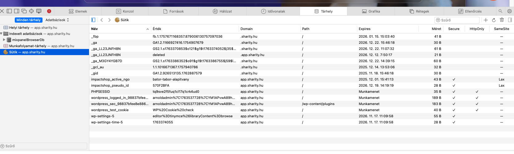
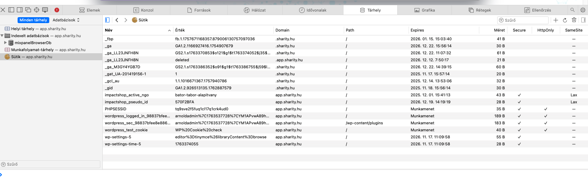
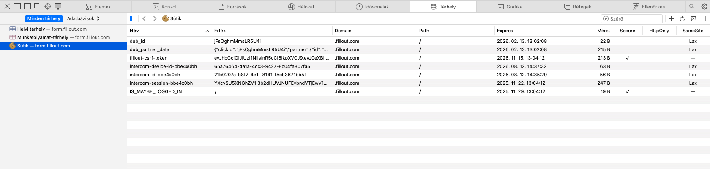

---
title: CJ Commission Detail API Reference (extracted)
source: https://commissions.api.cj.com/query
updated: 2025-11-15
---

> Az alábbi tartalom a CJ fejlesztői portál “Commission Detail API Reference” oldalának kivonata.

## Overview

The Commission Detail API is a GraphQL API available to both advertisers and publishers to access nearly real-time commission data from their accounts. Useful for retrieving fresh commission data on a regular basis. Supports filters such as posting date range, ad IDs, action statuses, etc.

## Authentication overview

- API requests authenticated via `Authorization` HTTP header.
- **Personal Access Tokens (PAT):** use `Authorization: Bearer <token>`. Tokeneket a CJ “personal access tokens” felületén lehet kezelni; tartsd privátban.
- **Developer keys:** deprecated; működnek a régi REST API-knál, de új API-k (pl. Commission GraphQL) csak PAT-et fogadnak el.

## CJ REST APIs – quick summary

- **REST v2 (Link Search / Advertiser Lookup / Publisher Lookup)**: `Authorization: <developer-key-or-PAT>` (nem `Bearer`). Legalább egy filter kötelező; Link Search esetén a `website-id` megadása ajánlott, különben a kapott link nem lesz kattintható.
- **GraphQL (Commissions, Tracking, Program Terms, Promotional Properties)**: `Authorization: Bearer <PAT>`.
- URI encoding: RFC 1738, space → `+`, explicit `+` → `%2B`.
- REST APIs for advertisers:
  * **Publisher Lookup** – detailed info on joined publishers.
  * **Commission Detail (legacy)** – real-time commission/item data; deprecated in favor of GraphQL Commission Detail.
- REST APIs for publishers:
  * **Link Search** – search CJ links by keywords, category, country, relationship, link type, etc.
  * **Advertiser Lookup** – find advertisers (joined/non-joined) and program metadata.
  * **Commission Detail (legacy)** – same as above for publishers (also deprecated).
  * **Automated Offer Feed** – finance-focused variant of the Link Search output.
- Universal REST error codes: `401` for missing/invalid auth (`None`, `"You must specify a developer key."`, `"Not Authenticated: xxxxxx"`). More details in each section below.

### 2.1 API Troubleshooting Matrix

| HTTP kód | Body | Tipikus ok | Megoldás |
| --- | --- | --- | --- |
| 401 | `{"error":"Unauthorized"}` | Hiányzó/lejárt dev key vagy PAT | Kulcs rotálása, CJ Account > Web Services |
| 403 | `{"error":"Forbidden"}` | API nincs engedélyezve | CJ support (account manager) |
| 404 | üres vagy HTML | Rossz host / API nincs aktiválva | Ellenőrizd a base URL-t, Web Services engedélyt |
| 429 | `{"retry_after":60}` | Rate limit túllépés | Tiszteld a `Retry-After`-t + backoff |
| 500 | `Server error` | CJ infrastruktúra hiba | 3× retry, majd alert |

```
wp impactshop cj:test-connection --verbose
# ✅ DNS resolution: advertiser-lookup.api.cj.com → 52.x.x.x
# ✅ SSL handshake: TLS 1.3
# ❌ HTTP 404: API nincs engedélyezve vagy helytelen host
```

### Known-good endpoint gyorslista

| Feladat | Endpoint | Auth | Smoke teszt |
| --- | --- | --- | --- |
| Commission GraphQL | `https://commissions.api.cj.com/query` | `Bearer <PAT>` | `curl -s -XPOST ... -d '{"query":"{ publisherCommissions(forPublishers:[\"PID\"],limit:1){count}}"}'` |
| Tracking API (test) | `https://tracking.api.cj.com/graphqltest` | `Bearer <PAT>` | Üres mutáció → HTTP 200, schema error |
| Tracking API (live) | `https://tracking.api.cj.com/graphql` | `Bearer <PAT>` | Csak production beküldéshez |
| Link Search v2 | `https://link-search.api.cj.com/v2/link-search` | `Authorization: <dev-key>` | `curl ... ?website-id=PID&records-per-page=1` → üres XML |
| Advertiser Lookup v2 | `https://advertiser-lookup.api.cj.com/v2/advertiser-lookup` | `Authorization: <dev-key>` | `curl ... ?requestor-cid=PID&advertiser-ids=joined` |

## Integration Overview

CJ provides two main real-time tracking integration options so you can choose the best fit for your stack:

- **Conversion Tags (Site Tracking)** – drop the CJ tag on the Thank You/receipt page to capture the order ID, totals, items, and the `CJEVENT` click token directly from the page rendering.
- **Tracking API** – send the same data (and more) server-side via CJ’s deterministic Tracking API mutations. This works for new orders, restatements, and cancellations, and exposes more flexibility for corrections or open-ended locking workflows.

### Tracking Data Types

No matter which integration you choose, you can send either:

- **Simple Integration** – only basic transaction values such as order ID and subtotal. Ideal when item-level reporting is unnecessary.
- **Advanced Integration** – includes item-level details (SKU, quantity, unit price, discounts, etc.) so CJ can enable product reporting and item-level commissioning.

## Site integration overview – Conversion Tags

CJ Conversion Tags rögzítik az alábbi paramétereket minden order vagy lead esetén. A datalayerben legyen elérhető:

- Unique Order ID (OID)
- Product SKU-k (ITEMx)
- Quantity per item (QTYx)
- Price per item (AMTx) – egységár; CJ kiszámolja `AMT * QTY`
- Currency of transaction
- Discount amount (order + item)
- Coupon code
- Marketing channel + last click timestamp
- Vertical-specific paraméterek (igény szerint)
- Dynamic `CJEVENT` click token – landing page URL query paraméterből

### Implementációs megjegyzések

- A konverziós tag a Thank You / order confirmation oldal `<body>` tagje után kerüljön.
- A site minden landing oldalon el kell mentse a `CJEVENT` query paramétert (max 64 karakter, param név testreszabható).
- Ha a CJ Event érték ismert konverziókor, a tag URL tartalmazza, különben küldd el nélküle.
- ITEM/AMT/QTY sorozatokat dinamikusan építsd (ITEM1/AMT1/QTY1, ITEM2/… stb.), a SKU-k csak betűt/számot/kötőjelet/underscore-t tartalmazhatnak.
- `AMTx` egy termék egységára; CJ szorozza a QTY-vel.
- OID csak betű/szám/kötőjel/underscore lehet.
- Paraméterek sorrendje mindegy, nem case-sensitive.
- A konverziós tagban szereplő SKU-k formátuma egyezzen a kataloguséval.
- Ha minden összeg USD, a currency hardcode-olható USD-re.
- A CJ két integrációs szintet támogat: Simple Integration és Advanced Integration (bővebb infó a CJ portálon).

## Publisher Tag (Tracking Integrity)

CJ’s Publisher Tag extends traditional tracking links with a lightweight JavaScript wrapper that:

- Exposes a function to navigate the browser without relying on server-side redirects when possible.
- Preserves click attribution data (`CJEVENT`, `adId`, `pid`) while being resilient to privacy changes.
- Falls back to standard CJ tracking links when the JavaScript interaction can’t complete.
- Loads asynchronously so it does not interfere with your page performance or dynamic scripts.
- A script hostja `https://www.mczbf.com/tags/.../tag.js`; engedélyezd a CSP-ben (`script-src`, `img-src`) és whitelisten az adblocker tesztekhez inkognitó módban.

### Set-Up Overview

1. Create a Publisher Tag inside CJ Account → `Account > TRACKING > Publisher Tags`.
2. Integrate the tag on your site either directly in markup or by invoking the exposed JavaScript function where your links live.

### Supported Publisher Models

- **Publishers placing links directly on their website** (e.g., bloggers embedding links within evergreen content) use the **On-Load** tag type.
- **Publishers serving links via JavaScript** (e.g., interstitials, dynamic widgets) use the **On-Click** tag type so the tag can intercept the link click and harvest attribution data.

### Creating and Managing Tags

#### Create a New Tag

1. Navigate to `Account > TRACKING > Publisher Tags`.
2. Click **Create Tag** and provide:
   - **Tag Name** for internal organization.
   - **Tag Type**: choose **On-Click** when links are served via JS or **On-Load** when links exist on the page.
3. Save the configuration.
4. In the tag list, open **Actions » Get Tag** to copy the snippet and embed it on your site.

#### Managing Existing Tags

| Action | Instructions |
| --- | --- |
| Re-generate the tag | Open the desired row under `Account > TRACKING > Publisher Tags`, click the three-dot menu, select **Generate Code**, and copy the new snippet into your integration. |
| Edit tag metadata | Use the three dots to select **Edit**, adjust details (name, type, description), save, and optionally re-generate the code when structural changes are made. |

### Link Requirements

- Tags and tracking links must live on a website you own/control.
- Click URLs must be under 2,000 characters.
- Masking (cloaking) the tracking links is not permitted.

### Best Practices

1. **On-Load tags** – include the tag on every page where you might publish a CJ link to avoid repeating integrations later.
2. **Validate after major site changes** – CMS migrations, tag manager swaps, theme updates, or other structural shifts can break the JavaScript; retest the tag whenever you update the page structure.
3. **Ask Support when needed** – if re-validating reveals issues, file a case under the Support Center for hands-on troubleshooting guidance.

## On-Click Publisher Tag Type

### Who Should Use It?

Use the On-Click tag when your site or interstitial already uses JavaScript to serve CJ tracking links instead of embedding them directly. This includes widgets, popups, or paths where the tracking navigation is triggered via script and traditional anchor tags are absent.

### Implementation Instructions

- Ensure you have created an **On-Click tag** in CJ (`Account > TRACKING > Publisher Tags`).
- Add the Publisher Tag `<script>` snippet to every page that will serve CJ links via JavaScript. Place it inside the `<head>` element before the closing tag so it loads early.
- Update your navigation logic so that, instead of the script performing `window.location.assign(trackingLink)`, it calls the CJ helper: 

```html
<script type="text/javascript">
    var trackingLink = "https://www.anrdoezrs.net/click-99999-1234567?SID=12345x67890";
    if (typeof cj !== 'undefined') {
        cj.navigate(trackingLink);
    } else {
        window.location.assign(trackingLink);
    }
</script>
```

- Keep any calls to `cj.navigate` below the tag loader to ensure the helper is available when needed.
- Perform any analytics tasks (e.g., Google Analytics pushes, tag executions) before calling `cj.navigate`, as the function hands control to CJ and then to the advertiser’s site.
- CSP tipp: `script-src https://www.mczbf.com` + `connect/img` engedély; ha AdBlock blokkolja a scriptet, tesztelj inkognitó módban.
- **SID parser**: a `sid` query param formátuma `{ngoSlug}~{ambCode}`; validáció: `/^([a-z0-9_-]{1,64})~([a-z0-9_-]{0,64})$/i`. Ha nincs ambassador, `ambCode` lehet üres (`ngoSlug~`).

### Example Before/After

**Before:**

```html
<script type="text/javascript">
    window.onload = function() {
        var trackingLink = "...";
        window.location.assign(trackingLink);
    }
</script>
```

**After:**

```html
<script type="text/javascript">
    window.onload = function() {
        var trackingLink = "...";
        if (typeof cj !== 'undefined') {
            cj.navigate(trackingLink);
        } else {
            window.location.assign(trackingLink);
        }
    }
</script>
```

### Testing + Validation

1. Remove any scripts that used to navigate via `window.location` directly; they must now pass the link into `cj.navigate`.
2. Open browser DevTools, start capturing the Network tab, and trigger a JavaScript-served CJ link.
3. Confirm a `V1` request appears with HTTP 200.
4. Verify the browser is redirected to the advertiser.
5. If issues arise, open a case in the CJ Support Center for assistance.

## On-Load Publisher Tag Type

### Who Should Use It?

Use the On-Load tag for properties (e.g., blogs) where CJ tracking links already exist in the page markup. The tag enriches those links automatically so users benefit from bounceless navigation without touching each anchor.

### General Instructions

1. Generate an **On-Load tag** in CJAM via `Account > TRACKING > Publisher Tags`.
2. Paste the provided `<script>` element into the `<head>` section of every page that features CJ links.
3. Once loaded, the tag scans the DOM for CJ links and rewrites them to call `cj.navigate` when clicked.
4. Visitors clicking the links will still land on the advertiser, but CJ records the click and handles attribution via the new JavaScript flow.

### Platform-specific placement tips

| Platform | Instructions |
| --- | --- |
| **Blogger** | Layout → Add a Gadget → HTML/JavaScript → paste the tag → save → drag the gadget into the Header section → save. |
| **Google Tag Manager** | Create a Custom HTML tag, paste the CJ Publisher Tag, trigger on **All Pages**, name it (e.g., "CJ Publisher Tag – On Load"), save, submit, and publish. |
| **Squarespace** | Settings → Advanced → Code Injection → Header area → paste the tag → save. |
| **WordPress** | Using “Insert Headers and Footers”: Settings → Insert Headers and Footers → paste the tag into Scripts in Header → save. |

### Testing + Validation

1. Load the page with the On-Load tag and open DevTools’ Network tab.
2. Confirm the tag fires (look for the Tag ID request returning HTTP 200).
3. Inspect a CJ tracking link on the page; it should now have `onclick="event.preventDefault(); cj.navigate(...)"`.
4. Click the link and verify a `V1` request with status 200 appears and the redirect completes.
5. Open a CJ Support case if any steps fail.

## Tag Templates (GTM / Custom Tags)

When you deploy CJ’s Publisher Tag via Google Tag Manager (or any tag manager/HTML injection tool), you typically configure three tag types: Custom HTML for the base script, Site Page tags for pageview context, and Conversion tags for purchase events.

### Tag #1 – Custom HTML (base tracking script)

1. In GTM, create a new tag → **Tag Configuration** → **Custom HTML**.
2. Paste this script while replacing `TAG_ID_FOR_YOUR_ACCOUNT` with the value provided by CJ (contact your workspace owner or CJ rep if unknown).

```html
<!-- BEGIN CJ TRACKING CODE -->
<script type='text/javascript'>
(function(a,b,c,d){
  a='https://www.mczbf.com/tags/TAG_ID_FOR_YOUR_ACCOUNT/tag.js';
  b=document;
  c='script';
  d=b.createElement(c);
  d.src=a;
  d.type='text/java'+c;
  d.async=true;
  d.id='cjapitag';
  a=b.getElementsByTagName(c)[0];
  a.parentNode.insertBefore(d,a)
})();
</script>
<!-- END CJ TRACKING CODE -->
```

3. Set a trigger to fire this tag on all pages where CJ tracking should be available.
4. Save and publish. A további CJ tagek (Page/Conversion) `Tag Sequencing` segítségével futnak a base tag után.

### Tag #2 – Site Page Tag (page-view context)

1. Create a new tag → Tag Configuration → **Community Template Gallery** → search for **CJ Affiliate - Universal Tag**.
2. Add it to your workspace, enable the **Page Data** toggle, and map:
   - **Page Type** – use values from the accepted list (`accountCenter`, `homepage`, `cart`, etc.). Assign the value that best matches each page’s role.
   - **Company ID** – your CJ Enterprise ID.
   - **Referring Channel** – optional but required for Cross Channel Journey reporting (Affiliate, Display, Social, Search, Email, Direct_Navigation).
   - **Order Subtotal** – send only on cart/relevant pages; do not include tax/shipping.
3. Map every attribute listed in the template to your GTM variables to unlock Cross Channel insights.
4. Expand **Advanced Settings**:
   - Use **Tag Sequencing** to fire this tag after the “CJ Universal Tag Container” tag when needed.
   - Under **Triggering**, specify all pages except transaction confirmation pages and add an **exception** for the confirmation page.
5. Publish.

### Tag #3 – Conversion Tag (transaction reporting)

1. In GTM add another **CJ Affiliate - Universal Tag**.
2. Enable the **Order Data** toggle.
3. Populate required fields with CJ-provided values:

| Property | Description | Format | Required |
| --- | --- | --- | --- |
| Action Tracker ID | Static CJ-provided actionTrackerId (e.g., `'123456'`). | Numeric | Yes |
| Company ID | Your CJ Enterprise ID. | Numeric | Yes |
| Order ID | Unique order identifier (alphanumeric, ≤96 chars, no PII). | Alphanumeric | Yes |
| Order Subtotal | Order amount excluding tax/shipping. | Decimal | Yes |
| Whole Order Discount | Discount value in the order’s currency. | Decimal | Yes |
| Currency | ISO 4217 code; mandatory when overriding functional currency. | ISO Code | Yes |
| Page Type | Must be `conversionConfirmation`. | String | Yes |

4. Provide item-level data when required:
   - **SKU/Product ID** (alphanumeric, ≤100 chars, max 100 items per order)
   - **Product Price** (unit price, decimal)
   - **Product Quantity** (integer)
   - **Product Discount** (item-level discount; required if applicable)
5. In **Advanced Settings**, optionally enable `item level data` and reference your product array variables (SKU, price, quantity, discount).
6. Under **Tag Sequencing**, fire this tag after your primary CJ container tag.
7. Trigger the tag on the confirmation page (DOM Ready recommended), így a felhasználó nem lép ki a POST előtt.
8. Publish and work with CJ’s integration engineers to validate via test orders.

## Troubleshooting & QA

### Publisher Tag ellenőrzőlista

- **On-Load**: DevTools Network nézetben ellenőrizd, hogy a Tag ID kérés 200-as státuszt ad, majd egy CJ link `onclick="event.preventDefault(); cj.navigate(...)"` attribútumot kap. Ha hiányzik, győződj meg róla, hogy a script a `<head>`-ben szerepel és nincs CSP-blokkolás.
- **On-Click**: A `cj.navigate(trackingLink)` hívást mindig azután futtasd, hogy saját analytics/tag logikád lefutott. Ha `cj` undefined, ellenőrizd, hogy a Publisher Tag script és a funkciót meghívó kód sorrendben van, illetve tarts fallbacket (`window.location.assign`).
- **Interaktív teszt**: A kattintás után a Network logban keress `V1` hívást 200-as kóddal, majd vizsgáld meg, hogy a böngésző átirányítja-e a felhasználót az advertiser oldalára. Hibánál ellenőrizd az AdBlock/tartalomszűrést és a hirdető whitelistinget.

### Conversion Tag / Tracking API validáció

- **Conversion Tag**: DOM Ready eseményhez kösd, hogy a látogató ne hagyja el az oldalt a POST előtt. Figyelj rá, hogy az `orderId` ≤ 96 karakter és csak alfanumerikus/`-_` karaktereket tartalmazzon. Item-level bekötésnél max 100 tételt küldhetsz, a `quantity` mező egész szám legyen.
- **Tracking API**: Új, restatement és cancel mutáció 100 tétel/ordernél többet nem fogad. Ha `"Order may not have more than 100 items"` vagy jövőbeli timestamp hiba érkezik, darabolj vagy javítsd az `eventTime` / `updateTime` mezőket. Open-ended locking esetén a `status` hiánya processing failure-t okoz.
- **Logolás**: Tartsd meg a GraphQL request/response logokat (`errors` blokk), így CJ supportnak is továbbíthatod a `commissionId` vagy `orderId` alapján. REST/GraphQL PAT lejárat vagy jogosultság hiba esetén 401-es kódot kapsz.

### Batch fájl és feed feldolgozás

- **Header + delimiter**: „Wrong Number of Fields” esetén ellenőrizd, hogy az import beállításnál a `Quoted values` opció egyezik-e a fájl formátumával, a mezők sorrendje és neve megegyezik-e a regisztrációs beállítással és nincsenek nem támogatott oszlopok.
- **Fájlnév és delivery**: Receipt email hiányában vizsgáld meg, hogy a feltöltött fájlnév case-sensitive egyezést mutat-e a feed/subscription beállításaival, illetve a fájl jó protokollra (CJ SFTP vs. Fetch) került-e.
- **Error report**: Sikertelen processz esetén a Results email csatolt JSON fájlja max 15 egyedi mintát ad hibánként – ezek alapján korrigáld a termék- vagy order sorokat (pl. kötelező mező hiány, invalid URL, rossz currency formátum).

### SFTP / jogosultságok

- A Product Feed jelszóreset az összes SFTP subscriptionot érinti, ezért reset előtt az `Account > Admin > Subscriptions` listában vizsgáld meg, hogy nincs-e más adatcsatorna ugyanazon a credentialen.
- Batch importoknál ugyanarra az Enterprise ID + Subscription ID kombinációra csak egy fájlt küldj egy időben. Ha OpenPGP-aláírás vagy titkosítás szükséges, ellenőrizd, hogy a kulcsverzió kompatibilis CJ feldolgozójával (RFC2440/GPG 5.x+).

### Support és regresszió megelőzés

- Minden nagyobb webhelyváltoztatás (CMS váltás, Tag Manager átállás, theme csere) után futtasd végig a fenti ellenőrzéseket. Ha eltérés tapasztalható, nyiss ticketet a CJ Support Centerben (`Data Transfer > Troubleshooting` vagy `Tracking > Publisher Tag`).
- Dokumentáld a teszt forgatókönyveket (pl. landing + cart + konverzió), így sprintenként gyorsan ismételhetők és összevethetők az új release-ekkel.

---

# CJ GraphQL Tracking API (Orders) – Overview

- Mutációk a teljes tranzakció lifecycle-re: `createOrders`, `restateOrders`, `cancelOrders`.
- Endpoints:
  - Test: `https://tracking.api.cj.com/graphqltest`
  - Production: `https://tracking.api.cj.com/graphql`
- Új rendelések: egyedi kombináció (Order ID + Action ID + Enterprise ID).
- Restatement: teljes order állapotot kell elküldeni; felülírja a meglévő adatokat (csak ha nincs lock/close).
- Cancel: meglévő order törlése, nem akarunk jutalékot/fee-t fizetni.
- Open-ended locking (pending actions): `restateOrders`-nél `status = Accepted/Pending`, `cancelOrders`-nél `status = Declined`. Ha STATUS hiányzik open-ended ordernél → request fail processingkor.
- Submission limit: max 10 000 order/batch.
- Monitoring: sikeres kérelmek új sorokat hoznak létre a Commission Detail riportban / API-ban (restatement = reversal + új állapot).

## Test vs Live

- **Test Mode:** küldj kérést a `/graphqltest` endpointra; minden validáció lefut, de nem kerül be a production reportingba. Nem ellenőrzi a lock/closed state-et.
- **Live Mode:** `/graphql` endpoint; minden request product-ban feldolgozás és riportálás.

## Error handling (realtime)

| Típus | Példa / üzenet |
| ----- | -------------- |
| Missing token | `"Missing Token"` |
| Invalid token | `"Invalid Token"` |
| Unauthorized | `"Unauthorized"` – Enterprise ID nincs társítva |
| Invalid syntax | `"Invalid Syntax"` |
| Schema validation | `"Validation error of type WrongType: argument …"` |
| Too many items | `"Order may not have more than 100 items"` |
| Future timestamps | `"Order may not have a eventTime/updateTime in the future"` |
| Excessive load | HTTP 504; csökkentsd 10k alattira és retry |

Hiba feldolgozás sorrendje: Authentication → Schema → Authorization → Field-level validation.

## Processing rules

- Új order: duplikáció vizsgálat (Order ID logika).
- Restate/cancel: ordernek léteznie kell, commissionable és nem locked/closed.
- Action ID-nek az adott accounthoz kell tartoznia.
- Restatement nem teheti non-commissionable-vé a tranzakciót, és nem változtathat publisher-t.
- Open-ended locking esetén kötelező a Status mező.
- Feldolgozás akár 1 órát is igénybe vehet; output a Commission Detail riportban látszik. Sikertelen (processing error) request esetén a CJ support tud logot adni.

---

# Data Imports Overview

- CJ három fő adat típust fogad: **Transaction**, **Adjustment** (Correction/Extension/Item list) és **Product** data.
- Formátumok: delimiteres (TAB/PIPE/CSV) és XML; átvitel: CJ SFTP, Client FTP/SFTP, HTTP(S), Email, Web Upload.
- Import receipt/result értesítések alapból a regisztrált Superusernek mennek.
- Minden adatfájl header + body mezőket tartalmaz. Header: CID, dataset típusa, akció; body: feldolgozandó rekordok.

## File types

- **Transaction** (online, concluded, in-store) → jutalékot generál, Account Managerben látszik.
- **Adjustment** → korábbi tranzakciók módosítása (correction, extension, item list).
- **Product** → shopping feed (külön retention).

## Enabling data transfer

1. Szükséges egy Import Subscription ID + CID → CJ Supporttal kell egyeztetni:
   - Subscription típusa (Action, Concluded Action, Offline, Correction, Extension).
   - Formátum (delimited/XML).
   - Transfer method (CJ SFTP, HTTP, Client FTP/SFTP, Email, Web upload).
   - E-mail cím(ek) a receipts/errors értesítéshez.

## Transfer methods

| Method | Leírás |
| --- | --- |
| CJ SFTP | Advertiser feltölti SFTP-n (CID userként, SSH kulcs). |
| Client FTP/SFTP | CJ húzza le a kliens szerveréről (edi info: host/user/pass, unique filenames, ne használj `_ts`, távolítsd el processed fájlokat). FTPS nem támogatott. |
| Client HTTP/S | CJ periodikusan letölti, timestamp alapján. |
| Email | `import@datatransfer.cj.com` címre Body vagy MIME attachment (1 fájl/email). |
| Web Upload | CJ Account Manager > Account > Admin > Subscriptions → Upload. |

Megjegyzések:
- ASCII fájlok, Content Guidelines szerint.
- Minden subscription teszt módban indul; csak sikeres verifikáció után megy live.
- Sikeres import fájlok 45 napig (products: 3 nap) archiválódnak; hibásak 31 / 3 nap.

## Results reporting

- Import receipt email → a CJ feldolgozás előtt / után megerősít.
- Eredmények: e-mailben vagy CJ SFTP-n (annak megfelelően, amit setupkor megadtál).
- Completion email tartalmazza: feldolgozás ideje, rekordok száma, hibák, opcionálisan részletes rekordlog.
- Leggyakoribb hiba: hiányzó/rossz header.

## Tracking compliance

- CJ monitorozza a publisher-referral aktivitást; 5 munkanapon belül bizonyítani kell, hogy tracking működik.
- Ha nem, a fiókot felfüggeszthetik.

## Data security

Két opció:

1. **Clearsigning** – digitális aláírás, nincs titkosítás (PGP/GPG). Az eredeti adat érintetlen, a végén signature blokk.
2. **Data signing + encryption** – aláírás + titkosítás (OpenPGP). Csak CJ által támogatott PGP/GPG verziókkal kompatibilis.

Lépések:
- Generálj public/private key párt (OpenPGP-kompatibilis eszköz: GPG vagy PGP).
- Küldd el CJ-nek a publikus kulcsot; ha encryption kell, importáld CJ publikus kulcsát is.
- Clearsign esetén ASCII formátum szükséges; encrypt esetén clearsign + encrypt.

## Getting started

- CJ az OpenPGP (RFC2440) standardot támogatja (PGP 5.x+, GPG).
- PGP info: https://www.pgp.com/ ; GPG: https://www.gnupg.org/.
- Fontos: csak támogatott verziókkal működik a CJ feldolgozás.

## Security key exchange & examples

- Általános eljárás: generáld a publikus kulcsot, küldd CJ-nek. Encryption esetén CJ publikus kulcsát is importáld.
- Példa clearsigned fájlra (PGP header + signature blokkal) szerepel az eredeti doksiban.

## Action Data (New Orders)

### Overview

- CJ’s Action Data files report **new, unique** orders that have not yet been sent to CJ. A unique order is defined by the combination of `orderId`, `actionId`, and `enterpriseId`.
- Supports both standard (subtotal only) and item-based commissions. Item-level data is provided either through the `items` field or the `itemSku`/`itemUnitPrice`/`itemQuantity` (with optional `itemDiscount`) combination.
- Each file is ASCII-delimited (CSV/pipe/tab) or XML and must include a header row. Custom parameters are allowed by prefixing their header with `cp.` (e.g., `cp.mkt_channel`).

### Rules for New Orders

- New orders must include publisher attribution data; the preferred value is the `cjEvent` token.
- Instead of `cjEvent`, you may optionally provide both `adId` and `promotionalPropertyId`.
- If both `cjEvent` and (`adId` + `promotionalPropertyId`) are provided, the CJ Event token takes precedence.
- Orders cannot be reported with future event times.
- Files may contain no more than 100 items per order.
- CJ rejects duplicate entries that reuse the same `orderId` + `actionTrackerId` combination—even within the same file.

### Header Row

- Required headers depend on the action type but always include `companyId`, `subscriptionId`, `orderId`, `actionTrackerId`, `eventTime`, `currency`, and either `cjEvent` or both `adId` and `promotionalPropertyId`.
- Optional headers include `enterpriseId`, `sid`, `discount`, `coupon`, advanced item columns, and any `cp.` custom parameters.

### Body Fields

| Field | Description | Requirement |
| --- | --- | --- |
| `companyId` | Advertiser CID provided by CJ. | Required |
| `enterpriseId` | Advertiser account number (Enterprise ID). | Optional unless specified by subscription. |
| `subscriptionId` | CJ-provided import subscription ID. | Required (per file). |
| `orderId` | Advertiser‑generated order identifier (truncate after 96 chars, alphanumeric only). | Required |
| `actionTrackerId` | CJ-assigned Action ID for the sale/lead. | Required |
| `eventTime` | ISO 8601 timestamp; future times are invalid. | Required |
| `cjEvent` | CJ click token for publisher attribution (preferred). | Conditionally required (or `adId` + `promotionalPropertyId`). |
| `adId` / `promotionalPropertyId` | Link/Promotional Property IDs from the click-through. | Required if `cjEvent` is missing. |
| `amount` | Order subtotal (decimal, no currency symbols). | Required for simple sale/lead actions. |
| `discount` | Whole-order discount (optional). | Optional |
| `currency` | ISO 4217 currency code; defaults to account currency if absent. | Required when overriding account currency. |
| `coupon` | Coupon code applied to the order (≤256 chars). | Optional |
| `sid` | Shopper ID passed through the click (alphanumeric, ≤64 char). | Optional |
| `itemSku`, `itemUnitPrice`, `itemQuantity`, `itemDiscount` | Item-level breakdown for advanced actions (semicolon-separated lists). | Conditionally required for item-based commissions. |
| `items` | Combined item string (`sku;price;qty;discount` per item, double semicolon between items). | Alternative to explicit item columns for item-based commissions. |

### Vertical Parameter Fields (optional)

advertiserVertical, ancillarySpend, annualFee, applicationStatus, apr, aprTransfer, aprTransferTime, bookingDate, bookingStatus, bookingValuePostTax,
bookingValuePreTax, brand, businessUnit, campaignName, cardCategory, carOptions, cashAdvanceFee, category, city, class, confirmationNumber, contractLength,
contractType, countryCode, couponDiscount, couponType, creditLine, creditQuality, creditReport, cruiseType, customerCountry, customerSegment, customerStatus,
customerType, destinationCity, destinationId, delivery, destinationCountry, destinationState, domestic, dropoffIata, duration, endDateTime, flightFareType,
flightOptions, flightType, flyerMiles, fundedAmount, fundedCurrency, genre, guests, iata, introductoryApr, introductoryAprTime, itemId, itemName, itemType,
itineraryId, location, loyaltyEarned, loyaltyFirstTimeSignup, loyaltyLevel, loyaltyRedeemed, loyaltyStatus, margin, marketingChannel, minimumBalance,
minimumDeposit, minimumStayDuration, noCancellation, orderSubtotal, originCity, originCountry, originState, paidAtBookingPostTax, paidAtBookingPreTax,
paymentMethod, paymentModel, pickupIata, pickupId, platformId, pointOfSale, port, preorder, prepaid, prequalify, promotion, promotionAmount,
promotionConditionThreshold, promotionConditionType, promotionEnds, promotionStarts, promotionType, quantity, rating, rooms, roomType, serviceType,
shipName, startDateTime, state, subscriptionFee, subscriptionLength, taxAmount, taxType, transferFee, travelType, tripType, upsell

### File Example

```
enterpriseId,companyId,subscriptionId,actionTrackerId,orderId,eventTime,cjEvent,amount,discount,currency,coupon,advertiserVertical,bookingDate,bookingStatus,brand,cp.mkt_channel
112233,7318997,1234,6653,ABC123,2021-05-12T03:04:05.6-07:00,5b1a8148b3a811eb80e89e3f0a1c0e12,49.33,12.76,USD,FALLSALE,Travel,4/11/2021,Confirmed,HotelBookingCo,affiliate
```

### Notification workflow

- Receipt confirmation email is sent immediately upon file arrival.
- Processing results email follows completion with a `Success`, `Partial Failure`, or `Failure` subject line; detailed error information is included either inline or as a JSON attachment.

## Order Restatement Data

### Overview

- Order Restatements let you update the full state of an order that is still commissionable and not locked/closed. CJ completely overwrites the previous record, so the payload must represent the intended final state.
- Restatements cannot adjust ID fields (`orderId`, `actionTrackerId`, `enterpriseId`) nor change which publisher receives credit.
- Restatements for open-ended locking (Pending Actions) must include a `status` of `Pending` or `Accepted`.
- Restatements cannot convert a non-commissionable order into a commissionable one; you must send it as a new order instead.

### Rules

- Status field may only transition to `Pending`, `Accepted`, or `Closed` depending on locking; `Declined` belongs to cancellations.
- CJ rejects restatements that would turn a commissionable order into a non-commissionable scenario (e.g., applying exclusive coupon codes).
- `updateTime` must not be in the future.
- Use the same publisher attribution data (`cjEvent` or `adId` + `promotionalPropertyId`) used when the order was first accepted.

### Header row & fields

- Same pattern as New Orders: header row lists the same field names, custom parameters allowed via `cp.`.
- Required body values include `companyId`, `subscriptionId`, `orderId`, `actionTrackerId`, `updateTime`, `currency`, `amount` (for simple/lead), plus the attribution data (`cjEvent` or `adId` + `promotionalPropertyId`).
- Optional fields mirror the Action Data set (discount, coupon, item-level columns, etc.). Include `status` and `correctionReason` when relevant.

| Field | Description | Requirement |
| --- | --- | --- |
| `updateTime` | Timestamp of the restatement (ISO 8601, no future dates). | Required |
| `status` | `Pending` or `Accepted` for pending actions (optional otherwise). | Required for open-ended locking |
| `correctionReason` | Descriptive reason for the restatement. | Optional |
| `amount`, `currency`, `item*` columns | Same as Action Data. | Required for simple/advanced orders alike |

### File example

```
enterpriseId,companyId,subscriptionId,actionTrackerId,orderId,updateTime,itemSku,itemUnitPrice,itemQuantity,itemDiscount,currency,coupon,customerStatus,cp.madeUpCustomParameter
1113122,7318997,264255,155,ABC123,2021-05-12T03:04:05.6-07:00,sku123,19.99,1,3.23,USD,FALLSALE,New,Made Up Parameter Value
```

### Notifications

- Same receipt/results cadence as New Orders, with email subjects `CJ Import Receipt Confirmation` and `CJ Order Restatements File Processed - [result_status]`. `result_status` follows the `Success / Partial Failure / Failure` pattern described earlier.

## Order Cancellations Data

### Overview

- Cancels reduce an already accepted commissionable order to zero commission/amount/quantity. CJ processes the cancellation but does not allow attribute changes beyond identifying the order.
- For orders on open-ended locking, include `status=Declined`.
- You cannot cancel locked/closed orders.
- Provide a `correctionReason` if you want to explain the cancellation.

### Fields

| Field | Description | Requirement |
| --- | --- | --- |
| `orderId`, `actionTrackerId`, `companyId`, `subscriptionId` | Identify the order to cancel. | Required |
| `updateTime` | Cancellation timestamp (ISO 8601, no future dates). | Required |
| `status` | `Declined` for open-ended locks. | Required for pending orders |
| `correctionReason` | Optional explanation (e.g., `InvalidCreditCard`). | Optional |

### File example

```
enterpriseId,companyId,subscriptionId,actionTrackerId,orderId,updateTime,correctionReason
1113122,7318997,264255,155,ABC123,2021-05-12T03:04:05.6-07:00,InvalidCreditCard
```

### Notifications

- Receipt and result emails follow the same cadence as other data imports, with the result_message `CJ Order Cancellations File Processed - [result_status]`.

## Tracking API (orders) vs. Batch files

- Ez a szekció csak emlékeztető: a Tracking API deterministic megközelítést használ (mindig a teljes order állapotot küldd). A batch importtal hasonló workflow valósítható meg, de a CSV/XML fájl már legacy módszer. A Tracking API részei fentebb találhatók.

## Ledger szinkron & idempotencia

### 5.3.1 Idempotencia szabályok

- **Elsődleges kulcs**: `external_id` (CJ `action-id`). A `wp_impact_ledger.external_id` mező UNIQUE.
- **Státusz frissítés**:
  - `pending` → `locked`: `UPDATE` a meglévő soron (`status`, `amount_huf`, `updated_at`).
  - `locked` → `corrected`: új sor beszúrása negatív összeggel, `parent_action_id` hivatkozással.
- **Időbélyeg**: `modified_date` alapján vizsgáljuk, hogy frissebb adat-e; ha nem, a rekordot logoljuk, de nem írjuk felül.
- **Collision handling**:

```sql
INSERT INTO wp_impact_ledger (external_id,status,amount_huf,ngo_slug,updated_at)
VALUES (:external_id,:status,:amount_huf,:ngo_slug,NOW())
ON DUPLICATE KEY UPDATE
  status = VALUES(status),
  amount_huf = VALUES(amount_huf),
  updated_at = NOW();
```

**CLI**:

```
wp impactshop cj:sync-ledger --since=2025-10-20 --dedupe-strategy=update
```

### Acceptance példák

- **Given** `actionStatus = locked` **When** correction érkezik `actionStatus = corrected` **Then** beszúrunk egy új sort `amount_huf = -abs(összeg)` és `parent_action_id` a korábbi sorra mutat.
- **Given** `actionStatus = cancelled` **When** ledger-be írjuk **Then** `amount_huf = 0`, `status = declined`, open-ended lock esetén kötelező a `Declined` státusz.
- **Given** correction érkezik, de `parent_action_id` nem található **Then** az esemény a “Manual review” queue-ba kerül (`/wp-admin/admin.php?page=impact-ledger-orphans`), amíg az eredeti ordert nem szinkronizáltuk.

### Webhook pilot (nem publikus)

- A CJ publikus dokumentációja jelenleg nem kínál hivatalos publisher webhookot, de egyedi megállapodással kérhető. Jelöld kísérleti státuszúnak, és csak account manager jóváhagyással engedélyezd.
- Endpoint példa: `https://app.sharity.hu/wp-json/impactshop/v1/cj-webhook`
- Signature: HMAC-SHA256 `X-CJ-Signature` fejléc; verify mielőtt feldolgozod.
- Guardrail: ha a webhook sorozatosan hibázik, automatikusan visszaállunk polling + cursor (`sinceCommissionId`) stratégiára.

## URL

```
https://commissions.api.cj.com/query
```

## Sample requests

**Publisher**

```
curl -H "Authorization: Bearer <token>" \
     -X POST https://commissions.api.cj.com/query \
     -d '{ publisherCommissions(forPublishers: ["999"], sincePostingDate:"2018-08-08T00:00:00Z",beforePostingDate:"2018-08-09T00:00:00Z"){count payloadComplete records {actionTrackerName websiteName advertiserName postingDate pubCommissionAmountUsd items { quantity perItemSaleAmountPubCurrency totalCommissionPubCurrency }}}}'
```

**Advertiser**

```
curl -H "Authorization: Bearer <token>" \
     -X POST https://commissions.api.cj.com/query \
     -d '{ advertiserCommissions(forAdvertisers: ["11223344"], sincePostingDate:"2018-08-08T00:00:00Z",beforePostingDate:"2018-08-09T00:00:00Z"){count payloadComplete records {actionTrackerName websiteName advertiserName postingDate pubCommissionAmountUsd items { quantity perItemSaleAmountPubCurrency totalCommissionPubCurrency }}}}'
```

minták a dokumentumban.

## Errors

- **Parse error**: invalid/misspelled field. Fix query.
- **Invalid auth token**: token/dev key invalid.
- **No data**: `count=0`; check arguments (forPublisher/forAdvertisers, token).

## Pagination

Cursor based:
- If `payloadComplete` is `false`, read `maxCommissionId`; pass as `sinceCommissionId` in next query.
- Repeat until `payloadComplete` is `true`.

## Limits

- Max date range 31 nap.
- Payload limit 10 000 commission; használj `sinceCommissionId`.
- Max 120 concurrent connection.
- Rate limit: 200 calls / 5 perc.

## Corrections

- Kérd le az `original` objektumot: `true` = eredeti tranzakció, `false` = corrected.
- Original és corrected rekordok ugyanazt az `orderId`-t használják, de eltérő `commissionId`-t.
- Simple sale: összegeket aritmetikusan kombináld.
- Advanced sale (item level): quantity-k összege + per item amount * commission.

## Best practices

- Ha csak egy dátumhatárt adsz meg, a másik default 24h.
- Ha nincs argumentum: past 24h by posting date.
- Egyes mezők lassabbak (pl. `situations`), hagyd ki ha nem kell.

## Insights & Reporting Workflow

- **Commission Detail GraphQL** az elsődleges adatforrás közel valós idejű riportokhoz; `sincePostingDate` + `beforePostingDate` vagy `sinceCommissionId` paraméterekkel építhetsz napi exportot. Tartsd szem előtt a 10 000 soros payload limitet, és írj visszatérést, ha `payloadComplete=false`.
- **Vertical/Situational mezők**: a feedekből és Tracking API-ból küldött vertikális paraméterek (pl. `brand`, `ancillarySpend`, `travelType`) Insights riportban és Commission Detail rekordokban jelennek meg. Azonos mezőneveket használj minden csatornán, hogy a riport aggregálni tudjon.
- **Program Terms API**: riportokhoz szükséges a mindenkori jutalékszint és `situations` lista. A `programTerms` GraphQL lekérdezés `actionTerms.commissions` tömbje tartalmazza a rankelt jutalékokat – mentsd el, hogy összevethesd a valós kifizetéssel.
- **CJ Insights UI**: a Commission GraphQL-ből exportált adatokat töltsd be BI vagy warehouse megoldásba (pl. BigQuery). Így saját dashboardot építhetsz, miközben az Insights UI-ban ugyanazokat a mutatókat (locking státusz, validation, publisher teljesítmény) ellenőrizheted.
- **Concluded / Correction importok**: ha manuális batch fájlokat küldesz (Action/Correction), a Results e-mail JSON-ját tárold, és a hibás sorokat flagged records-ként jelenítsd meg Insights riportban – így a csapat látja, hogy mi hiányzik a végső kifizetésből.
- **Data governance**: minden riport futásnál logolj `maxCommissionId` és `sinceCommissionId` párokat, tartsd a PAT lejárati dátumot, és legalább heti szinten ellenőrizd, hogy a grafikonok megegyeznek-e a CJ Insights UI aggregált számaival.

## Payout & Finance Operations

- **Locking folyamat**: a tranzakciók `Pending → Extended → Locked → Closed` státuszokon haladnak át. Csak a locked/closed commissionök kerülnek be a kifizetési sorba; ellenőrizd, hogy nincs-e sok hiba Pending státuszban (pl. hiányzó SKU, visszatartott lead).
- **Kifizetési ütemezés**: CJ alapértelmezés szerint havi ciklusokban utal (a publishing partnerek felé), az advertiser számára pedig számla készül az adott settlement periódusra. Figyeld a billing értesítőket, mert a fizetési határidő tipikusan 30 nap; késedelemnél a hálózat késedelmi kamatot számíthat fel.
- **Reserve / dispute kezelés**: ha jelentősebb chargeback vagy dispute merül fel, CJ ideiglenesen reserve-ot képezhet. A reserve oldásához teljes részletezést kell küldeni (order ID, reklamáció oka, kommunikáció a publisherrel). Dokumentáld ezeket az `impactshop-notes` alatt, hogy transzparens legyen minden csapat számára.
- **Invoice egyeztetés**: minden settlementhez tartozik egy részletes CSV (actionTracker, commissionId, payout összeg). Érdemes a Commission GraphQL exportot összevetni a számlával, és a különbségeket (pl. decline/cancel miatti levonások) külön lapon dokumentálni.
- **Adó- és compliance követelmények**: a CJ Account-ban tartsd naprakészen a vállalati és adózási adatokat (W-8/W-9, VAT ID). Hiányzó vagy lejárt dokumentum esetén a CJ felfüggesztheti a kifizetéseket, ezért évente ellenőrizd a státuszt.
- **Support workflow**: pénzügyi eltérés esetén nyiss ticketet `Account > Support Center > Billing`. A ticketben hivatkozz a settlement ID-ra, invoice számára, és csatolj Commission API exportot, így a CJ finance csapat gyorsabban tud reagálni.

## Queries & Arguments

### `advertiserCommissions(forAdvertisers: [String!]!)`

Fő argumentumok (részleges lista):

| Argument | Típus | Leírás |
| --- | --- | --- |
| `actionStatuses` | [String!] | Szűrés action status alapján. |
| `actionTypes` | [String!] | Szűrés action típus alapján. |
| `adIds` | [String!] | Ad ID lista. |
| `beforeEventDate` / `sinceEventDate` | String | ISO 8601 UTC dátum. |
| `beforeLockingDate` / `sinceLockingDate` | String | ISO 8601. |
| `beforePostingDate` / `sincePostingDate` | String | ISO 8601. |
| `commissionIds` | [String!] | Egyedi commission ID-k. |
| `forAdvertisers` | [String!]! | Advertiser CID lista (kötelező). |
| `lockingMethods` | [LockingMethod!] | Locking method filter. |
| `publisherIds` | [String!] | Publisher CID lista. |
| `sinceCommissionId` | String | Cursor pagination (használd `maxCommissionId`-t). |
| `validationStatuses` | [ValidationStatus!] | Validation státusz filter. |
| `websiteIds` | [String!] | Website ID lista. |

### `publisherCommissions(forPublishers: [String!]!)`

Argument lista megegyezik (publisher fókuszú mezők: `advertiserIds`, `websiteIds`, stb.).

## Objects & Fields (részletek)

### `AdvertiserCommission`

Fő mezők:
- `actionStatus` (ActionStatus)
- `actionTrackerId`, `actionTrackerName`, `actionType`
- `advertiserId`, `advertiserName`
- `commissionId`
- `eventDate`, `postingDate`, `lockingDate`
- `pubCommissionAmountPubCurrency`, `pubCommissionAmountUsd`
- `publisherId`, `publisherName`
- `orderId`, `original`, `originalActionId`, `correctionReason`
- `items`: `[Item!]!`
- `verticalAttributes`: `AdvertiserVerticalAttributes`
- stb.

### `Item`

- `commissionItemId`, `sku`, `quantity`
- `perItemSaleAmountAdvCurrency`, `perItemSaleAmountPubCurrency`, `perItemSaleAmountUsd`
- `totalCommissionAdvCurrency`, `totalCommissionPubCurrency`, `totalCommissionUsd`
- `discount*` mezők, `situationDetails`

### `PublisherCommission`

Publisher-eknek hasonló mezők, plusz:
- `shopperId`, `sid` (deprecated), `publisherId`, `websiteId`
- `saleAmountPubCurrency`, `saleAmountUsd`
- `verticalAttributes` (publisher definíció)

## Enums & Scalars

- `CorrectionReason`: `INVALID_CREDIT_CARD`, `RETURNED_MERCHANDISE`, `OTHER_REASON`, stb.
- `LockingMethod`: `IMMEDIATE`, `FIXED_DATE`, `OPEN_ENDED`, `FIXED_DURATION`.
- `ValidationStatus`: `PENDING`, `ACCEPTED`, `DECLINED`, `AUTOMATED`.
- `ActionStatus`: `new`, `extended`, `locked`, `closed`.
- `ActionType`: `bonus`, `click`, `imp`, `item_lead`, `item_sale`, `perf_inc`, `sim_lead`, `sim_sale`.
- Scalar típusok: `DecimalNumber`, `Instant`, stb.

---

# CJ Product Feeds

## Eligibility & Purpose

- Minden CJ hirdető létrehozhat product feedet, kivéve akik “gateway without redirect” integráción futnak. Ők csak az integration módosítása után kaphatnak engedélyt.
- A feedek biztosítják, hogy a publisher-ek keresni/exportálni tudják a termékeket, és hogy az advertiser részletes termék szintű riportokat kapjon (pl. item level commissioning).
- Három elfogadott specifikáció: **Shopping (Google format)**, **Travel & Experiences**, **Finance**. A Shopping feed retail SKU alapú termékekre, Travel időponthoz/kiszolgálási helyhez kötött ajánlatokra, Finance pedig jelenleg főleg hitelkártyákra szolgál.

## Feed regisztráció az Account Managerben

1. CJ Account Manager → `Campaigns > Ad Assets > Product Feeds`.
2. Első feed esetén kattints a **Register Feed** gombra; későbbiekben `Feeds` táblázatból is elérhető.
3. Minden mezőt tölts ki (a “Non-registered user emails” kivételével). A mezők egy része később nem szerkeszthető (pl. Feed name, Archive URL, Format).
4. Mentés után a Feeds listában jelenik meg; innen lehet **Edit / Delete / View Performance / Reset Password** műveleteket indítani.

### Registration form mezők (rövid összefoglaló)

- **Product Feed Name** *(nem szerkeszthető)* – publikus címke a publisher exportoknál.
- **Email(s) for notifications – registered users** – dropdown a fiók userjeiből. Ők kapnak import receipt/result e-maileket és (ha szükséges) SFTP credentialst.
- **Email(s) for notifications – non-registered users** – opcionális szöveges lista, vesszővel elválasztva (pl. ügynökség).
- **Send notifications when imports not received** – reminder e-mail, ha X napja nem jött feed.
- **Archive URL** *(nem szerkeszthető)* – hova irányítjuk a linkeket, ha a feed archivált státuszba kerül.
- **Mode** – `test` vagy `live`. Test feldolgozza és e-mailt küld, de nem jelenik meg a publisher felületén.
- **Product Search Results and API** *(nem szerkeszthető)* – `Yes` → termékek láthatók keresésben, `No` → csak csatlakozott publisher exportálhatja.
- **Publisher group with access to feed exports** – restrikció joined publisher csoportra.
- **Format** *(nem szerkeszthető)* – Shopping / Travel / Finance specifikáció.
- **Field to use for item-level commissioning** – pl. `google_product_category`, `product_type`, vagy `custom_label_x`.
- **Target country / currency / content language** – feed szintű default érték.
- **Data format** – CSV, pipe, tab vagy XML + “quoted values” opció.
- **Price field currency format** – tizedes elválasztó beállítás (US vs EU). Hibás beállítás → hibás megjelenítés publisher oldalon.
- **Delivery methods** – POST (CJ SFTP) vagy FETCH (kliens FTP/SFTP/HTTP/S). SFTP user/pass minden subscriptionra közös.
- **File name** – case-sensitive, változatlan fájlnév kiterjesztéssel. A CJ rendszer ezt használja a feldolgozáshoz.

## Közzététel, kezelés, jogosultságok

- A Feeds táblázat minden feedhez mutatja az utolsó import dátumát. Innen indítható az **Edit**, **Delete**, **View Performance**, **Reset Password**.
- **Delete** esetén a teljes feed archívba kerül; a publisher linkek az Archive URL-re mennek (max 24h, mire eltűnik a keresésből).
- **Reset Password** az összes SFTP subscription jelszavát cseréli, ezért előzetes ellenőrzés javasolt az `Account > Admin > Subscriptions` felületen.

## Mintafájlok

- Shopping feed (teljes): https://image.hi.cj.com/lib/fe2d11747364047f7c1272/m/1/ShoppingFeedSample_csv.csv
- Shopping feed (csak kötelező): https://image.hi.cj.com/lib/fe2d11747364047f7c1272/m/1/Shopping+Feed+Sample+-+Required+Fields.csv
- Travel Experiences feed: https://image.hi.cj.com/lib/fe2d11747364047f7c1272/m/1/TravelExperiencesFeedSample_csv.csv

## Shopping feed specifikáció (Google format)

- Formátum: plain text (CSV / pipe / tab) vagy XML; nincs külön header, csak oszlopfejek.
- Ha már létezik Google Merchant Center feed, a CJ verzió minimális módosítással használható (plusz `condition` mező).

### Kötelező mezők (Shopping)

| Mező | Elvárás | Megjegyzés |
| --- | --- | --- |
| `id` | egyedi SKU ≤ 50 karakter, csak alfanum + `- . # _ /` | Case-sensitive; pixel SKU-val egyezzen |
| `title` | ≤ 150 karakter | hiány esetén rekord reject |
| `description` | ≤ 5000 karakter | hiány esetén rekord reject |
| `link` | http(s) URL ≤ 2000 karakter | invalid URL → reject |
| `availability` | `in stock` / `out of stock` / `preorder` / `backorder` | invalid → reject |
| `price` | ISO 4217 formátum | currency hiányában feed szintű currency alkalmazódik |
| `condition` | `new` / `refurbished` / `used` | `new` esetén brand + GTIN/MPN kötelező, kivéve `identifier_exists=no` |
| `brand` + `gtin`/`mpn` | lásd identifier logika | hiányzó brand + GTIN/MPN esetén `identifier_exists=no` |

### Kulcs mezők és validációk

- `image_link`: erősen ajánlott (≤ 2000 char). Invalid URL → rekord elfogadva, mező törölve.
- `mobile_link`, `additional_image_link`: opcionális, URL validációval.
- `availability_date`, `expiration_date`, `sale_price_effective_date`: ISO 8601 (YYYY-MM-DD vagy időbélyeg). Hibás dátum → mező kihagyva.
- Árazás: `price`, `sale_price`, shipping/tax mezők 2 tizedesre kerekítve. Numerikus mezők `.` tizedesponttal.
- `identifier_exists`: `yes`/`no`/üres; ha `new` és nincs brand+GTIN/MPN → állíts `no`-ra.
- Apparel-specifikus: `age_group`, `color`, `gender`, `material`, `pattern`, `size`, `size_type`, `size_system`, `item_group_id` (variáns csoport azonosító). Kötelezők, ha ruházati feedről van szó.
- Méret/súly/dimenziók: `product_length`, `product_width`, `product_height`, `product_weight`, `shipping_weight`, `shipping_length/width/height` – formátum “szám + unit”.
- Komplex attribútumok: `shipping`, `tax`, `product_detail`, `product_highlight`, `custom_label_0-4`, `ads_redirect`, `promotion_id`, `included_destination`, `excluded_destination`, `certification`, `energy_efficiency_class` mezők támogatottak, de hibás formátum esetén a rekord mező nélkül kerül be.
- `google_product_category`: strongly recommended, Insights riportokhoz szükséges. Elfogad ID vagy teljes path (több nyelven).
- `product_type`: saját kategória (≤ 750 karakter, több érték vesszővel vagy `/` jellel).
- `unit_pricing_measure` + `unit_pricing_base_measure`: “szám + mértékegység”; hibás formátum → feldolgozás mező nélkül.
- `shipping_label`, `adwords_redirect`, `promotion_id`, `included_destination`, `excluded_destination`, `tax_category`: CJ elfogadja, de publishereknek nem jeleníti meg.

### Specifikus piacok / mezők

- `adult`, `multipack`, `is_bundle`.
- EU energiacímke: `energy_efficiency_class`, `min_energy_efficiency_class`, `max_energy_efficiency_class`.
- `ships_from_country`, `min_handling_time`, `max_handling_time`, `transit_time_label`.
- JP `loyalty_points`, BR/MX `installment`, wireless `subscription_cost`.

### Language támogatás

- Shopping feed enumerációi a következő nyelveken küldhetők: zh-CN, zh-TW, cs-CZ, da-DK, nl-NL, en-GB, en-US, fr-FR, de-DE, id-ID, it-IT, ja-JP, no-NO, pl-PL, pt-BR, ru-RU, es-ES, es-LA, sv-SE, uk-UA.
- Feed beállításban meg kell adni a content language-t; a CJ publikáláskor angolra normalizálja az enumerációkat.

## Travel & Experiences feed (highlights)

- Leginkább hotel, esemény, attrakció, helyi szolgáltatás feedekhez.
- Kulcs mezők: `item_id`, `title`, `description`, `link`, `image_link`, `travel_type`, `category_name`, `city`, `province_state`, `country`, `start_date`, `end_date`, `price`, `currency`, `condition`.
- További attribútumok: `brand`, `brand_id`, `custom_identifier_1/2`, `custom_label_0-4`.
- Több dátum formátum: ISO 8601; hibás → mező kihagyása.
- Item level commissioning alapértelmezett mezők: `brand`, `brand_id`, `category_name`, `city`, `country`, `province_state`, `travel_type`, `custom_identifier_1/2`, `custom_label_0-4`.
- Travel feed csak angol header/enum értékeket fogad; a tartalom (title/description) lehet bármely nyelv.

## Finance feed (credit cards)

- Kreditkártya/finance vertikálra fókuszál; több száz mező, köztük kötelező compound mezők.
- Alap mezők: `title` (≤ 100 char), `description` (Marketing copy, ≤ 2000), `destinationURL` (≤ 2000, http(s)), `processingNetwork` (Visa/MasterCard/AmEx/Discover), `marketingCopy`, `availableApplications`, `nonIntroPurchAPR`, `nonIntroTransAPR`, `balanceTransFee`, `cardName`, stb.
- Gyakori validation hibák (CJ e-mailből): `title` > 100 char → truncate; `promotionType`, `usageType`, `cardType`, `creditRating`, `categories` max char limit.
- **Mandatory nested mezők**:
  - `nonIntroPurchAPR`, `nonIntroTransAPR`: `aprValue`, `aprType` (Fixed/Variable), `aprDescription`. Fix típusnál csak egy érték engedélyezett.
  - `balanceTransFee`: `feeDescription` + `feeValuePercent` vagy `feeValueAmount` (amount + currency, ISO 4217).
  - További fee mezők (cash advance, late payment, return payment, over limit, foreign trans, annual mem fee, intro annual mem fee, stb.) – mind hasonló struktúrát követ.
  - APR period mezők (`introPurchAPRPeriod`, `introTransferAPRPeriod`, `transferGracePeriod`, `cashGracePeriod`, stb.) – `periodDescription`, `periodValue` (numerikus max 1000), `periodType` (`Day`, `Month`, `Year`).
- `availableApplications`: kötelező “comma separated text”; invalid formátum → reject.
- Rewards mezők (`rewards1`–`rewards4`): `rate`, `type`, `terms`; alfanumerikus ellenőrzés.
- Custom field 1–5: mindhárom almező (name/type/value) szükséges, különben reject.
- Currency mezőknek ISO 4217 kódot kell tartalmazniuk (CJ hibaüzenet esetén feed currencyre állítja).

## File átvitel és feldolgozás (Product feed sajátosságok)

- **POST (CJ SFTP)**: advertiser feltölti a root könyvtárba; több feltöltés/nap engedélyezett. Ha elfelejtetted a jelszót → `Reset Password`.
- **FETCH**: CJ naponta egyszer tölti le a kliens által megadott FTP/SFTP/HTTP(S) helyről. HTTP-nél publikus, jelszómentes URL plusz CA által hitelesített TLS kell. SFTP/FTP esetén host/user/pass/dir/port kötelező.
- 4 GB feletti fájlokat ZIP-eld; maximum 20 GB.
- Fájlnév pontossága kritikus: ha nem egyezik a regisztrált névvel vagy rossz könyvtárba kerül, nem lesz import visszaigazolás.
- `Quoted values` beállítás: CSV feedeknél szükséges, ha mezőkben is vannak vesszők. Ha “Expected X fields, got Y” hibát kapsz, kapcsold be az “Use quoted fields” opciót a feed konfigurációban.

### 4.3.1 Feed prioritási algoritmus

1. **Last Import Date** alapján kategorizálunk:
   - `<30 nap`: **P0** (aktív feed, azonnal migrálni kell).
   - `30-90 nap`: **P1** (stale, manuális review).
   - `>90 nap vagy üres`: **P2** (deprecated, manuális jóváhagyás).
2. **Advertiser feed count** súlyozás:
   - Top hirdetők (pl. Byrokko 34 feed, Skechers 19) → minden feed P0.
   - <5 feeddel rendelkező advertiser → P1.
3. **Seed generálás** CLI-ből:

```
wp impactshop cj:seed-from-csv \
  --csv=cj-docs/Feeds-Migration-Report.csv \
  --priority=P0 \
  --limit=50
```

```
Processing 168 feeds...
✅ P0 (<30 nap): 87 feed (Byrokko, Skechers, Reedog...)
⚠️  P1 (30-90 nap): 42 feed
❌ P2 (>90 nap): 39 feed (manual review)
→ data/cj-shops-P0.csv (87 sor) létrejött
```

## Validáció, értesítések, hibakezelés

- Minden importnál két e-mail megy a kijelölt címekre: **Receipt** (amikor a fájl beérkezett) és **Results** (feldolgozás kimenete, “Success” vs “Failure” a subjectben).
- Ha a feed feldolgozása sikertelen (file-level error vagy minden sor reject), a Results email JSON csatolmányban 15 egyedi hiba példát küld mezőnként.
- Gyakori file-level hibák: rossz delimiter, hiányzó header, nem támogatott formátum (pl. Excel), rossz filenames, invalid quoting vagy ismeretlen endpoint (pl. FTP helyett SFTP).
- Ha a feed accepted, de a publisher nem lát termékeket:
  - Ellenőrizd a `Product Search Results and API` flag-et (Yes?).
  - Nézd meg, nincs-e restrikció a `Product Exports` résznél (publisher group).
  - Ellenőrizd, hogy a Cron/import sikeresen fut-e (legutóbbi import date).
- Ha nincs receipt email:
  - Ellenőrizd, hogy a felöltött fájl neve egyezik-e.
  - A kijelölt delivery methodra töltötted-e fel? (CJ SFTP vs CJ FTP).
  - FETCH esetén jók-e a credentialek/URL? HTTP URL jelszómentes?
  - Rajta van a saját e-mailed a notification mezőkben?

## Item-level commissioning & SKU matching

- Ha item-based pixel vagy batch tracking van, a feed `id` mezőnek 1:1-ben egyeznie kell az Action/Transaction SKU-val.
- Feed setupban válaszd ki a `Field to use for item level commissioning` mezőt (Shopping: `google_product_category`, `product_type`, `custom_label0-4`; Travel: `brand`, `category_name`, `city`, `country`, `province_state`, `travel_type`, `custom_identifier_1/2`, `custom_label`.
- Értékek case-sensitive-ek; mismatch esetén a product list nem épül fel.

## Kapcsolattartás

- Ha a fentiek alapján sem oldódik meg a hiba, CJ Support Center → `Contact Support` → Case reason: `Data Transfer > Data Transfer Troubleshooting`. Itt lehet API host/endpoint problémát (pl. Advertiser Lookup 404) is jelenteni.

## CJ Product Feed GraphQL API (https://ads.api.cj.com/query)

### Overview

- A CJ Product Feed API egy GraphQL endpoint, amelyen keresztül shopping/travel/finance feed információkhoz férünk hozzá, illetve product import/re-update/delete műveleteket hajtunk végre.
- Két rész: **Product Import** (mutations a Shopping és Finance feedekhez) és **Product Search / Feed Subscription** (queries + subscription a shopping/travel/finance feedekhez).
- Authentication: személyes hozzáférési token `Authorization: Bearer <token>`; a token bármely CJ accounthoz tartozhat, de a `companyId` argumentum alapján történik jogosultsági ellenőrzés.
- Hívási limit: 500/5 perc (mutations + queries), 25/min (Publisher Lookup), termékkeresésnél 1k default limit, max 10k per lekérdezés.
- Ajánlott: API használatával csak kisebb volumenű delta frissítéseket küldeni (mutations), vagy preview-nak/trackingnek használni (queries) a feed fájlok mellett.

### Product Import mutations

- Mutations: `createShoppingProducts`, `updateShoppingProducts`, `deleteProducts`, `createCreditCardProducts`, `updateCreditCardProducts`.
- Kötelező paraméterek: `adId` (feed/Ad azonosító), `companyId`, egy vagy több termékkérés `shoppingProducts`/`creditCardProducts`.
- Visszatérési értékek: `response` (sikeres rekordok) és `errors` (field-level hibaüzenetek + `originalValue`).
- Limit: max 1 000 termék/lekérés. Ha ennél nagyobb a feladat, daraboljuk 1 000-es "chunk"-okra.
- Tippek: GraphiQL felület (`https://ads.api.cj.com`) segít a lekérdezések tesztelésében; mindig ellenőrizzük a `errors` tömböt a válaszban.

### Product Feed Queries

- `shoppingProductFeeds`, `productFeeds` – feed-szintű összegzés (adId, feedName, lastUpdated, termékdb).
- `products`, `shoppingProducts`, `financeProducts`, `travelExperienceProducts` – termékszintű lekérdezés; támogatja a `companyId`, `adIds`, `keywords`, `availability`, `partnerIds`, `limit`/`offset` vagy `page`/`nextPage` párosokat.
- `(finance)CreditCardProducts` – klasszikus finance termékadatok (promocopy, APR, fees).
- Pagination: ≤10k records `limit`+`offset`; >10k `page` token; másik opció a teljes feedet streamelő `subscription`.
- Publikus feedeknél `partnerIds` argumentum adja meg a publisher/partner viszonyt; `partnerStatus=JOINED/NOT_JOINED`.
- Megjegyzés: privát feedek (Account Managerben Private) nem érhetők el kereséssel.

### Product Feed Subscription & Catalog download

- `shoppingProductCatalog`, `financeProductCatalog`, `travelExperienceProductCatalog`: az egész feed letöltése streaming választ ad (subscription query vagy a speciális queryk).
- `productFeedsFromApplication` / `productsFromApplication` – csak CJ által regisztrált alkalmazásoknak (kontakt: dx@cj.com).
- `shoppingProductCatalog` hívásnál `includeDeletedProducts` flag is megadható.

### Publisher-side product snapshots (2025-11-16)

- **Lépések**:
  1. `productFeeds(companyId:7318997, limit:50, offset:0)` – visszaadja az összes joined advertiser feed meta adatát (`adId`, `advertiserId`, `feedName`, `productCount`, `lastUpdated`). A válasz `totalCount` mező segítségével batch-elve végigjárható a teljes lista.
  2. A feedeket advertiser ID szerint deduplikáljuk, a legmagasabb `productCount` + legfrissebb `lastUpdated` kombinációt választva (`score_feed_candidate`).
  3. Shoponként lefut `products(companyId:7318997, adIds:[<adId>], sortBy:LAST_UPDATED, sortOrder:DESC, limit:40)`. Az első olyan rekord kerül mentésre, ami rendelkezik képpel (`imageLink`) + árral; a `salePrice` → aktuális ár, a `price` → eredeti ár (kupon badge külön továbbra is a Link Searchből jön).
  4. Az eredmény az `impactshop_cj_products` optionben cache-lődik (`items[cj-<advertiserId>]`), amit `sharity-impact-banners-deals.php` automatikusan fogyaszt.
- **WP-CLI**: `wp impactshop cj:sync-products --limit=50` → shoponként 1 termék snapshot, futás PAT-tel. Ugyanígy működik stagingen is.
- **Output mezők**: `advertiser_id`, `advertiser_name`, `ad_id`, `title`, `description`, `link`, `image_link`, `price {amount,currency}`, `sale_price {amount,currency}`.
- **Használat**: `sib_load_cj_deals()` a CJ link + GraphQL termék adatokat összefésüli, így a deals/kupon kártyák shoponként egy-egy, képpel/árral rendelkező blokkot jelenítenek meg (a Fillout `shop=` paramétere változatlanul működik).

### Common Objects & Inputs

- `Shopping`, `TravelExperience`, `CreditCard` objektumok tartalmaznak minden releváns mezőt (`id`, `title`, `description`, `price`, `link`, `imageLink`, `shipping`, `tax`, `customLabelX`, `productDetail`, `subscriptionCost`, `loyaltyPoints`, `customFieldX`, `introPurchAPR`, `promotionType`, stb.).
- Számos helper objektum: `AmountWithCurrency`, `Shipping`, `Tax`, `Fee`, `APR`, `Period`, `Certification`, `Reward`, `LinkCode`, `ProductDetail`, `CustomField`.
- Input típusok (`CreateShoppingProductRequest`, `UpdateShoppingProductRequest`, `APRInput`, stb.) tükrözik a mezőket, csak a kötelező attribútumokat kell megadni, de a validation hibák az `errors` tömbben érkeznek.

### Errors & troubleshooting

- Autorizációs hibák: `Unauthorized` vagy `Invalid token` ha a PAT nem érvényes vagy nincs jogosultság a `companyId`-ra. A válaszban `errors` van; HTTP státusz 200, de a `errors` tömbben vannak részletek.
- Query Parsing hibák: GraphQL szintaxis hiba; GraphiQL javasolt a fejlesztési fázisban.
- Termék szintű hibák: `errors` mezőn belül `field`, `messages`, `warnings`, `originalValue`.
- Rate limit: 500 hívás/5 perc; ha túllépjük, az API 429-et ad vissza. Használjunk soros rate-limitert.
- Ha egyszerre használjuk batch fájlokat és API-t, az egyik felülírhatja a másikat – ne futtassuk párhuzamosan ugyanazt a feedet.

### FAQ / praktikai tippek

- Ha még nincs adId: regisztráljunk feedet és válasszuk az “API” delivery methodot; az adId marad azonos.
- API import után a Shopping feed adatok pár másodperc alatt frissülnek az Account Managerben; Finance feed esetén a CJ Account Manager nem mutatja a változásokat, de a Product Search API igen.
- API hívásnál mindig tartsuk kéznél a `companyId`-t, `adId`-t, és a PAT-et. Az `adId` a CJ Account > Campaigns > Ad Assets > Product Feeds oldalon látható.

## Publisher Lookup API

### Overview

- A Publisher Lookup REST API lehetővé teszi az advertiserek számára, hogy lekérdezzék az összes csatlakozott publisher adatait (programnevek, weboldalak, pid, kategóriák, promóciós módszerek stb.).
- A kérés URI-ját HTML 4 form content encoding szabályai szerint kell kódolni (W3C: http://www.w3.org/TR/REC-html40/interact/forms.html#h-17.13.4).
- Hívások limitje: 25 hívás/perc és csak advertiser fejlesztői kulccsal használható.

### Endpoint

`GET https://publisher-lookup.api.cj.com/v2/joined-publisher-lookup`

#### Példa lekérdezés

```
curl -s XGET "https://publisher-lookup.api.cj.com/v2/joined-publisher-lookup?requestor-cid=4567&country=US" \
     -H "Authorization: Bearer <your-personal-access-token>"
```

### Paraméterek

| Paraméter | Leírás | Speciális |
| --- | --- | --- |
| `requestor-cid` | A kérésben szereplő cég CID-je; kötelező és csak akkor jogosult adatot látni, ha tagja az adott cégnek. | required |
| `date-accepted` | Dátum YYYY-MM-DD formátumban. | optional |
| `publisher-name` | Publisher név (legalább 4 karakter). | optional |
| `country` | ISO országkód. | optional |
| `pid` | Publisher Web site ID (numerikus). | optional |
| `cid` | Publisher cég CID (numerikus). | optional |
| `special-incentive` | “yes” esetén csak speciális ösztönző programot futtató publisher-t listáz. | optional |

> Az üres kérés (`GET .../joined-publisher-lookup`) nem ad vissza adatot; mindig legalább egy lekérdezési paraméter szükséges, és legfeljebb egy használható egyszerre.

### Válasz

XML szerkezet, amely `<publishers>` gyökér alatt adja vissza az összes egyező publishert; mezők:

- `cid`, `country`, `currency`, `network-rating`, `publisher-name`
- `program-terms`: név, elfogadás/dátum, lejárat és státusz (`active/expired/cancelled`)
- `promotional-methods`: pl. `Web site / Content`, `Software`
- `seven-day-epc`, `three-month-epc`
- `websites`: `name`, `pid`, `url`, `category`

### Hibák

#### 401 – hitelesítési hibák (összes API-ra)

| Üzenet | Leírás |
| --- | --- |
| None | Hibás resource URL |
| "You must specify a developer key." |/ nincs dev key |
| "Not Authenticated: xxxxxx" | érvénytelen dev key |

#### 400 – Publisher Lookup specifikus

| Üzenet | Leírás |
| --- | --- |
| "Not Authorized" | Publisher dev key használata (advertiser kell) |
| "Invalid page-number provided." | nem numerikus page |
| "Only positive value is allowed for page-number." | negatív page |
| "At least one of the required query parameters (...) is needed." | nincs paraméter |
| "Only one of the required query parameters (...) is allowed." | több paraméter |
| "Invalid Key provided..." | érvénytelen kulcs |
| "Search criterion is required." | kulcs van, érték nincs |
| "Only ISO Code is allowed for country." | numerikus country |
| "Only numeric value is allowed for cid/pid." | nem szám |
| "Only positive value is allowed for cid/pid." | negatív |
| "Only 'yes' is allowed." | `special-incentive` csak `yes` |
| "Publisher Name has to be greater than 3 characters." | túl rövid név |

## Advertiser Lookup API

### Overview

- REST API...
- REST API for publishers to locate advertisers by CID, program name or URL and to inspect their program status + default term commission info. Commission details exclude Situations/Promotional Properties; use the Program Terms GraphQL API for full rates.
- Call limit: 25 requests/minute, publishers only. Authorization is a publisher-level PAT in `Authorization: Bearer <token>`.
- Empty requests return zero results; at least one filter parameter must be supplied.

### Endpoint

`GET https://advertiser-lookup.api.cj.com/v2/advertiser-lookup`

#### Sample request

```
curl -s -XGET "https://advertiser-lookup.api.cj.com/v2/advertiser-lookup?requestor-cid=4567&advertiser-ids=joined" \
     -H "Authorization: Bearer <your-personal-access-token>"
```

### Query parameters

| Parameter | Description | Notes |
| --- | --- | --- |
| `requestor-cid` | CID of the publisher requesting the data. Must belong to the specified company. | required |
| `advertiser-ids` | `joined`, `notjoined`, empty string (equivalent to `notjoined`), or comma-separated advertiser CIDs. | mutually exclusive with other filters. |
| `advertiser-name` | Filter by program name. | optional |
| `program-url` | Filter by advertiser program URL. | optional |
| `keywords` | Keyword search on advertiser/product names/descriptions; supports `+`/`-` operators. | optional |
| `page-number` | Controls paging (default 1). | optional |
| `records-per-page` | Defaults to 25, max 100. | optional |
| `mobile-tracking-certified` | `true` or `false` filter. | optional |

### Response

Root `<cj-api>` includes `<advertisers>` (... `total-matched`, `records-returned`, `page-number`). Each `<advertiser>` contains:

- `advertiser-id`, `account-status`, `seven-day-epc`, `three-month-epc`, `language`, `advertiser-name`, `program-url`, `relationship-status`, `mobile-supported`, `mobile-tracking-certified`, `cookieless-tracking-enabled`, `network-rank`, `primary-category` (parent/child names), `performance-incentives`.
- `actions` array: `<action>` entries with `name`, `type`, `id`, and `<commission>` block showing `<itemlist>` rates plus `<default>` (only default program term commissions are provided).
- `link-types` array of supported link types (e.g., `Content Link`, `Banner`, `Text Link`, `Advanced Link`).

### Errors

#### 401 – Authentication

| Message | Description |
| --- | --- |
| None | Incorrect resource URL |
| "You must specify a developer key." | Missing developer key |
| "Not Authenticated: xxxxxx" | Invalid developer key |

#### 400 – Validation

| Message | Description |
| --- | --- |
| "Search criterion is required." | Supply at least one filter. |
| "Only one of the required query parameters (...) is allowed." | Avoid conflicting filters. |
| "Only numeric value is allowed for advertiser ID." | CID must be numeric. |
| "Only positive value is allowed for advertiser ID." | CID cannot be negative. |
| "Invalid page-number provided." | Page must be numeric. |
| "Only positive value is allowed for page-number." | Page cannot be negative. |
| "Only ISO Code is allowed for country." | Country must be ISO string when supported. |
| "Only 'true' or 'false' is allowed." | `mobile-tracking-certified` must be lowercase boolean. |
| Other CJ messages may appear depending on parameters (keywords, records-per-page, etc.). |

## Link Search API

### Overview

- Publisher-only REST API to fetch promotional link metadata by keywords, category, relationship status, link type, and other filters.
- Requires at least one filter; blank requests return zero results. Call limit: 25/minute; auth via `Authorization: <developer-key-or-PAT>`.
- Allows deep linking, language, event, mobile/app optimization, targeted country, date range, and offer-related filtering (promo type, start/end date, promotion values).

### Endpoint

`GET https://link-search.api.cj.com/v2/link-search`

#### Sample request

```
curl -s XGET "https://link-search.api.cj.com/v2/link-search?website-id=12345&link-type=banner&advertiser-ids=joined" \
     -H "Authorization: <your-developer-key>"
```

### Deep link adapter és SID kezelés

- `clickUrl` → templét: `SID={ngo_slug}~{amb_code}` (regex: `^[a-z0-9_-]{1,64}~[a-z0-9_-]{0,64}$`).
- Ha `promotion-type` támogatja a deep linket, illeszd be a cél URL-t `&url={deeplink}` formában; fallbackként `shop.landing_url`.
- Mindig add hozzá a PID-hez tartozó linkkódot (`website-id`), különben a CJ nem számolja a kattintást.

**CLI példa** – CJ linkek lehúzása és JSON seed generálása:

```
wp impactshop cj:fetch-links \
  --link-type="Text Link" \
  --promotion-type="Coupon" \
  --keywords="netflix" \
  --limit=200 \
  --output=data/cj-links-netflix.json
```

A parancs a `CJ_DEVELOPER_KEY` + `CJ_PUBLISHER_ID` env változókat használja, és az eredményt frissíti a `impactshop_cj_links` optionben is, így a deals/coupons pipeline közvetlenül ehhez az optionhöz tud csatlakozni.

**ImpactShop deals integráció**

- A `sharity-impact-banners-deals.php` shortcode loader automatikusan beolvassa a `impactshop_cj_links` optionben lévő rekordokat, `slug = cj-<advertiserId>` formában.
- A `clickUrl` mezőhöz hozzáadjuk (vagy cseréljük) a `SID=ngoSlug~ambCode` paramétert, így a `sib_build_deal_link()` Fillout/go wrapperje biztosítja, hogy minden CJ kattintás hozzárendelt SID-del menjen ki.
- Ha nincs image/coupon adat, a sorok továbbra is megjeleníthetők (title + price). A deals shortcode paraméterei változatlanok maradnak.
- **Automatizált cron** – `.codex/cron/cj-sync.sh` óránként lefut (`.codex/cron/guards.crontab`), egymás után hívja a `wp impactshop cj:sync-ledger --dedupe-strategy=update` és `wp impactshop cj:fetch-links --limit=200 --output=data/cj-links-latest.json` parancsokat; a log a `~/.codex/logs/cj-sync.cron.log` fájlba kerül, guard státuszt a `cj-sync` guard jelzi.
- **Kézi szinkron (2025-11-15 20:05 CET)** – `wp impactshop cj:fetch-links --limit=200 --output=data/cj-links-manual.json` lefuttatva stagingen és productionön, így a CJ kupon/deal lista azonnal frissült.
- **CJ shop lista** – `wp impactshop cj:sync-shops` immár PAT-tel hívja a v2 Advertiser Lookupot, ezért a PAT-only fiókoknál is működik. Utolsó kézi futás: 2025-11-15 20:10 CET (staging + production, 41 aktív shop mentve az `impactshop_cj_shops` optionbe).
- **Landing tartalom** – az ImpactShop WordPress oldal (ID=16348) hero szövege és vizuális blokkja kizárólag manuálisan szerkeszthető; automatizált script vagy CLI parancs *nem* módosíthatja ezeket (így elkerülhető, hogy a frontenden véletlenül „karbantartás” felirat jelenjen meg).
- **CJ API health guard** – `.codex/cron/cj-health-guard.sh` óránként lefut és a `wp impactshop cj:test-connection --guard` parancsot futtatja. Ha bármely endpoint nem 200-at ad (vagy hiányzik a `CJ_PUBLISHER_PAT`), a script hibával kilép, a log a `~/.codex/logs/cj-health.cron.log` fájlba kerül, Discord értesítést (legacy Slack webhook kompatibilis) a `cj-api-health` guard küld. Hibánál javasolt sorrend: adj ideiglenes `CJ_PUBLISHER_PAT` kulcsot, majd (ha továbbra is hibás) `wp impactshop cj:toggle --off` — így 1 kattintással Dognet-only módra válthatsz, amíg a CJ endpoint helyre nem áll.
- **Website ID (PID)** – Sharity elsődleges CJ property azonosítója `101589464`. A Link Search / Advertiser Lookup REST hívások PAT headerrel így működnek: `Authorization: Bearer <CJ_PUBLISHER_PAT>` + `website-id=101589464`. Állítsd be `CJ_WEBSITE_ID` env változóban (ld. `.codex/.env.guard`), hogy a guardok és a `wp impactshop cj:fetch-links` parancs ugyanígy hitelesítsen.
- **Ledger (GraphQL)** – a `wp impactshop cj:sync-ledger` parancs már a `publisherCommissions` GraphQL endpointot hívja PAT-tel, `websiteIds=[CJ_WEBSITE_ID]` szűrés mellett. A script sliding window + `sinceCommissionId` kurzort használ, így REST dev-key nélkül is megbízhatóan ingestálja a jóváhagyott jutalékokat.

### Query parameters (case-insensitive)

| Parameter | Description |
| --- | --- |
| `website-id` | Your publisher PID; links are rendered for this property. Required for clickable link code. |
| `advertiser-ids` | `joined`, `notjoined`, empty string (non-joined) or comma-separated advertiser CIDs. |
| `keywords` | Matches advertiser/link names/descriptions/keywords; supports Boolean operators (`+`, `-`). |
| `category` | Sub-category name only (e.g., `Equipment`). Combine with keywords to sharpen results. |
| `link-type` | Concrete link type; product links are excluded (use Product Search API). |
| `promotion-type` | e.g., `coupon`, `sweepstakes`, `product`, `sale/discount`, `free shipping`, etc. Required if start/end dates provided. |
| `promotion-start-date`, `promotion-end-date` | MM/DD/YYYY (or `ongoing` for end date). Filters open promotions. |
| `page-number`, `records-per-page` | Pagination (max 100 per page; default 25). |
| `language` | Language code for the link content. |
| `allow-deep-linking` | `true`/`yes` filters for modifiable destination URLs. |
| `event-name` | Single event tag (e.g., holiday). |
| `link-id` | Filter by specific link AdId. |
| `last-updated` | MM/DD/YYYY: links updated since (inclusive). |
| `cross-device-only`, `mobile-app-download`, `mobile-optimized` | Boolean flags, restrict to links supporting these features. |
| `targeted-country` | Two-letter country code (input). Response shows `targeted-countries`. |

### Response

Root `<cj-api>` with `<links>` (attributes: `total-matched`, `records-returned`, `page-number`). Each `<link>` includes:

- Basic info: `link-id`, `link-name`, `description`, `link-type`, `advertiser-id`, `advertiser-name`, `category`, `relationship-status`.
- Financials: `click-commission`, `lead-commission`, `sale-commission`, `seven-day-epc`, `three-month-epc`.
- Technical: `destination`, `link-code-html`, `link-code-javascript` (blank for non-joined/advanced links), `clickUrl`, `link-code` details.
- Flags: `allow-deep-linking`, `performance-incentive`, `promotion-type`, `promotion-start-date`, `promotion-end-date`, `coupon-code`, `mobile-optimized`, `mobile-app-download`, `cross-device-only`, `targeted-countries`, `event-name`.
- Media: `creative-width`, `creative-height`, `ad-content` (max 200 chars for text links; advanced/content link longer).
- Tracking: `last-updated`.

### Errors

#### 401 – Authentication issues (same as other CJ APIs)

| Message | Description |
| --- | --- |
| None | Incorrect resource URL |
| "You must specify a developer key." | Missing developer key |
| "Not Authenticated: xxxxxx" | Invalid developer key |

#### 400 – Validation errors

| Message | Description |
| --- | --- |
| "Search criterion is required." | Supply ≥1 filter. |
| "Only one of the required query parameters (...) is allowed." | Avoid conflicting filters. |
| Pagination/format messages | e.g., invalid `page-number`, `records-per-page`, date format (MM/DD/YYYY) etc. |

## Enumerations for Link Search / Automated Offer Feed

### Categories

Use the following `category` values (each sub-category string must match CJ’s taxonomy) to narrow link searches:

Accessories · Air · Apparel · Art · Art/Photo/Music · Astrology · Auction · Audio Books · Automotive · Autumn · Babies · Back to School · Banking/Trading · Bath & Body · Beauty · Bed & Bath · Betting/Gaming · Black Friday/Cyber Monday · Blogs · Books · Books/Media · Broadband · Business · Business-to-Business · Buying and Selling · Camping and Hiking · Car · Careers · Cars & Trucks · Charitable Organizations · Children · Children's · Christmas · Classifieds · Clothing/Apparel · Collectibles · Collectibles and Memorabilia · College · Commercial · Communities · Computer & Electronics · Computer HW · Computer Support · Computer SW · Construction · Consumer Electronics · Cosmetics · Credit Cards · Credit Reporting and Repair · Department Stores · Department Stores/Malls · Discounts · Domain Registrations · E-commerce Solutions/Providers · Easter · Education · Electronic Games · Electronic Toys · Email Marketing · Employment · Energy Saving · Entertainment · Equipment · Events · Exercise & Health · Family · Father's Day · Financial Services · Flowers · Food & Drinks · Fragrance · Fundraising · Furniture · Games · Games & Toys · Garden · Gifts · Gifts & Flowers · Golf · Gourmet · Green · Greeting Cards · Groceries · Guides · Halloween · Handbags · Health and Wellness · Health Food · Home & Garden · Home Appliances · Hotel · Insurance · Internet Service Providers · Investment · Jewelry · Kitchen · Languages · Legal · Luggage · Magazines · Malls · Marketing · Matchmaking · Memorabilia · Men's · Military · Mobile Entertainment · Mortgage Loans · Mother's Day · Motorcycles · Music · Network Marketing · New Year's Resolution · New/Used Goods · News · Non-Profit · Nutritional Supplements · Office · Online Services · Online/Wireless · Outdoors · Parts & Accessories · Party Goods · Peripherals · Personal Insurance · Personal Loans · Pets · Pharmaceuticals · Phone Card Services · Photo · Productivity Tools · Professional · Professional Sports Organizations · Real Estate · Real Estate Services · Recreation & Leisure · Recycling · Rentals · Restaurants · Search Engine · Seasonal · Self Help · Services · Shoes · Sports · Sports & Fitness · Spring · Summer · Summer Sports · Tax Season · Tax Services · Teens · Telecommunications · Telephone Services · Television · Tobacco · Tools and Supplies · Toys · Travel · Utilities · Vacation · Valentine's Day · Videos/Movies · Virtual Malls · Vision Care · Water Sports · Web Design · Web Hosting/Servers · Web Tools · Weddings · Weight Loss · Wellness · Wine & Spirits · Winter · Winter Sports · Women's

### Link types

Allowed `link-type` values include: Banner, Advanced Link, Text Link, Content Link, SmartLink, Product Catalog, Advertiser SmartZone, Flash Link, Lead Form, Placement Text Link, Placement Banner, Branded Placement Text Link, Branded Placement Banner, EvergreenLink.

### Language codes

Use CJ’s numeric language IDs when filtering link records:

| Language | Code | | Language | Code |
| --- | --- | --- | --- | --- |
| English | 9 | | Spanish | 29 |
| French | 11 | | German | 12 |
| Swedish | 30 | | Arabic | 1 |
| Bengali | 2 | | Bulgarian | 3 |
| Chinese (Simplified) | 4 | | Chinese (Traditional) | 5 |
| Czech | 6 | | Danish | 7 |
| Dutch | 8 | | Finnish | 10 |
| Greek | 13 | | Hebrew | 14 |
| Hindi | 15 | | Hungarian | 16 |
| Indonesian | 17 | | Italian | 18 |
| Japanese | 19 | | Korean | 20 |
| Malay | 21 | | Norwegian | 22 |
| Persian | 23 | | Polish | 24 |
| Portuguese | 25 | | Romanian | 26 |
| Russian | 27 | | Slovenian | 28 |
| Tamil | 31 | | Thai | 32 |
| Turkish | 33 | | Ukrainian | 34 |
| Vietnamese | 35 |

Languages align with CJ’s enumerated fields so publishers can request localized content via `language` filters.

## Automated Offer Feed (Link Search)

### Overview

- A finance-focused presentation of the Link Search API tailored to credit card content. It delivers detailed card metadata, marketing copy, APRs, fees, and rewards in the same XML response used by standard link searches.
- Same endpoint (`GET https://link-search.api.cj.com/v2/link-search`), publisher-only PATs, 25 calls/minute, and at least one filter parameter requirement still apply.
- Recommended use: map the response into CMS components after securing advertiser approval for the featured content.

### Sample request

```
curl -s XGET "https://link-search.api.cj.com/v2/link-search?website-id=[PID]&advertiser-ids=[CID]&link-type=Content%20Link&records-per-page=100" \
     -H "Authorization: Bearer <your-personal-access-token>"
```

### Finance-specific response highlights

- Card metadata (`cardName`, `processingNetwork`, `productType`, `cardType`, `creditRating`) alongside standard link data.
- APR and fee breakdowns with display and numeric fields (`introPurchAPR`, `introPurchAPRValue`, `introPurchAPRType`, `introPurchAPRPeriod`, `nonIntroPurchAPR`, `cashAdvanceAPR`, `penaltyAPR`, `balanceTransFee`, `latePaymentFee`, `returnPaymentFee`, `overLimitFee`, `foreignTransFee`, etc.).
- Membership details (`introAnnualMemFee`, `introAnnualMemFeeValue`, `annualMemFee`, `minimumDeposit`) and marketing copy fields (`marketingCopy`, `mobileCopy`, `additionalCopy`, `customPromotion`).
- Rewards descriptors (`rewardsRate1-4`, `rewardsType1-4`, `rewardsRateNTerms`, `rewardsBonus`, `rewardsBonusTerms`), approvals (`availableApplications`, `prohibitedCategories`, `recommendedSiteType`), and referenced URLs (`detailsRatesFeesUrl`).

### Use cases

- Build a CMS feed that displays approved credit card offers with copy, APRs, rewards, and link codes refreshed via the API.
- Filter by `link-type`, `category`, `promotion-type`, `targeted-country`, or keywords containing “card”/“credit” to zero-in on relevant financial content.
- Optionally combine `link-id`, `website-id`, and pagination parameters to fetch a single or paged batch of offers.

### Error handling

- Reuse the 401/400 tables above; the Automated Offer Feed returns the same authentication and validation messages as the Link Search API. Ensure feeds respect the rate limit and provide valid date formats (MM/DD/YYYY) when using promotion filters.
## Program Terms API

### Overview

- Publisher-only GraphQL API (`https://programs.api.cj.com/query`) returning the complete commission definition for every Program Term the publisher can access (Pending/Active/Expired).
- Designed to expose Situations, Item Lists, Promotional Properties, locking methods, performance incentives, and referral rules for joined advertiser programs.
- Does not return advertisers without an existing relationship (use Advertiser Lookup for those cases).

### Sample query

```
{
  publisher {
    contracts(publisherId: "1234", limit: 1, filters: {advertiserId: "5678"}) {
      totalCount
      count
      resultList {
        startTime
        endTime
        status
        advertiserId
        programTerms {
          id
          name
          specialTerms {
            name
            body
          }
          isDefault
          actionTerms {
            id
            actionTracker {
              id
              name
              description
              type
            }
            referralPeriod
            referralOccurrences
            lockingMethod {
              type
              durationInDays
            }
            performanceIncentives {
              threshold {
                type
                value
              }
              reward {
                type
                commissionType
                value
              }
              currency
            }
            commissions {
              rank
              situation {
                id
                name
              }
              itemList {
                id
                name
              }
              promotionalProperties {
                id
                name
              }
              isViewThrough
              rate {
                type
                value
                currency
              }
            }
          }
        }
      }
    }
  }
}
```

### Pagination

- Default page size is 10, but you can request up to 100 results via `limit` and use `offset` to page through (e.g., first request `offset:0,limit:50`, next `offset:50,limit:50`).
- The response includes `totalCount`, `count`, and `resultList`; continue querying until you consume `totalCount`.

### Errors

- Authenticate with a publisher PAT that matches the requested `publisherId`; otherwise the API returns auth/permission failures.
- Invalid queries (missing `publisherId`, malformed filters) return GraphQL validation errors in the `errors` array.

### Schema highlights

- `publisher.contracts` returns a `ContractList` (`count`, `totalCount`, `resultList`) filtered by `publisherId`, optional `filters`, `limit`, and `offset`.
- Each `Contract` contains `advertiserId`, `startTime`, `endTime`, `status`, and `programTerms`.
- `ProgramTerms` include `actionTerms`, which describe `actionTracker`, `lockingMethod`, `referralPeriod`, `performanceIncentives`, and an ordered `commissions` array.
- Each `commission` entry captures `situation`, `itemList`, `promotionalProperties`, `isViewThrough`, and the `rate` (`type`, `value`, `currency`).
- Supporting types: `ActionTracker`, `Commission`, `CommissionRate`, `LockingMethod`, `PerformanceIncentive`, `ItemList`, `PromotionalProperty`, `SpecialTerms`, `ContractFilters`.
- Enums: `ActionTrackerType`, `CommissionRateType`, `ContractStatus`, `LockingMethodType`, `PerformanceIncentiveRewardCommissionType`, `PerformanceIncentiveRewardType`, `PerformanceIncentiveThresholdType`.
- Scalars: `BigDecimal`, `Boolean`, `ID`, `ISODateTime`, `Int`, `Long`, `String`.

### Usage tips

- Filter by `filters.advertiserId` for a specific advertiser; omit filters to inspect all contracts for the publisher.
- Respect `commissions.rank` order when reconciling overrides, and read `performanceIncentives` to discover threshold-based commission changes.
- Combine data from this API with Commission Detail (https://commissions.api.cj.com/query) to align posting/locking timelines and to ingest corrected/cancelling transactions.

## Tech Partner API

### Overview

- GraphQL service at `https://graph.cj.com/techpartners` that exposes Tech Partner mutations for enrolling publishers and managing partnerships.
- Mutation-only API. Authorization requires a PAT in the `Authorization: Bearer <token>` header.
- Errors follow GraphQL format with `extensions.code` (e.g., `Unauthorized`, `NotFound`, `InternalError`, `InvalidArguments`, `InvalidSystemState`).

### Key mutation

- `upsertAndEnrollPublisher(input: UpsertAndEnrollPublisherInput!)` creates or updates a publisher user/company and enrolls them into a partnership.
- (Deprecated) `createAndEnrollPublisher` still exists but `upsertAndEnrollPublisher` should be used for new/existing records.

### Sample mutation

```
mutation UpsertAndEnrollPublisher($input: UpsertAndEnrollPublisherInput) {
  upsertAndEnrollPublisher(input: $input) {
    emailAddress
    company {
      id
      promotionalProperties {
        id
      }
    }
  }
}
```

- Variables include user data (`firstName`, `lastName`, `phoneNumber`, `emailAddress`), company info (`name`, `address`, `functionalCurrency`, `description`, `promotionalProperties`), and enrollment details (`partnershipId`, `brandedSignupId`, `externalUserId`).
- Example success response returns the enrolled user email and publisher company (CID + promoted PIDs). Failure responses include GraphQL errors (e.g., `InvalidArguments` when description is too short).

### Queries

- `placeholder: String!` is currently the only query (to satisfy GraphQL); no data operations available yet.

### Schema highlights

- Objects:
  * `PromotionalProperty` with `id`.
  * `PublisherCompany` (`id`, list of `promotionalProperties`).
  * `UpsertAndEnrollPublisherResponse` (`emailAddress`, `company`).
+
- Inputs:
  * `UpsertAndEnrollPublisherInput` bundles `user`, `company`, and `enrollment`.
  * `UpsertUserInput`, `UpsertPublisherCompanyInput` (requires 250+ char `description`, address, currency, promotional properties), `EnrollPublisherInput`.
  * `PromotionalPropertyInput`, `SocialMediaPropertyInput`, `AddressInput`.

- Enums include `FunctionalCurrency` (USD/EUR/GBP/CAD/JPY) and `SocialMediaPlatform` (INSTAGRAM, TIKTOK, FACEBOOK, YOUTUBE, X, PINTEREST, TWITCH, WHATSAPP, SNAPCHAT).
- Scalars include `Boolean`, `CountryCode`, `EmailAddress`, `ID`, `PhoneNumber`, `String`, `Url`.

### Recommendations

- Ensure descriptions meet the 250-character requirement to avoid `InvalidArguments` errors.
- Build tooling to prepare `PromotionalPropertyInput` arrays (social media handle/platform pairs) before invoking the mutation.
- Handle GraphQL error codes gracefully (retry on `InternalError`, correct inputs on `InvalidArguments`, re-auth on `Unauthorized`).

## Promotional Properties API

### Overview

- GraphQL API (`https://accounts.api.cj.com/graphql`) that allows publishers to list, create, update and inspect promotional properties (PIDs) and lets advertisers view publisher properties.
- Suitable for automating PID-heavy portfolios and enabling advertisers to audit publisher link destinations or promotional methods.

### Sample query

```
{
  promotionalProperties(publisherId: 99999, status: ACTIVE, limit: 2, offset: 0) {
    totalCount
    resultList {
      id
      publisherId
      name
      description
      status
      isPrimary
      createdAt
      updatedAt
      tags {
        name
      }
      promotionalModels {
        type
        description
        isPrimary
      }
      propertyTypeDetails {
        type
        ... on PromotionalPropertyWebsiteDetails {
          websiteUrl
        }
        ... on PromotionalPropertyBrowserExtensionDetails {
          browserExtensionName
          browserExtensionDescription
          browserExtensionDownloadInformation {
            browserExtensionBrowser
            browserExtensionDownloadLink
          }
        }
        ... on PromotionalPropertyEmailDetails {
          emailAddress
          emailOpenRate
          emailMailingListSize
        }
        ... on PromotionalPropertyMobileAppDetails {
          mobileAppName
          mobileAppDownloadInformation {
            mobileAppPlatform
            mobileAppDownloadLink
          }
        }
        ... on PromotionalPropertyPaidSearchDetails {
          paidSearchEngineDescription
        }
        ... on PromotionalPropertySocialMediaDetails {
          socialMediaHandle
          socialMediaPlatform
        }
        ... on PromotionalPropertyPaidDisplayAdsDetails {
          paidDisplayAdsDescription
        }
        ... on PromotionalPropertyServicesAndToolsDetails {
          servicesAndToolsMarketingSiteUrl
        }
        ... on PromotionalPropertyOtherDetails {
          otherDescription
        }
      }
    }
  }
}
```

### Pagination

- Default `limit` is 10 (max 100); use `offset` to page (e.g., `(offset:0,limit:50)` then `(offset:50,limit:50)`).
- Responses include `totalCount` plus `resultList`; iterate offsets until reaching `totalCount`.

### Mutations

- `createPromotionalProperty(input: CreatePromotionalPropertyInput!)` – supply metadata, tags, promotional models, and property-specific details to register a new PID.
- `updatePromotionalProperty(input: UpdatePromotionalPropertyInput!)` – update an existing PID fields (including property union details and promotional model list).
- Both return the updated property; malformed requests surface field-level errors.

### Errors

- `UNAUTHENTICATED` when the PAT is missing/invalid.
- `GRAPHQL_VALIDATION_FAILED` for missing required subfields (e.g., forgetting to query `propertyTypeDetails { ... }`).
- Parse errors (e.g., `propertyTyipe`) highlight typos with the offending field/line.

### Queries

- `promotionalProperties(publisherId: ID!, status: PromotionalPropertyStatus, limit: Int, offset: Int, search: String)` – fetch property list and metadata.
- `promotionalPropertiesByIds(ids: [ID!]!)` – retrieve specific PIDs.
- `promotionalProperty(id: ID!)` – detail a single PID.
- `distinctPropertyValues(publisherId: ID!)` – list unique promotional models and property types used by the publisher.

### Schema highlights

- `PromotionalProperty` exposes `id`, `publisherId`, `name`, `description`, `status`, `isPrimary`, timestamps, `tags`, `promotionalModels`, and `propertyTypeDetails`.
- `propertyTypeDetails` is a union covering website, browser extension, email, mobile app, paid search/display, services/tools, social media, and other types, each providing tailored fields (URLs, handles, download info).
- Supporting objects: `PromotionalModel`, `PromotionalPropertyTag`, `BrowserExtensionDownloadInformation`, `MobileAppDownloadInformation`, `PromotionalPropertyTypeDetailsInput`, `PromotionalModelInput`, `TrackingConsentType`.
- Enums: `PromotionalPropertyStatus`, `PromotionalPropertyType`, `PromotionalModelType`, `BrowserType`, `MobileAppPlatform`, `SocialPlatform`.
- Scalars include `Boolean`, `Float`, `ID`, `ISODateTime`, `Int`, `String`, `Upload`.

### Recommendations

- Automate PID updates by pairing `promotionalModels` with the correct `propertyTypeDetailsInput`.
- Use `distinctPropertyValues` to understand available models/types before performing bulk edits.
- Feed API responses into dashboards or CMS workflows to validate property status, tags, or download links before launching campaigns.

## Automation & Retry Példák

### Commission Detail GraphQL (Python pszeudó)

```
import os, requests, time

TOKEN = os.environ["CJ_PAT"]
URL = "https://commissions.api.cj.com/query"
QUERY = """
query ($cid: [String!], $since: String, $before: String, $cursor: String) {
  advertiserCommissions(
    forAdvertisers: $cid,
    sincePostingDate: $since,
    beforePostingDate: $before,
    sinceCommissionId: $cursor,
    limit: 100
  ) {
    payloadComplete
    maxCommissionId
    records { commissionId orderId postingDate pubCommissionAmountUsd }
  }
}
"""

def fetch(cid, since, before, cursor=None, retries=3):
    payload = {"query": QUERY, "variables": {
        "cid": cid, "since": since, "before": before, "cursor": cursor}}
    for attempt in range(retries):
        resp = requests.post(URL, json=payload,
                             headers={"Authorization": f"Bearer {TOKEN}"})
        if resp.status_code == 200:
            body = resp.json()
            if "errors" in body:
                raise RuntimeError(body["errors"])
            return body["data"]["advertiserCommissions"]
        if resp.status_code in (429, 500, 502, 503, 504):
            time.sleep(2 ** attempt)
            continue
        resp.raise_for_status()

cursor = None
while True:
    data = fetch(["11223344"], "2025-01-01T00:00:00Z", "2025-01-02T00:00:00Z", cursor)
    # TODO: írjuk adatbázisba a records elemeket
    if data["payloadComplete"]:
        break
    cursor = data["maxCommissionId"]
```

### Tracking API (GraphQL mutation cURL)

```
curl -X POST https://tracking.api.cj.com/graphql \
  -H "Authorization: Bearer $CJ_PAT" \
  -H "Content-Type: application/json" \
  -d '{
    "query":"mutation ($orders: [CreateOrderInput!]!) { createOrders(input: { orders: $orders }) { results { orderId status } errors { orderReference message } } }",
    "variables":{
      "orders":[{
        "companyId":"7318997",
        "enterpriseId":"112233",
        "actionTrackerId":"155",
        "orderId":"TEST-123",
        "eventTime":"2025-01-10T12:00:00Z",
        "currency":"USD",
        "amount":"19.99",
        "cjEvent":"abc123"
      }]
    }
  }'
```

**Tippek**:

- Alkalmazz exponential backoffot 5xx/429 hibákra, és logold a teljes HTTP választ (`status`, `requestId`, `errors`). 
- A Tracking API-ban 10 000 order per request limit van, chunkold a tömeges importokat, és használd a `orderReference` mezőt saját korrelációs azonosítóként, hogy a CJ válaszát összeköthesd a saját logoddal.
- **Lokális script (publisher)**: a fenti logika implementálva is elérhető a `scripts/cj/commission_export.py` fájlban. Használat:

```
export CJ_PAT=...
scripts/cj/commission_export.py 7318997 2025-01-01T00:00:00Z 2025-01-02T00:00:00Z \
  --pretty --output tmp/commissions.json
```

Az első argumentum a publisher CID (Sharity esetén `7318997`). Az outputot fájlba írhatod vagy STDOUT-ra küldheted, a script automatikusan a `CJ_PAT` környezeti változót olvassa, és `publisherCommissions` lekérdezést futtat.
- Tartsd tiszteletben a 200 call / 5 perc limitet: `payloadComplete=false` esetén a `maxCommissionId`-t add át `--cursor`-ként a következő hívásnak, és 429 esetén alkalmazz exponential backoffot (`sleep(2**attempt)`), valamint tiszteld a REST válasz `Retry-After` értékét.

## Árfolyam fallback hierarchia

1. **MNB API** – minden nap 06:00-kor cache-eljük; siker esetén a cache frissül.
2. **ECB API** – ha az MNB hívás 3× timeout/hiba, 06:30-kor ECB-ből töltjük be az árfolyamokat.
3. **Statikus fallback** – utolsó 90 nap mediánja (`HUF/EUR`, `HUF/USD`), pl. 360 / 330; ezek addig élnek, amíg külső forrás nem tér vissza.
4. **Manual override** – admin UI: `wp-admin/admin.php?page=impact-fx-rates`; itt rögzíthető egyedi árfolyam + lejárat.

**Guardrail**: ha >3 napja fallback módban vagyunk, Slack + e-mail alert megy a PM-nek, és a `wp impactshop fx:status` parancs piros jelzést ad.

```
wp impactshop fx:status
# ✅ MNB API: OK (last success 2025-11-15 06:00)
# ⚠️  ECB API: Used (MNB timeout)
# ❌ Fallback mode active: 3 days → alert sent
```

## Maintenance & Release Notes Cadence

- **Havi release audit**: állíts be emlékeztetőt (pl. `.codex/tasks` vagy naptár bejegyzés) minden hónap első hetére, hogy átnézd a CJ fejlesztői portál frissítéseit. Jegyezd fel, ha új mező/endpoint jelenik meg, és frissítsd ezt a dokumentumot.
- **PAT / credential rotáció**: legalább negyedévente ellenőrizd a személyes hozzáférési tokeneket és SFTP jelszavakat. Dokumentáld a lejárati dátumokat (pl. `impactshop-notes/notes.md`), hogy ne legyen váratlan auth hiba.
- **QA checklist futtatása**: a “Troubleshooting & QA” szekciót használva minden jelentős release (frontend, tag manager, backend) után futtasd végig a landing → cart → conversion tesztet. Az eredményeket logold (pl. ticket vagy Google Sheet), hogy visszakereshető legyen.
- **Reporting egyeztetés**: heti szinten hasonlítsd össze a Commission GraphQL exportot a CJ Insights UI aggregált számaival és a pénzügyi settlement CSV-vel; eltérés esetén jelöld a Finance csapat feladatai között.
- **Dokumentum karbantartása**: minden bővítés után frissítsd az `updated` mezőt és a változások listáját (pl. `doc-changelog.sh` futtatásával), így a csapat tudja, mikor módosult utoljára az anyag.
- **Gyors rollback**: ha bármely CJ komponens instabillá válik, futtasd `wp impactshop cj:toggle --off` (vagy állítsd `IMPACTSHOP_CJ_ENABLED` konstanset `false`-ra). Ilyenkor a CJ shop/deals/ledger hookok inaktívak, a rendszer Dognet-only módba vált. Újraaktiváláshoz `wp impactshop cj:toggle --on`.

### Feature flag lifecycle

| Flag | Default | Expires | Deprecation path |
| --- | --- | --- | --- |
| `impact_share_enabled` | `off` | 2026-06-30 | Sprint 8 után always-on |
| `impact_token_sandbox` | `off` | Sprint 7 vége | ON ha QA pass, különben rollback |
| `fraud_monitor_enabled` | `off` | 2025-11-30 | Auto-ON ha <20 false positive/hét |

```
.codex/cron/flag-lifecycle-check.sh
if [[ "$(date +%s)" -gt "$(date -d '2025-11-30' +%s)" ]]; then
  wp option update fraud_monitor_enabled 1 --quiet
  echo "✅ fraud_monitor_enabled auto-promoted"
fi
```
