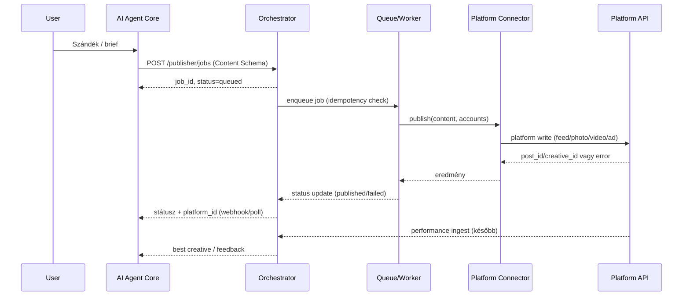

# AI Publishing Loop – áttekintés
Cél: a social/ads analitika + Sharity/Impact/NGO adatok alapján az AI Agent Core dönt, majd automatikusan publikál (post/short/ad kreatíva), a teljesítményt visszacsatolja, és ezzel egyre jobb targetálást ér el. Ez a dokumentum a meglévő social/ads integrációra épül (NormalizedAdMetric + ledger + Impi/AI Agent).

## Scope / Out of scope
- **Scope**: social/ads publishing (Meta/Google/YouTube/TikTok), token store, queue/orchestrator, approval/brand safety/spend cap, feedback ingest, rollback, monitoring.
- **Out of scope**: kreatív generálás (AI Agentben marad), organikus insights ledger-be írása, billing/számlázás, végfelhasználói UI design.

## Compliance & policy (összefoglaló)
- **Platform ToS**: automated posting/ads csak támogatott API-kon, rate limit és brand safety betartása.
- **GDPR/consent**: PII nem kerül ledgerbe; targeting csak anon szegmenssel; opt-out szegmens tiltás; törléskor token revoke + audit.
- **Brand safety policy**: globális és NGO-specifikus tiltólista, locale-aware szabályok, admin override indoklással.

## Fő komponensek (részletes)
- **Token Store (secure)**: platformonként (Meta Graph/Marketing, Google Ads/YouTube, TikTok) frissítő tokenekkel; titkosítás + audit, multi-tenant.
- **Token Store implementáció (javaslat)**:
  - Storage: PostgreSQL `wp_impact_tokens` (pgcrypto), vagy Vault/Secrets Manager ha van infra; master key env vagy KMS-re felkészítve.
  - Mezők: `platform, account_id, tenant_id/ngo_id, token_type, access_token (AES-256-GCM), refresh_token, expires_at, scope, created_by, last_used, rotation_count`.
  - Master key: `IMPACT_TOKEN_MASTER_KEY` (32 byte hex), havi rotáció; audit tábla: `wp_impact_token_audit` (read/write műveletek, user/ip, ts); threat model: DB dump, kompromittált admin, token újrahasznosítás ellen.
- **Token refresh flow**:
  - Óránkénti check: ha `expires_at < now + 1h` → refresh.
  - Refresh endpoint (Meta `/oauth/access_token`, Google `/token`), új token mentés (encrypt), `rotation_count++`, audit `token_refresh`.
  - Retry: 3 próbálkozás exponenciális backoff-fal; ha fail → token `expired` státusz, admin alert (Discord).
  - Guard: `bin/token-health-guard.sh` napi riport lejáró/lejárt tokenekről.
- **Publishing Orchestrator (Core service)**: API az AI Agent felől (`POST /publisher/jobs`), queue + rate limit, audit log (job_id, platform id-k, status).
- **Queue mechanizmus (javaslat)**:
  - Redis + BullMQ (ajánlott): retry/backoff, rate limit (pl. Meta 10 job/perc, Google 5 job/perc), worker pool, priority (1–10), stuck job auto-fail (pl. PROCESSING>30p), max_concurrency per platform/upload.
  - Fallback: MySQL tábla `wp_impact_publish_queue` + cron/worker (ha nincs Redis).
- **Content Schema** (AI→Orchestrator):
  ```json
  {
    "schema_version": "v1",
    "title": "string",
    "body": "string",
    "cta_url": "string",
    "media": [{"type": "image|video", "url": "...", "aspect_ratio": "1:1", "alt_text": "..."}],
    "hashtags": ["..."],
    "segment": {"geo": "...", "interests": ["..."], "ngo": "...", "shop": "...", "page_id": "...", "ad_account_id": "...", "segment_id": "..."},
    "channel": "post|short|ad_update",
    "ab_bucket": "A|B|C",
    "spend_cap": 0,
    "campaign_id": "...",
    "source": "ai_agent|human|import",
    "metadata": {...},
    "notes": "brand safety, érzékeny flag"
  }
  ```
- **Approval & guard**: emberi jóváhagyás flag, tiltólista (érzékeny témák), költés plafon, rate limit/backoff.
- **Platform write connectort**: Meta (feed/photo/video + Ads creative), YouTube (video/short), Google Ads (asset update), TikTok (video + ad update). Mindegyiknél dry-run + sandbox, ha elérhető.
- **Feedback loop**: a meglévő analytics/ledger ingest (NormalizedAdMetric) bővítése post/creative performance mezőkkel; job_id ↔ platform_id mapping az audit logban; AI Agent inputban használható „best creative per segment” jelölés.
- **Privacy/consent**: user token/profil csak explicit hozzájárulással; targetálás anon szegmensekre; PII nincs a ledgerben; opt-out szegmens szintjén.
- **Idempotencia / stuck-job**: `idempotency_key` a jobon; ha már van PROCESSING/PUBLISHED ugyanazzal, visszaadjuk. PROCESSING>30p → auto-fail + retry/backoff. Prioritás + max_concurrency platformonként.

### Adatfolyam (rövid)
1) AI Agent javaslatot generál (Content Schema) → Orchestrator queue.
2) Approval (opcionális emberi jóváhagyással) → Publish connector hívás → platform válasz (post_id/creative_id).
3) Audit log: job_id, platform_id, status, timestamp, user/approval info.
4) Performance ingest: reach/views/engagement/spend → NormalizedAdMetric → ledger/meta log.
5) Következő AI döntés: teljesítmény alapján súlyozott kreatíva javaslat.

### Biztonság / guardrail
- Token Store: encrypt-at-rest, role-based access; minden hívás előtt scope/expiry check.
- Költés guard: napi/összes cap, csak meglévő kampány/adset update; új költést csak flag-gel.
- Brand safety: tiltott témák/szavak, NGO-specifikus kizárások; approval kötelező érzékeny kategóriáknál.
- Rate limit/backoff: platform kvóták, max párhuzamos publishing queue méret.
- Dry-run: minden connector támogatja a dry-run tesztet (csak log, nincs publikáció).
- Hibakezelés (rövid matrica):
  - Meta: 190 token → refresh/retry; 100 invalid param → fail; 4 rate limit → 15p backoff; 368 blocked content → brand safety alert.
  - Google Ads: AUTH_ERROR → refresh; RATE_EXCEEDED → 60p backoff; INVALID_ARGUMENT → fail.
  - YouTube: quotaExceeded → 24h backoff; uploadLimitExceeded → fail + alert.
  - TikTok: auth error → refresh; rate limit → 30p backoff.
  - Retryable: max 3 attempt (2s, 4s, 8s), minden error auditálva (job_id, code, msg).

## API vázlat (Core Orchestrator)
- `POST /publisher/jobs`
  - Body: Content Schema + `requires_approval` + `platform_accounts` (page_id/ad_account_id) + `dry_run` + `metadata`.
  - Válasz: `{ job_id, status: "queued" }` (idempotency_key támogatott: ha duplikált, visszaadja a meglévőt).
- `POST /publisher/jobs/{id}/approve`
  - Approval UI/CLI hívja; státuszt “approved”-ra állítja, queue-ba küldi.
- `GET /publisher/jobs/{id}`
  - Meta: platform_id, status history, error log, published_at.
- `GET /publisher/jobs?status=pending|approved|failed&limit=...&campaign_id=...&platform=...&created_from=...&created_to=...`

### Audit log mezők
```
job_id, platform, account_id, page_id?, ad_account_id?, post_id?, creative_id?,
status (queued|approved|published|failed),
approved_by, requires_approval, dry_run, spend_cap, created_at, updated_at, error?
```

## OpenAPI vázlat (draft)
```yaml
openapi: 3.0.3
info:
  title: Impact Publishing Orchestrator API
  version: 0.1.0
paths:
  /publisher/jobs:
    post:
      summary: Létrehoz egy publishing jobot
      requestBody:
        required: true
        content:
          application/json:
            schema:
              $ref: '#/components/schemas/PublishJobRequest'
      responses:
        '200':
          description: Job létrejött
          content:
            application/json:
              schema:
                $ref: '#/components/schemas/PublishJobResponse'
              examples:
                queued:
                  value: { "job_id": "job_123", "status": "queued" }
    /publisher/jobs/{id}:
      get:
        summary: Job részletek
        parameters:
          - in: path
          name: id
          required: true
          schema: { type: string }
      responses:
        '200':
          description: Job státusz és audit
          content:
            application/json:
              schema:
                $ref: '#/components/schemas/PublishJobDetail'
              examples:
                published:
                  value:
                    job_id: job_123
                    status: published
                    status_history:
                      - { "status": "queued", "ts": "2025-12-11T10:00:00Z" }
                      - { "status": "published", "ts": "2025-12-11T10:00:05Z" }
                    platform_ids: ["123_456"]
    /publisher/jobs/{id}/approve:
      post:
        summary: Job jóváhagyása (admin)
      parameters:
        - in: path
          name: id
          required: true
          schema: { type: string }
      responses:
        '200':
          description: Jóváhagyva
          content:
            application/json:
              schema: { type: object, properties: { job_id: { type: string }, status: { type: string } } }
              examples:
                approved: { value: { "job_id": "job_123", "status": "approved" } }
    /publisher/jobs/{id}/rollback:
      post:
        summary: Publikált tartalom visszavonása/pause
      parameters:
        - in: path
          name: id
          required: true
          schema: { type: string }
      responses:
        '200':
          description: Rollback triggerelve
          content:
            application/json:
              schema: { type: object, properties: { job_id: { type: string }, status: { type: string } } }
              examples:
                rollback: { value: { "job_id": "job_123", "status": "rollback_triggered" } }

components:
  schemas:
    PublishJobRequest:
      type: object
      required: [content, platform_accounts]
      properties:
        idempotency_key: { type: string }
        requires_approval: { type: boolean }
        dry_run: { type: boolean }
        content:
          $ref: '#/components/schemas/ContentSchema'
        platform_accounts:
          type: object
          properties:
            page_id: { type: string }
            ad_account_id: { type: string }
    ContentSchema:
      type: object
      required: [title, body, channel]
      properties:
        schema_version: { type: string, example: v1 }
        title: { type: string }
        body: { type: string }
        cta_url: { type: string }
        media:
          type: array
          items:
            type: object
            properties:
              type: { type: string, enum: [image, video] }
              url: { type: string }
              aspect_ratio: { type: string, example: "1:1" }
              alt_text: { type: string }
        hashtags:
          type: array
          items: { type: string }
        segment:
          type: object
          properties:
            geo: { type: string }
            interests: { type: array, items: { type: string } }
            ngo: { type: string }
            shop: { type: string }
            page_id: { type: string }
            ad_account_id: { type: string }
            segment_id: { type: string }
        channel: { type: string, enum: [post, short, ad_update] }
        ab_bucket: { type: string, enum: [A, B, C] }
        spend_cap: { type: number }
        campaign_id: { type: string }
        source: { type: string, enum: [ai_agent, human, import] }
        metadata: { type: object }
        notes: { type: string }
    PublishJobResponse:
      type: object
      properties:
        job_id: { type: string }
        status: { type: string }
    PublishJobDetail:
      allOf:
        - $ref: '#/components/schemas/PublishJobResponse'
        - type: object
          properties:
            status_history:
              type: array
              items:
                type: object
                properties:
                  status: { type: string }
                  ts: { type: string, format: date-time }
            platform_ids:
              type: array
              items: { type: string }
            error:
              type: object
              properties:
                code: { type: string }
                message: { type: string }
```

## Sequence diagram (AI → Orchestrator → Connector)


## Webhook javaslat (AI Agent felé)
- **Webhook URI minta**: `POST https://ai-agent.sharity.hu/webhooks/publisher`
- Payload példa:
```json
{
  "job_id": "job_123",
  "status": "published",
  "platform_ids": ["123_456"],
  "published_at": "2025-12-11T10:00:05Z",
  "ab_bucket": "A",
  "segment_id": "hu_dogs_budapest"
}
```
- Retry: 3 próbálkozás exponenciális backoff-fal; signature (HMAC-SHA256, secret: `IMPACT_PUBLISHER_WEBHOOK_SECRET`) javasolt.

## Részletesebb hibakód táblázat (kiegészítés)
- **Meta**: 190 (token expired) → refresh+retry; 100 (invalid param) → fail; 4 (rate limit) → 15p backoff; 368 (blocked content) → brand safety alert+fail; 10 (permissions) → fail, admin review.
- **Google Ads**: AUTHENTICATION_ERROR → refresh; RATE_EXCEEDED → 60p backoff; QUOTA_EXCEEDED → 24h backoff; INVALID_ARGUMENT → fail.
- **YouTube**: quotaExceeded → 24h backoff; uploadLimitExceeded → fail+alert; forbidden (insufficientPermissions) → fail, admin review.
- **TikTok**: 40001 (auth) → refresh; 40100 (rate limit) → 30p backoff; 40005 (invalid param) → fail.
- **Webhook**: 410 (gone) → stop retry; 429 → backoff 15m; 5xx → retry max 3.

## Connector minimum (write)
- **Meta**: Page feed/photo/video publish (`/{page_id}/feed|photos|videos`), Ads creative/adset update (copy + asset csere), adset cap ellenőrzés.
- **YouTube**: video/short upload (title/description/tags), thumb; Community post (ha API támogatja).
- **Google Ads**: asset update (headline/description/image), PMax kreatíva bővítése; költéshez cap.
- **TikTok**: video upload + ad creative update (campaign/adgroup meglévő ID-vel).
- Minden connectornál: hibakód mapping, retry/backoff, partial failure log.

## Content & A/B logika
- Variánsok: AI 2–3 variánst generál (A/B bucket), Orchestrator osztja szét (70/30/…).
- Segment mapping: geo/interests/ngo/shop alapján választ platform-account-ot (pl. adott Page, adott ad account).
- CTA/URL: UTM + deeplink (Impact Shop/NGO Card) a ledgerhez köthető.
- **A/B keretrendszer**:
  - `ab_test_id` + bucket (A/B/C), split 70/30 vagy 60/20/20.
  - Mérés: min. 48 óra, min. 1000 impression/variáns; primary metrika: engagement_rate (guardrail: ctr, cost_per_conversion).
  - Winner: engagement_rate > baseline +10% ÉS p<0.05; early stop ha 2× jobb. AI input példák winner/loser job_id listával.
  - Tábla javaslat: `wp_impact_ab_tests` (status, winner_bucket, metrics_summary).
  - AI Agent input példa: `{"segment_id":"hu_dogs_budapest","ab_test_id":"ab_123","winner_bucket":"B","reason":"engagement +15%, p=0.03","loser_creatives":["job_42","job_43"]}`.

## Brand safety guard (példa)
- Globális tiltólista (politics, adult, medical claims, stb.), locale-aware listákkal.
- NGO-specifikus érzékeny témák (pl. allatvedok → hunting/meat industry).
- CTA domain whitelist (app.sharity.hu, impactshop.hu); ha nem whitelisted → block vagy admin override.
- Admin override lehetőség (indoklással) approval UI-ban; brand_safety_category/flags + override_reason naplózva.

## Feedback loop bővítés
- NormalizedAdMetric v2 javaslat: `reach, impressions, engagements, engagement_rate, ctr, cpc, cpm, video_views, video_watch_time, video_completion_rate, conversions, conversion_value, post_id, creative_id, job_id, ab_bucket, ledger_source=post|short`.
- job_id → platform_id hash az audit logban, AI Agent inputban: „best creative per segment”, „low CTR creatives” jelölés.
- Időzítés: napi ingest (ads), órás ingest (organikus, ha kvóta engedi).

## Privacy / compliance
- User/session adatok: csak consenttel, PII nélkül (anon szegmens).
- Opt-out: szegmens tiltása publishing/targetálás alól.
- Platform ToS: automated posting/ads szabályok betartása; költés plafon, manuális override.

## Rate limit irányelvek (ajánlott kiinduló értékek)
- Meta: page post ~200/óra, photo ~600/óra, video ~50/nap; Marketing API ~200 req/óra/user.
- Google Ads: asset/campaign update ~1000 op/nap/account.
- YouTube: upload ~6/nap (quota 10k unit/nap, 1 upload ~1600 unit), update 50 unit/req.
- TikTok: creative upload ~100/nap/advertiser, ad update ~1000/nap.
- Implementáció: Redis token bucket (per platform/account) vagy queue rateLimiter.

## Dry-run
- Minden connector kap `dry_run` flag-et: log + mock response (post_id/creative_id = `mock_*`), nincs publikus hívás.
- Orchestrator: `POST /publisher/jobs?dry_run=true` → azonnali mock eredmény, nincs queue.

## Approval UI/CLI váz
- Admin lista: szűrők (status/platform), soronként preview (title/body/media, CTA, segment), műveletek: View/Approve/Reject.
- CLI: `wp impact publisher list --status=pending`, `wp impact publisher show <job>`, `wp impact publisher approve|reject <job>`.
- Brand safety warning megjelenítése, override mezővel (admin-only).

## Spend cap enforcement
- Job-level: Content Schema `spend_cap`; ha platform támogatja, adset/campaign budget beállítása, különben fail.
- Account-level: `wp_impact_spend_limits` (daily_cap, monthly_cap, current_spend); ha túllépné, `awaiting_budget` státusz; soft_cap_hit 80%-nál ingest késés ellen.
- Global cap: `IMPACT_GLOBAL_SPEND_CAP_HUF`; ha elérte, minden ad job blokkol, alert.
- Spend tracking: ingestből napi/óra összegzés, spike detektálás; ingest delay esetén safety margin.

## Job státuszgép (ajánlott)
CREATED → QUEUED → (requires_approval? → PENDING → APPROVED/REJECTED) → PROCESSING → PUBLISHED/FAILED → (retry → QUEUED) → ARCHIVED. Extra: SUSPENDED (emergency), AWAITING_BUDGET, DRY_RUN_COMPLETE.

## Scheduling
- Content Schema bővítés: `schedule.type = immediate|scheduled|optimal`, `scheduled_at`, `timezone`, `optimal_window` (nap/órák); timezone fallback: job > account > system (Europe/Budapest).
- Optimal timing: platform best practice + saját history (engagement csúcsidő). Ha `scheduled_at < now` → publish azonnal vagy EXPIRED policy (paraméterezhető).

## Media pipeline
- Media forrás: URL / upload / AI-generated; meta: alt_text, aspect_ratio, media_hash dedup.
- Pre-process: resize/crop/transcode, méret/formatum ellenőrzés, CDN tárolás; platform aspekt arány szabályok megemlítve.
- Platform upload: Meta (photo/video -> media_fbid), YouTube (resumable upload), TikTok (video upload), Ads image hash.

## Rollback/Undo
- Organic: Meta delete post, YouTube delete, TikTok delete.
- Ads: adset/creative PAUSE; budget visszaállítás manuálisan.
- Orchestrator: `POST /publisher/jobs/{id}/rollback`, bulk rollback (time window) vészhelyzetben.

## Monitoring / alerting
- Metrikák: job volumen, queue time, publish time, failure rate, API call/error rate, rate limit hit, token health, spend vs cap; kiemelt KPI: publish_success_rate, avg_queue_time, AI döntéstől publishig eltelt idő.
- correlation_id = job_id minden logban/connectorban.
- Alert (Discord): kritikus (token expired, failure rate >10%, global cap), warning (queue>10m, rate limit 80%, spend 80% cap), napi összefoglaló.

## Appendix – Error code matrix (rövid)
- **Meta**: 190 token → refresh/retry; 100 invalid param → fail; 4 rate limit → 15p backoff; 368 blocked content → brand safety alert.
- **Google Ads**: AUTH_ERROR → refresh; RATE_EXCEEDED → 60p backoff; INVALID_ARGUMENT → fail.
- **YouTube**: quotaExceeded → 24h backoff; uploadLimitExceeded → fail + alert.
- **TikTok**: auth error → refresh; rate limit → 30p backoff.
- Retryable hibák: max 3 attempt (2s, 4s, 8s), minden error auditálva (job_id, code, msg); nem retryolható: azonnali fail + admin alert.

## Appendix – Scheduling / rate limit / spend guardrail megjegyzések
- Rate limit kiinduló értékek a fő szövegben; implementáció: Redis token bucket per platform/account, max_concurrency per platform/upload külön.
- Scheduling: ha `scheduled_at < now`, alapértelmezésben azonnali publikálás (alternatíva: EXPIRED státusz), timezone sorrend: job > account > system (Europe/Budapest).
- Spend guardrail: soft_cap_hit 80%-nál (ingest delay esetén is véd), hard cap: job/account/global; ingest késésnél safety margin alkalmazható.

## Schema versioning
- Content Schema: `schema_version` mező, ismeretlen verzió → reject; v1→v2 transformer.
- NormalizedAdMetric: version bump + migráció; dual-write átmeneti időszak.
- DB migrációk: verziózott SQL, rollback lehetőséggel.

## Glossary (gyors hivatkozás)
- **job_id**: belső publikációs feladat azonosítója, correlation_id minden logban.
- **platform_id**: a platformon létrejött post/creative azonosítója.
- **segment_id**: előre definiált szegmens (geo/interests/ngo/shop) hivatkozása.
- **ab_bucket / ab_test_id**: A/B variáns jelölése és teszt azonosító.
- **ledger_source**: view|click|post|short stb., a NormalizedAdMetric forrása.
- **idempotency_key**: ismételt job-létrehozás elkerülésére szolgáló kulcs.
- **dry_run**: publikáció nélküli próba, mock post/creative azonosítóval tér vissza.

## Emergency runbook (publishing stop/resume)
- **Stop**: queue pause (Redis rename vagy DB status=suspended), worker process kill, audit log bejegyzés.
- **Resume**: queue visszaállítás, suspended → queued, worker restart.
- Külön script javasolt: `bin/publisher-emergency-stop.sh` / `bin/publisher-resume.sh`.

## Kockázatok / nyitott kérdések
- Platform API policy változás (Meta/TikTok): ezért dry-run + approval kötelező első körben.
- YouTube/Community post API korlátai (nem minden elérhető).
- Rate limit/kvóta: nagy volumenű A/B tesztet throttle-ölni kell.
- Brand safety: érzékeny NGO témák manuális review-t igényelhetnek; locale-listák folyamatos karbantartása.
- Ingest késés: spend cap esetén soft_cap_hit + safety margin legyen aktív, hogy ne legyen overspend.

## Következő lépések (DNS/proxy után indítható)
1) Token Store + Orchestrator API draft (OpenAPI), audit log séma.
2) Meta write connector (feed + basic creative update) dry-run teszt.
3) AI→Orchestrator Content Schema integráció (Agent output → job create).
4) Performance ingest kiegészítése reach/engagement/spend mezőkkel.

## Részletes megvalósítási terv (iteratív)
### P0 – Alap infrastruktúra és biztonság
- DB migrációk: `wp_impact_tokens`, `wp_impact_token_audit`, `wp_impact_publish_queue`, `wp_impact_ab_tests` (idempotens, rollback script).
- Token Store PHP helper (encrypt/decrypt, pgcrypto fallback), token-health guard (cron).
- Orchestrator API v1 (REST/MU plugin vagy Node): `POST /publisher/jobs`, `GET /jobs/{id}`, approve/rollback stub, idempotency_key tárolással.
- Brand safety alap: globális/NGO tiltólista + domain whitelist; override log.
- Rate limit + spend guard config (env): per platform/account cap, soft_cap_hit=80%, global cap env.

### P1 – Queue/worker és Meta write alap
- Queue réteg: Redis+BullMQ (vagy MySQL+cron fallback), priority, stuck-job detector (PROCESSING>30p).
- Meta connector: feed/photo publish + dry-run; ad creative update stub; hibakód mapping + retry/backoff.
- Webhook hívó modul (HMAC aláírással) + healthz bővítés (queue depth, failure rate).
- Approval UI/CLI v0: lista, view, approve/reject, brand safety warning, per-page.

### P2 – AI integráció és A/B
- Content Schema validátor (schema_version), AI Agent → Orchestrator bekötés (idempotency_key használat).
- A/B keretrendszer: `ab_test_id`, bucket assign, winner/loser logging, guardrail metrikák definiálása.
- Spend cap enforcement a connectorban (adset/campaign budget), AWAITING_BUDGET státusz.
- Job státuszgép teljes implementáció (PENDING/APPROVED/REJECTED/PROCESSING/PUBLISHED/FAILED/DRY_RUN_COMPLETE/SUSPENDED).

### P3 – Analytics / feedback loop
- NormalizedAdMetric v2 ingest (reach/impressions/engagements/CTR/CPC/CPM/post_id/creative_id/job_id/ab_bucket).
- Mapping: job_id → platform_id → ledger/meta log; AI input (best creative per segment) generálás.
- Monitoring/alerting: publish_success_rate, avg_queue_time, time_from_ai_to_publish; Discord webhook WARN/CRIT.
- PDF/CSV riport kiegészítés a publishing metrikákkal (ha kell hirdető/NGO nézetben).

### P4 – Többi connector + hardening
- Google Ads asset update, YouTube upload, TikTok video/creative update (mind dry-run → real).
- Media pipeline: upload/dedup (media_hash), platform-spec aspect/size ellenőrzés.
- Scheduling (immediate/scheduled/optimal) + EXPIRED policy; timezone fallback (job>account>system).
- Rollback/undo endpoint: organic delete, ads pause; bulk rollback (emergency).
- Queue guardrail: emergency stop/resume script, stuck-job auto-retry, idempotencia audit.

### Függőségek / döntési pontok
- Redis elérhetőség? (ha nincs: MySQL queue fallback + cron worker).
- KMS/Vault elérhetőség? (ha nincs: env master key).
- Webhook végpont a AI Agenthez: host + secret egyeztetés szükséges.
5) Approval UI/CLI alap (job list + approve/reject).

## Végrehajtási terv (fázisok)
**P0 – Váz és biztonság**
- Token store specifikáció + titkosítás.
- Publishing Orchestrator API draft + audit log modell (job_id, platform ids).
- Approval flow flag + tiltólista keretrendszer (brand safety).

**P1 – Platform write alap**
- Meta write connector: page feed + basic creative update (dry-run).
- Google Ads asset update (dry-run).
- TikTok/YouTube: stub + jogosultság check (dry-run).

**P2 – AI integráció és A/B**
- Content Schema véglegesítés; AI Agent Core → Orchestrator hívás.
- A/B bucket és spend_cap kezelés (ads).
- Job status visszajelzés az AI Agent felé.

**P3 – Feedback loop**
- Analytics ingest kiegészítése post/creative performance mezőkkel.
- job_id → platform_id mapping az audit/meta naplóban; AI döntéshez használva.

**P4 – UX/Runbook**
- Admin/CLI jóváhagyó felület.
- Runbook: működés, logok, vészleállítás.

## Figyelmeztetések
- Platform ToS: automatizált posting/ads csak szabályosan; költésplafon kötelező.
- API kvóták: queue + backoff kötelező.
- Compliance: érzékeny tartalom/NGO témák brand safety szűrővel, emberi approval opció.

## Kapcsolódás a jelenlegi rendszerhez
- **Ingest/ledger**: a NormalizedAdMetric + ledger megvan; ide illesztjük a publikációk performance adatait (reach/view/engagement + ad spend).
- **AI Agent**: rendszerprompt + intent router már működik; a Content Schema-t az Agent generálja, az Orchestrator csak publikál/auditál.
- **Organikus monitoring**: `organic-insights` JSON/endpoint kiegészítésként használható, de nem kerül a ledgerbe (csak analitika).
