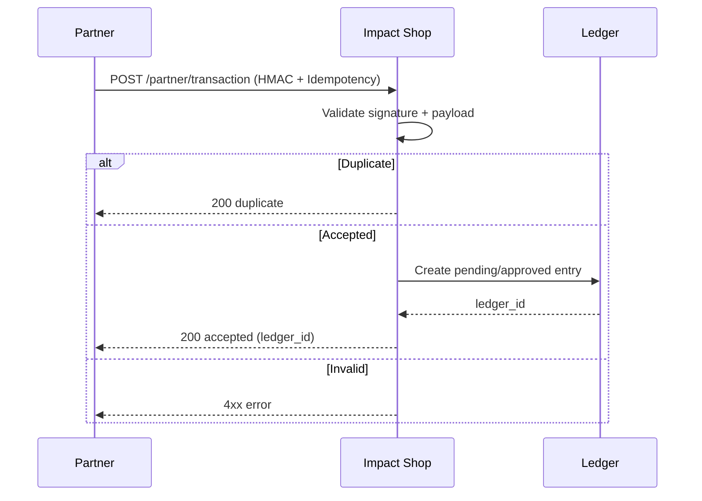

# Partner webhook sequence (simple)

```mermaid
sequenceDiagram
    participant Partner
    participant Impact as Impact Shop
    participant Ledger

    Partner->>Impact: POST /partner/transaction (HMAC + Idempotency)
    Impact->>Impact: Validate signature + payload
    alt Duplicate
        Impact-->>Partner: 200 duplicate
    else Accepted
        Impact->>Ledger: Create pending/approved entry
        Ledger-->>Impact: ledger_id
        Impact-->>Partner: 200 accepted (ledger_id)
    else Invalid
        Impact-->>Partner: 4xx error
    end
```
