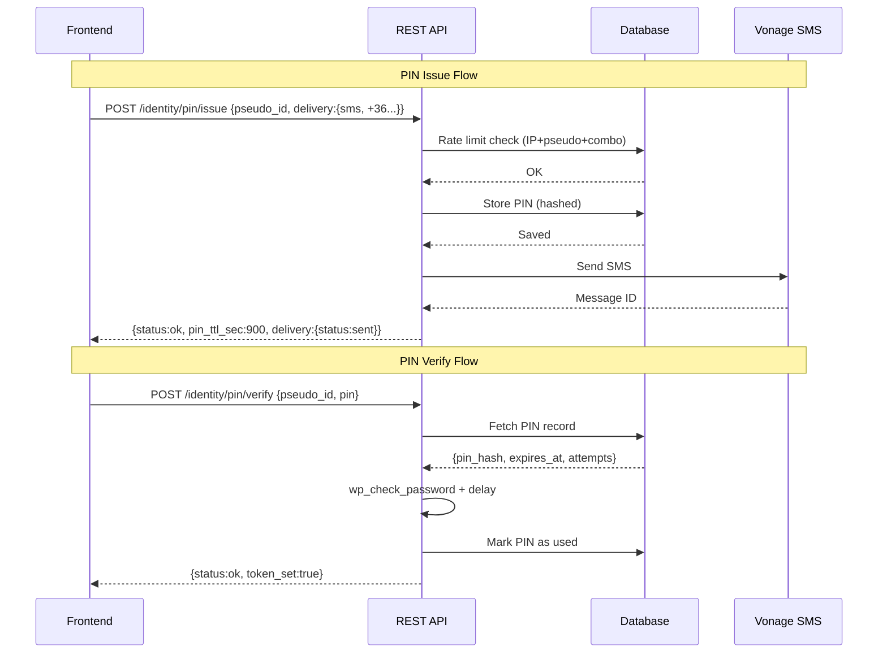

# PIN Issue/Verify Flow Diagram

```mermaid
sequenceDiagram
    participant F as Frontend
    participant R as REST API
    participant D as Database
    participant V as Vonage SMS

    Note over F,V: PIN Issue Flow
    F->>R: POST /identity/pin/issue {pseudo_id, delivery:{sms, +36...}}
    R->>D: Rate limit check (IP+pseudo+combo)
    D-->>R: OK
    R->>D: Store PIN (hashed)
    D-->>R: Saved
    R->>V: Send SMS
    V-->>R: Message ID
    R-->>F: {status:ok, pin_ttl_sec:900, delivery:{status:sent}}

    Note over F,V: PIN Verify Flow
    F->>R: POST /identity/pin/verify {pseudo_id, pin}
    R->>D: Fetch PIN record
    D-->>R: {pin_hash, expires_at, attempts}
    R->>R: wp_check_password + delay
    R->>D: Mark PIN as used
    R-->>F: {status:ok, token_set:true}
```
