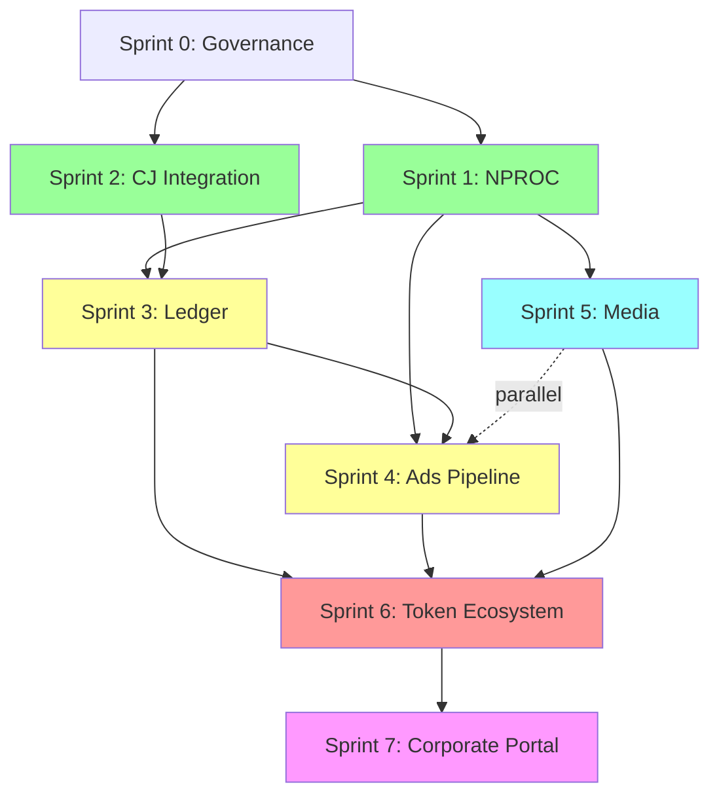
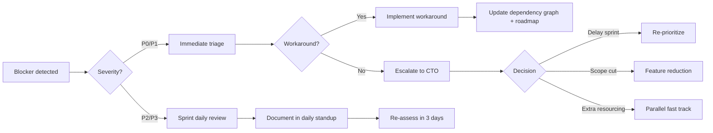
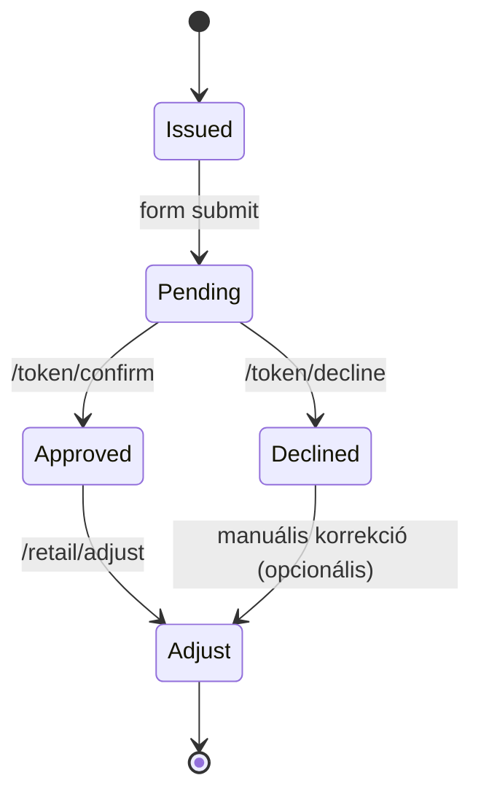

# Impact Hub System – v1.3
<!-- markdownlint-disable MD013 -->

Verziótörténet
v1.0 – Core Token architecture
v1.1 – Social Hub + Pseudo-ID
v1.2 – Wallet + Dynamic Ranking
v1.3 – Unified ecosystem + Fraud monitor + Chat feed
(Ez a dokumentum a v1.3 master tervet egységesíti és bástyavédelemmel látja el.)

---

## Dokumentum célja & használata

- **PM / Stakeholder**: átfogó roadmap, sprint státuszok, kockázatok, döntési pontok.
- **Fejlesztők**: részletes sprint-követelmények, feature flag policy, API versioning, rollback terv.
- **QA / Ops**: staging guardrails, load/perf checklist, incidenskezelési protokoll, audit log elvárások.
- **Security**: OWASP Top 10 megfelelőség, pen-test ütemezés, incident response runbook.

## Dokumentum hatóköre

- **Fókusz**: ImpactHub webes élmény (token, ledger, feed, attribution), kapcsolódó backend szolgáltatások, Ads & Analytics pipeline.
- **Nem tartalmazza**: mobil alkalmazások, POS/API integrációk, blockchain/white-label roadmap (külön dokumentum), harmadik felek saját widgetjei.
- **Átvezetés**: minden elem stagingen validálandó; production rollout csak külön RFC + jogi/brand jóváhagyással történhet.

### PM cheat sheet (rövid)

| Szint | Tartalom | Függőség | Kiadás feltétele |
| --- | --- | --- | --- |
| **MVP** | Sprint 0–3 (governance, NPROC, CJ, ledger) | none | staging zöld státusz |
| **Enhanced** | Sprint 4–5 (Ads pipeline, media import) | MVP + NPROC log | k6 baseline + E2E |
| **Full** | Sprint 6–7 (token sandbox, corporate portal) | Enhanced + fraud monitor | feature flag gating + pen-test |

### Impactall – gyors emlékeztető (kupon harvester + AI asszisztens)

- **Kupon harvester (impact_hub/tools)**: források Dognet+CJ, a slug/domain mapping és whitelist pedig a `docs/coupon-harvester.md` runbook szerint frissül (itt szerepel a korábbi `shops_registry` struktúra és a Gmail/Playwright lépések). Futtatás: a GitHub Actions "Coupon harvester" workflow (cron hétfő 03:00 UTC + manual dispatch); secretek: `GMAIL_CREDENTIALS_JSON`, `GMAIL_TOKEN_JSON`, `GOOGLE_SEARCH_API_KEY`, `GOOGLE_SEARCH_CX`. Kimenet: az automata `tmp/manual_coupons_draft-YYYY-MM-DD.csv` + `manual_coupons_draft-latest.csv` állományai (Actions artifact vagy lokális futás), amelyek beolvashatók a docmentált guard pipeline-okba.
- **Playwright/CSE/OCR**: env finomhangolás Actions-ben: `GOOGLE_SEARCH_MAX_DOMAINS` (default 5), `GOOGLE_SEARCH_RESULTS_PER_DOMAIN` (1), `GOOGLE_SEARCH_IMAGE_RESULTS_PER_DOMAIN` (1), `PLAYWRIGHT_GOTO_TIMEOUT` (ms, default 5000), `WAIT_AFTER_LOAD` (ms, default 300). Csak registry domain-ekre keres; image search → OCR. Lokálisan: a `GOOGLE_APPLICATION_CREDENTIALS` legyen beállítva a `/Users/bujdosoarnold/.impact-secrets/env.d/capi.env` fájlban a service account JSON útvonalára.
- **AI agent (ai-agent mappa, port 4000)**: start `npm install && npm run dev:mvp` (env: `GOOGLE_SEARCH_API_KEY`, `GOOGLE_SEARCH_CX`, `x-api-key`=dev-api-key vagy saját). Endpontok: `/healthz`, `/api/v1/chat/command` (pl. `{"text":"/keres teszt kupon"}`), `/api/v1/search?q=...`. JWT nem kötelező; x-api-key is elég. Discord/CLI kliensek a `/chat/command`-on keresztül drótozhatók. A `/healthz` JSON `status_code`, `latency_ms`, valamint `features` mezőket ad vissza; a kötelező flagek: `playwright`, `gmail`, `harvester_bridge`, `openai_bridge`, `reliability`. Ha bármelyik hiányzik a listából, a guard WARN állapotot jelent. Deploy után sync: `data/*` → `dist/data/` (pl. `shop-impact.json`, `keyword-synonyms.json`), különben a service induláskor `MODULE_NOT_FOUND`-ot dobhat.
- **Gmail kupon marker**: a “Kód:” / “utalvány kódja” jelölésnél a harvester unicode (ékezetes) tokeneket is normalizál (`AKCIÓ` → `AKCIO`), hogy a Gmail szövegben kijelölhető kuponok is bekerüljenek.

## Tartalomjegyzék

- [Dokumentum célja & használata](#dokumentum-célja--használata)
- [Dokumentum hatóköre](#dokumentum-hatóköre)
  - [PM cheat sheet (rövid)](#pm-cheat-sheet-rövid)
- [0.0 QUICK START GUIDE (5 perces onboarding)](#00-quick-start-guide-5-perces-onboarding)
  - [For Stakeholders (Non-Technical)](#for-stakeholders-non-technical)
  - [For Developers (Technical)](#for-developers-technical)
  - [Common Pitfalls & Solutions](#common-pitfalls--solutions)
  - [Next Steps After Onboarding](#next-steps-after-onboarding)
  - [Stakeholder (nem technikai)](#stakeholder-nem-technikai)
  - [Fejlesztő (technikai)](#fejlesztő-technikai)
  - [Gyakori hibák & megoldások](#gyakori-hibák--megoldások)
- [0. BÁSTYAVÉDELEM · KÖRNYEZETI GARANCIÁK](#0-bástyavédelem--környezeti-garanciák)
  - [Staging-only végrehajtás](#staging-only-végrehajtás)
  - [Biztonsági alapelvek](#biztonsági-alapelvek)
  - [Feature flag mátrix](#feature-flag-mátrix)
  - [Staging vs. Production guard](#staging-vs-production-guard)
  - [Kill-switch protokoll](#kill-switch-protokoll)
- [0.1 SECURITY TESTING & INCIDENT RESPONSE](#01-security-testing--incident-response)
  - [OWASP Top 10 megfelelőség (pre-production checklist)](#owasp-top-10-megfelelőség-pre-production-checklist)
  - [Penetration testing ütemezés](#penetration-testing-ütemezés)
  - [Incident response plan](#incident-response-plan)
  - [Audit log követelmények](#audit-log-követelmények)
  - [Security champions (Sprint 1-től)](#security-champions-sprint-1-től)
  - [Threat model (STRIDE röviden)](#threat-model-stride-röviden)
  - [0.1.2 Incident response runbook (P0/P1)](#012-incident-response-runbook-p0p1)
- [0.2 DOCUMENTATION VERSIONING & CHANGELOG](#02-documentation-versioning--changelog)
  - [Szemantikus verziózás](#szemantikus-verziózás)
  - [Changelog automatizálása](#changelog-automatizálása)
  - [Automatikus diff](#automatikus-diff)
  - [Pre-commit hook (opcionális)](#pre-commit-hook-opcionális)
  - [0.2.1 Secret rotation policy](#021-secret-rotation-policy)
- [0.3 FEATURE FLAG MANAGEMENT & DASHBOARD](#03-feature-flag-management--dashboard)
  - [CLI parancsok (`impactctl feature:*`)](#cli-parancsok-impactctl-feature)
  - [Admin dashboard](#admin-dashboard)
  - [Flag dependency YAML](#flag-dependency-yaml)
  - [Expiry monitor](#expiry-monitor)
  - [Kill-switch protokoll kiegészítés](#kill-switch-protokoll-kiegészítés)
- [0.4 CODE REVIEW & PR POLICY](#04-code-review--pr-policy)
  - [Pull request template](#pull-request-template)
  - [Automatikus ellenőrzések](#automatikus-ellenőrzések)
  - [Post-merge automatizmus](#post-merge-automatizmus)
  - [Review jóváhagyási policy](#review-jóváhagyási-policy)
- [0.5 DOCUMENTATION AUTOMATION & QUALITY GATES](#05-documentation-automation--quality-gates)
  - [Stub inventory dashboard](#stub-inventory-dashboard)
  - [Guardrail automatizmus ütemezése](#guardrail-automatizmus-ütemezése)
  - [Sprint pre-flight readiness](#sprint-pre-flight-readiness)
  - [Security hardening (msmtp + secrets)](#security-hardening-msmtp--secrets)
- [1. RENDSZERÁTTEKINTÉS · JELENLEGI MODULOK](#1-rendszeráttekintés--jelenlegi-modulok)
- [2. INTEGRÁCIÓS MÁTRIX · FEDŐTERVEK ÉS SZINERGIÁK](#2-integrációs-mátrix--fedőtervek-és-szinergiák)
- [2.1 REST API VERSIONING POLICY](#21-rest-api-versioning-policy)
  - [Verzióstratégia](#verzióstratégia)
  - [Breaking change kritérium](#breaking-change-kritérium)
  - [Deprecation folyamat](#deprecation-folyamat)
  - [Migration support réteg](#migration-support-réteg)
  - [Response header policy](#response-header-policy)
  - [Sprint alignment](#sprint-alignment)
- [3. SPRINTEK · KOORDINÁLT FEJLESZTÉSI ROADMAP](#3-sprintek--koordinált-fejlesztési-roadmap)
- <!-- markdownlint-disable MD051 -->
- [🟣 **Sprint 0 · Governance & Safety Net**](#🟣-sprint-0-·-governance--safety-net)
- [🟩 **Sprint 1 · Infrastruktúra Hardening (NPROC Guardian)**](#sprint-1-infrastruktúra-hardening-nproc-guardian)
- [🟦 **Sprint 2 · Adatforrás bővítés (CJ integráció)**](#sprint-2-adatforrás-bővítés-cj-integráció)
- [🟨 **Sprint 3 · Egységes Ledger & Havi Riport (Impact Hub Portál)**](#sprint-3-egységes-ledger-havi-riport-impact-hub-portál)
- [🟥 **Sprint 4 · Ads & Analytics Pipeline (Meta/TikTok/GA4)**](#sprint-4-ads-analytics-pipeline-metatiktokga4)
- [🟧 **Sprint 5 · Media Automation & SORA pipeline**](#sprint-5-media-automation-sora-pipeline)
- [🟫 **Sprint 6 · ImpactHub élmény & Token Ecosystem sandbox**](#sprint-6-impacthub-élmény-token-ecosystem-sandbox)
- [🟥 **Sprint 7 · ImpactHub Portal & Corporate Experience**](#sprint-7-impacthub-portal-corporate-experience)
- <!-- markdownlint-enable MD051 -->
- [3.1 SPRINT DEPENDENCY GRAPH](#31-sprint-dependency-graph)
  - [Critical path (hosszú lánc)](#critical-path-hosszú-lánc)
  - [Párhuzamosítási lehetőségek](#párhuzamosítási-lehetőségek)
  - [Dependency mátrix](#dependency-mátrix)
  - [Risk analysis & mitigáció](#risk-analysis--mitigáció)
- [3.2 SPRINT BLOCKER RESOLUTION PROTOCOL](#32-sprint-blocker-resolution-protocol)
  - [Blocker súlyossági szintek](#blocker-súlyossági-szintek)
  - [Döntési folyamat](#döntési-folyamat)
  - [Példa: Sprint 2 – CJ API rate limit](#példa-sprint-2--cj-api-rate-limit)
  - [Sprintenkénti contingency](#sprintenkénti-contingency)
  - [Heti blocker review](#heti-blocker-review)
- [3.3 STAKEHOLDER COMMUNICATION PLAN](#33-stakeholder-communication-plan)
  - [Heti státusz sablon](#heti-státusz-sablon)
  - [Sprint health dashboard auto-generálása](#sprint-health-dashboard-auto-generálása)
  - [Mérföldkő kommunikáció](#mérföldkő-kommunikáció)
- [3.4 SPRINT RETROSPECTIVE TEMPLATE](#34-sprint-retrospective-template)
  - [Kötelező retro (Sprint close +3 napon belül)](#kötelező-retro-sprint-close-3-napon-belül)
  - [Action item tracking](#action-item-tracking)
- [3.5 SPRINT TASK TRACKING TEMPLATE](#35-sprint-task-tracking-template)
  - [Task file struktúra](#task-file-struktúra)
  - [Példa `.codex/sprint-tasks/S2.md`](#példa-codexsprint-taskss2md)
  - [Task–blocker linking](#taskblocker-linking)
  - [Automatizált validáció](#automatizált-validáció)
  - [Működési elv](#működési-elv)
- [4. KERESZTFÜGGÉSEK · KOCKÁZATOK · FELÜGYELET](#4-keresztfüggések--kockázatok--felügyelet)
- [4.0 API SPEC & OPENAPI SNAPSHOTS](#40-api-spec--openapi-snapshots)
  - [OpenAPI 3.1 kivonat (fő endpointok)](#openapi-31-kivonat-fő-endpointok)
  - [Idempotency policy](#idempotency-policy)
  - [Request/response példák](#requestresponse-példák)
  - [Early abort sablon (STAGING jelölés)](#early-abort-sablon-staging-jelölés)
- [4.1 IDENTITY & RECOVERY BASELINE](#41-identity--recovery-baseline)
  - [Cél és alapelv](#cél-és-alapelv)
  - [Pseudo-ID generálás](#pseudo-id-generálás)
  - [Kliens tárolás és /go](#kliens-tárolás-és-go)
  - [PIN-kódos visszaállítás](#pin-kódos-visszaállítás)
  - [Attribúció és social ticker](#attribúció-és-social-ticker)
  - [Adatvédelem és UX](#adatvédelem-és-ux)
  - [QR / NFC / Wallet](#qr--nfc--wallet)
- [4.2 TOKEN LIFECYCLE · HOSPITALITY + RETAIL](#42-token-lifecycle--hospitality--retail)
  - [Állapotgép](#állapotgép)
  - [REST végpontok & hibakódok](#rest-végpontok--hibakódok)
  - [Számítási szabályok](#számítási-szabályok)
  - [Webhook / idempotencia](#webhook--idempotencia)
  - [HTTP hibakód mátrix](#http-hibakód-mátrix)
- [4.3 ATTRIBUTION & /GO ROUTER](#43-attribution--go-router)
  - [Param öröklés](#param-öröklés)
  - [Biztonsági guardok](#biztonsági-guardok)
- [4.4 SOCIAL SHARING & OG / META](#44-social-sharing--og--meta)
  - [OG fallback sorrend](#og-fallback-sorrend)
  - [Handle/hashtag szabályok](#handlehashtag-szabályok)
  - [Share flow](#share-flow)
- [4.5 MICROFEED HARMONIZÁCIÓ](#45-microfeed-harmonizáció)
  - [UI irányelvek](#ui-irányelvek)
  - [CSV normalizálás](#csv-normalizálás)
  - [Cache hierarchia](#cache-hierarchia)
- [4.6 SOCIAL FEED + CHAT MODERÁCIÓ](#46-social-feed--chat-moderáció)
  - [Nickname szabályok](#nickname-szabályok)
  - [Moderáció](#moderáció)
  - [Vizualis jelzések](#vizualis-jelzések)
- [4.7 PONTRENDSZER & BADGE ENGINE](#47-pontrendszer--badge-engine)
  - [Ponttábla (részlet)](#ponttábla-részlet)
  - [Inaktivitási lejtő & badge-k](#inaktivitási-lejtő--badge-k)
  - [Idempotens könyvelés](#idempotens-könyvelés)
- [4.8 FRAUD MONITOR & RISK SCORE](#48-fraud-monitor--risk-score)
  - [Szabályok](#szabályok)
  - [Risk score képlet](#risk-score-képlet)
  - [Vizualizáció](#vizualizáció)
- [4.9 GDPR · CMP · ADATKEZELÉS](#49-gdpr--cmp--adatkezelés)
  - [Cookie kategóriák](#cookie-kategóriák)
  - [Jogi alapok](#jogi-alapok)
  - [Retenció](#retenció)
  - [Elfelejtés flow](#elfelejtés-flow)
- [4.10 OBSERVABILITY & TELEMETRIA](#410-observability--telemetria)
  - [GA4 + belső eventek](#ga4--belső-eventek)
  - [Operatív metrikák](#operatív-metrikák)
- [4.11 QA & TESZTELÉSI PLAYBOOK](#411-qa--tesztelési-playbook)
  - [impactctl debug parancsok](#impactctl-debug-parancsok)
  - [Load & fuzz](#load--fuzz)
- [4.12 PARTNER / NGO EMBED POLICY](#412-partner--ngo-embed-policy)
  - [Domain whitelist admin](#domain-whitelist-admin)
  - [Embed API & CSP](#embed-api--csp)
  - [NGO-lock jelzés](#ngo-lock-jelzés)
- [5. QA & OPERÁCIÓS CHECKLIST](#5-qa--operációs-checklist)
- [5.1 PERFORMANCE & LOAD TESTING](#51-performance--load-testing)
  - [Cache & rate-limit célok](#cache--rate-limit-célok)
  - [Load baseline (staging)](#load-baseline-staging)
  - [k6 script (baseline)](#k6-script-baseline)
  - [Cache warm-up script](#cache-warm-up-script)
  - [Rate limiting guard](#rate-limiting-guard)
  - [Observability / Prometheus export](#observability--prometheus-export)
  - [QA perf checklist](#qa-perf-checklist)
- [5.2 E2E & VISUAL REGRESSION TESTING](#52-e2e--visual-regression-testing)
  - [Playwright setup](#playwright-setup)
  - [Alap E2E esetek (`tests/e2e/impact-hub.spec.ts`)](#alap-e2e-esetek-testse2eimpact-hubspects)
  - [Visual regression (Percy)](#visual-regression-percy)
  - [CI integráció (`.github/workflows/e2e-tests.yml`)](#ci-integráció-githubworkflowse2e-testsyml)
  - [Guardrail](#guardrail)
- [6. BACKLOG & KIEGÉSZÍTŐ KIEGÉSZÍTÉSEK](#6-backlog--kiegészítő-kiegészítések)
- [6.1 DISASTER RECOVERY & ROLLBACK STRATEGY](#61-disaster-recovery--rollback-strategy)
  - [Rollback SLA](#rollback-sla)
  - [Snapshot policy](#snapshot-policy)
  - [Rollback folyamat](#rollback-folyamat)
  - [DB migration guard](#db-migration-guard)
  - [Rollback drill checklist](#rollback-drill-checklist)
  - [Snapshot monitor](#snapshot-monitor)
- [6.2 TRADETRACKER INTEGRÁCIÓ (ROADMAP)](#62-tradetracker-integráció-roadmap)
  - [Deployment pre-flight checklist (Sprint 7+)](#deployment-pre-flight-checklist-sprint-7)
- [7. KNOWLEDGE BASE & TROUBLESHOOTING](#7-knowledge-base--troubleshooting)
  - [7.1 Gyakran ismételt kérdések (FAQ)](#71-gyakran-ismételt-kérdések-faq)
  - [7.2 Troubleshooting minták](#72-troubleshooting-minták)
  - [7.3 Architecture Decision Records (ADR)](#73-architecture-decision-records-adr)
  - [7.4 Jog és megfelelőség](#74-jog-és-megfelelőség)
- [8. FUTURE SCOPE & v1.4 PREP](#8-future-scope--v14-prep)
- [Mellékletek · Blueprint Promtok](#mellékletek--blueprint-promtok)
- [ZÁRÓ GONDOLAT](#záró-gondolat)

## 0.0 QUICK START GUIDE (5 perces onboarding)

### For Stakeholders (Non-Technical)

**Cél:** Projekt státusz gyors áttekintése 5 perc alatt

#### 1️⃣ Sprint health (30 mp)

```bash
cat .codex/reports/S1-health.md
```

**Értelmezés:**
🟢 ON TRACK → minden rendben
🟡 AT RISK → csúszás, mitigáció aktív
🔴 BLOCKED → döntés/jóváhagyás szükséges

#### 2️⃣ Heti státusz report (2 perc)

```bash
ls -t .codex/reports/weekly-status/*.md | head -n1 | xargs cat
```

#### 3️⃣ Deployment history (1 perc)

```bash
tail -n 20 .codex/deploy-log.txt
```

#### 4️⃣ Feature flag állapot (1 perc)

```bash
grep "staging: ON" impactshop-notes/impact-hub-system-v1.3.md | grep impact_
```

---

### For Developers (Technical)

**Cél:** Első commit 30 percen belül

#### 1️⃣ Repo setup (5 perc)

```bash
git clone <repo-url>
cd impactshop
composer install && npm install
cp .env.staging.example .env.staging
# Szerkeszd: IMPACT_ID_SALT, PAT kulcsok
```

#### 2️⃣ Local validation (10 perc)

```bash
.codex/scripts/doc-lint.sh
composer test
npx playwright test tests/e2e/impact-hub.spec.ts --grep "ticker"
```

#### 3️⃣ First feature branch (5 perc)

```bash
git checkout -b tag/first-feature
echo "// My first commit" >> wp-content/mu-plugins/impact-core.php
git add . && git commit -m "[SPRINT-1] Test commit"
# Pre-commit hook futtatja: doc-lint + secret scan
```

#### 4️⃣ Debugging tools (5 perc)

```bash
wp eval-file tests/debug/identity-test.php --path=/path/to/staging
wp eval-file tests/debug/token-smoke.php --path=/path/to/staging
```

#### 5️⃣ Sprint task tracking (5 perc)

```bash
.codex/scripts/sprint-health.sh S2
vim .codex/sprint-tasks/S2.md
# Jelöld [x] a kész tételeket
```

---

### Common Pitfalls & Solutions

| Probléma | Megoldás |
| --- | --- |
| `impactctl` nem található | `ln -s /path/to/impactctl ~/bin/` |
| Feature flag nem vált | `wp cache flush` + `wp transient delete --all` |
| REST 403 staging-en | Ellenőrizd `impact_*_enabled` flag-et |
| Markdown lint error | `.codex/scripts/doc-lint-fix.sh` futtatása |

---

### Next Steps After Onboarding

- Stakeholder: iratkozz fel a heti státusz riport Slack `#impact-roadmap` csatornára.
- Developer: PR sablon áttekintése + első sprint feladat kiválasztása.
- QA: Playwright + Percy suite futtatása, baseline frissítés.

---

## Fogalomtár (részleges)

### Stakeholder (nem technikai)

- **Impact Ledger**: összevont tranzakciós adattábla (Dognet + CJ + Ads + Token); negyedéves riport alapja.
- **IMPACT feature flags**: `impact_share_enabled`, `impact_token_sandbox`, `fraud_monitor_enabled`, `impact_portal_beta` – release gating és rollback gyorsítók.
- **NGO-lock**: token/élmény, amely kizárólag adott NGO-hoz kötött; embed UI-ban „Ez a token …” copyval jelzett.
- **Domain whitelist**: azon hostok listája, ahonnan az ImpactHub embed betölthető (admin felületen karbantartva, TTL 24h).
- **QR-OTP**: rövid életű (60–120s) egyszer használatos token, amely nem tartalmazza a nyers pseudo-ID-t; NFC/QR kompatibilis.
- **Last non-direct touch**: 30 napos attribution ablak; utolsó nem direkt csatorna (amb/d1) zárja le a conversion-t.
- **SAT (Signed Attribution Token)**: HMAC-sel aláírt JSON payload (`ngo`, `exp`, `sig`), amelyet a /go router használ visszaméréshez.

### Fejlesztő (technikai)

- **impact_uid / impact_sid**: hash-elt felhasználói és session azonosító PII nélkül.
- **amb / d1**: attribution paraméterek (affiliate, deep-link).
- **Pseudo-ID**: 10–12 karakteres base36 azonosító (NFC/QR kompatibilis),
  salted hash tárolással.
- **Token lifecycle státuszai**: Pending → Approved | Declined → Adjust.
- **NPROC Guardian**: process-limit guard + resource health + heatmap.
- **SAT debug**: `impactctl debug:sat --sample` visszaadja a legutóbbi SAT payloadot.

### Gyakori hibák & megoldások

- `impactctl` nem található → `ln -s /path/to/impactctl ~/bin/` + `export PATH="$HOME/bin:$PATH"`.
- Feature flag nem vált → `wp cache flush` + `wp transient delete --all`.
- REST 403 staging-en → ellenőrizd `impact_*_enabled` flag-et + audit logot.
- Markdown lint error → `.codex/scripts/doc-lint-fix.sh` futtatása, majd `git add`.
- Percy snapshot flake → `npx percy exec -- npx playwright test --retries=2`, animációk fagyasztása (`percy.config.yml`).

## 0. BÁSTYAVÉDELEM · KÖRNYEZETI GARANCIÁK

> ⚠️ **STAGING ONLY** – minden endpoint, script és feature ebben a dokumentumban kizárólag a staging stacken futtatható. Production rollout csak külön RFC + vezetői jóváhagyás után.

### Staging-only végrehajtás

- Minden itt szereplő fejlesztés kizárólag a staging stacken (<https://sharity.hu/impactshop-staging>) futtatható.
- Éles (<https://app.sharity.hu>) módosítás csak külön vezetői engedéllyel és külön dokumentált rollouttal történhet.

### Biztonsági alapelvek

1. Production izoláció: sem `wp-config.php`, sem prod DB nem érinthető. REST végpontok csak staging namespace-szel hozhatók létre.
2. Branch policy: új munka csak `tag/<feature>` ágakon; `main` merge kizárólag teljes QA + Codex-review után.
3. Adatvédelem: PII = 0; tesztadatok dummy e-mail címekkel. Tokenek, badge-ek és feed elemek fiktívek a stagingen.
4. Cron limit: staging cronok 5 percenként futhatnak; a NPROC Guardian korlátai és riasztási logikája minden futást felügyel.
5. Deploy pipeline: `impactctl deploy staging` → QA suite → hitelesítés → csak ezután léphet tovább a next sprint.
6. Rollback: minden staging push automatikus snapshotot készít (`impactshop-staging/.backups`), rollback drill kötelező sprintzáráskor.
7. Kommunikáció: a staging dashboards kizárólag fejlesztők, tesztelők és Codex-agentek számára nyilvános.
8. Secrets policy: érzékeny értékek `.env.staging` / Vault-ban; logokban maszkolt output (`****`). Commitba titok nem kerülhet.
9. Input sanitization: minden GET/POST paraméter (pl. `amb`, `d1`, `utm_*`) `sanitize_text_field()` + whitelist ellenőrzés; REST requestek schema validációt kapnak.
10. `X-Robots-Tag: noindex, nofollow` + látható „STAGING” vízjel minden UI nézetben; `robots.txt` stagingen `Disallow: /` policyval fut. HTML példákban mindig szerepeljen „STAGING” banner.

**Biztonsági jelölés**
Ha egy parancs vagy specifikáció nem tudja egyértelműsíteni a környezetet, azonnal megállunk, és kiírjuk:
`STAGING SAFETY: Environment not confirmed — no action taken.`

### Feature flag mátrix

>
> Hogyan használjam: sprint kezdetekor frissítsd a táblát, staging deploy előtt pedig egyeztesd a flag tulajdonosokkal és a lejárati dátummal.
| Flag | Default | Kapcsolódó sprint | Kapcsolt modulok | Risk owner | Rollback owner | Expires | Notes |
| --- | --- | --- | --- | --- | --- | --- | --- |
| `impact_share_enabled` | staging: ON / prod: OFF | Sprint 6 | Social feed, OG meta, share CTA | PM (Arnold) | Engineering Lead | Never | prod aktiválás előtt OG audit szükséges |
| `impact_token_sandbox` | staging: ON / prod: OFF | Sprint 6 | Token lifecycle, fraud monitor | Product + Security | CTO | 2025-12-31 | prod csak vezetői döntéssel |
| `fraud_monitor_enabled` | staging: ON / prod: OFF | Sprint 6 | Fraud heatmap, audit log | Security Champion | DevOps | 2025-11-30 | riasztások Slack `#impact-alerts` |
| `impact_portal_beta` | staging: OFF / prod: OFF | Sprint 7 | Corporate portal, partner API | PM (Corporate) | Engineering Lead | 2026-03-31 | staging pilot csak megbeszélés alapján |

### Staging vs. Production guard

| Elem | Staging | Production |
| --- | --- | --- |
| Domain | `sharity.hu/impactshop-staging` | `app.sharity.hu` |
| Cron | 5 perc, sandbox user | menetrend szerinti, guard-pr approval |
| Secrets | `.env.staging`, dummy API kulcsok | Vault + CI secret store |
| Rate limit | Alacsonyabb (teszteléshez) | CDN + Nginx guard 429 |
| Feature flags | Minden új funkció csak stagingen | Feature toggle board szerint |
| Logging | `.codex/reports`, heatmap preview | Central ELK, obfuszkált |

### Kill-switch protokoll

- Aktiválható: `impactctl feature:disable <flag>` (Staging), Cloudflare rule (Prod).
- Jogosult: Engineering lead, Security champion, Incident commander.
- Dokumentáció: `.codex/deploy-log.txt` + `impactall` snapshot.
- Audit log mezők: `action=feature_flag_override`, `flag`, `actor`, `timestamp`, `reason`.
- Visszakapcsolás: azonos jogosultsági kör + PM jóváhagyás; kommunikáció Slack `#impact-alerts` + stakeholder e-mail 15 percen belül.

---

## 0.1 SECURITY TESTING & INCIDENT RESPONSE

### OWASP Top 10 megfelelőség (pre-production checklist)

| Vulnerability | Mitigation | Test parancs / módszer | Sprint |
| --- | --- | --- | --- |
| **A01: Broken Access Control** | `check_ajax_referer()`, capability check | `wp eval 'wp_ajax_nopriv_impact_*'` → 403 | Sprint 6 |
| **A02: Cryptographic Failures** | HTTPS only, bcrypt/jwt lejárattal, HMAC SAT | `grep -r "password.*=" .env` → üres | Sprint 0 |
| **A03: Injection (SQL)** | `$wpdb->prepare()`, ORM wrapper | SQLMap staging ellen | Sprint 3 |
| **A04: Insecure Design** | Feature flag, least privilege, sandbox-only | QA matrix review | Mind |
| **A05: Security Misconfiguration** | `.htaccess` hardening, debug OFF | `curl -I /wp-config.php` → 403 | Sprint 0 |
| **A06: Vulnerable Components** | `composer audit`, `npm audit` CI-ben | GitHub Actions, weekly report | Sprint 1 |
| **A07: Auth Failures** | Nonce + JWT expiry + session timeout | brute force limitalás teszt | Sprint 6 |
| **A08: Data Integrity** | HMAC token aláírás, dedupe | Token forgery unit test | Sprint 6 |
| **A09: Logging Failures** | Audit trail (`wp_impact_audit_log`) | log tampering acceptance test | Sprint 3 |
| **A10: SSRF** | URL whitelist, no user-supplied fetch | SSRF payload próbák | Sprint 2 |

### Penetration testing ütemezés

- **Phase 1 – Automated baseline (Sprint 0)**: OWASP ZAP, SQLMap, XSSStrike a staging endpointokra.

  ```bash
  docker run -t owasp/zap2docker-stable zap-baseline.py -t https://sharity.hu/impactshop-staging
  sqlmap -u "https://staging.../wp-json/impact/v1/ticker?id=1" --batch --risk=3
  xssstrike -u "https://staging.../impacthub?search=test"
  ```

- **Phase 2 – Manuális pen-test (Sprint 3 & 6)**: külső partner, scope = REST + token + admin UI, költségkeret €2k–5k / alkalom.
- **Phase 3 – Bug Bounty (Post Sprint 7)**: HackerOne/Bugcrowd pilot, staging + production, díj €100–5 000 (CVSS).

### Incident response plan

- **Súlyosság**
  - P0 (kritikus): adatvesztés, auth bypass → < 1h reagálás
  - P1 (magas): XSS, privilege escalation → < 4h
  - P2 (közepes): info disclosure, rate limit bypass → < 24h
  - P3 (alacsony): UI jellegű → < 7 nap
- **Lépések (P0/P1)**: detektálás → triage (15 perc) → contain (flag off / IP block) → vizsgálat (log audit) → remediálás (hotfix vagy rollback) → postmortem (48h).
- **Kommunikáció**: Slack `#security-incidents` azonnal, stakeholder e-mail 24h-n belül (ha érintett), publikus tájékoztatás remediation után.

### Audit log követelmények

```php
// MU plugin: impact-audit-log.php
function impact_audit_log($action, $details = [], $user_id = null) {
    global $wpdb;
    $wpdb->insert("{$wpdb->prefix}impact_audit_log", [
        'timestamp'   => current_time('mysql'),
        'user_id'     => $user_id ?: get_current_user_id(),
        'ip_address'  => $_SERVER['REMOTE_ADDR'],
        'action'      => $action,
        'details'     => wp_json_encode($details),
        'user_agent'  => $_SERVER['HTTP_USER_AGENT']
    ]);
}
```

- Retenció: 12 hónap (GDPR kompatibilis), majd cold storage.
- Kibocsátási példa: `impact_audit_log('token_created', ['token_id' => $token_id]);`

### Security champions (Sprint 1-től)

- Heti `npm audit` / `composer audit`, OWASP checklist karbantartása (`.codex/security-checklist.md`).
- Pen-test koordináció, kill-switch jogosultság.
- Kötelező OWASP Top 10 online tréning (~4h).

### Threat model (STRIDE röviden)

- **Spoofing**: pseudo-ID / SAT hamisítás → HMAC, hash-elt tárolás, OTP TTL.
- **Tampering**: webhook payload → Idempotency-Key + signature ellenőrzés.
- **Repudiation**: audit log (`wp_impact_audit_log`) minden kritikus művelethez.
- **Information disclosure**: no PII, logs obfuszkált, `.env` titkos.
- **Denial of service**: rate limit (Nginx + WP fallback), k6 baseline.
- **Elevation of privilege**: capability checks, feature flag jogosultság, admin audit.

### 0.1.2 Incident response runbook (P0/P1)

#### P0 Incident Runbook (< 1 óra lezárás)

##### Step 1: Acknowledge (< 5 perc)

```bash
/incident acknowledge "ImpactHub ticker 500"  # Slack incident bot
tail -n 20 .codex/deploy-log.txt              # Utolsó deploy ellenőrzése
```

##### Step 2: Triage (< 10 perc)

```bash
tail -n 100 /var/log/nginx/error.log | grep impact
wp db query "SHOW PROCESSLIST" --path=/path/to/staging
cat impactshop-notes/.codex/reports/status_nproc.json | jq .
```

##### Step 3: Contain (< 15 perc)

```bash
impactctl feature:disable impact_token_sandbox --env=staging --reason="P0 incident"
.codex/scripts/rollback.sh latest
curl -I https://sharity.hu/impactshop-staging/wp-json/impact/v1/health
```

##### Step 4: Diagnose (< 30 perc)

```bash
wp db query "SELECT * FROM wp_impact_audit_log ORDER BY timestamp DESC LIMIT 20"
git show --stat HEAD
```

##### Step 5: Resolve (< 45 perc)

- Hotfix branch létrehozása → gyors PR → peer review → staging deploy.

##### Step 6: Verify (< 55 perc)

```bash
.codex/scripts/sprint-health.sh S1
impactctl debug:token --issue --approve --env=staging
```

##### Step 7: Document (< 60 perc)

```bash
cat > .codex/incidents/INC-$(date +%Y%m%d-%H%M).md <<'EOF'
# Incident timeline
EOF
```

Töltsd ki: ok-okozat, érintett rendszerek, follow-up action items (owner + due date).

---

## 0.2 DOCUMENTATION VERSIONING & CHANGELOG

### Szemantikus verziózás

- **Major (vX.0)**: áttörő változás (pl. REST séma módosulása, sprint struktúra újraírása).
- **Minor (vX.Y)**: új funkció/sprint hozzáadása (pl. v1.3 → Sprint 6 token sandbox).
- **Patch (vX.Y.Z)**: kisebb pontosítás, hibajavítás, magyarázó toldás (ISO-8601 dátum: `v1.3.20251020`).

### Changelog automatizálása

```bash
# .codex/scripts/doc-changelog.sh
#!/usr/bin/env bash
DOC="impactshop-notes/impact-hub-system-v1.3.md"
SINCE_TAG="${1:-doc-v1.2}"
git log --oneline "$SINCE_TAG"..HEAD -- "$DOC" | sed 's/^/- /' \
  > .codex/changelogs/impact-hub-system.md
```

- Sprint lezáráskor futtatandó; output beillesztendő a dokumentum tetején lévő changelog blokkba.
- Git tag: `doc-v1.3.20251020` formátum – `.codex/scripts/doc-release.sh --tag` létrehozza (GitHub release opció: `--github`, gh CLI szükséges).
- Deploy log automatikusan frissül: `.codex/deploy-log.txt`.
- Részletes changelog: .codex/changelogs/impact-hub-system-{verzió}.md (doc-release generálja, kategóriák + statisztika).

### Automatikus diff

```bash
# .codex/scripts/doc-diff.sh v1.2 doc-v1.3
git diff v1.2 doc-v1.3 -- impactshop-notes/impact-hub-system-v1.3.md \
  | diff-so-fancy
```

- Kötelező lefuttatni production rollout előtt; eltérésekből QA checklist készüljön.

### Pre-commit hook (opcionális)

- `.codex/hooks/pre-commit` növeli a patch verziót, ha a dokumentumhoz hozzányúltunk.
- Hook kimenet: `✅ Doc version bumped to v1.3.YYYYMMDD`.

> **Hivatkozás**: a teljes OpenAPI specifikáció és példák a `docs/api/` mappában, a dokumentációs scriptek és template-k a `.codex/scripts/` illetve `.codex/templates/` könyvtárban találhatók.

### 0.2.1 Secret rotation policy

#### Rotation Schedule

| Secret típus | Gyakoriság | Owner | Figyelmeztetés |
| --- | --- | --- | --- |
| **GitHub Token** | 90 nap | DevOps | 14 nap |
| **DB Password** | 180 nap | DevOps | 30 nap |
| **API Keys (CJ, Dognet)** | 90 nap | PM + DevOps | 30 nap |
| **JWT Signing Key** | 365 nap | Security Lead | 60 nap |

#### Automated Rotation Reminder

```bash
# .codex/cron/secret-expiry-check.sh (ütemezd: hétfő 09:00)
.codex/cron/secret-expiry-check.sh >> .codex/reports/secret-rotation.log
```

- `IMPACT_SECRET_ENV_FILE` változóval adható meg a konkrét `.env`; default: `.codex/.env` → fallback: `.codex/analytics.env`.
- `IMPACT_SECRET_ALERT_WINDOW_DAYS` paraméterrel állítható a figyelmeztetési ablak (default: 14 nap).

#### Encryption & Audit

- `.codex/scripts/env-encrypt.sh` / `.codex/scripts/env-decrypt.sh` használata kötelező; minden decrypt után audit log sor kerüljön a `.codex/reports/secret-audit.log` fájlba (`timestamp`, `user`, `indoklás`).
- A titkosított csomagokat (age/GPG) `s3://impacthub-secrets` bucket tárolja verziózva; hozzáférés csak MFA-val rendelkező DevOpsnak.

#### Emergency Rotation (Compromised Secret)

1. **Immediate revocation** (< 15 perc) – API konzol / GitHub → revoke.
2. **Generate new secret** (< 30 perc) – új érték + dokumentált owner.
3. **Deploy everywhere** (< 60 perc) – staging ellenőrzés → production rollout.
4. **Audit impact** (< 24 óra) – log vizsgálat, érintett tokenek/kliens azonosítás.
5. **Post-mortem** (< 48 óra) – gyökérok elemzés, follow-up action items.

---

## 0.3 FEATURE FLAG MANAGEMENT & DASHBOARD

### CLI parancsok (`impactctl feature:*`)

```bash
impactctl feature:list --env=staging
impactctl feature:status impact_token_sandbox
impactctl feature:enable impact_share_enabled --env=staging --reason="Sprint 6 QA"
impactctl feature:disable fraud_monitor_enabled --env=staging --reason="False positive spike"
```

- Minden parancs audit logot ír: `action=feature_flag_override`, flag, környezet, indoklás.

### Admin dashboard

- **URL**: `/wp-admin/admin.php?page=impact-feature-flags` (staging).
- **Oszlopok**: Flag, aktuális státusz (🟢/🔴), lejárati dátum, tulajdonos, „Audit log” link, Toggle gomb.
- **Re-enable jogosultság**: Engineering lead vagy Security champion; Slack `#impact-alerts` bejegyzés kötelező.

### Flag dependency YAML

```yaml
# .codex/config/feature-flags.yaml
impact_token_sandbox:
  requires: [impact_share_enabled]
  blocks: [impact_portal_beta]
  expires: 2025-12-31
  owner: PM (Arnold)
impact_share_enabled:
  requires: []
  blocks: []
  expires: Never
  owner: Engineering Lead
```

- Toggle előtt `impactctl feature:check <flag> --action=enable|disable` validálja a függőségeket.

### Expiry monitor

```bash
# .codex/cron/flag-expiry-check.sh
wp option list --search="impact_flag_*_expires" --format=json \
 | jq -r '.[] | @base64' | while read line; do
     # base64 decode + lejárat ellenőrzés
   done
```

- Cron: `0 9 * * *` – ha lejárt flaget talál, Slack + e-mail riasztás.

### Kill-switch protokoll kiegészítés

- **Ki kapcsolhatja vissza?** ugyanaz a szerepkör, aki lekapcsolta + PM jóváhagyás.
- **Kommunikáció**: Slack `#impact-alerts`, majd `.codex/deploy-log.txt` bejegyzés; production esetén e-mail a stakeholder listának (15 percen belül).

---

## 0.4 CODE REVIEW & PR POLICY

> Template forrás: `.codex/templates/github/` (PR sablon + workflow minták). Production használathoz másold a fájlokat a `.github/` könyvtárba.

### Pull request template

```markdown
# PR Title: [SPRINT-X] Rövid összefoglaló

## Típus

- [ ] Feature
- [ ] Bugfix
- [ ] Refactor
- [ ] Documentation
- [ ] Security hotfix

## Sprint kontextus

**Sprint:** SX
**Feladatok:** T-X.1, T-X.2
**Blocker resolution:** S-blocker-001 (ha releváns)

## Változások röviden

- …

## Deployment hatás

- [ ] Staging only
- [ ] DB migráció (backup + rollback terv)
- [ ] Feature flag toggle (`impact_<flag>`)
- [ ] Konfig módosítás (`.env`, `wp-config.php`)
- [ ] Cache invalidálás (kulcsok: …)
- [ ] Cron változás (időzítés: …)

## Security checklist (OWASP)

- [ ] A01 – Access control (capability / nonce)
- [ ] A02 – Cryptography (nincs plain jelszó, secret `.env`-ben)
- [ ] A03 – Injection (minden query `$wpdb->prepare()`)
- [ ] A07 – Auth (nonce/session guard)
- [ ] A10 – SSRF (URL whitelist)

## Tesztelés

- [ ] Unit / integration tesztek (`composer test`)
- [ ] `impactctl debug:*` parancsok lefutottak
- [ ] Manual QA (screenshot csatolva)
- [ ] k6 baseline (ha perf kritikus endpoint)
- [ ] Rollback teszt (ha migráció)

## Dokumentáció

- [ ] `impact-hub-system-v1.3.md` frissítve
- [ ] `.codex/deploy-log.txt` bejegyzés
- [ ] Changelog (`.codex/scripts/doc-changelog.sh`)
- [ ] Runbook / operáció frissítve

## Reviewer checklist

- [ ] WordPress coding standard (PHPCS)
- [ ] Nincs hardcoded secret
- [ ] Robusztus hibakezelés (PII nélkül)
- [ ] Rate-limit tiszteletben tartva
- [ ] Feature flag dokumentálva

## Kapcsolódó jegyek

Closes: #123
Related: #456, #789
```

### Automatikus ellenőrzések

- GitHub Actions `pr-validation.yml`:
  - PR template kitöltés (legalább egy `[x]`).
  - Secret scan: `grep -iE '(api_key|password|secret)'`.
  - PHPCS lint (`vendor/bin/phpcs`).
  - Teszt futtatás (`composer test`, `npm run test:e2e` – lásd 5.2).
  - k6 perf baseline opcionálisan.

### Post-merge automatizmus

- `.codex/hooks/post-merge`:
  - `date -Iseconds PR-<szám> merged` → `.codex/deploy-log.txt`.
  - `.codex/scripts/doc-changelog.sh` → `.codex/changelogs/auto.md`.
  - `impactctl cache:flush --docs`.

### Review jóváhagyási policy

- **P0 (kritikus biztonsági/infra)**: 2 reviewer + Security Champion.
- **P1 (core feature)**: 1 reviewer + zöld CI.
- **P2/P3**: 1 reviewer vagy automatikus ellenőrzés elegendő, de emberi review ajánlott.

---

## 0.5 DOCUMENTATION AUTOMATION & QUALITY GATES

- **Tartalomjegyzék frissítés**: `.codex/scripts/doc-toc-refresh.sh --write impactshop-notes/impact-hub-system-v1.3.md` (H2–H4 címek alapján).
- **Markdown lint**: `.codex/scripts/doc-lint.sh 'impactshop-notes/**/*.md'` (markdownlint + opcionális codespell).
- **OpenAPI validáció**: `.codex/scripts/openapi-validate.sh` — elvárja, hogy a teljes specifikáció a `docs/api/openapi.yaml` útvonalon, a minták pedig a `docs/api/examples/` könyvtárban legyenek.
- **ADR index**: `.codex/scripts/adr-index.sh` → `impactshop-notes/.codex/reports/adr-index.md`.
- **PR metrikák**: `.codex/scripts/pr-metrics.sh` → `impactshop-notes/.codex/reports/pr-metrics.md` (adatforrás: `.codex/reports/pr-history.csv`).
- **Mermaid lint**: `mmdc --check impactshop-notes/impact-hub-system-v1.3.md` (ha telepítve az `@mermaid-js/mermaid-cli`).
- **Doc quality gate a CI-ben**: lásd `.codex/scripts/doc-lint.sh` + `.codex/scripts/doc-toc-refresh.sh`; templát workflow: `.codex/templates/github/workflows/pr-validation.yml`.
- **Secrets kezelés**: `.codex/scripts/env-encrypt.sh` + `.codex/scripts/env-decrypt.sh` (titkosított `.codex/.env.enc`, kulcs `.codex/.env.key`).

> Tipp: a dokumentációval kapcsolatos eszközök a `.codex/scripts/` és `.codex/templates/` könyvtárban találhatók. A végleges, éles CI konfigurációk a repo gyökerébe (`.github/workflows/`) másolhatók.

### Stub inventory dashboard

- Fő nyilvántartás: `impactshop-notes/.codex/reports/stub-inventory.md` — a `.codex/scripts/stub-inventory-sync.sh` automatikusan generálja (impactall részeként is fut).
- P0 állapotban maradt stub (`❌ Üres`) esetén a sprint pre-flight piros jelzést ad.
- Ha egy hivatkozást törölsz, logold az okot a táblázatban, majd futtasd: `.codex/scripts/doc-link-check.sh impactshop-notes/impact-hub-system-v1.3.md`.
- Guardrail: `impactall` → „Stub inventory sync” check, a summary kiírja a P0 hiányok/drafotok számát.
- P0 döntési matrica: `.codex/scripts/p0-stub-decision.sh` (FILL / RETIRE / HYBRID workflow) + progress bar a riportban.

### Guardrail automatizmus ütemezése

- Detalizált ütemterv: `.codex/docs/automation-schedule.md` (msmtp health, stub sync, cron dashboard, heti digest).
- Cron ajánlás (local gépen):

  ```cron
  0 9  * * * cd $IMPACT_REPO && .codex/cron/secret-expiry-check.sh >> .codex/reports/cron-secret-expiry.log 2>&1
  15 9 * * * cd $IMPACT_REPO && .codex/cron/red-flag-alert.sh >> .codex/reports/cron-red-flag.log 2>&1
  0 18 * * 5 cd $IMPACT_REPO && ~/bin/impactall >> .codex/reports/cron-impactall.log 2>&1
  ```

- Log rotáció: `.codex/scripts/cron-log-rotate.sh` (alapból 30 napot tart meg).
- Cron health összegző: `.codex/scripts/cron-health-dashboard.sh` → `impactshop-notes/.codex/reports/cron-health-dashboard.md`.
- Heti digest: `.codex/scripts/cron-health-email.sh` e-mailt küld (msmtp segítségével).
- Ha bármely guardrail hibát dob, Slack/e-mail alert kötelező (lásd `.codex/docs/automation-schedule.md#monitoring--alerting` és `.codex/prometheus/cron-health-alerts.yml`).
- Root cause és action items automatikusan készülnek a dashboardban; minden 🔴 sorhoz feladat generálódik.

### Sprint pre-flight readiness

- Sablon: `.codex/templates/sprint-preflight-checklist.md` (PDF/Slack share előtt duplikáld).
- Automatikus ellenőrzőlista: `.codex/scripts/sprint-preflight.sh S1`.
  - Ellenőrzi a doc lintet, hivatkozásokat, OpenAPI-t, stub inventort, cron beállítást, msmtp biztonságot, working tree tisztaságát, Percy secretet.
  - Részletes riport: .codex/reports/preflight-{SX}.md (dashboard + sikerességi kritérium).
  - Exit kód `1`, ha kritikus hiba van → sprint indulás blokkolva.
- Weekly status dry-run: `.codex/scripts/weekly-status-generate.sh --dry-run --sprint S1`.

### Security hardening (msmtp + secrets)

- Plaintext Gmail jelszó tilos: `~/.config/msmtp/config` → `passwordeval "security find-generic-password -s msmtp-gmail -a <email> -w"`.
- Keychain audit: `.codex/cron/gmail-password-check.sh` — figyelmeztet 90 napos kor felett.
- Daily health check: `.codex/scripts/msmtp-test.sh --dry-run` (impactall része) + cron verzió → `.codex/reports/cron-msmtp-test.log`.
- Secret expiry guard: `.codex/cron/secret-expiry-check.sh` — HTML értesítés e-mailben; `impactall` is futtatja.
- Embed domain lista: `.codex/config/embed-whitelist.yaml` → futtasd `.codex/scripts/validate-url-whitelist.sh`.
- Prometheus alert szabályok: `.codex/prometheus/cron-health-alerts.yml` → importálható alertmanagerbe.
- Grafana dashboard: `.codex/observability/cron-health-dashboard.json`.
- Rotációs runbook: interaktív workflow a `.codex/cron/gmail-password-check.sh` scriptben; audit log: `.codex/reports/secret-rotation.log`.
- OAuth2 roadmap: msmtp XOAUTH2 migráció a backlogban (lásd security backlog, App Password csak 2FA mellett használható, évi kiváltási terv kötelező).
- Percy integráció lépésről lépésre: `impactshop-notes/Percy-setup.md`.

---

## 1. RENDSZERÁTTEKINTÉS · JELENLEGI MODULOK

| Rendszer | Szerep | Kulcskimenet | Kapcsolódó terv |
| --- | --- | --- | --- |
| ImpactHub Core (pseudo-ID, token, feed) | közösségi élmény és vásárlói hatás láthatóvá tétele | REST: `/impact/v1/*`, shortcode set | Impact Hub 1.4 terv |
| Impact Bridge Local | affiliate + adomány aggregátor (Dognet jelenleg) | REST aggregáció, /go router | CJ integráció terv |
| Impact Ledger | unify shop + view forintos kimutatások | `wp_impact_ledger`, havi riport export | Impact Hub Portál terv |
| Ads & Analytics pipeline | Meta/TikTok/GA4 integráció, Node CAPI proxy | services/capi-proxy, új MU pluginek | Hirdetési fiókok integrációja terv |
| NPROC Guardian v2.1 | erőforrás védelem, log, heatmap, Prometheus | crononként fut, `.codex/reports` | NPROC védelem terv |
| Media import automation | Sora/GPT által generált média idempotens feltöltése | `impactctl media-import`, ACF betöltés | SORA integráció terv |
| Impact Token Ecosystem pilot | hospitality + retail + NGO embed sandbox | feature flag, microfeed, badge/gamification | Impact Token Ecosístem terv |

---

## 2. INTEGRÁCIÓS MÁTRIX · FEDŐTERVEK ÉS SZINERGIÁK

- **NPROC Guardian**: minden sprint alatt futó cron/job az ő log struktúrájára támaszkodik (`~/.impact/alerts`, `.codex/reports`). Gondoskodjunk arról, hogy az új modulok is ide logoljanak, ne írjanak felül meglévő fájlokat.
- **CJ integráció**: az Impact Bridge Local aggregator modul bővítése; a REST sémát nem változtathatja meg, csak új “source=cj” adatokat adhat hozzá. Ez az Impact Ledger és Ads riportok alapvető adatforrása lesz.
- **Impact Ledger**: Dognet + CJ + Meta adatok közös tárolója. A hirdetési pipeline Sprintjei (ledger reportok, REST kibővítések, admin felület) erre épülnek.
- **Ads & Analytics pipeline**: Node CAPI, MU pluginek, short­code-ok, CLI. Szoros kapcsolat: Impact Ledger (report) + ImpactHub front (feed/shortcode).
- **Microfeed / ImpactHub UI**: Impact Hub 1.4 anyaga adja a UI viselkedést, a microfeed kiegészítések a token ecosystémával együtt Futó backlog.
- **Media import**: az Ads kampányok és ImpactHub hero elemek frissítésének támogató motorja; a pipeline-nak idempotensnek kell lennie, hogy a feed/shortcode modulok stabilak maradjanak.
- **Impact Token Ecosystem**: a tokenes sandbox csak akkor aktiválható, ha az előző sprintjeink green státuszban vannak (külön feature flag, staging).

---

## 2.1 REST API VERSIONING POLICY

### Verzióstratégia

- **Current**: `/wp-json/impact/v1/*` – stabil, breaking change tilos Sprint 0–5 között.
- **Next**: `/wp-json/impact/v2/*` – Sprint 6+ új funkciói (token sandbox, partner API).
- **Legacy**: v1 támogatás v2 GA után +6 hónapig, `X-API-Deprecation: true` figyelmeztetéssel.

### Breaking change kritérium

- Kötelező új mező request-ben vagy meglévő kötelező mező törlése.
- Response mező törlése vagy kötelező mező típusának módosítása.
- Enum érték csere (pl. `status=pending` → `awaiting_approval`).
- HTTP státuszkód változtatása (`200` → `201`).

> Minden más (opcionális mezők, új endpoint, teljesítmény-optimalizáció) non-breaking.

### Deprecation folyamat

1. **T-90 nap**: `X-API-Deprecation: true` header + changelog értesítés.
2. **T-60 nap**: Warning log minden v1 híváskor (DevTools console).
3. **T-30 nap**: E-mail a regisztrált partner API felhasználóknak.
4. **T-0**: v1 → `410 Gone` (kivéve whitelisten lévő key-k).

### Migration support réteg

```php
add_action('rest_api_init', function() {
    register_rest_route('impact/v1', '/ticker', [
        'methods'  => 'GET',
        'callback' => function($request) {
            $v2_response = wp_remote_get(rest_url('impact/v2/ticker'));
            $v2_data     = json_decode(wp_remote_retrieve_body($v2_response), true);

            return [
                'status' => 'ok',
                'data'   => array_map(function($item) {
                    return [
                        'id'     => $item['impact_id'],
                        'amount' => $item['donation_eur'],
                        // további mezők mappingje
                    ];
                }, $v2_data['items'] ?? [])
            ];
        }
    ]);
});
```

### Response header policy

```text
X-API-Version: v1
X-API-Latest: v2
X-API-Deprecation: true
X-API-Sunset: 2026-01-01T00:00:00Z
```

### Sprint alignment

- Sprint 2–5: v1 freeze, csak non-breaking bővítések.
- Sprint 6: v2 alpha (feature flag `IMPACT_API_V2=1`).
- Sprint 7: v2 stable, v1 deprecation notice.
- Post Sprint 7: v1-v2 parity mérés, compatibility layer fenntartása 6 hónapig.

---

## 3. SPRINTEK · KOORDINÁLT FEJLESZTÉSI ROADMAP

Az alábbi sprintek egymásra épülnek. Ha valamelyik részfeladat ütközést okozna, jelezd, és döntünk a prioritásról.

### 🟣 **Sprint 0 · Governance & Safety Net**

**Cél**: dokumentáció és környezet rendezése.
**Feladatok**:

- Frissítsd ezt a master dokumentumot (DONE).
- Egységesítsd a `.codex/deploy-log.txt` formátumot (NPROC script + Ads pipeline + media import azonos timestamp/summary formátum).
- Készíts “impact-all-docs.md” changelog oldalt a fontos döntések követésére.
- Audit: van-e ütköző MU plugin név (`impact-shortcodes.php`, `impact-bridge-local`, stb.).
**Elfogadás**: impactall futtatása után új doc listát mutat, `.codex/deploy-log.txt` azonos formátumú sorokat tartalmaz; nincs ütköző plugin.
**Biztonsági guard**: semmilyen kódmódosítás nem történik, csak audit/terv.

### 🟩 **Sprint 1 · Infrastruktúra Hardening (NPROC Guardian)**

**Cél**: üzemeltetési bástya biztosítása, cronok, logok, Prometheus.
**Feladatok**:

- Futtasd a `NPROC Guardian v2.1` install scriptet stagingen; ellenőrizd a logokat és a 24h heatmapet.
- Garanterd, hogy `.codex/reports` könyvtár struktúrája összeegyezik a későbbi riport modulokkal.
- Bevezetsz `impactctl dev-qa` parancsot a quick sanity checkhez.
**Elfogadás**:
  - `~/impact-tools/nproc-guardian.sh test 170` → WARN log.
  - `impactshop-notes/.codex/reports/status_nproc.json` frissül.
  - `.codex/deploy-log.txt` tartalmazza a `DEV-QA OK` bejegyzést.
**Kimenet**: stabil cron guard, riasztási lánc, heatmap baseline.

### 🟦 **Sprint 2 · Adatforrás bővítés (CJ integráció)**

**Cél**: Impact Bridge Local + CJ GraphQL adatforrás integrálása Dognet mellé.
**Feladatok**:

- Új modulok: `impact-bridge-local/cj-init.php`, `cj-fetcher.php`, `cj-normalizer.php`, `aggregator.php`, `exceptions.php`.
- WP-CLI tesztek: `/tmp/impactcj_integration_test.php`, `/tmp/impactcj_smoke_test.php`.
- Fallback logika: Dognet adat akkor is kiszolgálódik, ha a CJ API hibára fut.
**Elfogadás**:
  - `wp eval-file /tmp/impactcj_integration_test.php` → ✅.
  - `wp eval-file /tmp/impactcj_smoke_test.php` stagingen → adatsorokat hoz.
  - REST `impact/v1/ticker` output sémája nem változik, `sources.cj` aggregált mező megjelenik.
  - `impactcj_disabled` transient és PAT-kezelés guardol.
**Biztonság**: PAT `.env`-ből töltődik; logban nem jelenhet meg titok.

### 🟨 **Sprint 3 · Egységes Ledger & Havi Riport (Impact Hub Portál)**

**Cél**: Impact Ledger táblázat + havi riport pipeline (NGO / Advertiser).
**Feladatok**:

- `mu-plugins/impact-ledger.php` létrehozása (dbDelta, REST ingest, shortcode).
- `bin/impactctl` bővítése: `ledger:sync shop`, `ledger:sync view`, `report:generate`.
- Cron: minden hónap 5-én 06:00 → előző havi riport (CSV + PDF).
- Elementor / shortcode oldalak: `/impacthub/civils`, `/impacthub/advertisers`.
**Elfogadás**:
  - `impactctl ledger:sync shop` + `view` lefut és sorok jelennek meg a `wp_impact_ledger`-ben.
  - `impactctl report:generate 2025-09` → `reports/2025-09_civils.csv` & `.pdf` + advertisers verziók.
  - REST `impact/v1/ledger?tab=ngo|advertiser` 10 perces cache-szel működik.
**Biztonság**: riport könyvtár `.codex/reports/ledger/` (staging + prod külön).
**Függés**: Sprint 2 (CJ adatok) adja a multi-source inputot.

### 🟥 **Sprint 4 · Ads & Analytics Pipeline (Meta/TikTok/GA4)**

**Cél**: a “Hirdetési fiókok integrációja” 0→3 sprintjeinek végrehajtása.
**Feladatok (részleteiben a specifikáció hivatkozásaival)**:

1. **Sprint 0** – Repo bootstrap & safety: hooks (`.codex/hooks/pre-commit`), `bin/dev-qa`, biztos deploy-log append.
2. **Sprint 1** – Impact ledger és riport plugin-ek (részben átfedés Sprint 3-mal → összehangolt implementáció).
3. **Sprint 2** – Node `services/capi-proxy` bővítése (Meta + TikTok + GA4 endpoint, 429 backoff).
4. **Sprint 3** – MU pluginek (impact-reports, impact-shortcodes, impact-api, impact-gamification, impact-corporate), REST rate limit, gamification helper.
5. Cron wrapper script-ek: `.codex/cron/meta-insights.sh`, `.codex/cron/monthly-close.sh`.
**Elfogadás**:

- deploy-log sor: `SPRINT-X OK: ...` mindegyik sprint után.
- `services/capi-proxy` rate limit visszajelzés, 5 próbálkozásig exponenciális backoff.
- Gamification helper pontozás és badge kiosztás idempotens.
- QA commands blokk generálva minden sprint output végén.
**Biztonság**: staging Node service secret = `.staging_env`; rate limit guard; gamification belső API.
**Függés**: Sprint 3 (ledger), Sprint 2 (CJ) adatai a Multi-source pipeline-hoz.

### 🟧 **Sprint 5 · Media Automation & SORA pipeline**

**Cél**: `impactctl media-import` parancs bevezetése (Sora integráció).
**Feladatok**:

- CLI opciók: `--env`, `--src`, `--meta`, `--acf`, `--post-target`, `--shortcode-template`, `--dry-run`, `--report`.
- Fájlnév konvenció, meta JSON/YAML feldolgozás, ALT/licence default.
- Idempotencia: `_impact_hash` WP meta, `--force` flag.
- ACF mező kezelése (single, gallery), Elementor opcionális patch.
- Naplózás: `.codex/deploy-log.txt`, `.codex/media-import-report.json`.
**Elfogadás**:
  - `impactctl media-import --env=staging --dry-run` logolja a várható lépéseket.
  - Valós import stagingen: WP media tárban megjelenik, ALT, licence, tag, ACF mező beállítva.
  - `--force=false` mellett duplikált hash → skip.
**Biztonság**: path whitelist, méretkorlát, licence check, ALT kötelező figyelmeztetés.

### 🟫 **Sprint 6 · ImpactHub élmény & Token Ecosystem sandbox**

**Cél**: a Impact Hub 1.4 + Impact Token Ecosystem terveinek koherens bevezetése.
**Feladatok**:

1. Identity layer (impact_uid, impact_sid, impact_amb, impact_ngo_pref, recovery).
2. Token service (/token/new + fillout webhook + /arrival).
3. Retail bővítések (/retail/sale/redeem|void|adjust).
4. Social feed + chat + share + OG meta.
5. NGO embed.js + domain whitelist.
6. Fraud monitor (pending ratio, void, adjust spike).
7. Microfeed backlog (MF-1 … MF-6) a short­code stylinggal, CSV normalizálással, cache hierarchiával.
**Elfogadás**:

- REST endpointok mind 200/403 guarddal viselkednek (feature flag).
- Pontozás + badge table működik (Gamification modulra épül).
- NGO embed domain whitelist guard; token lock.
- Microfeed `[impact_microfeed]` short­code harmonizált UI + fallback.
**Biztonság**: pseudo-ID PII nélkül, cookie consent, share gomb URL határ < 2 000 char, handle fallback.

### 🟥 **Sprint 7 · ImpactHub Portal & Corporate Experience**

*(opcionális, ha Sprint 4-6 simán fut)*
**Cél**: Impact corporate admin skeleton, moderation & support réteg, partner API kiegészítés.
**Feladatok**:

- Partner REST API: `/impact/v1/partner/stats` + `/feed`.
- Moderation UI: feed üzenet, fraud flag, export.
- Versioning policy + deployment meta frissítés (Telemetria, Token economy roadmap).
**Elfogadás**: partner API 200-as JSON 10 perces cache-szel; moderation naplók auditálhatóak.

---

## 3.1 SPRINT DEPENDENCY GRAPH



### Critical path (hosszú lánc)

**S0 → S2 → S3 → S4 → S6 → S7** ≈ 26–32 hét. Bármely csúszás itt az egész roadmapet érinti.

### Párhuzamosítási lehetőségek

- Sprint 1 fejlesztés közben Sprint 2 adatelőkészítése elindítható (log struktúra kész).
- Sprint 5 (media import) futtatható Sprint 4-gyel párhuzamosan, ha NPROC guard és ledger API stable.
- Sprint 7 csak akkor indulhat, ha Sprint 6 green státuszban van (token sandbox stabil).

### Dependency mátrix

| Sprint | Függ tőle | Blokkolja |
| --- | --- | --- |
| S0 | – | S1, S2 |
| S1 | S0 | S3, S4, S5, S6 |
| S2 | S0 | S3, S4, S6 |
| S3 | S1, S2 | S4, S6 |
| S4 | S1, S3 | S6 |
| S5 | S1 | S6 |
| S6 | S3, S4, S5 | S7 |
| S7 | S6 | – |

### Risk analysis & mitigáció

- **High risk**: Sprint 2 (CJ API változás) → fallback Dognet-only mód, contract tesztek.
- **High risk**: Sprint 3 (ledger adatmodell) → design review + data model freeze implementáció előtt.
- **Mitigation**: sprint zárásokon rollback drill, API schema diff, load/perf baseline validáció.

---

## 3.2 SPRINT BLOCKER RESOLUTION PROTOCOL

### Blocker súlyossági szintek

| Severity | Definíció | Reakcióidő | Eskaláció |
| --- | --- | --- | --- |
| **P0 (Critical)** | A sprint megállt, workaround nincs | < 2 óra | CTO + PM + Engineering Lead |
| **P1 (High)** | >3 nap késés, workaround létezik | < 1 nap | PM + Engineering Lead |
| **P2 (Medium)** | Feladat csúszik, sprint kimenet veszélyben | < 3 nap | Sprint lead |
| **P3 (Low)** | Minimális hatás, sprint várhatóan teljesül | Sprint retro | Team self-resolve |

### Döntési folyamat



### Példa: Sprint 2 – CJ API rate limit

- **Blokkoló**: GraphQL limit 100 → 20 req/perc.
- **Severity**: P1 (workaround = Dognet only mód).
- **Döntés**: cache layer beépítése + párhuzamos egyeztetés CJ supporttal; Sprint 3 start +2 nap, Sprint 5 előrehozható.
- **Dokumentáció**: `.codex/sprint-blockers/S2-blocker-001.md` – státusz, hatás, megoldás, tanulság.

### Sprintenkénti contingency

- **Sprint 1**: NPROC script csúszás → ideiglenes manuális log review.
- **Sprint 2**: CJ kiesés → Dognet-only fallback; Sprint 3* ledger min. dataset.
- **Sprint 3**: Kritikus (ledger) → CTO döntés, scope minimalizálás vagy teljes csúsztatás.
- **Sprint 4**: Ads pipeline → GA4-only fallback, külső ügynökségi adat import.
- **Sprint 6**: Token sandbox → Feature flag OFF, ImpactHub core marad.
- **Sprint 7**: Corporate portal → Roadmap re-prioritization (jóváhagyási kör).

### Heti blocker review

- Minden hétfő 10:00 (30 perc), résztvevők: PM, sprint leadek, stakeholder képviselő.
- Napirend: nyitott blokkolók listája (`.codex/sprint-blockers/*.md`), dependency graph frissítése, szükséges eskalációk.
- Riportok: `.codex/scripts/sprint-health.sh` + `.codex/scripts/pr-metrics.sh` output csatolása a meeting jegyzethez.
- Red-flag küszöb finomhangolása: `IMPACT_RED_FLAG_MIN_COMPLETION`, `IMPACT_RED_FLAG_COMPLETION_TOLERANCE` és `IMPACT_RED_FLAG_MAX_P0` környezeti változókkal paraméterezhető a `.codex/cron/red-flag-alert.sh` script.
- Slack értesítés: állítsd be az `IMPACT_SLACK_WEBHOOK` környezeti változót, így a red-flag script automatikusan riaszt a `#impact-alerts` csatornára.

---

## 3.3 STAKEHOLDER COMMUNICATION PLAN

### Heti státusz sablon

```markdown
# Impact Hub Roadmap — Weekly Update
**Week of:** 2025-10-21
**Sprint:** S2 (CJ integration)
**Status:** 🟡 AT RISK (blocker: CJ rate limit)

## This Week

- ✅ Completed: CJ normalizer, unit tesztek
- 🟡 In progress: cache layer (ETA szerda)
- ❌ Blocked: CJ rate limit tárgyalás (ETA péntek)

## Next Week

- 🎯 Target: S2 lezárása, S3 start
- 🚧 Risk: S3 +2 nap csúszás → Sprint 5 előrehozása

## Sprint Health

| Metric | Target | Actual | Status |
| --- | --- | --- | --- |
| Tasks completed | 8/10 | 7/10 | 🟡 |
| Blocker count | 0 | 1 P1 | 🟡 |
| Code coverage | >80% | 85% | 🟢 |
| QA pass rate | 100% | 100% | 🟢 |

## Decisions Needed

- [ ] Cache layer költség (Redis) jóváhagyás (€500)
- [ ] CJ account manager call (csütörtök 14:00)
```

- **Kik kapják?** stakeholder lista + Slack `#impact-roadmap`.
- **Gyakoriság**: hétfő 17:00 (blocker review után).

### Sprint health dashboard auto-generálása

```bash
# .codex/scripts/sprint-health.sh
SPRINT=${1:-S2}
./codex-tools/sprint-health "$SPRINT" > .codex/reports/${SPRINT}-health.md
```

- Cron: `0 9,17 * * 1-5`.
- P0 blokkoló vagy <50% task készültség esetén Slack + e-mail riasztás (`.codex/cron/red-flag-alert.sh`).

### Mérföldkő kommunikáció

| Milestone | Audience | Csatorna | Időzítés | Owner |
| --- | --- | --- | --- | --- |
| Sprint 0 zárás | Engineering | Slack `#impact-dev` | Azonnal | Engineering Lead |
| Sprint 3 (Ledger GA) | Stakeholder + Ops | E-mail + demo | Sprint close | PM |
| Sprint 6 (Token sandbox) | Partnerek | Webinar + doc | GA előtt 1 hét | PM + Partnerships |
| Sprint 7 (Corporate beta) | Corporate | Sales deck + pilot | GA előtt 2 hét | Sales + PM |
| Production rollout | Nyilvános | Blog + PR | Rollout után | Marketing + CTO |

---

## 3.4 SPRINT RETROSPECTIVE TEMPLATE

### Kötelező retro (Sprint close +3 napon belül)

- Résztvevők: Sprint lead, PM, Engineering, QA, opcionálisan stakeholder.
- Kimenet: `.codex/retrospectives/SX-retro.md` (lásd minta).

```markdown
# Sprint X Retrospective
**Date:** YYYY-MM-DD
**Status:** 🟢 / 🟡 / 🔴

## What went well

- [ ] ...

## What went wrong

- [ ] ...

## What we learned

- [ ] ...

## Action items

- [ ] Owner – ETA – Priority (P0/P1/P2)

## Metrics

| Metric | Target | Actual | Delta |

## Blocker postmortem (ha releváns)

- ID, root cause, megoldás, megelőzés
```

### Action item tracking

```bash
# .codex/scripts/retro-actions.sh
grep -h "^- \[ \]" .codex/retrospectives/*-retro.md \
  > .codex/reports/retro-actions-open.md
```

- Sprint induláskor a PM végignézi az open listát; 3+ ismétlődő hiba → architektúra review.
- Mintakimenet: `3 API rate limit surprise (Sprint 2,4,6)` → automatikus jelzés az Engineering Leadnek.

---

## 3.5 SPRINT TASK TRACKING TEMPLATE

### Task file struktúra

```markdown
# Sprint X Tasks — <Sprint neve>
**Időtartam:** YYYY-MM-DD → YYYY-MM-DD
**Status:** 🟢 / 🟡 / 🔴
**Owner:** <Felelős neve>

## Tasks

- [ ] **T-X.1** [P0] Rövid leírás | Owner: <Név> | ETA: YYYY-MM-DD | Blocker: none
- [x] **T-X.2** [P1] Lezárt feladat | Owner: <Név> | Completed: YYYY-MM-DD
- [ ] **T-X.3** [P2] Blokkolt feladat | Owner: <Név> | Blocker: S2-blocker-001

## Dependencies

- Requires: Sprint Y (T-Y.1, T-Y.2)
- Blocks: Sprint Z (T-Z.1)

## Notes

- Risk: …
```

### Példa `.codex/sprint-tasks/S2.md`

```markdown
# Sprint 2 Tasks — CJ Integration
**Időtartam:** 2025-10-20 → 2025-11-03
**Status:** 🟡 AT RISK (blocker: CJ rate limit)
**Owner:** Engineering Lead

## Tasks

- [x] **T-2.1** [P0] CJ GraphQL fetcher | Owner: Dev A | Completed: 2025-10-22
- [x] **T-2.2** [P0] Normalizer + unit teszt | Owner: Dev B | Completed: 2025-10-23
- [ ] **T-2.3** [P1] Cache layer | Owner: Dev A | ETA: 2025-10-25 | Blocker: none
- [ ] **T-2.4** [P1] Dognet-only fallback | Owner: Dev B | ETA: 2025-10-26 | Blocker: none
- [ ] **T-2.5** [P2] CJ rate limit egyeztetés | Owner: PM | ETA: 2025-10-27 | Blocker: S2-blocker-001
- [ ] **T-2.6** [P2] Integrációs tesztek | Owner: QA | ETA: 2025-10-28 | Blocker: T-2.3
- [ ] **T-2.7** [P3] Dokumentáció update | Owner: Tech Writer | ETA: 2025-11-02 | Blocker: none

## Dependencies

- Requires: Sprint 0 (governance), Sprint 1 (NPROC log struktúra)
- Blocks: Sprint 3 (ledger multi-source)

## Notes

- Risk: CJ rate limit 100→20 req/min → cache layer mitigál 80%
- Fallback: Dognet-only mód biztosítja, hogy Sprint 3 részadatokkal indulhat
```

### Task–blocker linking

- `.codex/sprint-blockers/S2-blocker-001.md` tartalmazza: severity, érintett taskok, státusz, megoldás.
- `Blocker: S2-blocker-001` jelölés nélkül task nem maradhat „Blocked” státuszban.

### Automatizált validáció

```bash
# .codex/scripts/task-validate.sh
SPRINT="S2"
TASK_FILE=".codex/sprint-tasks/${SPRINT}.md"
[[ -f "$TASK_FILE" ]] || { echo "❌ Missing ${TASK_FILE}"; exit 1; }

TOTAL=$(grep -c "^- \[" "$TASK_FILE")
DONE=$(grep -c "^- \[x\]" "$TASK_FILE")
echo "Tasks: ${DONE}/${TOTAL} ($(( TOTAL ? DONE * 100 / TOTAL : 0 ))%)"

grep "Blocker:" "$TASK_FILE" | cut -d':' -f2 | tr -d ' ' | while read -r blocker; do
  [[ -z "$blocker" ]] && continue
  [[ -f ".codex/sprint-blockers/${blocker}.md" ]] || echo "⚠️  Missing blocker file: ${blocker}"
done
```

### Működési elv

- **Daily standup**: minden tulajdonos frissíti saját taskjait.
- **Mid-sprint**: PM futtatja `task-validate.sh` + `sprint-health.sh`.
- **Sprint close**: minden task `[x]` vagy backlogba kerül (`Backlog` fejezet).
- Seed adat létrehozása: `.codex/scripts/seed-sprint-data.sh` (csak egyszer futtasd, utána kézzel karbantartandó).

---

## 4. KERESZTFÜGGÉSEK · KOCKÁZATOK · FELÜGYELET

- **Log struktúra ütközés**: NPROC, Ads pipeline és Media import ugyanazt a `.codex/deploy-log.txt`-et használja → Sprint 0-ban szabványos formátum (ISO8601 + modul + summary) bevezetése kötelező.
- **REST sémák stabilitása**: Sprint 2 (CJ) kimondja, hogy a meglévő sémát nem változtathatjuk; Sprint 4/6 új endpointot hoz, de meglévőt nem tör.
- **Cron load**: NPROC Guardian riaszt, ha túl sok job fut; a haviriport (Sprint 3) + Ads cron (Sprint 4) + heatmap (Sprint 1) összehangolása szükséges.
- **Feature flag**: Impact Token sandbox csak a staging feature flag alatt élhet; production aktiválás külön döntés.
- **Licence compliance**: Media import figyelmeztet, ha hiányzik licence mező; no production push, amíg nincs rendezve.
- **Partner API**: amint közzétesszük, caching + rate-limit (pl. 60 req/óra) szükséges, nehogy a partnerek túlterheljék.

---

## 4.0 API SPEC & OPENAPI SNAPSHOTS

> Forrás: `docs/api/openapi.yaml` + `docs/api/examples/*.json`. Validáció: `.codex/scripts/openapi-validate.sh`.

### OpenAPI 3.1 kivonat (fő endpointok)

```yaml
openapi: 3.1.0
info:
  title: ImpactHub API
  version: v1.3
paths:
  /impact/v1/ticker:
    get:
      summary: Aggregált hatás ticker
      responses:
        '200':
          description: OK
          content:
            application/json:
              schema:
                type: object
                properties:
                  data:
                    type: array
                    items:
                      $ref: '#/components/schemas/TickerItem'
        '503':
          description: Staging maintenance (feature flag OFF)
  /impact/v1/token/new:
    post:
      summary: Token kiadás (STAGING ONLY)
      security:
        - bearerAuth: []
        - satHmac: []
      requestBody:
        required: true
        content:
          application/json:
            schema:
              $ref: '#/components/schemas/TokenIssueRequest'
      responses:
        '201':
          description: Token kiadva
        '403':
          description: Feature flag off / NGO-lock mismatch
        '422':
          description: Invalid payload
components:
  securitySchemes:
    bearerAuth:
      type: http
      scheme: bearer
      bearerFormat: JWT
    satHmac:
      type: apiKey
      in: header
      name: X-Impact-Signature
  schemas:
    TickerItem:
      type: object
      properties:
        ngo:
          type: string
          example: bator-tabor
        amount:
          type: number
          example: 12500
        source:
          type: string
          enum: [dognet, cj, meta]
    TokenIssueRequest:
      type: object
      required: [pseudo_id, ngo, amount]
      properties:
        pseudo_id:
          type: string
          example: ABC123
        ngo:
          type: string
          example: bator-tabor
        amount:
          type: integer
          example: 10000
```

> Hogyan használjam: minden API módosításnál frissítsd a `docs/api/openapi.yaml` fájlt, generálj mintákat a `docs/api/examples/` könyvtárba, majd futtasd a `.codex/scripts/openapi-validate.sh` scriptet a CI előtti gyors ellenőrzéshez.

### Idempotency policy

- Header: `Idempotency-Key: <UUIDv4>`.
- Tárolás: `wp_impact_webhook_log` (`key_hash`, `created_at`, `status`).
- TTL: 30 nap; takarítás `impactctl webhook:prune --days=30`.
- Ütközés esetén 200 + `X-Idempotent-Replay: true`.

### Request/response példák

- `/token/new` (STAGING):

  ```http
  POST /wp-json/impact/v1/token/new
  X-Environment: STAGING
  Content-Type: application/json
  Idempotency-Key: 0a5f9d04-90c3-4f98-a3c0-d2f5f2df1e80

  {
    "pseudo_id": "TEST12",
    "ngo": "bator-tabor",
    "amount": 10000,
    "currency": "HUF"
  }
  ```

- Válasz:

  ```json
  {
    "status": "pending",
    "token_id": "tok_01HFY...",
    "expires_at": "2025-10-21T12:30:00Z"
  }
  ```

- `/impact/v1/metrics`:

  ```json
  {
    "impact_cache_hit_ratio": 0.96,
    "impact_api_requests_total": 12530,
    "token_issue_rate": 42,
    "fraud_score_avg": 18.4
  }
  ```

### Early abort sablon (STAGING jelölés)

```php
if (!defined('IMPACT_ENV') || IMPACT_ENV !== 'staging') {
    return new WP_Error(
        'impact_staging_only',
        'STAGING SAFETY: Environment not confirmed — no action taken.',
        ['status' => 503]
    );
}
```

### Partner integráció – hivatkozások

- `docs/non-affiliate-integration-plan.md`
- `docs/partner-summary.md`
- `docs/partner-transparency-dashboard.md`
- `docs/partner-webhook-sla.md`
- `docs/partner-api-openapi.yaml`
- `docs/partner-api-examples.md`
- `docs/partner-pilot-tests.md`
- `docs/partner-demo-scenario.md`
- `docs/partner-master-checklist.md`
- `docs/partner-db-migration-template.md`
- `docs/partner-db-schema.md`
- `docs/partner-config-storage.md`
- `docs/partner-auth-secrets.md`
- `docs/partner-reconciliation-job.md`
- `docs/partner-dashboard-wireframes.md`
- `docs/partner-webhook-test-env.md`
- `docs/partner-monitoring-kpi.md`
- `docs/partner-dispute-policy.md`
- `docs/partner-data-retention.md`
- `docs/partner-postman-collection.md`
- `docs/partner-postman-collection.json`
- `docs/partner-admin-ui-draft.md`
- `docs/partner-admin-ui-fields.csv`
- `docs/partner-admin-permissions.md`
- `docs/partner-reconcile-export-spec.md`
- `docs/partner-audit-event-list.md`
- `docs/partner-webhook-retry-spec.md`
- `docs/partner-sla-onepager.md`
- `docs/partner-config-validation.md`
- `docs/partner-api-error-catalog.md`
- `docs/partner-api-sample-responses.md`
- `docs/partner-staging-runbook.md`
- `docs/partner-webhook-security-checklist.md`
- `docs/partner-data-mapping.md`
- `docs/partner-onboarding-email-template.md`
- `docs/partner-release-checklist.md`
- `docs/partner-faq.md`
- `docs/partner-changelog.md`
- `docs/partner-webhook-sequence.md`

---

## 4.1 IDENTITY & RECOVERY BASELINE

### Cél és alapelv

- Email nélküli azonosítás: belépés nem kötelező, de a user érdeke, mert így
  részt vehet nyereményjátékban, badge-gyűjtésben és kedvezményekben.
- A token nem PII, kizárólag jutalék/adomány attribúcióhoz és “owner” logikához
  kell; PIN-kóddal visszaállítható.
- A rendszer az Impact Shop, NGO card és social ticker folyamataival összhangban
  kezeli a pseudo-ID-t.

### Pseudo-ID generálás

- Formátum: 10–12 karakteres base36 (`[0-9a-z]`), alapértelmezés: 12 karakter.
- Tárolás: salted HMAC (`hash_hmac('sha256', pseudo_id, IMPACT_ID_SALT)`);
  nyers érték nem kerül adatbázisba.
- Device-meták: UA hash, locale, OS family – csak kockázatbecslés, nem hard
  fingerprint.
- Idempotencia: `impact_uid` + `impact_sid` pár alapján deduplikáció.
- Ütközési esély: 36^12 ≈ 4.7e18 kombináció → gyakorlatilag elhanyagolható.

### Kliens tárolás és /go

- Cookie: `impactshop_pseudo_id` (365 nap); kliensen él, nem kerül PII mellé.
- Automatikus létrehozás: ha a cookie hiányzik, a `/go` első kattintáskor
  generál és beállít pseudo-ID-t.
- Beégetés `/go`-n: affiliate átadásokban pseudo mezőként szerepel
  (Dognet: `data2`/`d2`, CJ: `sid=d1~pseudo`).
- Social ticker beállítás: `impact_pseudo_id` query esetén a cookie frissül,
  hogy a share visszakövethető maradjon.

### PIN-kódos visszaállítás

1. Felhasználó „Visszaállítás PIN-nel” modalt indít.
2. PIN ellenőrzés → token visszatöltés a kliens cookie-ba.
3. PIN paraméterek:
   - Formátum: 6 számjegy (`000000`–`999999`), egyszer használatos.
   - Érvényesség: 15 perc; 1 aktív PIN / pseudo-ID.
   - Újragenerálás: max 3 kérés / 24 óra / pseudo-ID.
4. Rate limit: 5/óra/IP + 10/nap/pseudo-ID; 3 hibás próba után 15 perc lockout.
   Kombinált IP+pseudo limit: 5 issue/óra (botnet bypass ellen).
5. Audit: minden próbálkozás `identity_pin_verify` eventtel logolva
   (`pseudo_hash`, `ip_hash`, `status`, `attempt_count`).
6. Kézbesítés: `delivery.channel` = email/sms/qr. Email `wp_mail`-lel megy,
   SMS/QR hookon keresztul (`impactshop_identity_pin_sms`,
   `impactshop_identity_pin_qr_payload`).
   SMS provider: Vonage (`VONAGE_API_KEY`, `VONAGE_API_SECRET`, `VONAGE_FROM`).
   QR provider: QuickChart (public API, secret nem kell).
7. Konfiguráció: `PIN_*` változók opcionálisan
   `/home/sharityh/.impact-secrets/env.d/pin.env` fájlból.
8. Régi token lezárás: `identity_recover` audit event, új token aktiválás.
9. Multi-device szinkron: csak PIN-nel történik, automatikus sync nincs.

### Attribúció és social ticker

- Minden affiliate tranzakció a ledgerben `pseudo_id`-val rögzül.
- Owner-check: a social ticker `can_share` akkor igaz, ha a ledger pseudo
  megegyezik a kliens tokennel.
- NGO card + Impact Shop link: a d1/ngo param a /go routeren keresztül kap
  pseudo-ID-t, így a donor attribúció megmarad.

### Adatvédelem és UX

- Nem tárolunk e-mailt vagy személyes adatot; a token csak technikai azonosító.
- UX szöveg: „Az azonosítóddal tudjuk összekötni az adományodat és a jutalmat.”
- PIN visszaállítás: „Add meg a PIN-t → token visszatöltés a kliensbe.”

### PIN REST payload minták

#### Kiadás

```json
POST /impact/v1/identity/pin/issue
{
  "pseudo_id": "ab12cd34ef56",
  "context": "impactshop",
  "client_ts": "2026-01-18T18:40:00Z",
  "delivery": {
    "channel": "email",
    "target": "user@example.com"
  }
}
```

```json
200 OK
{
  "status": "ok",
  "pin_ttl_sec": 900,
  "rate_limit": {
    "ip_hour": 5,
    "pseudo_day": 10,
    "regenerate_day": 3
  }
}
```

#### Ellenőrzés

```json
POST /impact/v1/identity/pin/verify
{
  "pseudo_id": "ab12cd34ef56",
  "pin": "123456",
  "client_ts": "2026-01-18T18:41:30Z"
}
```

```json
200 OK
{
  "status": "ok",
  "token_set": true,
  "cookie": {
    "name": "impactshop_pseudo_id",
    "ttl_days": 365
  }
}
```

### PIN hibakód mátrix

| HTTP | Kód | Mikor | Megjegyzés |
| --- | --- | --- | --- |
| 400 | `invalid_request` | Hiányzó mező / hibás formátum | Schema hiba |
| 401 | `pin_invalid` | PIN hibás | Attempt számláló nő |
| 403 | `pin_locked` | Lockout aktív | 15 perc |
| 404 | `pseudo_not_found` | Ismeretlen pseudo | Rate limit is él |
| 409 | `pin_expired` | Lejárt PIN | Új kiadás szükséges |
| 409 | `pin_used` | PIN már felhasznált | Új kiadás szükséges |
| 429 | `rate_limited` | IP/pseudo limit túllépve | `Retry-After` |
| 500 | `server_error` | Váratlan hiba | Audit log kötelező |

### PIN Sonnet review (rövid)

- Erősségek: prepared statementek, többszintű rate limit, audit log.
- Kockázatok: timing attack, kombinált IP+pseudo limit hiánya, log rotáció hiánya.
- P0: kombinált limit + log rotáció + env‑konstansok.
- P1: timing védelem + DB index + Vonage retry + health bővítés.
- P2–P3: QR validáció, structured logging, metrics, tesztek, docs.
- Részletes: `docs/pin-sonnet-review.md`.

### QR / NFC / Wallet

- QR payload: short-lived OTP (`impactqr_<nonce>`), érvényesség 60–120s.
- OTP validáció: `/impact/v1/identity/qr-otp` → egyszer használatos, replay esetén 409; clock drift tolerancia ±30s.
- Offline fallback: maszkos kód (`IMP-12AB34`).
- Wallet integráció: secure storage; pseudo-ID plaintext tilos.
- Replay naplózás: `wp_impact_audit_log` `action=identity_qr_replay`.
- CLI javaslat: `impactctl debug:collision --sample 1000000` (QA) a pseudo-ID ütközési valószínűség mérésére.

---

## 4.2 TOKEN LIFECYCLE · HOSPITALITY + RETAIL

### Állapotgép



- `Issued`: token létrejött, 24h TTL.
- `Pending`: kitöltés folyamatban.
- `Approved`: megerősített tranzakció.
- `Declined`: manuális elutasítás.
- `Adjust`: arányos korrekció (részjóváírás).

### REST végpontok & hibakódok

| Endpoint | Művelet | Kulcs guard | Hibakód |
| --- | --- | --- | --- |
| `/token/new` | Token kiadás | Feature flag, NGO-lock | 403 |
| `/token/activate` | Hospitality POS aktiválás | Idempotency-Key | 409 |
| `/token/arrival` + `/confirm` | Érkezés + jóváhagyás | Signature validáció | 422 |
| `/retail/sale/redeem\|void\|adjust` | Retail események | Amount sanity-check | 410 |

### Számítási szabályok

- Hospitality: 5% NGO + 2.5% vásárlói pont + 2.5% hospitality reward.
- Retail: 3% NGO + 1.5% vásárló + 1.5% retail (konfigurálható).
- Deviza: HUF alap; EUR esetén MNB napi középárfolyam.
- Árfolyam cache: `impact_fx_rates` transient 12 órás TTL; cache miss → azonnali MNB API hívás, hiba esetén fallback előző értékre.
- Kerekítés: `round_half_up`, két tizedes (pl. 12.345 → 12.35).
- Void/Adjust limit: 30 nap után csak CFO jóváhagyással; jogszabályi kivétel lista (`impact_adjust_whitelist`) adminból karbantartható.
- Példa adjust táblázat (10 000 HUF hospitality token):

  | Esemény | NGO | Vásárló | Partner |
  | --- | --- | --- | --- |
  | Approved (100%) | 5000 | 2500 | 2500 |
  | Adjust -20% | 4000 | 2000 | 2000 |
  | Void | 0 | 0 | 0 |

- Audit: `impact_ledger` + `impact_points_log`, idempotens kulcs `pseudo_id:event_id`.

### Webhook / idempotencia

- Minden webhook `Idempotency-Key` fejlécet visz; duplikált kulcs → 200 + „duplicate” státusz (nincs újbóli könyvelés).
- `wp_impact_webhook_log` táblában tároljuk az utolsó 30 nap kulcsait.
- TTL policy: 30 napos tárolás, `DELETE` batch job `impactctl webhook:prune --days=30`.
- Idempotency key generálás: UUID v4; tárolás: `hash_hmac('sha256', key, IMPACT_IDEMPOTENCY_SALT)`.
- Audit CLI ötlet: `impactctl token:audit --stale` listázza a 24 órán túli, még Pending tokeneket (fraud monitor input).
- CFO jóváhagyás kötelező kapcsolása: `IMPACT_ADJUST_REQUIRE_APPROVAL=1` környezeti változó production körökben.

### HTTP hibakód mátrix

>
> Hogyan használjam: fejlesztéskor ellenőrizd, hogy az endpoint a táblázat szerinti hibakódokat és guardokat adja vissza; QA során a `impactctl debug:*` parancsokkal validálható.
| Endpoint | 403 | 409 | 410 | 422 | Megjegyzés |
| --- | --- | --- | --- | --- | --- |
| `/token/new` | Feature flag off, NGO-lock mismatch | – | 24h TTL lejárt (issue tiltva) | Invalid payload (összeg < min) | Always STAGING jelöléssel |
| `/token/activate` | Sandbox disabled | Idempotency-Key reuse | Token inaktiv | POS payload hiányos | |
| `/token/arrival` | Token sandbox off | Dupla confirm | Token lejárt | Signature mismatch / amount diff | |
| `/retail/sale/redeem|void|adjust` | Retail flag off | Dupla void/adjust | >30 nap | Amount sanity-check bukik | |
| `/impact/v1/identity/qr-otp` | Watermark missing | OTP replay | OTP lejárt | Device meta mismatch | Replay audit log |

---

## 4.3 ATTRIBUTION & /GO ROUTER

### Param öröklés

- Követett mezők: `amb`, `d1`, `sat`, `utm_*`, `src=impactshop`, `campaign_id`.
- Last non-direct touch: 30 nap; direct forgalom nem írja felül az aktív `amb`.
- Flow: ImpactHub → `/go` → partner oldal → visszamérés (ledger / token webhook).

| Paraméter | Forrás | Öröklés szabály | Felülírás | Tárolás |
| --- | --- | --- | --- | --- |
| `amb` | kampány URL | utolsó nem-direct 30 napon belül | explicit új `amb` query | cookie + session |
| `d1` | deep link | utolsó `utm_campaign` / partner | checkoutnál `d1` query | cookie |
| `sat` | `/go` HMAC | 15 perc TTL, clock skew ±60s | új SAT generálása | session |
| `utm_*` | marketing URL | mind öröklődik, de direct traffic (utm_medium=direct) nem ír | explicit param | GA4 custom dim |
| `src` | default `impactshop` | mindig beállítjuk, ha hiányzik | explicit param | GA4 |

### Biztonsági guardok

- URL hossz limit: 2 000 karakter; frontenden kötelező `encodeURIComponent`.
- Domain whitelist: adminból kezelhető (`impact_allowed_domains`, TTL 24h).
- SAT (Signed Attribution Token) HMAC-elve (`ngo`, `exp`, `sig`), 15 perc lejárat; signature mismatch → 403.
- Tiltott host: IP, localhost, file:// → 400 + audit (`impact_go_blocked`).
- SAT aláírás: `base64url(HMAC_SHA256(secret, ngo|exp|payload))`; kulcs rotáció évente (`SAT_KEY_<YYYY>`).
- SAT clock drift policy: ±60 másodperc, >60s → 401.
- Audit események: `impact_go_redirect_allow`, `impact_go_redirect_block`, `impact_sat_invalid`.

---

## 4.4 SOCIAL SHARING & OG / META

### OG fallback sorrend

1. NGO-specifikus grafika (`ngo_assets/<ngo>-og.png`).
2. ImpactHub default hero (`assets/og-default.png`).
3. Generált OG (SORA pipeline) – cache 24h, invalidálás deploy után.

### Handle/hashtag szabályok

- `ngos.csv`: `ngo_code,display_name,handle_x,fb_page,hashtag`.
- Handle hiányában plain `@DisplayName`.
- WhatsApp üzenet ≤ 1 024 karakter; X-en default hashtag: `#impactshop #adomány #ngo`.

### Share flow

- Feature flag: `impact_share_enabled`.
- OG frissítés: `impactctl cache:warmup --og`.
- QA: stagingen Facebook Debugger + X Card Validator screenshot csatolása.

---

## 4.5 MICROFEED HARMONIZÁCIÓ

### UI irányelvek

- 16px baseline grid, kártya padding 16/20/24; ImpactHub színek (#2C4BFF, #0F172A, #F4F8FF).
- Állapot ikonok: Pending (szürke óra), Approved (zöld pipa), Declined (piros X), Adjust (narancs mérleg).

### CSV normalizálás

- Kötelező oszlopok: `title,ngo,impact_value,story,media_url,cta_label,cta_url`.
- BOM + CRLF tolerálása; hiányzó mező → warning + fallback („Egy fontos ügyet támogatunk”).
- Napló: `.codex/reports/microfeed-normalizer.log`.

### Cache hierarchia

- Sorrend: session cache → localStorage (7 nap) → hardcoded top10.
- Invalidálás: CSV ETag változás vagy `impact_microfeed_version`.
- QA parancs: `impactctl debug:microfeed --smoke`.

---

## 4.6 SOCIAL FEED + CHAT MODERÁCIÓ

### Nickname szabályok

- 3–24 karakter, `\p{L}\p{N}_-` + emoji whitelist; Unicode normalizálás NFC-re.
- Tiltólista: `.codex/config/nick-blocklist.txt`; 1 nick / pseudo-ID / 24h.

### Moderáció

- Rate limit: 10 üzenet / 5 perc / pseudo-ID; túllépés → 429 + log.
- Spam-szűrés: kulcsszavas scoring + manual override feed admin UI-ban.
- Státusz frissítés: Pending → Approved/Declined/Adjusted ugyanazon kártyán, audit log `impact_feed_action`.

### Vizualis jelzések

- Színkód + ikon legend a feed tetején; adjust esetén narancs badge.
- Opcionális e-mail: felhasználó értesítést kap státuszváltáskor.

---

## 4.7 PONTRENDSZER & BADGE ENGINE

### Ponttábla (részlet)

| Esemény | Pont | Limit | Megjegyzés |
| --- | --- | --- | --- |
| Token approve | +50 | napi 5 | dedupe: `pseudo_id+token_id` |
| Share link valid SAT-tel | +10 | napi 3 | SAT ellenőrzés szükséges |
| Referral accept | +100 | heti 2 | mindkét fél pontot kap |
| Feed hozzászólás | +5 | napi 10 | moderáció után éles |

### Inaktivitási lejtő & badge-k

- Heti -5% pont 14 nap inaktivitás után, minimum 0.
- Badge küszöbök: `New Supporter` 500, `Impact Ambassador` 2 000, `Legend` 5 000 pont + fraud score < 20.
- Badge unlock esemény megjelenik a feedben (`impact_badge_unlock`).

### Idempotens könyvelés

- `impact_points_log`: `entry_id`, `pseudo_id`, `event_key`, `points`, `created_at`.
- `event_key` általi dedupe akadályozza a duplikált pontozást.
- Rollback esetén `points_voided` flag és audit rekord kötelező.

---

## 4.8 FRAUD MONITOR & RISK SCORE

### Szabályok

- `pending_ratio_high`: Pending > 60% az elmúlt 24 órában.
- `too_many_voids`: Void >5 / hét / partner.
- `adjust_spike`: Adjust összeg >150% heti átlag.
- `otp_backup_excess`: OTP backup >3 / óra / készülék.
- `unusual_origin`: 6 órán belül 3 különböző ország IP-je.

### Risk score képlet

- Súlyok: Pending (30), Void (25), Adjust (20), OTP (15), Origin (10).
- `risk_score = Σ(weight * trigger)`; 60 felett narancs, 80 felett piros.
- Alert: Slack `#impact-alerts` + e-mail operations. 90 felett token sandbox auto OFF (feature flag).

### Vizualizáció

- Admin heatmap (`/wp-admin/admin.php?page=impact-fraud`), napi bontásban.
- CSV export: `impactctl fraud:export --since=2025-10-01`.
- QA: `impactctl debug:fraud --inject-spike` → risk_score>80.

---

## 4.9 GDPR · CMP · ADATKEZELÉS

### Cookie kategóriák

- **Strictly necessary**: pseudo-ID, session cookie, security nonce (CMP nélkül).
- **Analytics**: GA4, belső metrikák (CMP opt-in).
- **Marketing**: Meta/TikTok pixel (CMP + partner szerződés).

### Jogi alapok

- **Szükséges feladat**: pseudo-ID, ledger → szerződés teljesítése / jogos érdek (audit trail).
- **Hozzájárulás**: marketing pixelek, gamification badge e-mail értesítések.
- **Jogos érdek**: fraud monitor, rate-limit log; DPIA szükséges a bevezetés előtt.

### Retenció

| Adattípus | Megőrzés | Törlés módja |
| --- | --- | --- |
| `impact_uid` hash | 24 hónap | Anonimizálás (hash törlés) |
| `impact_sid` | 30 nap | Hard delete |
| Token / ledger rekord | 7 év | Jogszabály szerinti archiv |
| Audit log | 12 hónap | Cold storage |
| Fraud snapshot | 6 hónap | Aggregált statisztika |

### Elfelejtés flow

- UI gomb → API `impact/v1/privacy/delete` (staging).
- SLA: max 30 nap; script: `.codex/scripts/privacy-delete.sh`.
- Tranzakciós adatok: NGO/jogi kötelezettség esetén pszeudoanonimizálás (hash id).
- Kivétel log: `.codex/reports/privacy-exceptions.log` (miért nem törölhető azonnal).

---

## 4.10 OBSERVABILITY & TELEMETRIA

### GA4 + belső eventek

- Custom dimenziók: `impact_uid_hash`, `amb`, `d1`, `ngo_code`.
- Eventek: `impact_view`, `shop_click`, `share_click`, `referral_accept`, `badge_unlock`, `fraud_flag`, `token_issue`.
- `impactctl telemetry:sync` script a GA4 property frissítésére (service account).

### Operatív metrikák

- `token_issue_rate`, `approve_ratio`, `avg_adjust`, `fraud_score_avg`, `cache_hit_ratio`.
- Prometheus endpoint: `/impact/v1/metrics`; Grafana dashboard: `.codex/observability/impacthub-overview.json`.
- Alert: p95 >500ms 10 percen át → PagerDuty; cache hit <85% → DevOps riasztás.
- SLO: p95 < 500 ms / 28 nap, hibaarány < 1%; error budget = 1.2 órányi hiba / hónap. Budget túllépéskor feature freeze + perf fókusz.
- Dashboard provisioning: `.codex/scripts/provision-grafana-dashboard.sh` (Grafana API token szükséges).
- Prometheus alert szabályok sablonja: `.codex/prometheus/impacthub-alerts.yml`.

---

## 4.11 QA & TESZTELÉSI PLAYBOOK

### impactctl debug parancsok

| Parancs | Leírás | Elvárt kimenet |
| --- | --- | --- |
| `impactctl debug:identity --issue --recover` | Pseudo-ID issue + recovery | Új ID + audit sor |
| `impactctl debug:token --issue --activate --approve` | Token lifecycle smoke | Pending→Approved |
| `impactctl debug:go --url '/go?...'` | /go router guard | 302 + audit log |
| `impactctl debug:feed --limit 10` | Chat/feed | Nick szabály valid |
| `impactctl debug:points --simulate 30d` | Pontozás | Pont + badge unlock |
| `impactctl debug:microfeed --smoke` | CSV normalizáció | Fallback ellenőrzés |
| `impactctl debug:fraud --inject-spike` | Fraud riasztás | risk_score>80 |
| `impactctl debug:embed --origin 'https://partner.hu'` | Domain whitelist | 200/403 |

### Load & fuzz

- k6 baseline (5.1) – p95 <500ms @100 RPS.
- Fuzz: `scripts/tests/fuzz-go-router.py` open redirect ellen; `/token/*` fuzz script negative inputokra.
- E2E: Token issue → Pending → Approved → Ledger export; /go redirect; feed share + OG preview.

---

## 4.12 PARTNER / NGO EMBED POLICY

### Domain whitelist admin

- UI: `/wp-admin/admin.php?page=impact-embed-whitelist` – TTL 24h, purge gomb cache invalidálásra.
- Napló: `.codex/reports/embed-whitelist.log` (ki, mikor, mit vett fel).
- Staging ↔ production sync: `.codex/config/embed-whitelist.yaml`.

### Embed API & CSP

```html
<script src="https://impacthub.sharity.hu/embed.js"
        data-mode="ngo"
        data-ngo="bator-tabor"
        data-theme="light"
        data-lang="hu"
        defer></script>
```

- Támogatott attribútumok: `data-mode`, `data-ngo`, `data-theme`, `data-lang`, `data-ref`.
- CSP ajánlás: `script-src 'self' https://impacthub.sharity.hu`.

### NGO-lock jelzés

- Embed UI copy: „Ez a token a {NGO} ügyet támogatja.”
- Nem whitelistelt domain → 403 + audit (`impact_embed_denied`); admin értesítés Slack `#impact-alerts`.

---

## 5. QA & OPERÁCIÓS CHECKLIST

| Sprint | Kötelező QA lépés | Kulcsparancs / URL | Pass feltétele |
| --- | --- | --- | --- |
| 1 | Guardian száraz futás | `~/impact-tools/nproc-guardian.sh test 170` | WARN log + JSON frissül |
| 2 | CJ smoke | `wp eval-file /tmp/impactcj_smoke_test.php --path=/home/sharityh/app-staging` | sorok > 0, hiba nincs |
| 3 | Ledger riport | `impactctl report:generate lastmonth` | 2 CSV + 2 PDF létrejön |
| 4 | CAPI proxy backoff | `curl -X POST http://localhost:PORT/capi/meta` (rate limit szimulációval) | exponential retry log |
| 5 | Media import dry-run | `impactctl media-import ... --dry-run` | JSON riport + no WP write |
| 6 | Feature flag guard | REST 403, ha flag off | 403 és log bejegyzés |
| 7 | Partner API smoke | `curl -s https://staging.../impact/v1/partner/stats?ngo_id=TEST` | 200 + cache header |

Minden sprint lezárása után:

- `impactctl cache:flush --docs` (impactall frissítés)
- `.codex/deploy-log.txt` sor: `YYYY-MM-DDTHH:mm:ssZ SPRINT-X OK: <rövid összegzés>`
- `impactall` futtatás → doc list, health output, status snapshot commit

---

## 5.1 PERFORMANCE & LOAD TESTING

### Cache & rate-limit célok

>
> Hogyan használjam: deploy előtt hasonlítsd össze a staging mérési adatokat ezzel a táblával; eltérés esetén fusd le a cache warm-up scriptet és rögzítsd a k6 baseline-t.
| Endpoint | TTL | Rate limit cél | Megjegyzés |
| --- | --- | --- | --- |
| `/impact/v1/ticker` | 5 perc (Redis) | 50 req/s, burst 20 | impact_token_sandbox flagtől független |
| `/impact/v1/leaderboard` | 10 perc | 20 req/s, burst 10 | tab=ngo/user |
| `/impact/v1/activity` | 5 perc | 30 req/s | feed fallback miatt fontos |
| `/impact/v1/ledger` | 10 perc | 5 req/s, burst 5 | DB index + Redis |
| `/impact/v1/partner/stats` | 10 perc | 10 req/s, 10 req/perc/IP | Corporate sprint |
| `/impact/v1/metrics` | 30 mp | 5 req/s | Prometheus scrape |
| `/go` redirect | N/A | 100 req/s | CDN + Nginx guard |

### Load baseline (staging)

| Endpoint | Tervezett load | p95 cél | Cache stratégia |
| --- | --- | --- | --- |
| `/impact/v1/ticker` | 50 req/s | < 200 ms | 5 perc Redis |
| `/impact/v1/leaderboard` | 20 req/s | < 500 ms | 10 perc Redis |
| `/impact/v1/ledger` | 5 req/s | < 1 000 ms | 10 perc Redis + DB index |
| `/impact/v1/partner/stats` | 10 req/s | < 300 ms | 10 perc Redis + rate limit |

### k6 script (baseline)

```javascript
// tests/load/impact-api-load.js
import http from 'k6/http';
import { check, sleep } from 'k6';

export let options = {
  stages: [
    { duration: '2m', target: 50 },
    { duration: '5m', target: 50 },
    { duration: '2m', target: 100 },
    { duration: '5m', target: 100 },
    { duration: '2m', target: 0 },
  ],
  thresholds: {
    http_req_duration: ['p(95)<500'],
    http_req_failed: ['rate<0.01'],
  },
};

export default function () {
  const res = http.get('https://staging.../wp-json/impact/v1/ticker');
  check(res, {
    'status 200': (r) => r.status === 200,
    'has data': (r) => JSON.parse(r.body).data.length > 0,
    'cache hit': (r) => r.headers['X-Cache-Status'] === 'HIT',
  });
  sleep(1);
}
```

### Cache warm-up script

```bash
# .codex/scripts/cache-warmup.sh
#!/usr/bin/env bash
set -euo pipefail

ENDPOINTS=(
  "/wp-json/impact/v1/ticker"
  "/wp-json/impact/v1/leaderboard?tab=ngo"
  "/wp-json/impact/v1/leaderboard?tab=user"
  "/wp-json/impact/v1/activity"
  "/wp-json/impact/v1/ledger?tab=ngo"
  "/wp-json/impact/v1/ledger?tab=advertiser"
)

BASE_URL="${1:-https://staging.sharity.hu}"
echo "🔥 Warming up cache for $BASE_URL..."

for endpoint in "${ENDPOINTS[@]}"; do
  echo "  - $endpoint"
  curl -s -o /dev/null -w "  Status: %{http_code}, Time: %{time_total}s\n" \
    "$BASE_URL$endpoint"
  sleep 0.5
done

echo "✅ Cache warm-up complete"
```

### Rate limiting guard

```nginx
# nginx/impact-api-rate-limit.conf
limit_req_zone $binary_remote_addr zone=impact_ticker:10m rate=50r/s;
limit_req_zone $binary_remote_addr zone=impact_ledger:10m rate=5r/s;
limit_req_zone $binary_remote_addr zone=impact_partner:10m rate=10r/m;

location /wp-json/impact/v1/ticker {
    limit_req zone=impact_ticker burst=20 nodelay;
    limit_req_status 429;
}
location /wp-json/impact/v1/ledger {
    limit_req zone=impact_ledger burst=5 nodelay;
}
location /wp-json/impact/v1/partner/ {
    limit_req zone=impact_partner burst=2 nodelay;
}
```

```php
// WP fallback (ha nincs Nginx)
add_filter('rest_pre_dispatch', function($result, $server, $request) {
    if (strpos($request->get_route(), '/impact/v1/partner/') === 0) {
        $ip   = $_SERVER['REMOTE_ADDR'];
        $key  = "rate_limit:partner:$ip";
        $hits = (int) get_transient($key);
        if ($hits > 10) {
            return new WP_Error('rate_limit', 'Too many requests', ['status' => 429]);
        }
        set_transient($key, $hits + 1, 60);
    }
    return $result;
}, 10, 3);
```

### Observability / Prometheus export

```php
// mu-plugins/impact-metrics.php
add_action('rest_api_init', function() {
    register_rest_route('impact/v1', '/metrics', [
        'methods'  => 'GET',
        'callback' => function() {
            $hits   = get_transient('impact_cache_hits') ?: 0;
            $misses = get_transient('impact_cache_misses') ?: 0;
            $total  = $hits + $misses;
            header('Content-Type: text/plain; version=0.0.4');
            echo "# HELP impact_cache_hit_ratio Cache hit ratio\n";
            echo "# TYPE impact_cache_hit_ratio gauge\n";
            echo "impact_cache_hit_ratio " . ($total ? $hits / $total : 0) . "\n";
            echo "# HELP impact_api_requests_total Total API requests\n";
            echo "# TYPE impact_api_requests_total counter\n";
            echo "impact_api_requests_total $total\n";
            exit;
        },
        'permission_callback' => '__return_true',
    ]);
});
```

### QA perf checklist

- [ ] k6 load 100 req/s → p95 < 500 ms
- [ ] Cache warm-up script < 30 s + minden endpoint 200
- [ ] 429 válasz < 1% (rate limit)
- [ ] Cold cache első lekérés < 2 s
- [ ] Cache hit ratio > 95% hot cache mellett
- [ ] DB slow query log üres (> 1s)
- [ ] Prometheus `/impact/v1/metrics` 200 OK

---

## 5.2 E2E & VISUAL REGRESSION TESTING

### Playwright setup

```bash
npm install -D @playwright/test @percy/playwright
npx playwright install --with-deps
```

### Alap E2E esetek (`tests/e2e/impact-hub.spec.ts`)

>
> Forrás könyvtár: `tests/e2e/` (templát: `.codex/templates/tests/e2e/`). Percy baseline screenshotok: `tests/e2e/baseline/`, aktuális futások: `tests/e2e/current/`.

```typescript
test('ticker megjelenik', async ({ page }) => {
  await page.goto('/impacthub');
  await page.waitForResponse(res => res.url().includes('/impact/v1/ticker') && res.status() === 200);
  await expect(page.locator('[data-testid="impact-ticker"]')).toBeVisible();
});

test('token issue flow (sandbox)', async ({ page }) => {
  await page.goto('/impacthub/token');
  await page.fill('[name="pseudo_id"]', 'TEST123');
  await page.fill('[name="amount"]', '10000');
  await page.click('button[type="submit"]');
  await expect(page.locator('.success-message')).toContainText('STAGING TOKEN ISSUED');
});
```

### Visual regression (Percy)

```typescript
import percySnapshot from '@percy/playwright';
await percySnapshot(page, 'ImpactHub - Home');
```

### CI integráció (`.github/workflows/e2e-tests.yml`)

- Node 18 setup → `npm ci`.
- `npx playwright install --with-deps`.
- `npx playwright test`.
- Sikertelen futásnál `playwright-report/` artifakt feltöltés.

### Guardrail

- E2E pass rate ≥ 95% (`.codex/scripts/e2e-coverage.sh` → `impactshop-notes/.codex/reports/e2e-coverage.json`).
- Percy diff < 5 screenshot / release.
- Flaky test újrafuttatás 3x; flakiness > 1% → backlog task.

---

## 6. BACKLOG & KIEGÉSZÍTŐ KIEGÉSZÍTÉSEK

- **Telemetria / GA4**: ImpactHub események (impact_view, shop_click, badge_unlock) rögzítése custom dimensionnel (impact_uid hashed).
- **Token Economy roadmap**: jövőbeli modul, amely a pontokat “Impact Credit”-té alakíthatja, CSR meccseléssel.
- **Moderáció & Support**: feed üzenetek jóváhagyása, fraud flag workflow, support bejelentő modul.
- **Verziózás**: minden `.md` tetején changelog blokk (dátum, author, summary); `impactctl doc:list` parancs javasolt.
- **SORA media generate**: a későbbi `impactctl media-generate` parancs a Sora API hívását is orchestrálhatja.
- **Corporate rollout**: ha az Impact corporate modul feature flaggel aktiválható, dedikált sprintben kell a jogi/brand validációt elvégezni.

---

## 6.1 DISASTER RECOVERY & ROLLBACK STRATEGY

### Rollback SLA

- Kritikus hiba (500, adatvesztés, auth bypass): < 15 perc staging rollback.
- Nem kritikus hiba (UI bug, lassulás): < 2 óra.
- Tervezett rollback (QA bukás): < 30 perc.

### Snapshot policy

```bash
# .codex/scripts/snapshot-create.sh
#!/usr/bin/env bash
set -euo pipefail

SNAPSHOT_DIR=".codex/snapshots"
TIMESTAMP=$(date +%Y%m%d_%H%M%S)
SNAPSHOT_NAME="staging_${TIMESTAMP}"

mkdir -p "$SNAPSHOT_DIR"
wp db export "$SNAPSHOT_DIR/${SNAPSHOT_NAME}_db.sql" --path=/path/to/staging
git rev-parse HEAD > "$SNAPSHOT_DIR/${SNAPSHOT_NAME}_commit.txt"
rsync -a --link-dest="$SNAPSHOT_DIR/latest" \
  /path/to/staging/wp-content/uploads/ \
  "$SNAPSHOT_DIR/${SNAPSHOT_NAME}_uploads/"

cat > "$SNAPSHOT_DIR/${SNAPSHOT_NAME}_meta.json" <<JSON
{
  "timestamp": "$TIMESTAMP",
  "commit": "$(git rev-parse HEAD)",
  "sprint": "${SPRINT_ID:-unknown}",
  "created_by": "${USER}"
}
JSON

ln -sfn "$SNAPSHOT_NAME" "$SNAPSHOT_DIR/latest"
```

### Rollback folyamat

```bash
# .codex/scripts/rollback.sh
#!/usr/bin/env bash
set -euo pipefail

SNAPSHOT_NAME="${1:-latest}"
SNAPSHOT_DIR=".codex/snapshots"

[[ -d "$SNAPSHOT_DIR/$SNAPSHOT_NAME" ]] || { echo "❌ Snapshot not found"; exit 1; }

COMMIT=$(cat "$SNAPSHOT_DIR/${SNAPSHOT_NAME}_commit.txt")
git reset --hard "$COMMIT"

read -p "Import DB snapshot? [y/N] " -n 1 -r; echo
if [[ $REPLY =~ ^[Yy]$ ]]; then
  wp db import "$SNAPSHOT_DIR/${SNAPSHOT_NAME}_db.sql" --path=/path/to/staging
fi

read -p "Restore uploads? [y/N] " -n 1 -r; echo
if [[ $REPLY =~ ^[Yy]$ ]]; then
  rsync -a --delete \
    "$SNAPSHOT_DIR/${SNAPSHOT_NAME}_uploads/" \
    /path/to/staging/wp-content/uploads/
fi

wp cache flush --path=/path/to/staging
wp transient delete --all --path=/path/to/staging
```

### DB migration guard

```php
// mu-plugins/impact-migration-guard.php
class Impact_Migration_Guard {
    public static function run($callback, $version) {
        global $wpdb;
        $backup = "{$wpdb->prefix}impact_ledger_backup_v{$version}";
        $wpdb->query("CREATE TABLE IF NOT EXISTS $backup LIKE {$wpdb->prefix}impact_ledger");
        $wpdb->query("INSERT INTO $backup SELECT * FROM {$wpdb->prefix}impact_ledger");
        try {
            $wpdb->query('START TRANSACTION');
            $callback();
            $wpdb->query('COMMIT');
            error_log("✅ Migration v{$version} success");
        } catch (Exception $e) {
            $wpdb->query('ROLLBACK');
            $wpdb->query("TRUNCATE TABLE {$wpdb->prefix}impact_ledger");
            $wpdb->query("INSERT INTO {$wpdb->prefix}impact_ledger SELECT * FROM $backup");
            error_log("❌ Migration v{$version} failed: {$e->getMessage()}");
            return false;
        } finally {
            wp_schedule_single_event(time() + 7 * DAY_IN_SECONDS, 'impact_cleanup_migration_backup', [$backup]);
        }
        return true;
    }
}
```

### Rollback drill checklist

- [ ] Snapshot létrehozva (`snapshot-create.sh`).
- [ ] Deploy + QA lefutott.
- [ ] Failure szimuláció (feature flag off vagy endpoint disable).
- [ ] Rollback futtatva < 15 perc.
- [ ] QA smoke test visszaigazolta az állapotot.
- [ ] Lessons learned dokumentálva (`.codex/deploy-log.txt`).

### Snapshot monitor

```bash
# .codex/cron/snapshot-monitor.sh
#!/usr/bin/env bash
LAST=$(ls -t .codex/snapshots/staging_*.json 2>/dev/null | head -n1)
[[ -z "$LAST" ]] && { echo "⚠️  No snapshots found"; exit 1; }
AGE=$(( $(date +%s) - $(stat -f %m "$LAST") ))
if (( AGE > 86400 )); then
  echo "⚠️  Last snapshot older than 24h: $LAST"
  exit 1
fi
echo "✅ Snapshot fresh (${AGE}s old)"
```

- Cron: `0 6 * * * cd /path/to/repo && .codex/cron/snapshot-monitor.sh || mail -s "Snapshot Alert" admin@...`

### Deployment pre-flight checklist (Sprint 7+)

- [ ] `.env` változók ellenőrizve (API kulcsok, feature flag default).
- [ ] OG scraper futtatva (Facebook Debugger, X Card Validator).
- [ ] UTM naming convention (`utm_source=impacthub`, `utm_medium=share`, `utm_campaign=<sprint>`).
- [ ] Domain whitelist szinkron staging ↔ production.
- [ ] `impactctl feature:list` → kívánt flag állapot.
- [ ] `impactctl cache:warmup` + `impactctl cache:flush --docs`.
- [ ] `impactall` futtatása + `.codex/deploy-log.txt` bejegyzés.
- CI sablon: `.codex/templates/github/workflows/staging-preflight.yml` (másold a `.github/workflows/` könyvtárba, ha aktiválni szeretnéd).

## 6.2 TRADETRACKER INTEGRÁCIÓ (ROADMAP)

- **Dokumentum**: `impactshop-notes/TradeTracker-integráció.md` — teljes tervezet (file tree, API kliens, normalizer, cache, diagnosztika, rollout).
- **Guardrail**: `.codex/scripts/tradetracker-scope-check.sh` → impactall „TradeTracker scope sync”; riport: `impactshop-notes/.codex/reports/tradetracker/scope-overview.md`.
- **Állapot**: tervezés, nincs production hatás. Kód scaffold előtt kötelező gate review + security pass.
- **Következő lépések**:
  1. Sandbox kredenciálok (TT_CUSTOMER_ID, TT_PASSPHRASE) vaultban.
  2. `impact-bridge-tradetracker/` skeleton (composer.json, README, src/ stub).
  3. Diagnostics & smoke scriptek (`scripts/diagnostics/tt_*.sh`) implementálása.
  4. `/go` router módosítás code review.
  5. TT-specifikus unit / integration / smoke pipeline + rollback szimuláció.

---

## 7. KNOWLEDGE BASE & TROUBLESHOOTING

### 7.1 Gyakran ismételt kérdések (FAQ)

- **`.codex/deploy-log.txt` nem frissül**
  1. `ls -la .codex/deploy-log.txt` – kell: `-rw-r--r--` vagy `-rw-rw-r--`.
  2. Tesztírás: `echo "$(date -Iseconds) TEST" >> .codex/deploy-log.txt`.
  3. Permission hiba → `chmod 664 .codex/deploy-log.txt`.

- **`impactctl` parancs nem található**
  - Symlink: `ln -s /path/to/impactctl ~/bin/impactctl` + `export PATH="$HOME/bin:$PATH"`.

- **Feature flag nem vált át**
  - `wp cache flush --path=/path/to/staging` + `wp transient delete --all`.
  - `wp option get impact_flag_<flag>` ellenőrzés.

- **REST endpoint 403 stagingen**
  - Feature flag ellenőrzés + user capability (admin only).
  - Audit log: `wp db query "SELECT * FROM wp_impact_audit_log ORDER BY timestamp DESC LIMIT 20"`.

- **DB migráció félbeszakadt**
  - `./codex/scripts/rollback.sh latest`.
  - Migrációs guard log: `wp db query "SELECT * FROM wp_impact_migration_log ORDER BY created_at DESC LIMIT 5"`.

- **Red-flag false positive jelzés**
  - Ellenőrizd, hogy létezik-e aktuális sprint task fájl (`.codex/sprint-tasks/Sx.md`) és legalább egy `[x]` jelzés.
  - Ha nincs aktív sprint, állítsd be ideiglenesen `--threshold` paraméterrel: `.codex/cron/red-flag-alert.sh` futtatása előtt exportáld `IMPACT_RED_FLAG_MIN_COMPLETION=20` értéket.

- **Sprint health script "permission denied"**
  - Adj futtatási jogot: `chmod +x .codex/scripts/sprint-health.sh`.
  - Győződj meg arról, hogy a scriptet a repo gyökeréből futtatod.
  - Ha WSL/macOS környezetben vagy, állítsd a sorvégeket LF-re (`git config core.autocrlf false`).

- **Hogyan frissítsem a Tartalomjegyzéket?**
  - Futtasd: `.codex/scripts/doc-toc-refresh.sh --write impactshop-notes/impact-hub-system-v1.3.md`.
  - Commit előtt javasolt a `.codex/scripts/doc-lint.sh` script futtatása is.

### 7.2 Troubleshooting minták

- **Ticker lassú (>2s)**
  - Query ellenőrzés:
    `wp db query "EXPLAIN SELECT * FROM wp_impact_ledger WHERE created_at > NOW() - INTERVAL 24 HOUR"`
  - Index hiánya → `CREATE INDEX idx_created_at ON wp_impact_ledger(created_at);`
  - Cache hit <0.8 → `curl -s /metrics | grep cache_hit_ratio`.

- **Token webhook duplikáció**
  - `wp db query "SELECT event_id, COUNT(*) FROM wp_impact_ledger GROUP BY event_id HAVING COUNT(*)>1"`
  - Idempotency-Key log: `SELECT * FROM wp_impact_webhook_log ORDER BY created_at DESC LIMIT 10;`.

- **OG meta nem frissül**
  - `wp transient get impact_og_cache_<ngo>`
  - `impactctl cache:warmup --og` vagy `wp transient delete impact_og_cache_<ngo>`.

### 7.3 Architecture Decision Records (ADR)

- **ADR-001: Pseudo-ID formátum** (2025-10-15)
  - Base36 6 char default, 8 char fallback; alacsony collision, QR kompatibilis.
- **ADR-002: REST API verziózás** (2025-10-18)
  - `/impact/v1` → `/impact/v2`; proxy layer a visszafelé kompatibilitásra.
- **ADR-003: Feature flag tárolás** (2025-10-20)
  - `wp_options` rekordok, audit log + expiry policy; gyors runtime toggle.
- Új ADR-ek `.codex/adr/ADR-00N-title.md` formátumban tárolandók.
- Index generálása: `.codex/scripts/adr-index.sh` → `impactshop-notes/.codex/reports/adr-index.md`.

### 7.4 Jog és megfelelőség

- Nem minősül jogi tanácsadásnak; compliance ellenőrzés szükséges minden production rollout előtt.
- GDPR: adatminimalizálás, 30 napon belüli „elfelejtés”, audit trail kötelező.
- Partner szerződések: SAT kulcsok és rate limit policy dokumentált.

---

## 8. FUTURE SCOPE & v1.4 PREP

- **Media AI pipeline**: `impactctl media-generate` → Sora / GPT-4 Vision integráció (Story + vizuál generálás).
- **Impact Credit**: pont → credit konverzió, CSR match-funding szabályrendszer; szükséges ledger bővítés (`impact_credits`).
- **Corporate Match-Funding**: partner API kibővítése vállalati adomány duplázáshoz (v1.4).
- **Dokumentáció sablon**: `impacthub-ecosystem-v1.4.md` előkészítése moduláris (identity / wallet / corporate) fejezetekkel.

> Következő lépések: backlog refinement Sprint 7 zárása után, majd `impactctl doc:list` futtatása az új v1.4 dokumentum létrehozásakor.

---

## Mellékletek · Blueprint Promtok

- **[PROMPT] Identity & Recovery**
  - **Prereq**: Sprint 6, `impact_token_sandbox` flag ON, pseudo-ID salt beállítva.
  - Cél: Pseudo-ID generálás (base36), recovery modal, QR-OTP (60–120 s).
  - Elfogadás: hash-elt tárolás, rate limit + CAPTCHA, 409 dupla felhasználás.
  - Teszt: `impactctl debug:identity --issue --recover --qr-otp`.
- **[PROMPT] Token Lifecycle**
  - **Prereq**: Sprint 6 hospitality/retail webhook sandbox.
  - Cél: `/token/new|activate|arrival/confirm|decline`, TTL 24h, single-use.
  - Elfogadás: Pending → Approved/Declined → Adjust, 5/2.5/2.5 képlet.
  - Teszt: `impactctl debug:token --issue --activate --approve`.
- **[PROMPT] /go Router & Attribution**
  - **Prereq**: Sprint 4, domain whitelist + SAT secret konfigurálva.
  - Cél: amb, d1, utm_*, sat propagálás; URL limit 2 000 char; whitelist redirect.
  - Elfogadás: paraméterek visszaállítása, open-redirect védelem.
  - Teszt: `impactctl debug:go --url '/go?shop=boltZ&amb=kati&d1=bator-tabor'`.
- **[PROMPT] Social Feed + Chat**
  - **Prereq**: Sprint 6, `impact_share_enabled` ON, nick blocklist friss.
  - Cél: feed nick + share; status update ugyanazon kártyán; moderáció.
  - Elfogadás: nick validáció, flood limit, handle-tag fallback.
  - Teszt: `impactctl debug:feed --limit 10`.
- **[PROMPT] Points & Badges**
  - **Prereq**: Sprint 6, pont tábla migráció lefuttatva.
  - Cél: ponttábla, napi sapka, inaktivitási lejtő, badge unlock feed.
  - Elfogadás: idempotens könyvelés (event dedupe), badge esemény log.
  - Teszt: `impactctl debug:points --simulate 30d`.
- **[PROMPT] Fraud Monitor**
  - **Prereq**: Sprint 6, `fraud_monitor_enabled` flag ON.
  - Cél: szabály alapú scoring (pending_ratio_high, adjust_spike), admin export.
  - Elfogadás: risk_score súlyozott, CSV export, Slack alert threshold.
  - Teszt: `impactctl debug:fraud --inject-spike`.
- **[PROMPT] Microfeed Harmonization**
  - **Prereq**: Sprint 5, microfeed CSV pipeline (SORA import).
  - Cél: UI reskin, CSV normalizálás (BOM, CRLF), cache hierarchia.
  - Elfogadás: fallback „egy fontos ügyet” üzenet, 60 elemig stabil.
  - Teszt: `impactctl debug:microfeed --smoke`.
- **[PROMPT] NGO Embed + Whitelist**
  - **Prereq**: Sprint 6, embed whitelist admin + domain sync.
  - Cél: `<script>` widget domain whitelist, NGO-lock jelzés.
  - Elfogadás: nem whitelist domain → 403, embed UI lock copy.
  - Teszt: `impactctl debug:embed --origin 'https://partner.hu'`.
- **[PROMPT] Deployment & Versioning**
  - **Prereq**: Sprint 0, doc versioning script + changelog workflow.
  - Cél: doc diff, cache flush, rollback drill, changelog update.
  - Elfogadás: impactall betölti az új md-t, changelog frissül.
  - Teszt: `impactctl doc:diff && impactctl cache:flush --docs`.

---

## ZÁRÓ GONDOLAT

A Sharity célja továbbra is az, hogy a vásárlásból származó hatást láthatóvá, követhetővé és jutalmazottá tegye – személyes adatok nélkül.
Ez a roadmap a meglévő terveket (NPROC, CJ, Ads/Analytics, Ledger, Token Ecosystem,
Media import, Portal, Corporate) egy logikus, egymásra épülő sorozattá rendezi, erős
bástyavédelemmel és staging-only kontrollal.
A dokumentum lesz a további egyeztetések, Codex feladatok és impactall riportok elsődleges forrása.

<!-- markdownlint-enable MD013 -->
<!-- IMPACTALL: AUTOLOAD -->

### Impactall – Ads integráció gyors infók (nem secret)

- SSH/WP-CLI cél (éles): `sharityh@s59.tarhely.com`, útvonal: `/home/sharityh/app`
  (staging: `/home/sharityh/app-staging`). `sharity.hu` jelenleg publickey
  hibát ad, **ne azt használd**.
- CAPI base URL: `https://app.sharity.hu/wp-json/impact/v1/capi`
- CAPI endpoints: `/event/meta`, `/event/tiktok`, `/event/ga4`, `/event/googleads`,
  `/event/youtube`
- CAPI health: `/health`
- Ads management: `https://app.sharity.hu/wp-json/impact/v1/ads/execute`
- Secret fájlok (szerver): `/home/sharityh/app/secrets/ads-management.secret`,
  `/home/sharityh/app/secrets/ads-execute-mode`,
  `/home/sharityh/app/secrets/ads-management.json`
- Meta ad account: `act_704809472916006`
- Meta page ID: `409581609762060`
- TikTok advertiser ID: `7415920446899765249`
- Google Ads MCC (login customer): `6169110444`
- Google Ads customer ID: `8974881927`
- Google Ads conversion action ID: `7440853323`
- YouTube conversion: ugyanaz, mint a Google Ads conversion action ID
- Developer token státusz: test → management hívás csak Approved után működik
- AI Agent API (prod, SSH): `http://127.0.0.1:4000` (s59.tarhely.com-on, publikus
  reverse-proxy nélkül)

### Impactall – Impact Shop gyors emlékeztető (nem secret)

- Dognet/CJ ledger cron: `impactshop_dognet_ledger_cron`,
  `impactshop_cj_ledger_cron` (10 perc).
- Ledger watchdog: `impactshop_ledger_watchdog_cron` (10 perc) → e-mail
  `office@sharity.hu` ha `last_run` > 20 perc, cooldown 30 perc.
- Dognet NGO szűrés: ha nincs d1/értelmes slug (nincs betű), akkor nem
  számolunk és nem jelenítjük meg.
- Social ticker default státusz: `status=all` (pending is megjelenik, shopnév
  látszik).
- Social ticker share: `impact_pseudo_id` query esetén
  `impactshop_pseudo_id` cookie is beállítódik (365 nap).
- Extra bástyavédelem (NGO card + Fiókkezelés + JYSK szavazás + Social ticker):
  az érintett fájlok és kapcsolati pontjaik **nem módosíthatók/törölhetők**
  külön engedély nélkül. Ha elkerülhetetlen a módosítás, **előtte backup +
  egykattintásos rollback** kötelező (guard snapshot + rollback script).
- NGO card logo CORS (idegen domain embed): prod/staging `.htaccess`
  `/home/sharityh/app/wp-content/uploads/impactshop/.htaccess` és
  `/home/sharityh/app-staging/wp-content/uploads/impactshop/.htaccess` —
  csak külön engedéllyel módosítható.
- Fejlesztési alapelv (impactall nyomaték): **először mindig** védett fájlon
  kívüli megoldást keresünk. Védett fájlhoz csak külön engedéllyel, előzetes
  kockázatfelméréssel és garantált rollbackkel nyúlhatunk.
- Dokumentációs folytonosság (2026-03-05): modulmódosítás után kötelező a
  `conversation-summaries/` bővítése és a guard evidenciák (config/hash/checksum)
  frissítése, külön clean commitban is merge-elhetően.
- Tisztítás (numerikus NGO-k):
  `DELETE FROM wp_impact_ledger WHERE ngo_slug REGEXP '^[0-9-]+$'`.
- Affiliate integrációs runbook: `docs/affiliate-integration-runbook.md`.
- Kötelező secret mentési pont:
  `/Users/bujdosoarnold/.impact-secrets/env.d/capi.env` (minden affiliate secret
  itt is legyen).
- Kupon harvester full cron: `.codex/cron/coupon-harvester-full.sh` (kedd+péntek
  09:00), log: `.codex/logs/coupon-harvester-full.cron.log`.

### Impactall – NAV Online quick runbook (nem secret)

- Core worker: `/Users/bujdosoarnold/Developer/GitHub/impact_hub/ai-agent/apps/core-worker/src/nav-online-invoice.ts`
- Base URL: `https://api.onlineszamla.nav.gov.hu/invoiceService/v3`
- requestSignature: `requestId + maskedTimestamp + signKey` (SHA3-512, UPPERCASE)
- Digest limit: max 35 nap + `availablePage` pagináció
- Exportok: `data/nav-online-invoice/` + Drive: `.../AI Agent Core/NAV Online 2025/`
